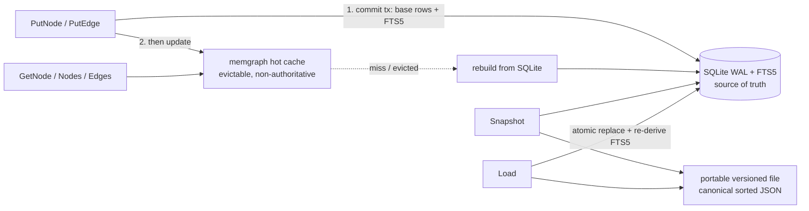

# Graphstore Backend (Documentation: Before / After)

## Before

Prior to this change, the `graphi` module had two core leaf libraries:

- `core/parse` (SW-001) — the parser registry.
- `core/model` (SW-002) — the canonical, immutable `Node`/`Edge`/`Graph` value
  types with mandatory edge provenance (`confidence_tier`, `confidence`,
  `reason`, `evidence`), deterministic xxhash64 IDs, and canonical JSON
  serialization.

There was **no persistence layer**. Nothing could durably store a graph, rebuild
it, or persist/rehydrate it across runs. The architecture (catalog §7.2) called
for an in-memory hot graph plus a SQLite durable sidecar behind a pluggable
backend interface, but none of it existed yet.

## After

This change adds `core/graphstore`, a new core leaf library that consumes
`core/model` only (no `engine`/`surfaces`/CGo imports — enforced by the layering
check). It introduces:

1. **A pluggable `Graphstore` interface** — `PutNode`/`PutEdge`, `GetNode`/
   `GetEdge`, `Nodes`/`Edges` (query + canonical iteration), `Snapshot`/`Load`,
   `EvictCache`, `Close` — plus a `Factory` so any backend is substitutable.
2. **`MemStore`** — an in-memory test-double backend.
3. **`SQLiteStore`** — the durable backend on the CGo-free `modernc.org/sqlite`
   driver (v1.52.0), opened in **WAL** journal mode with an **FTS5** full-text
   index over the searchable text fields (node qualified name, edge reason).
4. **A single shared contract test suite** parameterized by a backend factory, so
   the *identical* test bodies run against both `MemStore` and `SQLiteStore`.

### Data flow (after)

## Why these changes were made

- **SQLite-first write ordering** (`commit then update cache`) makes SQLite the
  single source of truth. A fault injected *after* commit but *before* the cache
  update leaves durable state complete and merely invalidates the cache, so
  **eviction never loses data**. The cache is a transparent accelerator, rebuilt
  on demand; queries return byte-identical results whether served hot or rebuilt.
- **WAL + FTS5** match the architecture's datastore decision (concurrent readers
  during writes; full-text/BM25 search). A startup self-check confirms both are
  active and fails fast with an actionable error on a misconfigured build.
- **Portable, versioned snapshots** (not a raw `.db` copy) honor the *pluggable*
  promise: any backend can produce or consume the same file. Each snapshot
  carries a magic value plus a `format_version` and `model_schema_version`
  header, serializes records in canonical sorted-by-ID order (so two snapshots
  of the same logical state are byte-identical), is written atomically
  (temp + rename), and re-derives the FTS5 index on load rather than trusting
  it from the file.
- **Fail-closed, atomic Load** validates the whole snapshot before mutating
  anything and replaces durable state in one transaction. On any error
  (unknown/incompatible version, malformed/truncated content, path traversal, or
  symlink escape) the target store is left unmodified.
- **Local-first invariants**: a CGo-free pure-Go driver, zero outbound network,
  and every data-derived value passed as a bound SQL/FTS5 parameter rather than
  through string concatenation — including the FTS5 `MATCH` query, which is
  tokenized and quoted safely.
