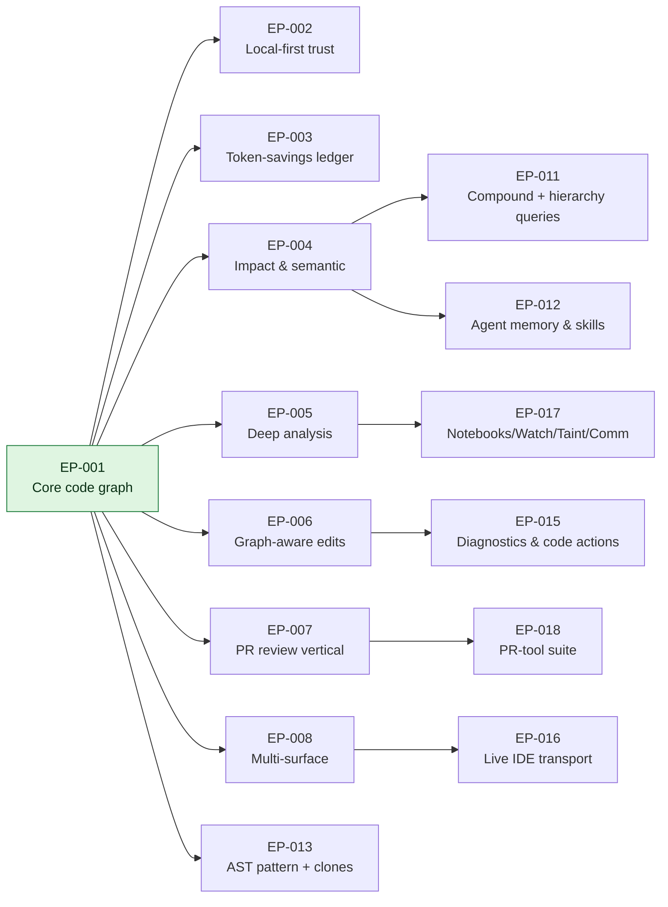
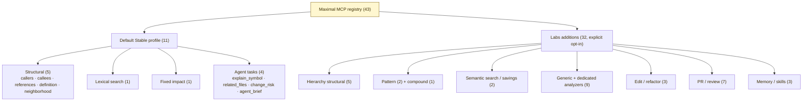
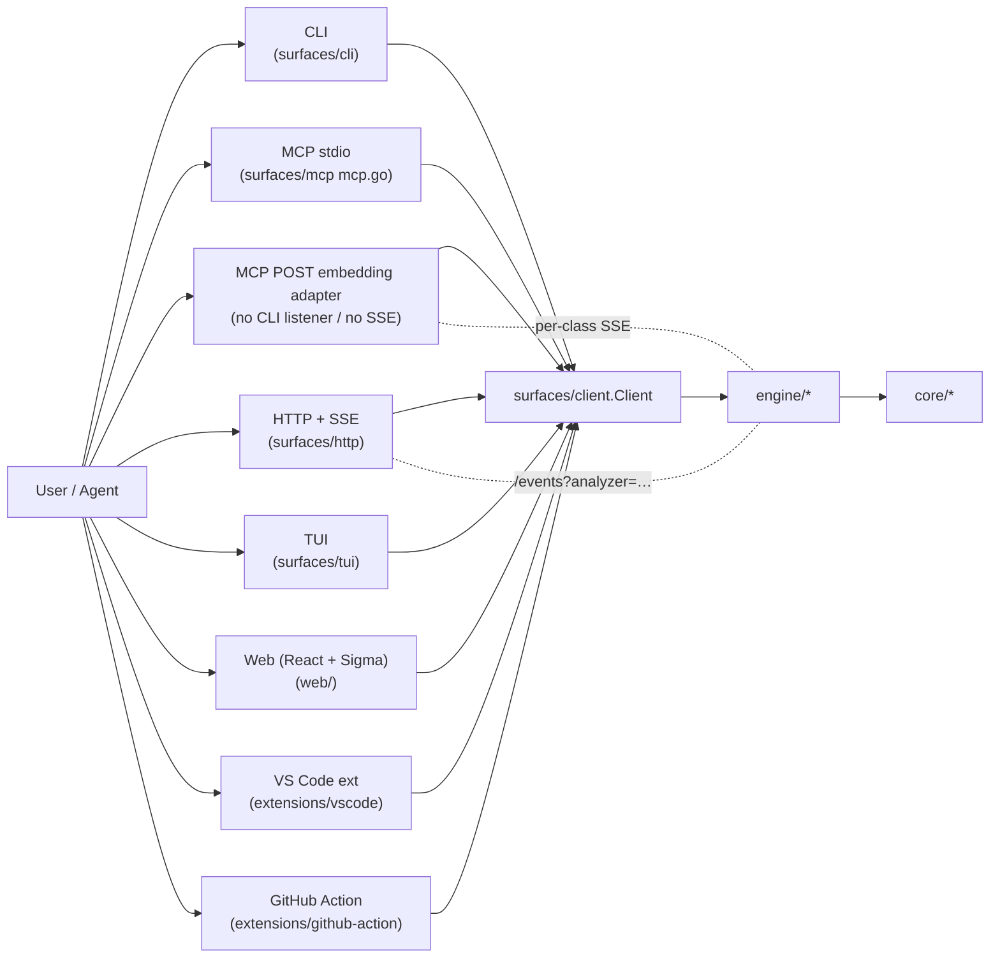
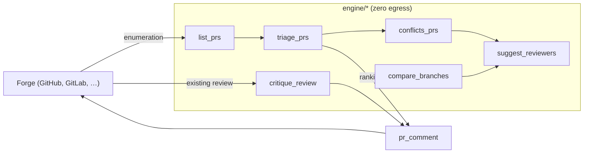
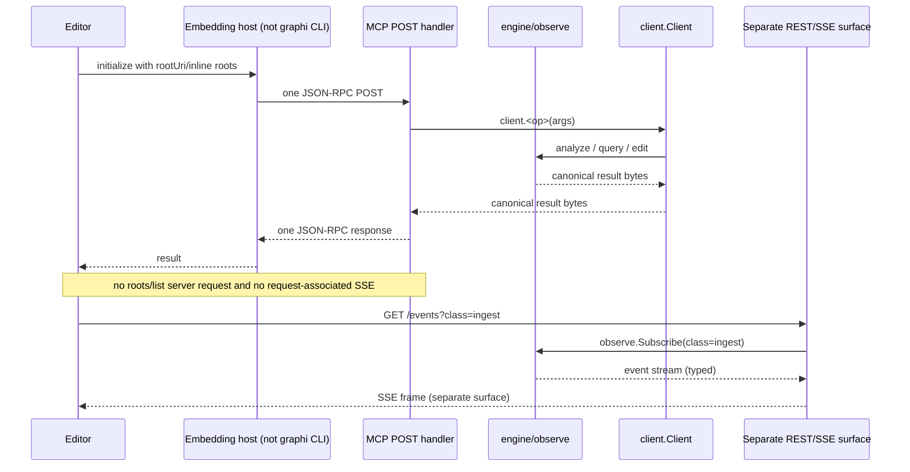
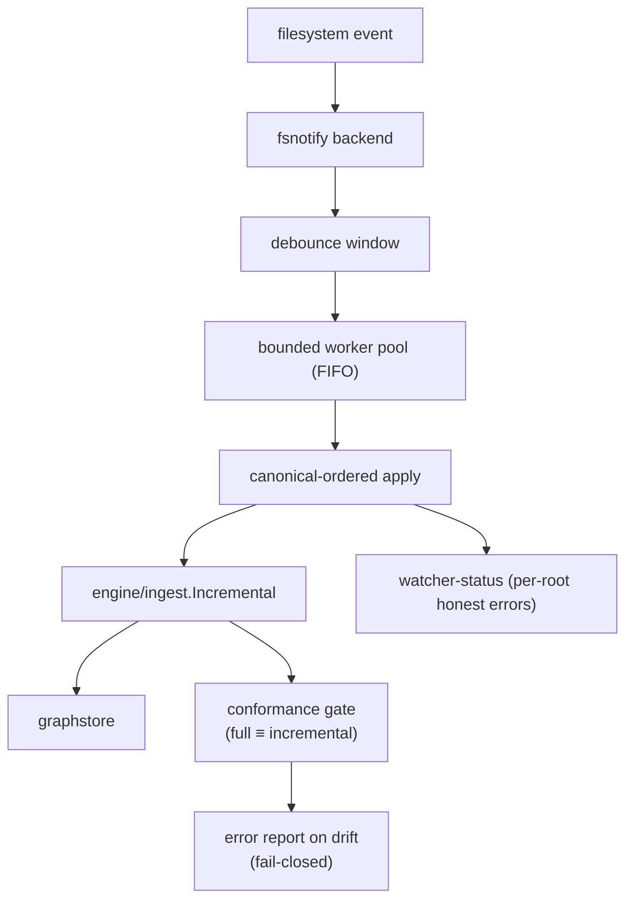
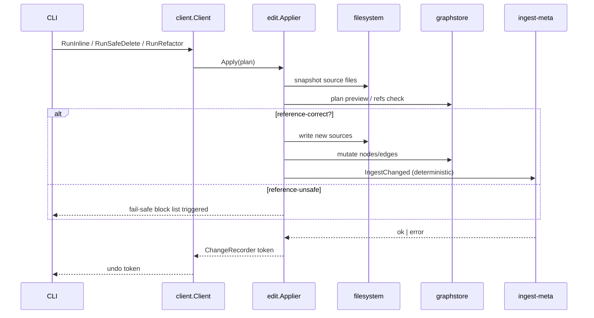
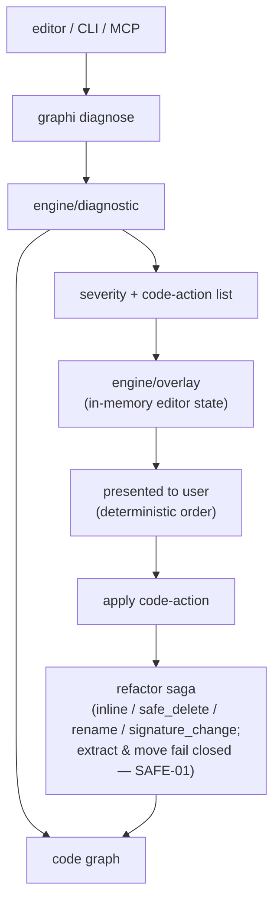

# graphi — Feature Inventory

> Single-source catalogue of every capability graphi ships today, grouped by epic.
> Every entry maps to the machine-checked [coverage matrix](coverage-matrix.md)
> (CI-enforced — docs-vs-code drift breaks the build). MCP has two distinct
> code-derived sets: `StableMCPToolNames()` is the exact default profile;
> `ToolNames()` is the maximal Stable+Labs registry. The companion source of
> truth for the `analyze` subcommand set is `engine/analysis/dispatch.go`.
>
> Reconciled 2026-07-15. The generated
> [`coverage-matrix.md`](coverage-matrix.md) remains authoritative.

## Contents

- [Epic roadmap](#epic-roadmap)
- [MCP tool taxonomy](#mcp-tool-taxonomy)
- [Surface matrix](#surface-matrix)
- [Per-epic feature tables](#per-epic-feature-tables)
  - [EP-004 — Impact & semantic queries](#ep-004--impact--semantic-queries)
  - [EP-005 — Deep analysis](#ep-005--deep-analysis)
  - [EP-007 — GitHub PR review vertical](#ep-007--github-pr-review-vertical)
  - [EP-012 — Agent memory & skills](#ep-012--agent-memory--skills)
  - [EP-013 — Pattern queries (AST + clones)](#ep-013--pattern-queries-ast--clones)
  - [EP-015 — Diagnostics & code actions](#ep-015--diagnostics--code-actions)
  - [EP-016 — Live IDE transport](#ep-016--live-ide-transport)
  - [EP-017 — Notebooks, watcher, interproc taint, communities](#ep-017--notebooks-watcher-interproc-taint-communities)
  - [EP-018 — PR-tool suite](#ep-018--pr-tool-suite)
- [PR-tool pipeline](#pr-tool-pipeline)
- [Live-IDE transport sequence](#live-ide-transport-sequence)
- [Watcher + conformance](#watcher--conformance)
- [Refactor saga (incl. inline & safe-delete)](#refactor-saga-incl-inline--safe-delete)
- [Diagnostic → code-action flow](#diagnostic--code-action-flow)
- [Counts at a glance](#counts-at-a-glance)

## Epic roadmap



## MCP tool taxonomy

The default in-process MCP product surface is intentionally small: `graphi mcp`
advertises exactly **11 Stable tools**. These are the 12 frozen product
operations minus `index`, which is repository lifecycle rather than an MCP
`tools/call`. Every concrete binding is filtered again through its
side-effect-free capability report. In particular, `graphi mcp -daemon`
currently advertises seven wired Stable RPCs and omits the four unwired agent
tools instead of returning guaranteed failures.

`graphi mcp -labs` is the only CLI opt-in to the larger profile. The maximal
registry contains exactly **43 tools**: the same 11 Stable tools plus 32 Labs
tools. Actual Stable and Labs advertisement is binding-capability-gated, so a
session can expose fewer tools when its transport or an optional service is not
wired. An unadvertised call is rejected before client dispatch.

The wire-visible identifier is canonical; `surfaces/mcp/mcp.go` routes through
the shared client. Stable `impact` is a dedicated fixed-dispatch tool through
`StableClient.Impact`; the generic analyzer selector remains Labs.



## Surface matrix



## Per-epic feature tables

> Notation: a tool is listed under the surface(s) that currently expose it.
> The MCP, HTTP, and CLI surfaces all share the `surfaces/client.Client`
> interface, so the engine-side implementation is identical — only the
> transport differs. MCP tables inventory the maximal registry; only entries
> explicitly marked **Stable default** are present without `-labs`.

### EP-001 — Core code graph & structural queries

- **Status:** ✅ shipped (foundation epic; everything builds on it)
- **Key packages:** `core/{model,parse,graphstore}`, `engine/{query,search,ingest,link}`
- **Capabilities:** 23 matrix entries for CGo-free parsers (22 shipped + 1 html disabled/planned), FU-1 cross-file linker, FU-3 graceful-skip semantic search, 10 structural MCP registry tools. Five structural operations are in the default Stable profile; five hierarchy operations require Labs.

| MCP tools | CLI subcommands | HTTP endpoints | Analyzers |
|---|---|---|---|
| Stable default: `callers`, `callees`, `references`, `definition`, `neighborhood`; Labs: `implementers`, `implements`, `overrides`, `subtypes`, `supertypes` | `graphi parse`, `graphi query <op>`, `graphi search`, `graphi setup-embedder` | `GET /query/{op}`, `GET /search`, `GET /search/semantic`, `GET /contract`, `GET /healthz` | (foundational — consumed by all analyzers) |

### EP-004 — Impact & semantic queries

- **Status:** ✅ shipped
- **Key packages:** `engine/analysis/{impact,callchain,concept,metrics,batched}`
- **What it is:** structural reachability, call-path reconstruction, concept-to-graph resolution, and a batched composite.

| MCP tools | CLI subcommands | HTTP endpoints | Analyzers |
|---|---|---|---|
| Stable default: `impact` (fixed dispatcher); Labs: `analyze` (generic selector) | Stable: `graphi impact <symbol>`; Labs: `graphi analyze <analyzer>` | `GET /analyze/{analyzer}` | `impact`, `call-chain`, `concept`, `metrics`, `batched` |

```bash
graphi impact p.MyFunc
graphi analyze impact    -symbol p.MyFunc -direction reverse # Labs generic path
graphi analyze call-chain -symbol p.Caller -target p.Callee
graphi analyze concept   -symbol p.Root -concept "rate limiting"
```

### EP-005 — Deep analysis

- **Status:** ✅ shipped
- **Key packages:** `engine/analysis/{taint,pdg,interproc,contracts,githistory}`

| MCP tools | CLI subcommands | HTTP endpoints | Analyzers |
|---|---|---|---|
| `analyze_taint`, `analyze_pdg`, `analyze_interproc`, `analyze_contracts`, `analyze_githistory` | `graphi analyze <analyzer>` | `GET /analyze/{analyzer}` | `taint`, `pdg`, `interproc`, `contracts`, `git-history` |

### EP-006 — Graph-aware edits & refactoring

- **Status:** ✅ shipped
- **Key packages:** `engine/edit`

| MCP tools | CLI subcommands | HTTP endpoints | Analyzers |
|---|---|---|---|
| `refactor_preview`, `refactor`, `undo` | `graphi refactor-preview`, `graphi refactor`, `graphi undo` | (not exposed on HTTP — direct CLI / MCP) | (engine-side) |

### EP-007 — GitHub PR review vertical

- **Status:** ✅ shipped
- **Key packages:** `engine/review`, `extensions/github-action`

| MCP tools | CLI subcommands | HTTP endpoints | Analyzers |
|---|---|---|---|
| `analyze_pr_risk`, `analyze_pr_signals`, `analyze_pr_questions`, `pr_comment` | `graphi analyze <analyzer>`, `graphi pr-comment -diff <ref> [-gate] [-publish]` | (review vertical — host integration) | `pr-risk`, `pr-signals`, `pr-questions` |

### EP-011 — Compound + hierarchy queries

- **Status:** ✅ shipped
- **Key packages:** `engine/query/{dispatch,compound}`

| MCP tools | CLI subcommands | HTTP endpoints | Analyzers |
|---|---|---|---|
| `compound`, `implementers`, `implements`, `overrides`, `subtypes`, `supertypes` | `graphi query <op>`, `graphi compound` | `POST /compound` | (consumed by hierarchy analyses) |

### EP-012 — Agent memory & skills

- **Status:** ✅ shipped
- **Key packages:** `engine/{memory,distill,skillgen}`

| MCP tools | CLI subcommands | HTTP endpoints | Analyzers |
|---|---|---|---|
| `memory`, `distill`, `skillgen` | `graphi memory store\|recall\|forget …`, `graphi distill -session <id> …`, `graphi skillgen -name <n> -trigger <t> -description <d>` | `POST /memory`, `POST /distill`, `POST /skillgen` | (engine-side) |

### EP-013 — Pattern queries (AST + clones)

- **Status:** ✅ shipped
- **Key packages:** `engine/query/{searchast,findclones}`

| MCP tools | CLI subcommands | HTTP endpoints | Analyzers |
|---|---|---|---|
| `search_ast`, `find_clones` | `graphi search-ast [-limit N] <json-pattern>`, `graphi find-clones [<json-config>]` | `POST /query-ast`, `POST /find-clones` | (engine-side) |

### EP-015 — Diagnostics & code actions

- **Status:** ✅ shipped (SW-091 … SW-094)
- **Key packages:** `engine/diagnostic/`, `engine/edit/inline.go`, `engine/edit/safe_delete.go`, `engine/edit/serialize.go`, `surfaces/client/` (marshaller extensions), `surfaces/ep015_parity_test.go`
- **What it is:** graph-derived diagnostics with severity and a suggested code-action, a reference-correct inline refactor with a fail-safe block list, and a reference-safety-gated safe-delete refactor. Surface exposure rides the shared marshaller and is byte-parity-tested.

| MCP tools | CLI subcommands | HTTP endpoints | Analyzers |
|---|---|---|---|
| (diagnose / inline / safe_delete are CLI-only on the first cut; MCP dispatcher extension is a follow-up) | `graphi diagnose [<kind>...]`, `graphi inline [-dry-run] <target>`, `graphi safe-delete [-dry-run] <target>` | (CLI / parity-tested only) | (engine-side; `engine/diagnostic`) |

```bash
# What is the editor showing diagnostics for?
graphi diagnose

# Inline this helper into every caller (fail-safe on ambiguous references).
graphi inline p/Helper -dry-run
graphi inline p/Helper

# Delete this symbol — only if no inbound references remain.
graphi safe-delete p/LegacyThing -dry-run
graphi safe-delete p/LegacyThing
```

### EP-016 — Live IDE transport

- **Status:** ✅ shipped (SW-095 … SW-099)
- **Key packages:** `engine/overlay/`, `surfaces/daemon/{control,service}`, `surfaces/mcp/http.go`, `engine/observe/class.go`, `surfaces/guard/`, `internal/canary/gate.go`
- **What it is:**
  - The in-memory editor-overlay subsystem tracks unsaved buffers.
  - The daemon control plane adds RPCs (`DaemonStop`, `WatchStatus`, `IngestNotebook`, `AnalyzeCommunities`/`TaintQuery`/`WatcherStatus`).
  - `surfaces/mcp.HTTPHandler` is a loopback-guarded POST embedding adapter with
    ordinary response-envelope parity. It is not a standalone CLI-owned
    streamable-HTTP/SSE server: `roots/list` discovery remains stdio-only, and a
    binder-backed HTTP initialize must supply `rootUri` or inline roots.
  - Per-class SSE subscriptions let an editor subscribe to only the event classes it cares about.
  - The **zero-egress enforcement guard** rejects any non-loopback dial at the surface boundary, and the central loopback/egress chokepoint is fail-closed.

| MCP tools | CLI subcommands | HTTP endpoints | Analyzers |
|---|---|---|---|
| The embeddable POST handler preserves the constructed server profile (11 Stable by default; explicit Labs construction up to the capability-gated 43-tool maximum). No standalone MCP HTTP CLI listener is shipped. | `graphi daemon start\|stop\|status`; `graphi http` serves the separate REST/SSE surface, not MCP HTTP | REST/SSE `GET /events` (optional `?analyzer=<name>`); no request-associated SSE in `mcp.HTTPHandler` | (overlay + observe + guard) |

### EP-017 — Notebooks, watcher, interproc taint, communities

- **Status:** ✅ shipped (SW-100 … SW-104, capstone SW-104)
- **Key packages:** `engine/ingest/notebook.go`, `engine/watch/{watch,manager,pool,service,debounce,config}.go`, `engine/analysis/interproctaint/`, `core/community/louvain.go`, `engine/community/detector.go`, `engine/analysis/communities.go`, `engine/analysis/notebookingest.go`, `engine/analysis/watcherstatus.go` (the `taint-query` analyzer is registered in `engine/analysis/dispatch.go` and the implementation lives in `engine/analysis/interproctaint/solve.go`), `engine/conformance/`
- **What it is:**
  - `.ipynb` cell-provenance ingestion (cell-as-symbol granularity).
  - An `fsnotify` watcher with a bounded worker pool and deterministic canonical-ordered apply.
  - An interprocedural taint fixpoint over per-procedure gen/kill summaries (procedure-level label sets, not statement-level dataflow).
  - Deterministic Louvain community detection behind a single grouping seam.
  - Single-dispatch surfacing through the analysis pipeline.
  - A full-vs-incremental byte-parity conformance gate.

| MCP tools | CLI subcommands | HTTP endpoints | Analyzers |
|---|---|---|---|
| (surfaced through `analyze <name>`; no new singleton tools) | `graphi analyze <analyzer>`, `graphi daemon start` | `GET /analyze/{analyzer}`, `GET /events?analyzer=…` | `communities`, `notebook-ingest`, `taint-query`, `watcher-status` |

### EP-018 — PR-tool suite

- **Status:** ✅ shipped (SW-105 … SW-108, capstone SW-108)
- **Key packages:** `surfaces/forge/forge.go`, `engine/analysis/{triage,conflicts,suggest_reviewers,compare_branches,critique_review}.go`
- **What it is:**
  - Read-only forge PR enumeration (`list_prs`).
  - Single-pass graph-derived PR triage (`triage_prs`).
  - Inter-PR conflict detection (`conflicts_prs` — textual + graph-semantic + asymmetric contract-dependency).
  - Reviewer recommendation (`suggest_reviewers` — ownership/churn + affected-subgraph proximity).
  - Graph-level branch diff (`compare_branches` — keyed by canonical NodeId).
  - Deterministic graph-evidence critique of an existing PR review (`critique_review` — gap / over_flag / unsupported_claim, no LLM prose).

  The engine never resolves a git ref and never fetches a review — the only egress is at the surface boundary, and it's optional/inline.

| MCP tools | CLI subcommands | HTTP endpoints | Analyzers |
|---|---|---|---|
| `list_prs`, `triage_prs`, `conflicts_prs`, `suggest_reviewers`, `compare_branches`, `critique_review` | `graphi list-prs`, `graphi triage-prs`, `graphi conflicts-prs`, `graphi suggest-reviewers [-diff <ref>]`, `graphi compare-branches -base <ref> -head <ref>`, `graphi critique-review -diff <ref> [-pr N] [-review <json>\|-review-path <file>]` | `GET /prs`, `GET /prs/triage`, `GET /prs/conflicts`, `GET /prs/suggest-reviewers`, `GET /branches/compare`, `GET /reviews/critique` | `triage-prs`, `conflicts-prs`, `suggest-reviewers`, `compare-branches`, `critique-review` |

```bash
# Read-only forge enumeration.
graphi list-prs

# Single-pass graph-derived ranking.
graphi triage-prs

# Inter-PR conflict detection.
graphi conflicts-prs

# Reviewer recommendation for a touched set.
graphi suggest-reviewers -diff origin/main..HEAD

# Graph-level diff of two graphi SQLite snapshots (paths to `graphi index`
# outputs — compare-branches never resolves a git ref; build one db per branch).
graphi compare-branches -base base-graph.db -head head-graph.db

# Critique an existing review (no LLM prose; graph evidence only).
graphi critique-review -diff origin/main..HEAD -pr 42 -review-path review.json
```

## PR-tool pipeline

The six PR-tool suite tools (EP-018) form a left-to-right pipeline: enumerate →
rank → conflict-check → reviewer-pick → branch-compare → review-critique.
Every step is zero-egress on the engine; the only egress is at the surface
boundary (forge PR list fetch, review fetch — both optional and inline).



## Live-IDE transport sequence



## Watcher + conformance

The notebooks/watcher/taint/communities work (EP-017) ships an
`fsnotify`-backed watcher with a bounded worker-pool and deterministic
canonical-ordered apply. The conformance gate
(`engine/conformance`) proves that an incremental re-index produces the
**byte-identical** graph as a full re-index — same NodeId set, same edge
provenance ordering, same tier assignments.



## Refactor saga (incl. inline & safe-delete)

The atomic saga coordinates writes across filesystem + graphstore +
ingest-meta in dependency order; failure in any domain triggers
compensating actions. The diagnostics & code actions work (EP-015) adds two
new saga branches (`inline`, `safe_delete`) on top of the SW-035 `refactor`
(rename / extract / move / signature) family.



## Diagnostic → code-action flow

The `diagnose` command (EP-015) produces severity-tagged diagnostics, each
with a suggested code-action. The editor overlay tracks unsaved buffers so
diagnostics are anchored to the live editor state, not the on-disk file.



## Counts at a glance

| Dimension | Count | Source of truth |
|---|---|---|
| Parsers (CGo-free tier) | 23 | `core/parse` registry + `docs/coverage-matrix.md` § Parsers |
| Analyzers | 22 | `engine/analysis/dispatch.go` + `docs/coverage-matrix.md` § Analyzers |
| MCP tools (default) | 11 | `surfaces/mcp.StableMCPToolNames()`; 12 Stable product operations minus lifecycle-only `index` |
| MCP tools (maximal registry) | 43 | `surfaces/mcp.ToolNames()`; 11 Stable + 32 explicit-opt-in Labs rows, capability-gated at runtime |
| CLI subcommands | ~30 | `surfaces/cli/cli.go` + `cmd/graphi/main.go` |
| HTTP endpoints | 22 | `surfaces/http/server.go` (incl. `/prs/*`, `/branches/compare`, `/reviews/critique`) |
| Surfaces | 8 | `docs/coverage-matrix.md` § Surfaces |
| Feature Units | 5 | `docs/coverage-matrix.md` § Feature-Unit |

---

Last reconciled to: `docs/coverage-matrix.md` (CI-enforced),
`surfaces/mcp.StableMCPToolNames()` (default profile), and
`surfaces/mcp.ToolNames()` (maximal registry).
