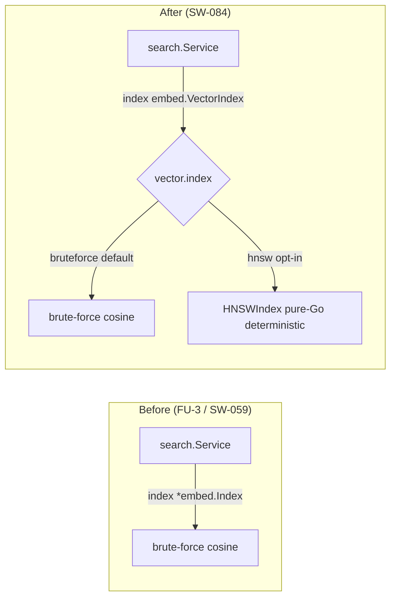

# HNSW vector index — OFF-by-default build contract (SW-084)

graphi's semantic search can rank vectors two ways behind one seam
(`embed.VectorIndex`):

| Backend | Selector | When |
|---|---|---|
| **Brute-force cosine** | `vector.index: bruteforce` (default) | always available; exact ranking; the recall oracle |
| **HNSW (approximate NN)** | `vector.index: hnsw` | explicit opt-in; sub-linear query at ≥0.95 recall@10 |

Both are pure Go and CGo-free. HNSW is an **upgrade** of the FU-3 / SW-059 brute-force
store, never a replacement: the typed `Unavailable` graceful-skip response (no embedder
configured) and the `WithSemantic(...)` seam are byte-for-byte unchanged.

## Before / after (SW-084)



- **Before:** `search.Service.index` was the concrete `*embed.Index`; ranking was
  always O(N) brute-force cosine. Fine for correctness, linear in corpus size.
- **After:** `index` is the `embed.VectorIndex` interface. `*embed.Index` (brute-force)
  still satisfies it unchanged, and a new deterministic `*embed.HNSWIndex` is selectable
  via config. All existing call sites compile unchanged (seam invariant, AC6).

## OFF-by-default contract

The default configuration (`DefaultVectorIndexConfig()` → `index: bruteforce`) selects
the brute-force backend. The `cmd/graphi` default path constructs `embed.NewIndex()`
directly, so **the HNSW path is never referenced and the linker strips it entirely**
from the default binary:

```
$ go tool nm ./graphi | grep -ci hnsw
0
```

HNSW is only constructed when a caller passes `vector.index: hnsw` through
`embed.NewVectorIndex(cfg)`. (The literal `graphi.yaml` key parsing and the CLI/MCP/HTTP
exposure land in SW-085; SW-084 delivers the engine capability and the typed config
contract.)

## CGo-free verification

```
$ CGO_ENABLED=0 go build -o graphi ./cmd/graphi      # succeeds — no cgo required
$ go test ./internal/cgoconformance/                  # project gate: PASS
$ go tool nm ./graphi | grep -ci 'engine/embed.*HNSW' # 0
```

The only `_cgo_*` symbols in the binary are Go runtime-internal stubs
(`__cgo_init`, `runtime._cgo_setenv`, …) present in every Go binary regardless of CGO;
none originate from the vector index. The SQLite store uses the pure-Go
`modernc.org/sqlite` driver, so no path here pulls native code.

## Binary-size delta measurement

Because the HNSW path is dead-code-eliminated from the default binary, the **default**
binary-size delta is **0 bytes** (the symbol count above is the proof). To measure the
delta of the *active* HNSW path (once SW-085 wires the selector), build a small probe
that references `embed.NewVectorIndex(VectorIndexConfig{Index:"hnsw"})` and diff:

```
# default (HNSW stripped)
go build -o /tmp/graphi-bf ./cmd/graphi
# with HNSW referenced (probe or SW-085 config wiring)
go build -tags hnsw_probe -o /tmp/graphi-hnsw ./cmd/graphi
ls -l /tmp/graphi-bf /tmp/graphi-hnsw   # delta = HNSW code size (~tens of KB, pure Go)
```

The HNSW implementation is ~400 lines of pure Go with no new dependencies, so the
active-path size delta is bounded by that translated code — well within the size-budget
invariant. No `go.mod` entry, no `LICENSES.md` change (AC7/AC8 satisfied with zero new
deps).

## Determinism

HNSW results are byte-identical across runs, processes, and full-vs-incremental indexes:
node levels are hashed from the NodeId (no RNG), insertion is canonical NodeId order, and
every tie-break is NodeId-ascending. Final hits are `(score desc, NodeId asc)` — the same
contract as brute-force. See `docs/decisions/hnsw-library.md` for the rationale and
`engine/embed/hnsw_test.go` (`TestHNSW_DeterministicReplay`,
`TestHNSW_PutOrderIndependent`) for the proofs.
