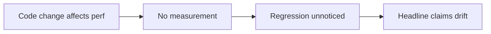
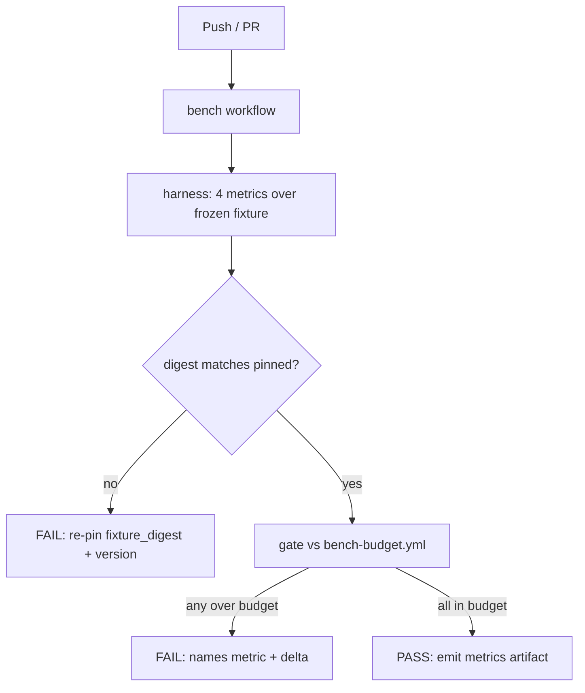

# Budget-Gated Benchmark Suite (SW-010)

This document describes graphi's performance benchmark gate: what it measures, how
budgets are pinned and re-pinned, and why the gate exists. It's for contributors
touching performance-sensitive code or the benchmark harness itself.

> Distinct CI check: **`bench-budget-gate`**.
> Workflow: [`.github/workflows/bench.yml`](../../.github/workflows/bench.yml)
> Suite: [`internal/bench`](../../internal/bench) · CLI: [`cmd/bench`](../../cmd/bench) · manifest: [`bench/bench-budget.yml`](../../bench/bench-budget.yml) · fixture: [`bench/fixture`](../../bench/fixture)

## State before this story

Before SW-010, graphi's performance promises ("local-first", "~50× fewer tokens",
fast cold-start) were **asserted, not measured**:

- There was no harness that measured cold-start latency, full-index time,
  freshness lag, or static binary size.
- There were no pinned, version-stamped budgets, so a performance regression
  could land silently and the headline claims could drift undetected.
- There was no persisted, machine-readable metric artifact for audit/trend
  tracking.
- There was no reviewer-friendly way to bless an intentional performance change
  short of editing code.

## State after this story

Performance is now **provable and gated**. A distinct CI check runs a
four-metric harness against a frozen workload fixture. The moment any metric
exceeds its pinned budget, the check fails loudly, naming the regressed metric
and its delta versus baseline.

### The four metrics (measured at their owning-layer boundaries)

| Metric | Boundary | How it is measured |
|---|---|---|
| `cold_start_p95_ms` | daemon/engine hot-index | fresh durable store → ingester → `IngestAll` → wire query+search → first served query; P95 over N samples |
| `full_index_ms` | engine/ingest | `IngestAll` over the frozen fixture; median over N samples |
| `freshness_lag_ms` | daemon/engine hot-index | hot-index `IngestChanged` + query round-trip latency |
| `binary_size_bytes` | canonical default release flavor | byte size of the `CGO_ENABLED=0` build produced with `internal/release.CanonicalBuildArgs`: `-trimpath`, VCS metadata, a fixed version stamp, and `DefaultGrammarSubsetTags` |

The JSON report reads Go version, GOOS, GOARCH, GOAMD64, CGO and VCS settings
from the measured binary itself. CI pins `GOAMD64=v1`; the enforced baseline is
therefore a clean `go1.26.5/linux-amd64` artifact rather than a value silently
mixed across machines or source-path lengths. Supplying `BinaryPath` skips the
canonical build and marks the contract `external-binary/unverified`; an
arbitrary prebuilt binary is never reported as canonical.

> Note on `freshness_lag_ms`: the Go parser now runs an extraction pass
> (`core/parse/extract_go.go`) that populates symbol nodes and intra-file
> `defines`/`calls`/`references` edges, so freshness is measured end-to-end
> through the real propagation path (parse → extract → hot-index absorption →
> query round-trip). Cross-file/cross-package edges await the linker pass; once it
> lands the same harness measures the wider reflection with no structural change.

### The manifest — single source of truth

[`bench/bench-budget.yml`](../../bench/bench-budget.yml) pins every budget along
with a `fixture_digest` and `baseline_version`. Re-pinning an intentional,
justified performance change is a **manifest-only edit**: update the
`baseline`/`budget`, re-pin `fixture_digest` if the fixture changed, and bump
`baseline_version`. No code change is required — reviewers can bless a change
through the manifest alone.

The gate fails when any metric exceeds its budget and reports the delta vs the
pinned baseline:

### Hermeticity

The suite reuses the egress/telemetry posture established for the CI gates
described in `docs/ci/egress-canary.md`: loopback/local only (temp files plus
the pure-Go modernc SQLite backend), `CGO_ENABLED=0`, and zero network I/O or
telemetry. It also adds no module dependencies — a constrained YAML reader
avoids pulling in a full YAML library, keeping the default module hermetic for
the release packaging described in `docs/ci/release.md`.

## Why these changes were made

- **Make perf claims provable.** A budget that is not checked in CI is a hope.
  The gate turns "fast cold-start" into a machine-checked invariant.
- **Name the regression.** A failing metric reports its measured value, its
  budget, and its delta vs the pinned baseline, so a regression points straight
  at the cause.
- **Make re-pinning cheap and auditable.** Reviewers bless intentional changes by
  editing one manifest line + bumping a version stamp; the diff is small,
  reviewable, and carries no code risk.
- **Persist for trends.** Passing runs emit a machine-readable report uploaded as
  a CI artifact for audit/trend tracking.

## Out of scope

- Symbol stripping (`-s -w`) is a separate release/debuggability policy and is
  not used to make the size gate pass.
- Egress/telemetry enforcement — reused here as posture only (see
  `docs/ci/egress-canary.md`).
