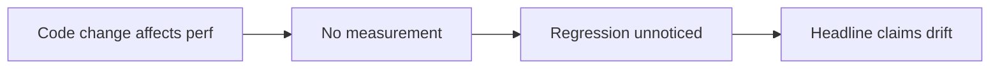
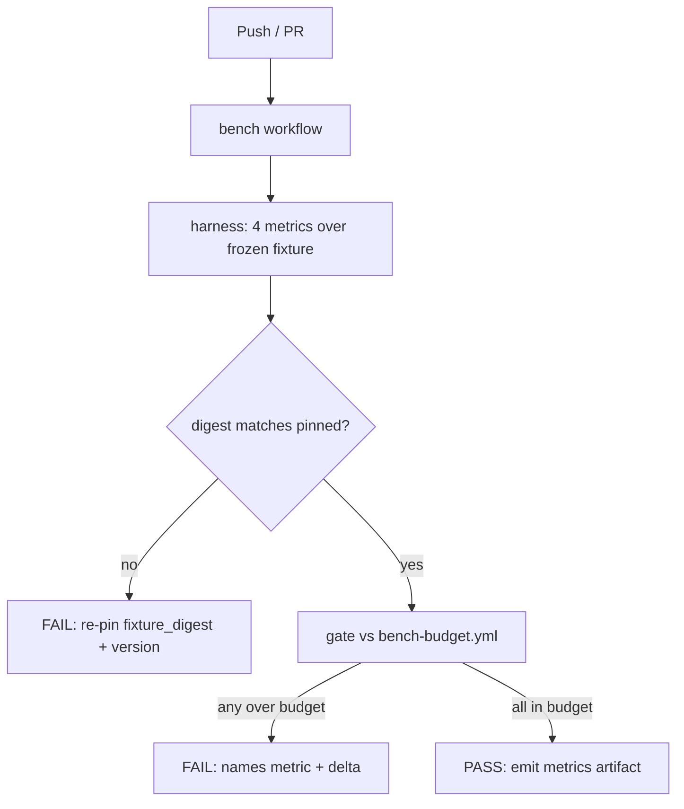

# Budget-Gated Benchmark Suite (SW-010)

This document describes graphi's performance benchmark gate: what it measures, how
budgets are pinned and re-pinned, and why the gate exists. It's for contributors
touching performance-sensitive code or the benchmark harness itself.

> Distinct CI check: **`bench-budget-gate`**.
> Workflow: [`.github/workflows/bench.yml`](../../.github/workflows/bench.yml)
> Suite: [`internal/bench`](../../internal/bench) · CLI: [`cmd/bench`](../../cmd/bench) · manifest: [`bench/bench-budget.yml`](../../bench/bench-budget.yml) · fixture: [`bench/fixture`](../../bench/fixture)

## State before this story

Before SW-010, graphi's performance promises ("local-first", "~50× fewer tokens",
fast cold-start) were **asserted, not measured**:

- There was no harness that measured cold-start latency, full-index time,
  freshness lag, or static binary size.
- There were no pinned, version-stamped budgets, so a performance regression
  could land silently and the headline claims could drift undetected.
- There was no persisted, machine-readable metric artifact for audit/trend
  tracking.
- There was no reviewer-friendly way to bless an intentional performance change
  short of editing code.

```mermaid
flowchart LR
  A[Code change affects perf] --> B[No measurement]
  B --> C[Regression unnoticed]
  C --> D[Headline claims drift]
```

## State after this story

Performance is now **provable and gated**. A distinct CI check runs the
benchmark harness against a frozen workload fixture. The moment any
fail-severity metric exceeds its pinned budget, the check fails loudly, naming
the regressed metric and its delta versus baseline.

### The four core metrics (measured at their owning-layer boundaries)

| Metric | Boundary | How it is measured |
|---|---|---|
| `cold_start_p95_ms` | daemon/engine hot-index | fresh durable store → ingester → `IngestAll` → wire query+search → first served query; P95 over N samples |
| `full_index_ms` | engine/ingest | `IngestAll` over the frozen fixture; median over N samples |
| `freshness_lag_ms` | daemon/engine hot-index | hot-index `IngestChanged` + query round-trip latency |
| `binary_size_bytes` | canonical default release flavor | byte size of the `CGO_ENABLED=0` build produced with `internal/release.CanonicalBuildArgs`: `-trimpath`, VCS metadata, a fixed version stamp, and `DefaultGrammarSubsetTags` |

### The incremental-indexing suite (P4 / roadmap TODO-19)

All incremental measurements mutate a RUNTIME COPY of the fixture only — the
pinned `fixture_digest` never changes. Every published number is CI-produced
(`bench-report.json` artifact); nothing is hand-written into docs.

| Metric | What it measures | Severity |
|---|---|---|
| `incremental_ten_file_ms` | a ten-file change (4 modified + 6 created) absorbed via `IngestChanged` + a proving query round-trip | fail |
| `branch_switch_sim_ms` | a checkout-shaped delta (2 modified + 2 added + 1 deleted) absorbed via `IngestChanged` + round-trip | fail |
| `mcp_startup_ms` | the measured binary: `mcp -db` spawn → first `initialize` response, median (skipped/omitted for external binaries — their MCP capability is unverified) | warn |
| `symbol_lookup_ms` | lexical symbol lookup on the hot store, median | warn |
| `callers_query_ms` | `callers` structural query on a resolved node id, median | warn |
| `context_query_ms` | the `task_context` one-call bundle on the hot store, median | warn |
| `index_heap_alloc_bytes` | post-GC heap after a full fixture index | warn |

The spawn-, sub-millisecond-, and GC-sensitive metrics start at severity
`warn` (trend tracking in every report without adding CI flake surface); the
index-bound ones gate at `fail` like `full_index_ms`/`freshness_lag_ms`.

The JSON report reads Go version, GOOS, GOARCH, GOAMD64, CGO and VCS settings
from the measured binary itself. CI pins `GOAMD64=v1`; the enforced baseline is
therefore a clean `go1.26.5/linux-amd64` artifact rather than a value silently
mixed across machines or source-path lengths. Supplying `BinaryPath` skips the
canonical build and marks the contract `external-binary/unverified`; an
arbitrary prebuilt binary is never reported as canonical. Internally built
artifacts with a non-default target, tag set, path or build setting are marked
`custom-build/unverified` instead.

> Note on `freshness_lag_ms`: the Go parser now runs an extraction pass
> (`core/parse/extract_go.go`) that populates symbol nodes and intra-file
> `defines`/`calls`/`references` edges, so freshness is measured end-to-end
> through the real propagation path (parse → extract → hot-index absorption →
> query round-trip). Cross-file/cross-package edges await the linker pass; once it
> lands the same harness measures the wider reflection with no structural change.

### The manifest — single source of truth

[`bench/bench-budget.yml`](../../bench/bench-budget.yml) pins every budget along
with a `fixture_digest` and `baseline_version`. Re-pinning an intentional,
justified performance change is a **manifest-only edit**: update the
`baseline`/`budget`, re-pin `fixture_digest` if the fixture changed, and bump
`baseline_version`. No code change is required — reviewers can bless a change
through the manifest alone.

### `binary_size_bytes` is a ratchet — when it may move, and when it may not

Re-pinning the **baseline** is routine bookkeeping: the baseline is only the
number the gate reports a delta against, so letting it drift stale makes every
green run report a wrong delta. Raising the **budget** is not routine, because
the budget is the gate. The 2026-08-28 decision (SW-243) re-pinned the baseline
to the measured `main` and left the budget at 36,100,000 B, and wrote four
standing refusals into
[`bench/bench-budget.yml`](../../bench/bench-budget.yml) so the budget cannot be
moved by feel:

1. **No raise without attribution** — a same-method before/after build, a
   `go tool nm -size` package rollup, and a `go.mod`/`go.sum`/grammar-tag diff
   showing no new external dependency and no new grammar blob.
2. **No raise for a newly *linked* existing dependency** until that link is shown
   to be needed on the shipped default path.
3. **No raise while headroom still exceeds 10x the largest measured
   toolchain-noise event** (currently 8,854 B, so 88,540 B). Above that line the
   gate still discriminates and a raise is relief, not necessity; below it the
   gate fires on compiler noise and a raise is the honest move.
4. **No budget above 40,000,000 B** — 80% of ADR 0001's hard < 50 MB ceiling —
   without a new ADR amending the sizing model.

**Measure from the real repository working directory, never from a `git worktree`
checkout.** Go's VCS stamping requires `.git` to be a *directory*, so a linked
worktree silently drops `-buildvcs=true` — no error, no warning — and produces an
unstamped binary of a different size. The discrepancy is not a constant: at
`a2ae62c` the worktree build read 72 B *more* than the canonical one, at `ebe0e87`
4,024 B *less*. Built the right way, the canonical measurement is exact — the same
command at `a2ae62c` reproduces the CI-pinned 34,267,107 B to the byte from
darwin/arm64.

The gate fails when any metric exceeds its budget and reports the delta vs the
pinned baseline:

```mermaid
flowchart TD
  PR[Push / PR] --> W[bench workflow]
  W --> H[harness: 4 metrics over frozen fixture]
  H --> D{digest matches pinned?}
  D -->|no| FD[FAIL: re-pin fixture_digest + version]
  D -->|yes| G[gate vs bench-budget.yml]
  G -->|any over budget| FB[FAIL: names metric + delta]
  G -->|all in budget| P[PASS: emit metrics artifact]
```

### Measurement ownership in the release gate

The dedicated `bench-budget-gate` job is the sole authority for wall-clock
metrics. It runs the full harness in a short, isolated job and uploads
`bench-report.json`; cold start, indexing, freshness, incremental updates, MCP
startup, and query latency gate there against the pinned manifest.

`cmd/release-gate` deliberately does not repeat those timings. A long shared CI
job cannot reproduce the load conditions against which the timing budgets were
calibrated, so treating a second wall-clock sample as a release verdict would
turn runner scheduling into product evidence. Its `bench-budget` constituent
instead measures and gates the environment-independent projection: canonical
binary size plus the fast/balanced/deep database sizes and edge counts. The
projection keeps each metric's manifest severity, so `binary_size_bytes`
remains a hard ratchet. A future size/count metric enters this closed projection
only through a reviewed code change; its manifest severity then controls whether
it blocks. Removing any projected metric from the manifest fails closed.

### Hermeticity

The suite reuses the egress/telemetry posture established for the CI gates
described in `docs/ci/egress-canary.md`: loopback/local only (temp files plus
the pure-Go modernc SQLite backend), `CGO_ENABLED=0`, and zero network I/O or
telemetry. It also adds no module dependencies — a constrained YAML reader
avoids pulling in a full YAML library, keeping the default module hermetic for
the release packaging described in `docs/ci/release.md`.

## Why these changes were made

- **Make perf claims provable.** A budget that is not checked in CI is a hope.
  The gate turns "fast cold-start" into a machine-checked invariant.
- **Name the regression.** A failing metric reports its measured value, its
  budget, and its delta vs the pinned baseline, so a regression points straight
  at the cause.
- **Make re-pinning cheap and auditable.** Reviewers bless intentional changes by
  editing one manifest line + bumping a version stamp; the diff is small,
  reviewable, and carries no code risk.
- **Persist for trends.** Passing runs emit a machine-readable report uploaded as
  a CI artifact for audit/trend tracking.

## Out of scope

- Symbol stripping (`-s -w`) is a separate release/debuggability policy and is
  not used to make the size gate pass.
- Egress/telemetry enforcement — reused here as posture only (see
  `docs/ci/egress-canary.md`).
