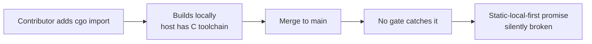
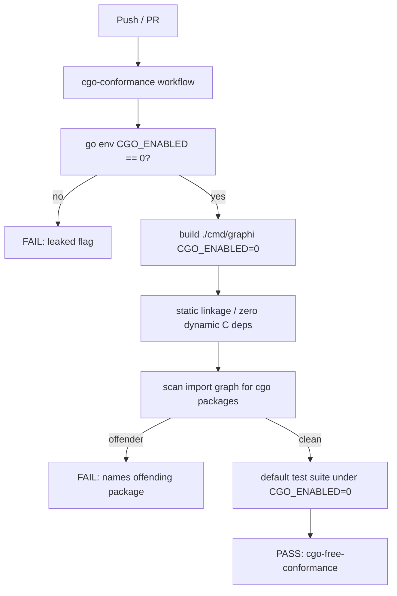

# CGo-Free Build Conformance Gate (SW-009)

This document describes the CI gate that enforces graphi's CGo-free default
build. It's for contributors adding dependencies or touching the default build
graph, and for anyone auditing the "fully static, dependency-free" claim.

> Distinct, named CI check: **`cgo-free-conformance`**.
> Workflow: [`.github/workflows/cgoconformance.yml`](../../.github/workflows/cgoconformance.yml)
> Gate implementation: [`internal/cgoconformance`](../../internal/cgoconformance) · gate binary: [`cmd/cgoconformance`](../../cmd/cgoconformance)

## State before this story

Before SW-009, "CGo-free from day one" was an **aspirational** property of the
default `graphi` binary:

- Nothing mechanically prevented a contributor from adding a cgo-dependent
  import (e.g. a CGo SQLite binding, a C library wrapper) to a package reachable
  from `./cmd/graphi/`. Such a change would compile locally (where the host has
  a C toolchain) and silently break the "fully static, dependency-free
  local-first artifact" promise.
- There was no distinct CI check asserting the default graph builds and tests
  with `CGO_ENABLED=0`.
- There was no static-linkage assertion on the produced binary, and no regression
  detector that names an offending cgo package.
- The opt-in `graphi-broad` CGo flavor had no documented boundary against the
  default gate, so a broad-only cgo dependency could ambiguously leak into the
  default gate's verdict.

## State after this story

The CGo-free property is now **enforceable rather than asserted**. A
distinct, named CI check (`cgo-free-conformance`) gates every push and PR. The
moment a cgo dependency enters the default graph, it fails loudly and names
the offending package.

The gate (`internal/cgoconformance`) asserts, in order:

1. **`CGO_ENABLED=0` is actually in effect** — `go env CGO_ENABLED` reflects the
   enforced value; it is not silently leaked from the host environment.
2. **Default binary builds** under `CGO_ENABLED=0` (`./cmd/graphi/`).
3. **Produced binary has zero cgo-introduced dynamic C dependencies** —
   `go version -m` shows `CGO_ENABLED=0`; on Linux `file` additionally reports
   "statically linked". (On darwin a fully-static binary is unattainable — the
   platform mandates a dynamic link to its system library — so the guarantee is
   carried by the `CGO_ENABLED=0` build setting. Semantics are identical: zero
   cgo-introduced dynamic C deps.)
4. **Default import graph is cgo-free** — `go list -deps -json` over
   `./cmd/graphi/` finds no package with non-empty `CgoFiles`; any offender is
   named verbatim.
5. **Default test suite passes** under `CGO_ENABLED=0` (`./...`).

The opt-in `graphi-broad` CGo flavor is **explicitly excluded** by a named,
documented condition (`cgoconformance.ExcludedBroadFlavor = "graphi-broad"`): the
gate never sets the broad build tag and strips any `graphi-broad` tag from a
leaked `GOFLAGS`. It therefore has its own separate conformance track and never
affects this gate's verdict.

## Why these changes were made

- **Make the promise enforceable.** A guarantee that is not checked in CI is a
  hope, not a property. The gate turns "CGo-free from day one" into a
  machine-checked invariant.
- **Name the offender.** A gate that fails with "cgo detected somewhere" is
  expensive to debug. The regression detector returns the exact import paths, so
  a failing build points straight at the offending package.
- **One definition of "default graph".** `DefaultBuildTarget = "./cmd/graphi/"`
  is defined once here and shared with the static gate (`docs/ci/egress-canary.md`)
  and the release packaging (`docs/ci/release.md`). It is never redefined.
- **Bound the broad flavor.** `graphi-broad` is intentionally CGo-capable for its
  separate grammar-conformance track. Giving it a named exclusion keeps its
  scope explicit and prevents it from contaminating the default gate.

## Out of scope

- `graphi-broad`'s own CGo conformance (a separate future gate on its own track).
- Runtime egress/telemetry enforcement — that is covered by the egress canary
  (see `docs/ci/egress-canary.md`).
