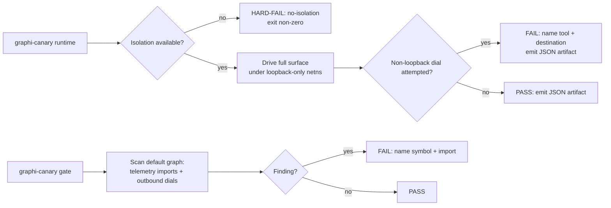

# Egress-Denied Canary & Zero-Telemetry CI Gate (SW-008)

This document describes the CI mechanisms that enforce graphi's local-first
network posture: the runtime egress canary and the static zero-telemetry gate.
It's for contributors touching network code or the surface stack, and for
anyone auditing the "zero outbound network" claim.

> Part of EP-002 (Local-First Trust, DevOps & Eval Harness). This document
> describes the state before and after this story and the reasoning behind the
> design.

## Before

graphi advertises a "local-first by contract" promise — CGo-free, zero outbound
network, no telemetry, no accounts. But before SW-008 this promise was
**aspirational, not mechanically enforced**:

- Nothing prevented a dependency or code path from introducing an outbound
  dial, a telemetry/analytics SDK, or an HTTP analytics hook into the default
  build.
- There was no CI job that proved the full surface stack (cli, daemon, mcp,
  http) stays silent on the network when exercised.
- A misconfigured CI runner without network isolation could silently pass,
  masking any regression.

In short: the trust property could regress undetected.

## After

The local-first contract is now **mechanically enforceable** through two
independent mechanisms behind one acceptance contract:

1. **Runtime egress canary** (`internal/canary`, `cmd/canary runtime`)
   - Runs the full graphi surface stack (CLI subcommands, every canonical query
     operation, search) under **loopback-only network isolation** (a Linux
     network namespace with only `lo` brought up).
   - Asserts **zero non-loopback dial attempts** — at dial-attempt time via an
     injected recorder, so even a *blocked* attempt is caught (not only packets
     that reach the wire).
   - **Hard-fails when isolation is unavailable** (non-Linux or unprivileged
     runner) rather than silently passing. This is the single most important
     correctness property.
   - Emits a **machine-readable JSON artifact** (covered-tool list + dial
     summary) for audit.

2. **Static zero-telemetry gate** (`internal/canary`, `cmd/canary gate`)
   - Scans the **default CGo-free build graph** (`CGO_ENABLED=0 go list -deps`)
     for telemetry/analytics SDK imports (curated denylist).
   - AST-scans graphi's own source for non-allowlisted outbound dial
     constructors (`net.Dial`, `http.Get`, …), with an explicit **allowlist**
     limited to the loopback surfaces (`surfaces/daemon`, `surfaces/client`).
   - The opt-in `graphi-broad` CGo flavor is on a separate track and is not in
     the default graph.

### Why this design (reasoning)

- **Two mechanisms, kept separate.** The runtime canary catches *behavioral*
  egress; the static gate catches *structural* introduction. A failure points at
  the right thing.
- **Dial-attempt, not packet-seen.** The assertion fires when code *tries* to
  reach a non-loopback destination, so telemetry that opens a socket which netns
  then blocks is still caught. This avoids a libpcap/cgo dependency and keeps the
  canary itself CGo-free.
- **Loopback scoped, not blanket.** Only `127.0.0.0/8`, `::1`, `localhost`, and
  Unix sockets are permitted — the legitimate local IPC users (daemon Unix
  socket, local HTTP/SSE).
- **Surface union derived, not hand-maintained.** Coverage comes from
  `engine/query.Operations`, the CLI command set, and search, so a new
  capability cannot slip past the canary.
- **Lives outside production surfaces.** The canary is a CI/test concern under
  `internal/canary` and `cmd/canary`; it does not import `surfaces/*` or
  `engine/*` runtime code, so it cannot become part of the attack surface it
  asserts about.

## CI

See `.github/workflows/canary.yml`: the runtime canary runs on an
isolation-capable Linux runner; the static gate runs on the default build.
Both gate the build (non-zero exit on any fail/hard-fail).

## Relationship to sibling stories

- Builds on the surface stack it exercises (EP-001) and the default-graph
  notion the static gate scans (SW-009, see `docs/ci/cgo-conformance.md`).
- The canonical static binary the canary eventually drives is produced by
  **SW-013**.
