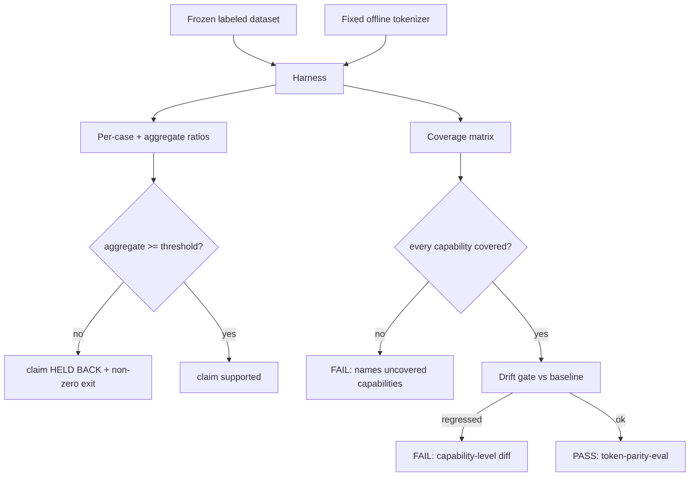

# Token-Parity Eval Harness & Coverage Matrix (SW-012)

> Distinct CI check: **`token-parity-eval`**.
> Workflow: [`.github/workflows/eval.yml`](../../.github/workflows/eval.yml)
> Harness: [`internal/eval`](../../internal/eval) · CLI: [`cmd/eval`](../../cmd/eval) · dataset: [`internal/eval/cases.json`](../../internal/eval/cases.json) · coverage baseline: [`internal/eval/coverage-baseline.json`](../../internal/eval/coverage-baseline.json)

## State before this story

Before SW-012, graphi's headline "~50× fewer tokens" claim was an **assertion**:

- Nothing measured the token ratio between graphi's winnowed context and a
  whole-file-read baseline, so the claim could drift undetected (open question
  OQ4 was unresolved).
- There was no deterministic offline tokenizer, so any measurement would depend
  on a model call (non-hermetic, non-reproducible).
- There was no per-capability coverage matrix, so the eval surface could silently
  erode — a capability could ship with zero eval cases and regress unnoticed.

## State after this story

SW-012 makes the claim **evidence-gated** and the eval surface **coverage-gated**.

### The measurement

Each frozen eval case carries the terse winnowed graphi answer (a citation-backed
result, ~6 tokens) versus a realistically-sized whole-file-read baseline (graphi's
real source files run 460–2700 tokens; the frozen baselines are 326–528 tokens).
The harness tokenizes both with a **fixed offline tokenizer** (`strings.Fields` —
deterministic, no model calls) and computes per-case and aggregate ratios.

On the committed frozen set, the harness measures an **aggregate of ~57×**
(sum of baseline tokens ÷ sum of graphi tokens), so the public ~50× claim is
currently **supported by evidence**. The claim gate (`-claim-validate`) exits
non-zero the moment the measured aggregate drops below the configured threshold
(default 50×), resolving OQ4 with evidence rather than assertion.

### The coverage matrix

The capability set is derived mechanically from the canonical MCP tool registry +
CLI command set (`query.Operations` + `search`): `callers, callees, references,
definition, neighborhood, search`. The coverage matrix maps every capability to
≥1 eval case; any capability with zero cases fails CI. A committed coverage
baseline + drift gate fails CI with a **capability-level diff** when a previously-
covered capability loses coverage or the count drops.

### Hermeticity & determinism

Reused SW-008 posture: zero non-loopback network, no telemetry, CGo-disabled
(enforced by the SW-009 gate), embedded dataset (no filesystem/net at runtime).
Two runs on unchanged inputs produce **byte-identical** reports (`TestDeterministic_ByteIdenticalReport`).

## Why these changes were made

- **Resolve OQ4 with evidence.** A claim that is not measured is marketing. The
  harness turns "~50×" into a machine-checked, evidence-backed verdict that fails
  loud the moment it stops being true.
- **Make the eval surface self-defending.** The coverage matrix + drift gate
  guarantee a capability cannot ship (or lose) eval coverage silently.
- **Keep it hermetic and reproducible.** A fixed offline tokenizer + embedded
  frozen set make the harness deterministic and free of model/network dependency,
  so the verdict is trustworthy and CI-stable.

## Out of scope

- The token-shaping/savings-ledger implementation (EP-003) — this story only
  evaluates it. When EP-003 ships, its live winnowed output is captured into the
  frozen eval set and re-measured by this same harness.
- Egress/telemetry enforcement (SW-008) — reused as posture only.
