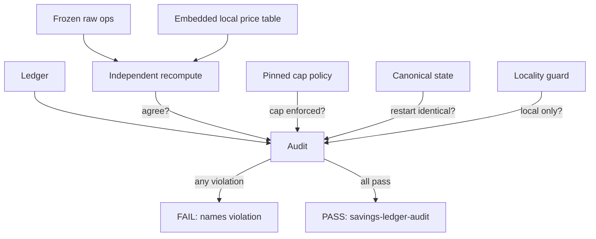

# Savings-Ledger Audit, Recompute & Anti-Gaming Suite (SW-011)

> Distinct CI check: **`savings-ledger-audit`**.
> Workflow: [`.github/workflows/ledgeraudit.yml`](../../.github/workflows/ledgeraudit.yml)
> Suite: [`internal/ledgeraudit`](../../internal/ledgeraudit) · CLI: [`cmd/ledgeraudit`](../../cmd/ledgeraudit) · price table: [`internal/ledgeraudit/pricetable.json`](../../internal/ledgeraudit/pricetable.json)

## Scope note (read first)

EP-003 has shipped the production token-savings ledger (`engine/ledger`,
`engine/meter`, `engine/price`, `engine/cap`, `engine/context`). This audit
suite runs the same `Audit`/`Ledger` contract against the real EP-003 ledger —
not a fixture — and the production ledger meters real engine calls and persists
across daemon restarts. Independence is preserved: the recompute
(`recompute.go`) derives savings via its own summation path, separate from the
ledger's.

## State before this story

Before SW-011, the headline "It saved me $X" claim would have had **no
independent verification**:

- The savings ledger (EP-003, when it landed after SW-011) would be the sole source of its own totals —
  a bug or tampering could silently inflate savings.
- There was no frozen baseline method to pin the computation, so a silent formula
  change could drift savings.
- There was no anti-gaming cap, so a single oversized op or a repeated session
  could inflate totals beyond a defensible bound.
- There was no cross-restart integrity check, so restarts could drift, double-
  count, or replay entries.
- Pricing could in principle reach an external source, violating local-first.

## State after this story

SW-011 makes savings **verifiable and un-gameable**. A distinct CI check runs
five independent check groups against the ledger and fails loudly on any
violation:

| Check group | What it proves |
|---|---|
| Baseline version-stamp | The frozen computation method is pinned; a method change without a version bump fails the build |
| Independent recompute | Savings recomputed from raw token inputs (separate code) agree with the ledger's totals exactly (integer micro-USD); a tampered ledger is caught |
| Anti-gaming cap | No single op exceeds the per-op cap; no session exceeds the per-session cap, even under crafted inflation |
| Cross-restart integrity | After serialize→deserialize, totals, ordering, session totals, and content-addressed entry hashes are byte-identical; reorder/replay are caught |
| Local-only pricing | Pricing resolves only from the embedded local price table; non-loopback/external lookups are rejected by the locality guard |

All math is **integer micro-USD** (no float tolerance ambiguity). The price table
is **embedded** via `go:embed`, so pricing is unambiguously local and the suite is
fully hermetic.

## Why these changes were made

- **Don't trust the ledger's own accounting.** Savings claims must be
  independently reproducible from raw inputs; the recompute makes that provable.
- **Make the method frozen and version-stamped.** A baseline that can change
  silently is no baseline. The stamp forces intentional, reviewed re-pins.
- **Make savings un-gameable.** Caps bound per-op and per-session contributions so
  inflation cannot manufacture savings.
- **Make restarts safe.** Content-addressed hashes + canonical encoding make drift
  detectable rather than silent.
- **Keep pricing local.** The locality guard enforces the local-first invariant at
  the pricing boundary.

## Out of scope

- Egress/telemetry enforcement (SW-008) — reused as posture only.
