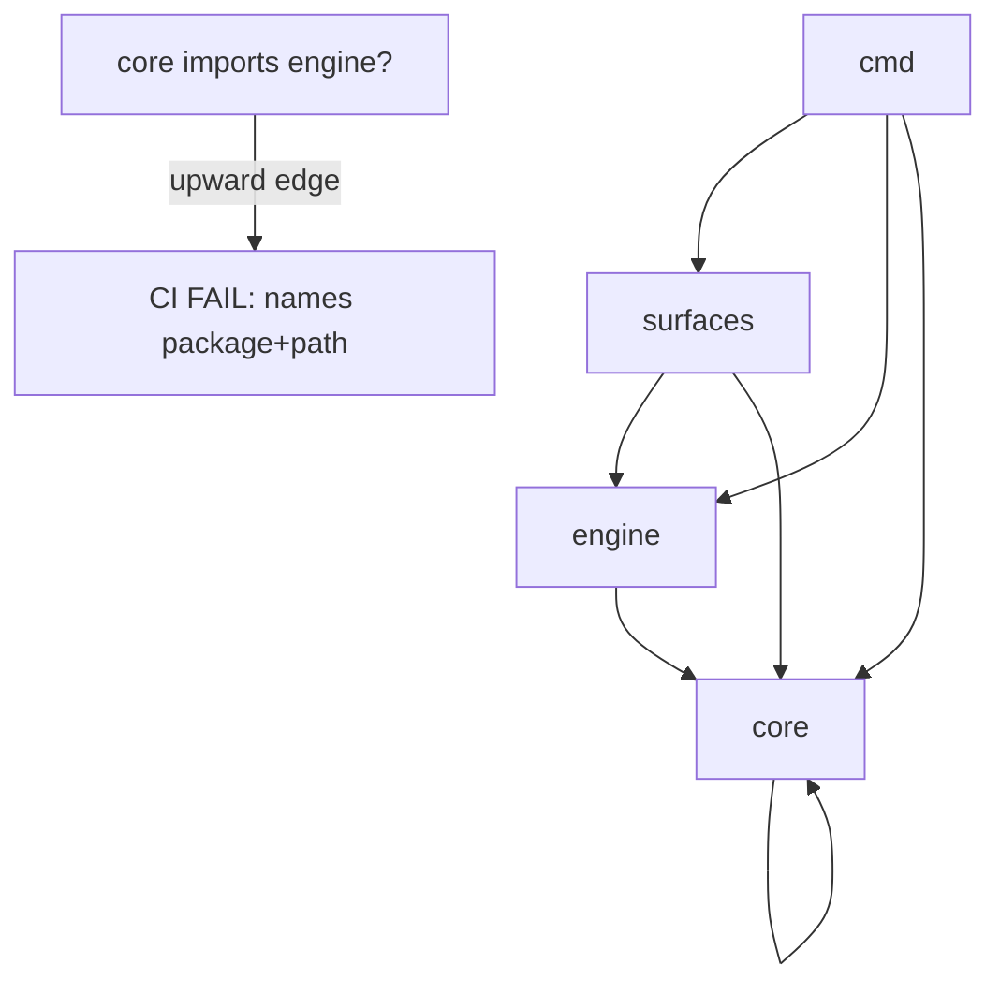
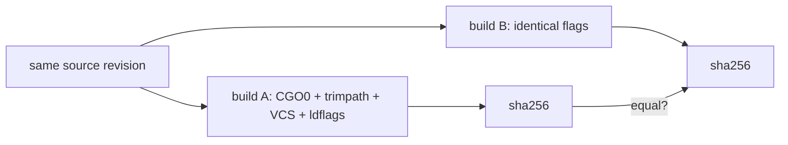

# Workspace CI, Layer-Direction Guard & Release Packaging (SW-013)

> Distinct CI checks: **`workspace-build-test`**, **`layer-direction`**, **`release`**.
> Workflow: [`.github/workflows/release.yml`](../../.github/workflows/release.yml)
- Layer guard: [`internal/layerguard`](../../internal/layerguard) · CLI: [`cmd/layerguard`](../../cmd/layerguard)
- Release: [`internal/release`](../../internal/release) · CLI: [`cmd/release`](../../cmd/release) · workspace discovery: [`internal/workspace`](../../internal/workspace)

## State before this story

Before SW-013:

- There was no `go.work` and no single gated CI job that built + tested the whole
  workspace, so a new module could land unbuilt/untested.
- The architectural boundary `cmd → surfaces → engine → core` was documented but
  not mechanically enforced — a `core` package importing `engine` could merge.
- There was no canonical release artifact: the binary downstream gates target
  (canary, bench, eval) had no reproducible, version/commit/date-stamped,
  CGo-free packaging recipe, and no proof two builds of one revision are identical.

## State after this story

SW-013 makes the workspace **auto-built**, the architecture **mechanically
enforced**, and the release **reproducible**.

### Workspace CI (auto-discovered)

A `go.work` (single `use .` today; grows as modules are added) drives a single
gated `workspace-build-test` job. `go build ./...` + `go test ./...` honor the
workspace's `use` directives, so a new module is **auto-included with no pipeline
edit**. `internal/workspace` reads the `use` directives programmatically.

### Layer-direction guard (single authoritative rule)

`internal/layerguard` declares the rule once — `cmd(4) → surfaces(3) →
engine(2) → core(1)`, higher may import lower — and scans the import graph via
`go list -json`. Any ranked package importing a higher-ranked package fails CI,
**naming the offending package + import path**. On success it reports the
verified allowed-edge set (currently `[cmd→core, cmd→engine, cmd→surfaces,
core→core, engine→core, surfaces→core, surfaces→engine, surfaces→surfaces]`).
Unranked packages (stdlib, external, `internal/*`, `bench/*`) are unconstrained.



### Reproducible release packaging

`internal/release` builds `./cmd/graphi` with `CGO_ENABLED=0`, `-trimpath`,
`-buildvcs=true`, and an ldflags-stamped version (`-X .../internal/version.Version`).
Commit SHA and commit (build) date come from Go **VCS stamping**
(`debug.ReadBuildInfo`) — deterministic for a given revision, so the binary stays
reproducible. A reproducibility check builds the same source **twice** and asserts
the binaries are **byte-for-byte identical** (sha256 equal). `graphi version`
self-reports the embedded version + commit + date.



## Why these changes were made

- **Make the architecture self-defending.** A documented layer rule that isn't
  checked is aspirational; the guard makes `cmd → surfaces → engine → core` a
  machine-enforced invariant.
- **Give every downstream gate one consistent artifact.** The canary, bench, and
  eval gates all target the static CGo-free `graphi` binary; reproducible
  packaging makes that target trustworthy and auditable.
- **Keep CI maintenance-free as modules grow.** Auto-discovery from `go.work`
  means new modules are built/tested without editing pipeline module lists.

## Reproducibility recipe

```
CGO_ENABLED=0 go build -trimpath -buildvcs=true \
  -ldflags "-X github.com/samibel/graphi/internal/version.Version=<version>" \
  -o graphi ./cmd/graphi/
```

Two such builds of the same clean revision produce sha256-identical binaries.
The `date` is the VCS commit time (`vcs.time`), not wall-clock, so it is stable
across builds.

## Out of scope

- Runtime egress/telemetry (SW-008), CGo-free gate (SW-009), benchmarks (SW-010),
  ledger audit (SW-011), token-parity eval (SW-012) — these *consume* this
  story's binary.
- The opt-in `graphi-broad` CGO flavor packaging (separate track).
