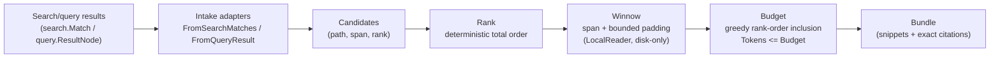

# Context Assembly

> Part of the Token-Savings Ledger & Token-Efficient Context work.
> Package: `engine/context`

This document explains how graphi turns raw search results into compact,
citation-backed context bundles. It's for contributors working on the
`engine/context` package or anyone trying to understand how graphi keeps
token usage low when serving an AI agent.

## Before

graphi's query/search layer (`engine/query`, `engine/search`) returns matched
symbols with their source location, but an AI agent answering a question
about the repo still had to **read whole files** to get usable code context.

The `Match` / `ResultNode` types carried a point location (file, line, column)
and a rank, but nothing shaped the raw file bytes into a minimal,
citation-backed bundle. As a result, agents consumed far more tokens than the
answer required.

## After

`engine/context` adds a **context-shaping transform** that sits between the
search/query results and the agent. Given a query plus candidates, it produces
a compact, deterministic bundle of **winnowed, citation-backed evidence
snippets**, ranked and budget-bounded:

### Key properties

- **Winnowed, not whole-file** — each snippet is the relevant span plus a bounded,
  configurable number of surrounding context lines; the rest of the file is
  excluded. A match on one line of a 1000-line file yields a snippet of a few
  lines, not 1000.
- **Exact citations** — every snippet carries `Citation{Path, StartLine, EndLine}`
  produced at extraction and carried verbatim; re-reading the cited span
  reproduces the snippet bytes exactly (the citation round-trips).
- **Token-budget ceiling** — snippets are included greedily in rank order until
  the configured budget is reached; the remainder is dropped. `Bundle.Tokens` is
  always `<= Budget`. Budget `<= 0` yields an empty bundle.
- **Deterministic across processes** — ranking is a stable total order
  (`Rank asc → Path asc → StartLine asc → EndLine asc`); there is no wall-clock,
  no randomness, and no map-iteration-order dependence. Identical inputs yield
  byte-identical bundles.
- **Local-first** — the only I/O path is `LocalReader`, which reads from disk
  only and **rejects remote sources** (`http(s)://`). Assembly never dials out.

## Why these decisions

- **Layer placement in `engine/context`** — context shaping is an engine-level
  transform, so it lives in `engine` to keep the `cmd → surfaces → engine →
  core` chain intact. It imports its engine siblings `engine/query` and
  `engine/search` only for the intake adapters. The layer guard fires only on
  strictly-upward edges, so a same-layer `engine → engine` import is allowed
  and shows up as a verified allowed edge.
- **Local tokenizer (mirrors `eval.CountTokens`)** — the engine deliberately
  does not import `internal/eval`, since runtime must not depend on tooling and
  an `engine → internal` edge would fall outside the ranked chain. The
  tokenizer itself is a one-line stdlib call, duplicated intentionally to
  preserve layer integrity.
- **Greedy rank-order inclusion** — the acceptance criterion is to include
  snippets in rank order until the budget is reached, then drop the remainder.
  Greedy prefix-filling is the faithful, deterministic way to implement that; a
  knapsack-style fill would be neither rank-ordered nor trivially
  deterministic.
- **Citation = expanded span** — the citation labels the bytes actually
  carried, including context padding, so it always round-trips. The raw match
  line is preserved separately only if the caller supplies it.

## Scope boundary

This capability emits the bundle only. Related work that builds on this
output — but lives elsewhere — includes:

- **Metering** the bundle's tokens against a baseline
- **Pricing** the savings in USD
- **Persisting** those savings
- The **anti-gaming cap and readout**
