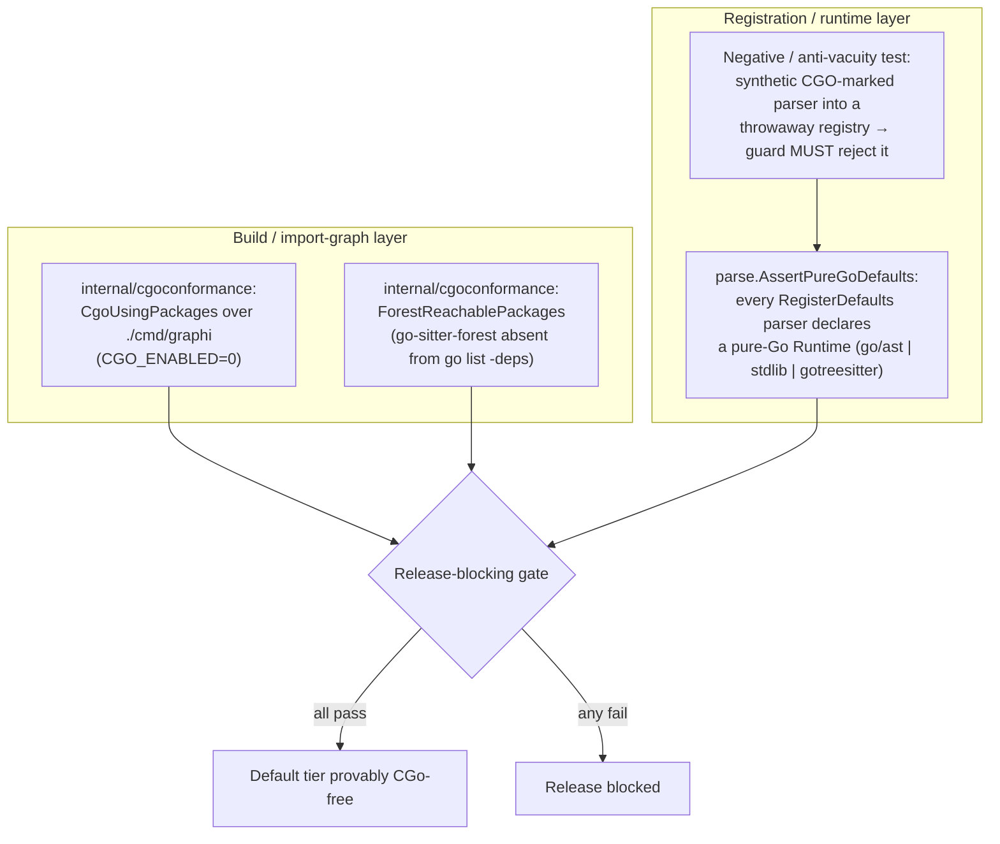
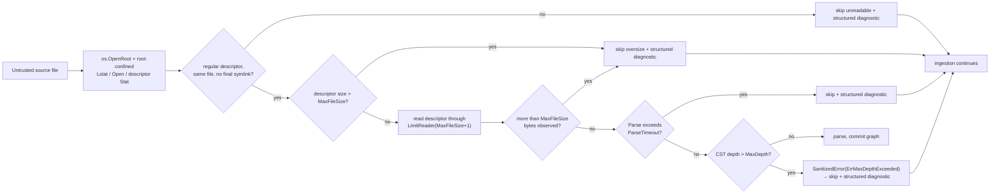

# Default-Tier Security & Isolation Controls

This document records the security controls that make the CGo-free /
zero-egress guarantees of graphi's **default tier** *provable and
regression-proof*. It's for contributors and security reviewers who need to
verify those guarantees rather than take them on faith.

These are security controls, not packaging conveniences: the CGo-free default
build is the architectural firewall against the native-code surface that the
opt-in `graphi-broad` flavor introduces.

> **Scope split: default tier vs. the broad flavor.** This work builds the
> default-tier firewall, along with the shared, reusable guard/bounds/harness
> that the broad flavor later wires into its own lane. The `graphi-broad` smoke
> lane, `go-sitter-forest` license verification, and the broad flavor's offline
> build and resource bounds belong to that later, separate effort. The
> default-tier firewall described here is provably safe independently of the
> broad flavor's state.

## Why these are security controls

The default tier is the trust boundary a user relies on when they run graphi
locally against untrusted source repositories:

- **No native code** → no cgo attack surface, no dynamic C dependency, a static
  reproducible binary.
- **No egress / no telemetry** → a local-first tool that never phones home.
- **Pinned, provenanced, license-verified supply chain** → no surprise
  dependency, no surprise license, no build-time network fetch.
- **Fail-closed resource bounds** → an untrusted input cannot exhaust resources
  (multi-GB file, billion-laughs nesting) or leak its own bytes through an error.

Each guarantee must be **regression-proof**: enforced by a test that fails the
moment the guarantee silently regresses.

## Before → After

| Control | Before | After |
|---|---|---|
| **No-CGO default tier** | Build-graph cgo scan only (`internal/cgoconformance`); the CGo-free guarantee could silently regress at the *registration* layer. | Release-blocking **registration-level guard** (`parse.AssertPureGoDefaults`) over `RegisterDefaults` output asserts every parser declares a pure-Go `Runtime`, **plus** a static `go-sitter-forest`-unreachable scan in the import graph. Paired with an **anti-vacuity negative test** that registers a synthetic CGO-marked parser and proves the guard rejects it. |
| **Zero egress / no telemetry** | `internal/audit.checkNoTelemetry()` returned a **hard-coded declared PASS**. | Backed by the **real `internal/canary` static gate** (telemetry-import denylist + type-checked outbound-dial AST scan over the default graph) + a **runtime zero-egress test** that exercises every default-tier parser under an **injected failing dialer** (no live sockets). |
| **Supply chain** | `go.mod` pin + `go.sum` only; license **assumed** Apache-2.0. | **Provenance/license record** (`internal/release.DefaultTierGrammarProvenance`): pinned `gotreesitter v0.20.2`, source URL, **actual license = MIT** read from the resolved module cache. Tests assert pin-match against `go.mod`, `go mod verify`, and SPDX-permissive license (fails on a license-changing bump). |
| **Offline build** | Assumed from the `//go:embed` mechanism, never tested. | **Actively tested**: the default flavor builds under `GOPROXY=off` + warm cache (the real risk is a *module* fetch, not a grammar fetch — blobs are Go-embedded via subset tags). |
| **Parse-time resource bounds** | **None** — `engine/ingest` read files unbounded (`os.ReadFile`), `Parse()` had no enforced size/timeout/depth. (The `parser_go.go` comment referenced a guard that did not exist.) | **Introduced fail-closed** (`parse.ResourceBounds`): source files are opened through a repository-confined `os.Root`, descriptor size is checked before reading, and the descriptor read is capped at `MaxFileSize+1`; parse timeout uses `context.WithTimeout`, and CST nesting depth is capped inside the gotreesitter walk. On any breach the file is **skipped with a structured diagnostic** — never parse-anyway, never silently truncate. |
| **Error/log source sanitization** | Unaudited; parser errors could echo raw source. | **Default-deny** (`parse.SanitizedError` / `Provenance`): errors carry only structured provenance (file, language, byte-span, node-kind), **never raw source bytes**. Verified by sentinel-secret negative tests across every failure mode. |
| **CI test-suite assertion** | A shell pipeline could lose `go test`'s producer status, and two permission fixtures were tolerated as expected failures under root. | **Strict all-green gate** (`internal/testgate`): consumes the complete `go test -json` stream plus exit status and stderr; every test/package/build failure is fatal. Permission fixtures probe actual filesystem enforcement and skip where denial cannot be exercised (root/ACL/platform), so the gate needs no UID-dependent carve-out. |

## Defense-in-depth: the two complementary no-CGO layers

The build layer proves `go-sitter-forest` (wholly CGO) can never enter the
default graph. The registration layer proves every *registered* default
parser is pure Go, and that the guard itself is **non-vacuous** — it rejects a
planted CGO offender. Neither layer subsumes the other.

## Fail-closed resource bounds & default-deny sanitization

Every skip path emits **only** structured provenance — file, language, byte-span,
node-kind — and never the raw source bytes, so a secret embedded in an oversize /
deeply-nested / failing file can never leak into an error or log line.

## Where the controls live

| Control | Code | Tests |
|---|---|---|
| Runtime provenance marker | `core/parse/runtime.go`, `Parser.Runtime()` | `core/parse/bounds_test.go` |
| Registration no-CGO guard + negative test | `core/parse/guard.go` | `core/parse/guard_test.go` |
| Static forest-unreachable scan | `internal/cgoconformance/gate.go` (`ForestReachablePackages`) | `internal/cgoconformance/gate_test.go` |
| Zero-egress / no-telemetry (real) | `internal/audit/audit.go` (`checkNoTelemetry` → `canary.RunGate`) | `internal/audit/telemetry_test.go`, `core/parse/egress_test.go` |
| Supply chain + offline build | `internal/release/provenance.go` | `internal/release/provenance_test.go` |
| Root-confined reads, fail-closed bounds + sanitization | `internal/rootfile/rootfile.go`, `core/parse/bounds.go`, `engine/ingest/ingest.go` | `internal/rootfile/rootfile_test.go`, `core/parse/bounds_test.go`, `engine/ingest/bounds_test.go` |
| Strict test-stream validator + drift-guard | `internal/testgate/allowlist.go`, `cmd/testgate` | `internal/testgate/allowlist_test.go`, `internal/mcpconfig/fixture_test.go` |

## CI wiring

- `.github/workflows/cgoconformance.yml` — adds a **release-blocking** "no-cgo
  registration guard" step (`go test ./core/parse/ -run TestAssertPureGoDefaults`)
  ahead of the named `cgo-free-conformance` check (which now also runs the static
  forest-unreachable scan).
- `.github/workflows/testgate.yml` — runs the strict all-green gate over a
  complete auto-discovered first-party `go test -json` result; npm
  `node_modules` trees are excluded before execution and no expected failures
  are accepted.
