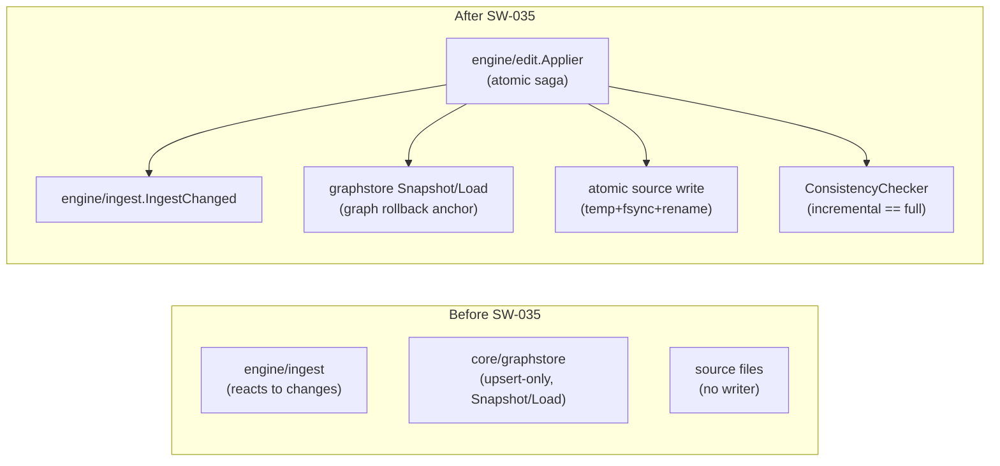
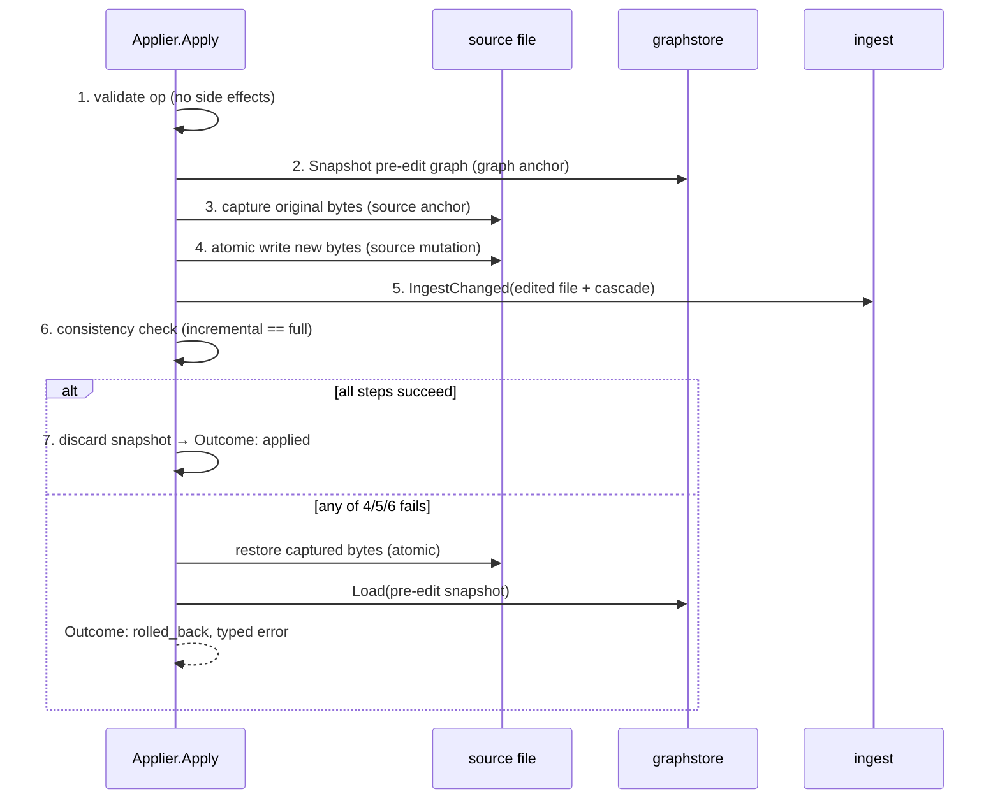

# Atomic, graph-consistent source edits (`engine/edit`)

Status: introduced in SW-035 (EP-006, epic 1/4).
Scope: identity-preserving span replacement only. Graphstore node/edge delete
semantics and non-identity-preserving edits are a documented fast-follow for
SW-036 (rename / extract / move).

## State before this story

Before SW-035, graphi could **read** a code graph and **ingest** source into
it, but it had no authoritative way to **mutate user source files** and keep the
graph consistent:

- `engine/ingest` owned the incremental path (`IngestChanged`, the two-phase
  dirty-flag protocol, `RecoverWithRoot`) and the full path (`IngestAll`), but
  ingest reacts to files that *something else* already changed — it never wrote
  source itself.
- `core/graphstore` provided durable storage plus a deterministic, byte-identical
  `Snapshot` / `Load` envelope, but `PutNode` / `PutEdge` are upsert-only — there
  is **no delete API**.
- There was no package that could take "replace these bytes in this file" and
  guarantee the source change and the graph update either both land or neither
  does. No cross-store transaction spans the filesystem, the graphstore SQLite,
  and the ingest-meta SQLite.

Consequently every higher-level refactor (rename, extract, move) had nothing
safe to build on, and there was no place to enforce the atomic / rollback
guarantee that a source mutation demands.

## State after this story

A new engine package `engine/edit` provides the **atomic edit primitive**:

- `EditOp{TargetNodeID, FilePath, ByteSpan, Replacement}` — the validated input
  contract. It carries its own byte span because `core/model.Node` exposes only
  `Line()` / `Column()` and no byte offset.
- `Applier.Apply(ctx, EditOp) (Result, error)` — applies the edit as a saga and
  returns a structured `Result{Outcome, TouchedFiles, UndoToken}` whose `Outcome`
  is either `applied` or `rolled_back` (mirroring the `engine/query` Outcome
  convention; `UndoToken` is reserved for SW-038 so adding undo later is not a
  breaking change).
- A reusable `ConsistencyChecker` that proves AC-3 after every edit, and an
  atomic source writer that mirrors `graphstore.writeFileAtomic`
  (temp + fsync + rename).



## Why it is built this way

### Atomicity by capture-and-compensate (saga), not a shared transaction

A single edit touches **three independent durability domains** that share no
transaction:

1. the **filesystem** (the source bytes),
2. the **graphstore** SQLite (the graph), committed inside `PutNode`/`PutEdge`,
3. the **ingest-meta** SQLite (content cache, reverse-deps, dirty flags).

There is no way to wrap all three in one commit. Atomicity is therefore achieved
with a saga: capture a rollback anchor for each mutable domain *before* mutating
it, then compensate in reverse on any failure.

Saga order (each step is undone by the anchor captured before it):



Reusing `graphstore.Snapshot`/`Load` as the graph rollback anchor is deliberate:
the snapshot envelope is already deterministic, atomic (temp + rename), and
contract-tested. Inventing a bespoke graph-undo would duplicate a proven
mechanism. The source rollback anchor is simply the original file bytes, read
before the write and rewritten via the same atomic writer on failure.

### Three rollback fault modes (AC-2)

`Apply` defends against the three failure modes the story names, each with a
typed sentinel error so callers and tests can distinguish them:

| Fault mode          | Sentinel          | What is restored                          |
|---------------------|-------------------|-------------------------------------------|
| write error         | `ErrWrite`        | nothing landed (atomic rename) — graph untouched |
| parse failure       | `ErrReindex`      | source bytes + pre-edit graph snapshot    |
| index inconsistency | `ErrInconsistent` | source bytes + pre-edit graph snapshot    |

A failure encountered *while compensating* is surfaced as `ErrRollback` so a
dirty rollback is never mistaken for a clean one. Deterministic fault-injection
seams (`SetFaultHook`, mirroring ingest's `SetFailAfterDirtyMarkHook`) drive each
mode in tests, and post-rollback **idempotency** is asserted: the same edit,
retried after a rollback, succeeds — proving no poisoned state survives.

### Byte-identical invariant via canonical marshal, not the FNV cache (AC-3)

After the incremental re-index, the `ConsistencyChecker` builds a throwaway store,
runs a **full** `IngestAll` over the post-edit source into it, marshals both the
live (incremental) store and the fresh (full) store via `model.Graph.Marshal`,
and compares their SHA-256 digests. Equal digests prove the incremental update
converged with a full rebuild.

The comparison targets the **canonical serialized graph** (`model.Graph.Marshal`
— nodes sorted by NodeId, edges by EdgeId, fixed field order), **never** the
ingest FNV-1a content cache. The cache is an ingest-internal optimization keyed
on file bytes; the invariant we care about is graph equivalence, which only the
canonical marshal renders byte-stably.

### Why the scope is identity-preserving span replacement only

`PutNode`/`PutEdge` are upsert-only and the graphstore has no delete API. After
an edit that changed a node's **identity** (Kind + QualifiedName + normalized
SourcePath), a full re-index would drop the old node while the incremental path
would leave it orphaned — breaking AC-3. SW-035 is therefore scoped to
**identity-preserving** edits: the replacement bytes do not change the targeted
node's identity, so no orphan can arise and incremental == full holds honestly.
Adding graphstore delete semantics (needed for rename/move anyway) is deferred to
SW-036.

> **Update (SW-036):** that deferral is now closed. `core/graphstore` gained
> `DeleteNode`/`DeleteEdge` and `ingest.parseAndCommit` deletes identity-changed
> nodes, so non-identity-preserving refactors (rename/extract/move/signature
> change) are supported via `engine/edit.ApplyRefactor` — see
> [graph-aware-refactor.md](graph-aware-refactor.md).

### Security and concurrency

- **Path safety:** every write path is sanitized against the repo root; an edit
  can never write outside it (rejects `..` traversal).
- **Atomic source write:** temp + fsync + rename mirrors
  `graphstore.writeFileAtomic`, so a crash never leaves partially-written source.
  Existing file permissions are preserved.
- **No eval/exec/shell, no outbound network** — unchanged local-first guarantees.
- **Crash safety:** an edit interrupted mid-re-index is recoverable via the
  EP-001 dirty-flag + `RecoverWithRoot` path; a half-applied edit that corrupts
  source is impossible by construction (capture-and-restore original bytes).
- **Concurrency:** single-writer-per-repo (config `writing.default_mode:
  single_writer`). The saga is not atomic against a concurrent edit or ingest;
  callers must serialize edits per repository.
```
