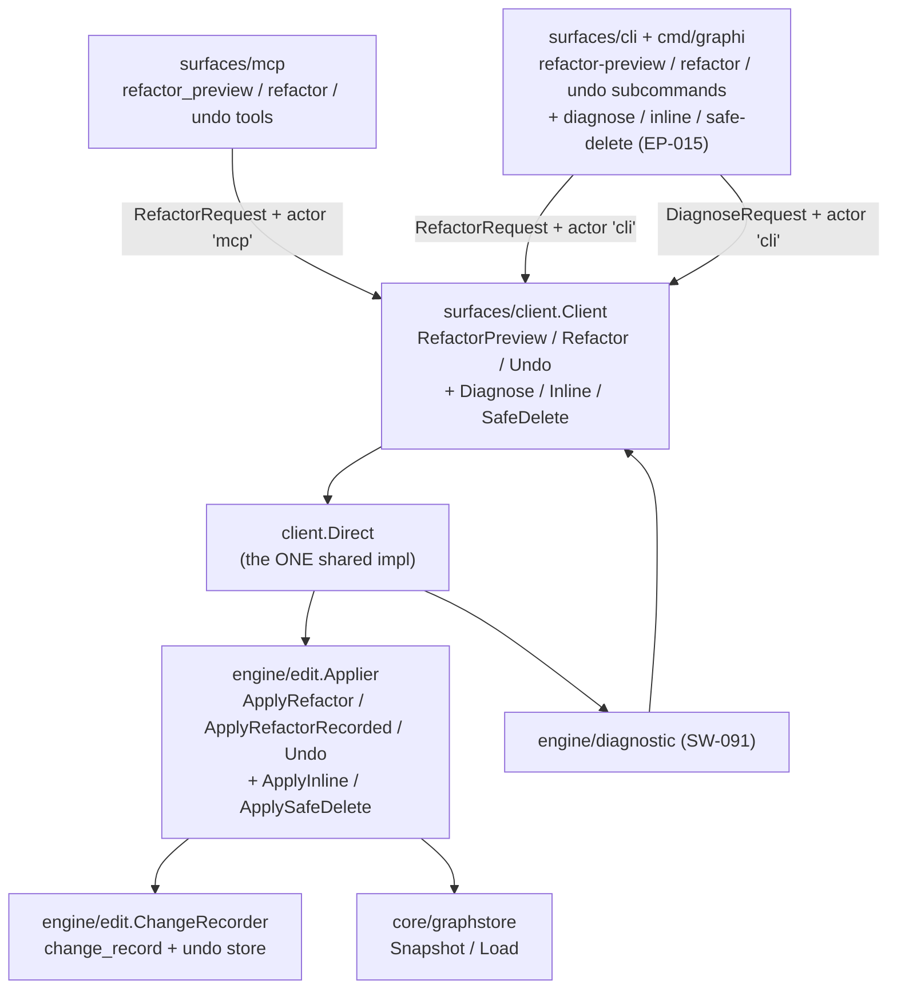
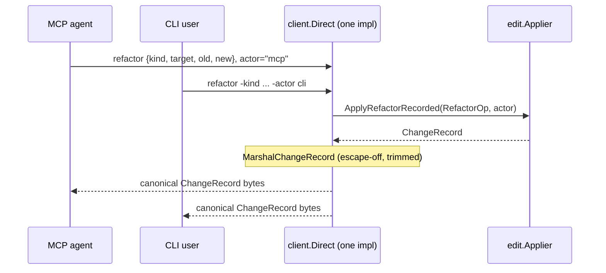
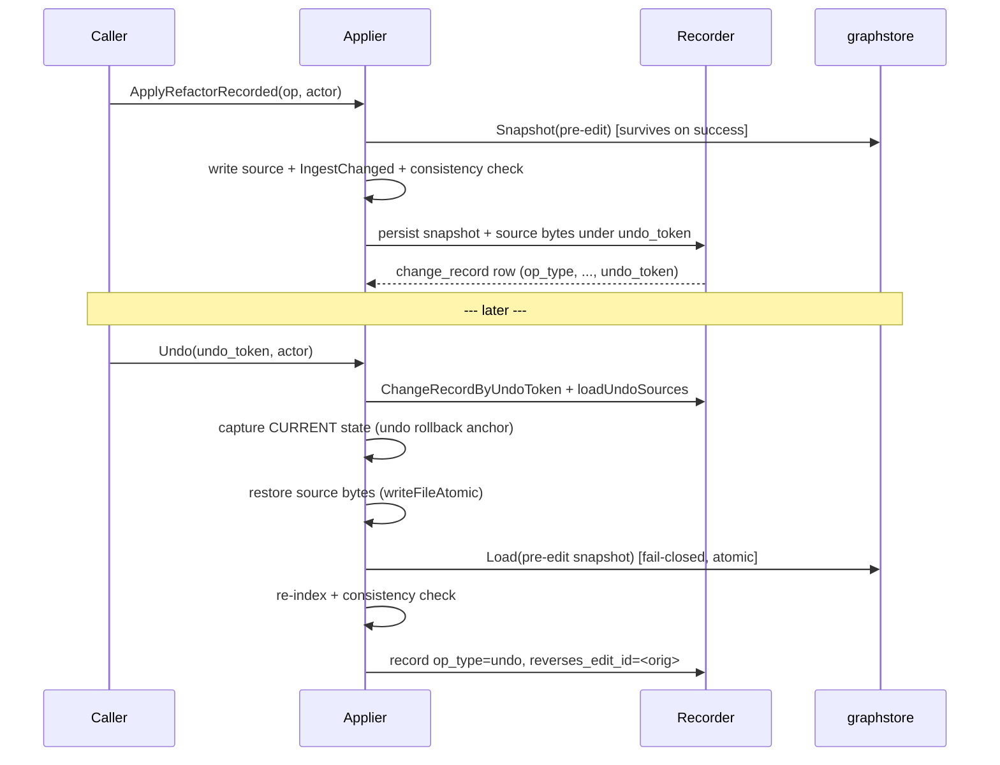

# MCP/CLI Graph-Aware Edit & Refactor Command Surface

This document covers how graph-aware edit and refactor operations are exposed
to callers over the MCP server and the CLI. It's written for contributors
working on either surface, or on the shared `client.Direct` implementation
underneath them.

It explains the state **before** and **after** this surface was introduced,
why the changes were made, and the load-bearing design decisions: the surface
is a **thin transport** over one shared `client.Direct` implementation; undo is
achieved by **persisting the pre-edit snapshot** keyed by a crypto-random undo
token; and the audit/undo store is an `engine/edit` **side-channel** in the
ingest-meta sidecar, never in `core/graphstore`.

> **Later additions: diagnose, inline, safe-delete.** This surface was later
> extended with two new CLI subcommands — `graphi inline` and
> `graphi safe-delete` — and the `graphi diagnose` diagnostics + code-action
> flow. All three ride the same shared `client.Client` interface through new
> `Inline` / `SafeDelete` / `Diagnose` methods, with a shared marshaller
> (`engine/edit/serialize.go`) and a byte-parity harness
> (`surfaces/ep015_parity_test.go`). `diagnose` is graph-derived (no source
> mutation), `inline` performs a reference-correct inline refactor with a
> fail-safe block list, and `safe-delete` gates on reference-safety before
> removing a symbol.

## Before this surface existed

The atomic edit primitive, the graph-aware refactor saga with dry-run preview,
and per-edit `edit_provenance` tracking all shipped in `engine/edit`, but
**none of it was reachable from a surface**. The MCP server (`surfaces/mcp`)
and CLI (`surfaces/cli` + `cmd/graphi`) exposed only query/search/savings/
analysis through the shared `surfaces/client.Client` seam. There was:

- **No** way for an MCP agent or a CLI user to trigger a refactor.
- **No** auditable change record (operation, target, before/after, actor,
  timestamp, undo token) — the only persistent edit record was `edit_provenance`,
  which lacks actor, before/after, and an undo token.
- **No** undo: the pre-edit graph `Snapshot` taken inside both sagas was
  `defer os.RemoveAll`'d, so it was discarded on success **and** failure, and
  `Result.UndoToken` was always empty.

## After this surface landed

A unified edit/refactor command surface is exposed over **both** the MCP server
and the CLI, sharing **one** implementation in `client.Direct`:

- `RefactorPreview` resolves the target via the query layer and returns the
  impact set + planned ops via `ApplyRefactor(DryRun:true)`
  **before any mutation** (AC-1).
- `Refactor` commits through the same `*edit.Applier` saga and persists an
  auditable `ChangeRecord` (operation, target, before/after, actor, timestamp,
  undo token) (AC-2).
- `Undo` reverses an applied edit by its undo token, restoring the prior graph +
  source and recording the reversal as its own auditable entry (AC-3).

MCP gets three tool descriptors (`refactor_preview`, `refactor`, `undo`) and the
CLI gets three subcommands; both are **thin transport** that marshal inputs into a
`client.RefactorRequest` and call the same `client.Client` methods — so the two
surfaces return identical change records by construction (AC-4).

### Architecture: one impl, two surfaces

Layering is preserved (`cmd → surfaces → engine → core`): the surfaces hold **no**
engine logic; all invariants (path sanitization, atomic temp+fsync+rename writes,
all-or-nothing compensation, single-writer) live below the surface in
`engine/edit` and cannot be weakened by a malicious tool input.

### The MCP↔CLI parity story

Both surfaces converge on the same `ApplyRefactorRecorded`. The only field that
legitimately differs is `actor`.

#### Documented comparable subset (AC-4 "identical records")

"Identical" is pinned to a **comparable subset** so it is unambiguous against the
per-surface `actor` (AC-2) and the non-deterministic ids:

| Field | In comparable subset? | Why |
|---|---|---|
| `op_type`, `target_node_id`, `old_name`, `new_name`, `touched_files` | **Yes** | the structural outcome of the edit |
| before/after refs (snapshot graph + name pair) | **Yes** | the AC-2 before/after |
| `actor` | **No** | per-surface by construction (`"mcp"`/`"cli"`) |
| `edit_id`, `undo_token` | **No** | unique/crypto-random by design |
| `recorded_at`, `snapshot_ref` | **No** | wall-clock / absolute path, environment-specific |

The parity test (`surfaces/edit_parity_test.go`) runs the same refactor through
both real surface paths and asserts equality over exactly this subset.

## The undo mechanism: persisted snapshot, not inverse edit

Undo restores the **exact** prior graph. Re-deriving an inverse edit is unsound:
rename/move are non-identity-preserving (`NodeId = xxhash64(Kind, QualifiedName,
SourcePath)`), so the old node is **deleted** by the re-index and cannot be
reconstructed byte-identically. Instead, a successful refactor persists:

1. the **pre-edit graph snapshot** (`graphstore.Snapshot`, portable + atomic), and
2. the **captured pre-edit source bytes** of every touched file,

keyed by a crypto-random undo token under `<meta>/undo/<token>/`. The surgical
change to the saga: `applyBatch` no longer unconditionally `os.RemoveAll`s the
snapshot dir — on **rollback** `compensate` removes it (so a faulted edit leaves
no orphan), and on **success** it hands the snapshot + captured originals back to
the caller as `sagaArtifacts`. A bare (non-recording) `ApplyRefactor` discards
them itself, preserving the original "no orphan on success" behavior; the
recording path (`ApplyRefactorRecorded`) persists them into the durable undo
store. **The existing failure-rollback semantics are unchanged**: every rollback
path still restores source bytes + `Load`s the snapshot, and now also removes the
snapshot dir.

Undo is a **second compensating saga**: it captures the current (post-edit) state
first, so a fault anywhere in the restore compensates back to the post-edit state
(no half-applied undo).

## The audit/undo store: an `engine/edit` side-channel, never in the graph store

The `change_record` table lives in the **ingest-meta SQLite sidecar**
(`ingest-meta.db`), a sibling of `edit_provenance` / `file_content_cache` /
`reverse_deps` / `dirty_units`. It is **never** in `core/graphstore`: the AC-1
byte-identical invariant compares the marshalled **graph**
(`model.Graph.Marshal`), and an audit table in the graph store would poison
that digest — the same reason `edit_provenance` was kept out of the graph
store. `engine/edit.ChangeRecorder` owns its table via
`(*ingest.Ingester).MetaDB()`, keeping the audit logic in `engine/edit` while
reusing the one sidecar.

### `change_record` schema

| Column | Type | Notes |
|---|---|---|
| `edit_id` | TEXT PRIMARY KEY | = saga `Result.EditID` (a fresh id for an undo) |
| `op_type` | TEXT NOT NULL | rename / extract / move / signature_change / undo |
| `target_node_id` | TEXT | resolved NodeId |
| `old_name` / `new_name` | TEXT | human-readable before/after |
| `touched_files` | TEXT NOT NULL | JSON array of repo-relative paths |
| `actor` | TEXT NOT NULL | per-surface (`"mcp"`/`"cli"` or supplied) |
| `recorded_at` | INTEGER NOT NULL | unix ns, from the `SetClock` seam |
| `undo_token` | TEXT NOT NULL UNIQUE | crypto-random; the undo handle |
| `snapshot_ref` | TEXT NOT NULL | path to the persisted pre-edit snapshot |
| `reverses_edit_id` | TEXT (nullable) | set on `op_type=undo` records |

Read API: `ChangeRecords(ctx)` and `ChangeRecordByUndoToken(ctx, token)`, mirroring
the `EditProvenance` reader shape. **before/after**: before = `snapshot_ref` (graph)
+ `old_name`; after = the committed graph + `new_name`; element-level deltas remain
available via `edit_provenance` joined on `edit_id`.

## Security invariants (inherited + new)

- **Inherited, unweakenable:** the surface only marshals inputs into a
  `RefactorOp`; path sanitization, atomic source writes, all-or-nothing
  compensation, single-writer, no eval/exec/shell, no outbound network all live in
  `engine/edit` below the surface.
- **Undo-store path safety + atomic writes:** snapshots and source bytes are
  written within the meta dir under a sanitized leaf (`snapshotPathFor` validates
  against path escape), atomically (`writeFileAtomic`).
- **Unguessable undo tokens:** minted with `crypto/rand` + a monotonic sequence,
  not derived from the edit id, so undo cannot be aimed at an arbitrary prior edit.
- **Full compensating undo saga:** capture → restore source → `Load` → re-index →
  consistency check → record reversal; a faulted undo compensates.
- **No partial audit record:** a rolled-back edit writes **no** `change_record`
  row and leaves **no** orphan undo snapshot (tested via the inherited fault seams).

## Undo-store bounding (documented limitation)

The undo store currently retains every successful edit's snapshot + source bytes
under `<meta>/undo/`. There is **no** retention/pruning policy yet; an
unbounded store is a disk-growth consideration for long-lived repos. This is a
**documented limitation**, not a silent gap — a future change can add
size/age-based pruning of `change_record` rows + their `<meta>/undo/<token>/` dirs.

## Tests (where each AC is proven)

- **AC-1 impact-before-mutation:** `surfaces/edit_parity_test.go:TestEdit_ImpactBeforeMutation`
  (preview returns the impact set, source byte-identical; committing path's touched
  set matches the preview's).
- **AC-2 audit persistence + durability:** `engine/edit/audit_test.go:TestChangeRecorder_AuditPersistenceAndDurability`
  (one record, all fields, survives reopen) and `..._RolledBackEditLeavesNoArtifacts`.
- **AC-3 undo round-trip:** `engine/edit/audit_test.go:TestUndo_RoundTripByteIdentical`
  (4 kinds × single/multi-file, graph + source byte-identical, reversal record) and
  `TestUndo_FaultCompensates`.
- **AC-4 parity:** `surfaces/edit_parity_test.go:TestEdit_MCP_CLI_Parity` (both real
  surface paths, comparable subset) and `TestEdit_ActorRecordedPerSurface`.
