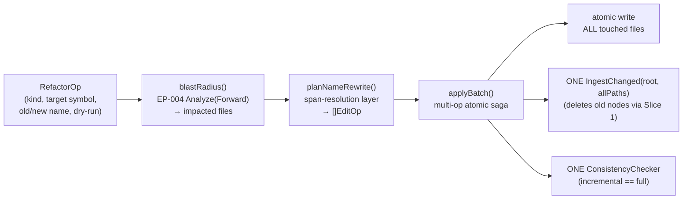
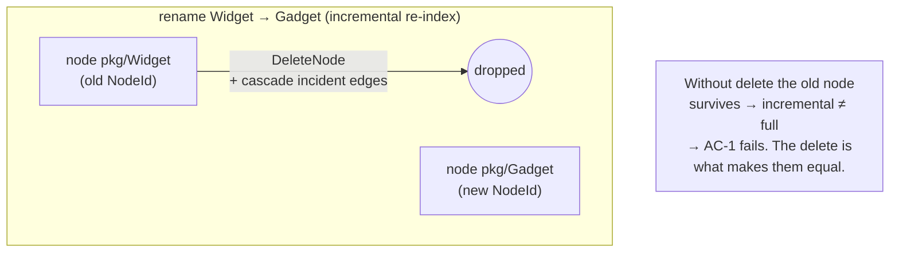
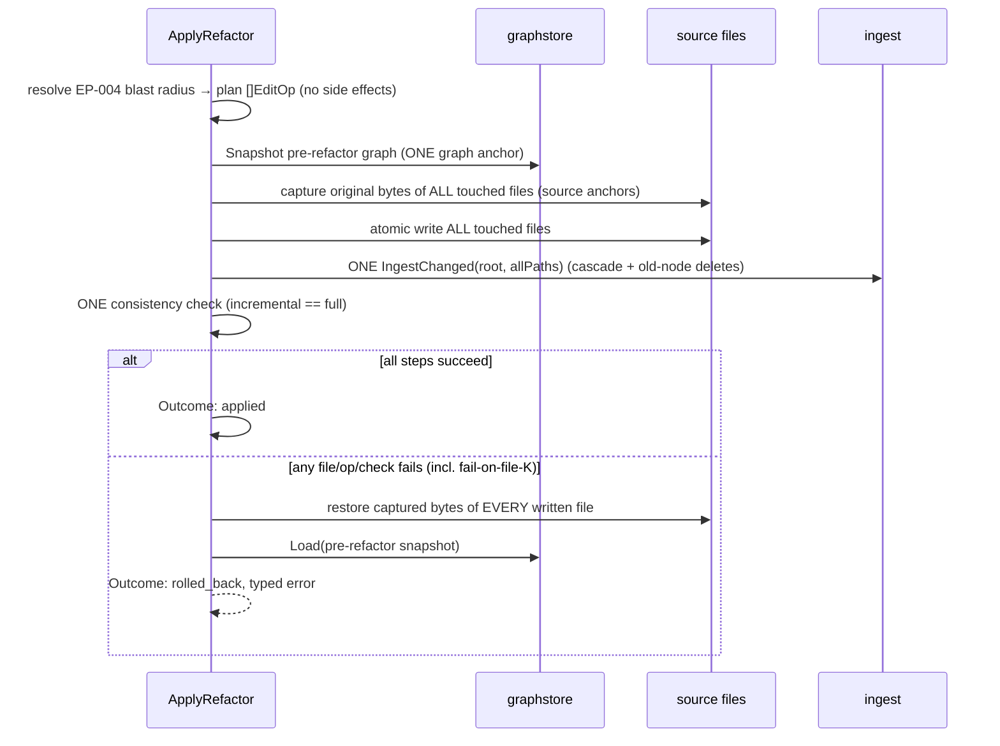

# Graph-aware refactors (`engine/edit.ApplyRefactor`)

This document covers `ApplyRefactor`, the multi-op saga that powers rename,
extract, move, and signature-change refactors. It's written for contributors
working on the refactor engine or a surface built on top of it.

Scope: rename, extract, move, and signature-change refactors that resolve their
blast radius through impact resolution and apply every edit in ONE atomic
multi-op saga, staying byte-identical to a full re-index within a ≤2s freshness
budget. Built on the atomic edit primitive (`Applier.Apply`) described in
[atomic-edit.md](atomic-edit.md).

Built-on / deferred-to:
- **Reuses** the atomic edit primitive: `writeFileAtomic`, `Snapshot`/`Load`,
  `ConsistencyChecker` (`NewParserConsistencyChecker` + `graphDigest`),
  `resolvePath`, `applySpan`, the `Result`/`Outcome` shape, and the inherited
  fault seams.
- **Closes** an earlier deferral: the `core/graphstore` node/edge **delete API**.
- **Defers** per-edit-id / operation-type provenance to a follow-up (this
  document's refactors record re-derived *parse* provenance, see below), and
  defers the MCP/CLI surface and the `UndoToken` (reserved on `Result`, still
  empty here) to a later surface — see
  [command-surface.md](command-surface.md).

## State before this capability existed

Graphi had an atomic edit primitive — but it was deliberately scoped to
**single-file, identity-preserving span replacement**:

- `core/graphstore` was **upsert-only** (`PutNode`/`PutEdge`): there was **no
  delete API**. `ingest.parseAndCommit` documented the consequence verbatim — its
  `oldIDs` loop was a no-op, so a node whose identity changed was left orphaned.
- `engine/edit.Applier.Apply` ran its saga over **one** `EditOp` against **one**
  file. A multi-file refactor could only be a *loop* of `Apply` calls, which (a)
  leaves files 1..K-1 committed on a failure at file K (partial state), and (b)
  runs N full-graph consistency checks (O(N) full re-indexes — wrecks ≤2s).
- The impact analyzer (`impactAnalyzer.Analyze`) could compute a blast radius as
  **nodes**, but nothing turned that into the concrete `(FilePath, ByteSpan)`
  edits a refactor needs (`model.Node` exposes only `Line()`/`Column()`, no byte
  span).

Because `NodeId = xxhash64(Kind, QualifiedName, SourcePath)`, **rename** (changes
QualifiedName), **move** (changes SourcePath) and **signature change** (changes
QualifiedName) are all *non-identity-preserving* — exactly the class the atomic
edit primitive excluded. They were unbuildable on `Apply` alone.

## State after this capability landed



Three things landed:

1. **`core/graphstore` delete API.** `DeleteNode(ctx, NodeId)` (cascades every
   incident edge) and `DeleteEdge(ctx, EdgeId)`, on **both** backends (MemStore +
   SQLite), proven identical by the contract suite. Crash-safe: SQLite commits the
   delete transaction FIRST, then updates the cache (mirrors `PutNode`).
   `ingest.parseAndCommit` now deletes any previously-committed node for a file
   whose identity the new parse does not reproduce — so an identity-changing
   re-index drops the old node instead of orphaning it.

2. **Multi-op refactor saga `ApplyRefactor` / `applyBatch`.** It generalizes the
   single-file saga to N files / N ops with the whole batch as the unit of
   atomicity (see the diagram below).

3. **Impact-analysis consumption + span-resolution planner.** `blastRadius` calls
   the impact analyzer (`Direction:Forward`, kinds `{calls,references,defines}`)
   to find the impacted files, and `planNameRewrite` resolves each file down to
   identifier-boundary-matched `(FilePath, ByteSpan, Replacement)` `EditOp`s — the
   net-new layer that bridges "which nodes" to "which bytes". An optional
   `DryRun` returns the impact set + planned ops without mutating.

## Why it is built this way

### The delete API is the gating prerequisite (closes an earlier deferral)

A rename mints a *new* `NodeId` while the old node still exists. A full re-index
drops the old node; the incremental path, without delete, would keep it. So the
incremental graph would diverge from a full re-index and **AC-1's byte-identical
invariant would be unachievable**. `DeleteNode` (cascading incident edges) plus
the wired `parseAndCommit` loop makes incremental == full hold honestly.



### One multi-op saga, not a loop of `Apply` calls

The unit of atomicity is the **whole batch**:



A failure at file K of N restores **all** already-written files and `Load`s the
pre-edit graph — a half-applied multi-file refactor is impossible by
construction. This is exercised by the new **fail-on-file-K** fault seam
(`SetBatchFaultHook`) alongside the three fault seams inherited from the atomic
edit primitive, and a retried refactor then succeeds (idempotency). The single
end-of-batch consistency check (never per file) is what keeps the ≤2s freshness
budget feasible.

### The impact analyzer gives nodes; the span-resolution layer gives bytes

`impactAnalyzer.Analyze(Forward)` returns the blast radius as reached *nodes*
(capped at 1024, with `Truncated` surfaced). `model.Node` has no byte offset, so
`planNameRewrite` reads each impacted file and emits an `EditOp` for every
**whole-identifier** occurrence of the old name (boundary-aware, so renaming
`Foo` never touches `FooBar`). Multiple ops in one file are applied
back-to-front so earlier byte offsets stay valid; overlapping spans are rejected.

### AC-2 provenance = re-derived PARSE provenance

`core/model.Edge` provenance is `(tier, confidence, reason, evidence)`, derived by
the parser at ingest — there is no per-edit-operation field. Per the refinement
scope clarification, AC-2's "provenance recording the originating operation" is
read as: affected nodes/edges are re-derived with correct **parse** provenance via
the incremental path. Dedicated per-edit-id / operation-type provenance is
explicitly deferred to a follow-up (see
[provenance-and-recovery.md](provenance-and-recovery.md)); no model field was
added here.

### The four operations

All four are the same saga + planner; they differ only in which identity field
the resulting source changes (and therefore which old node the re-index deletes):

| Operation        | Identity field changed | Old node deleted? |
|------------------|------------------------|-------------------|
| rename           | QualifiedName          | yes               |
| signature change | QualifiedName          | yes               |
| move             | SourcePath             | yes               |
| extract          | new node(s) created    | n/a (additive)    |

### Security and concurrency

- **Path safety, every file:** all N touched paths are sanitized to the repo root
  (`resolvePath`); a refactor can never write or delete outside it.
- **Atomic source write, every file:** `writeFileAtomic` (temp + fsync + rename),
  permissions preserved.
- **All-or-nothing multi-file compensation** is the load-bearing safety property,
  tested via fail-on-file-K.
- **Crash-safe delete:** `DeleteNode`/`DeleteEdge` commit to SQLite first.
- **No eval/exec/shell, no outbound network** — unchanged local-first guarantees.
- **Concurrency:** single-writer-per-repo (config `writing.default_mode:
  single_writer`); the saga is not atomic against a concurrent edit/ingest.
```
