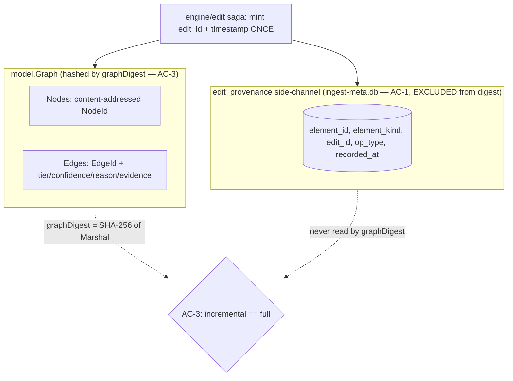
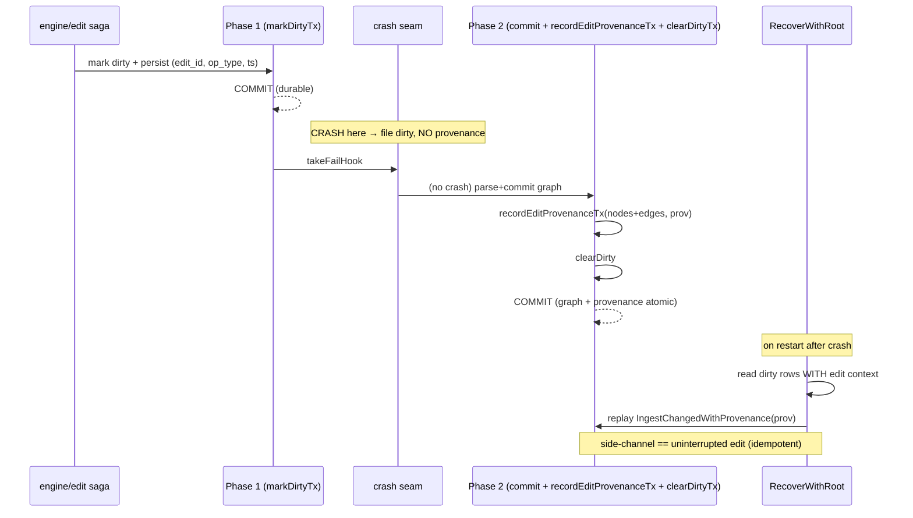

# Provenance-Tracked Edits & Crash-Idempotent Recovery (SW-037)

This document explains the state **before** and **after** SW-037, why the changes
were made, and the one load-bearing design decision: edit provenance is a
**side-channel** that is deliberately **excluded** from the byte-identical
re-index digest.

## Before SW-037

`engine/edit`'s `Apply` (single-op) and `ApplyRefactor` → `applyBatch` (multi-op)
already routed every edit through the EP-001 incremental ingest path
(`(*ingest.Ingester).IngestChanged`). Only affected nodes/edges were re-derived,
the two-phase **dirty-flag** protocol made a mid-ingest crash recoverable via
`RecoverWithRoot`, and the shipped `ConsistencyChecker`/`graphDigest`
(SHA-256 over `model.Graph.Marshal`) proved the incremental graph was
byte-identical to a full re-index.

What was **missing**: a per-edit audit record. After an edit landed, nothing
recorded *which edit* (its id, operation type, and timestamp) last touched each
node/edge. SW-036 re-derived the structural **parse provenance**
`(tier, confidence, reason, evidence)` on every affected edge but explicitly
**deferred per-edit-id provenance to SW-037**.

## After SW-037

Each edit now mints an **edit id once** and captures a **timestamp once** in the
saga, and that bundle (`EditProvenance{EditID, OpType, Timestamp}`) is threaded
into a provenance-aware ingest entry point,
`IngestChangedWithProvenance(ctx, root, changed, prov)`. Ingest records one row
per affected **NodeId and EdgeId** (including reverse-dependency cascade
elements) in a new `edit_provenance` table in the ingest meta sidecar
(`ingest-meta.db`). The minted `edit_id` is surfaced on `Result.EditID` /
`RefactorResult` for SW-038's audit/undo.

- `op_type` is a **closed enum** (`apply` / `rename` / `extract` / `move` /
  `signature_change`); unknown values and empty edit ids are rejected so the
  audit field cannot be poisoned.
- The side-channel write is O(touched elements) of indexed SQLite upserts inside
  the **already-present Phase-2 transaction**, so the ≤2s freshness budget on the
  incremental window is unaffected.
- `core/model`, `core/graphstore`, and `model.Graph.Marshal` are **untouched**.

## The two provenances (why the side-channel is excluded from the AC-3 digest)

This story has an apparent contradiction:

- **AC-1** says each updated node/edge must record `(source edit id, operation
  type, timestamp)`.
- **AC-3** says the incremental graph must be **byte-identical to a full
  re-index "including provenance"**.

A full re-index (`IngestAll`) **never saw the edit**: it has no edit id and a
different (later) wall-clock timestamp. If edit id / op type / timestamp were
serialized into `model.Graph.Marshal`, the incremental `graphDigest` would always
differ from the full-re-index `graphDigest`, so **AC-3 would fail for every
edit**. The two AC cannot both hold if edit provenance lives inside the
Marshal-hashed graph.

Resolution — these are **two different provenances**:

| | AC-1 edit provenance | AC-3 structural provenance |
|---|---|---|
| Content | edit id, op type, timestamp | tier, confidence, reason, evidence |
| Nature | volatile (how the graph was last mutated) | content-derived (deterministic) |
| Home | `edit_provenance` side-channel (`ingest-meta.db`) | `model.Edge` inside `model.Graph.Marshal` |
| In `graphDigest`? | **No — excluded** | **Yes** |

`graphDigest` compares only the structural graph, which incremental and full
re-index produce identically (proved by SW-035/036). The edit-provenance
side-channel is the audit record of *which edit touched what* and is correctly
excluded. **Regression guard:** if AC-3 ever fails on edit metadata, the
side-channel separation was violated.

## Two-phase dirty-flag write + provenance recording + crash recovery

The edit context rides the **existing two-phase dirty-flag protocol**:

- **Phase 1** persists the dirty flag *with* the edit context
  (`edit_id, op_type, recorded_at` columns on `dirty_units`) in its own
  transaction, so it is durable before the crash seam.
- **Phase 2** parses + commits to the graphstore, updates the cache/reverse-deps,
  **records the edit provenance**, and clears the dirty flag — all in one meta
  transaction.

A crash **before** the Phase-2 commit leaves the file dirty **and no provenance
recorded**; a crash **after** leaves both committed. There is no window where the
graph is updated but provenance is missing/stale. On restart, `RecoverWithRoot`
reads the leftover dirty rows **with their edit context** and replays the
provenance-aware Phase-2 path, reproducing the **identical** side-channel state an
uninterrupted edit would have produced — **provenance-idempotent recovery**.

## On-upgrade schema migration (existing `ingest-meta.db`)

The Phase-1 edit context lives in **three new columns** on the `dirty_units`
table (`edit_id`, `op_type`, `recorded_at`). A repository indexed by an earlier
story (SW-036 / EP-001) already has an on-disk `ingest-meta.db` whose
`dirty_units` table has **only** the original `path` column.

`CREATE TABLE IF NOT EXISTS` **cannot** retrofit columns onto a table that
already exists — it silently no-ops — so relying on it would leave a pre-SW-037
sidecar with the old shape, and the first provenance-bearing edit's `markDirtyTx`
INSERT would fail with `no such column: edit_id`, breaking incremental ingest
until the DB was deleted by hand (i.e. AC-2's "without manual intervention" would
not hold for already-indexed repos).

To migrate deterministically, the sidecar now carries a `PRAGMA user_version`
schema version and an idempotent migration ladder run at `New`:

- The base DDL declares `dirty_units` with **only** its original `(path)` shape.
- `migrate` reads `PRAGMA user_version`; if it is below the current
  `schemaVersion` (1), it runs the additive steps and then stamps the new
  version, so each step runs **exactly once** per database.
- The SW-037 step (`migrateDirtyUnitsEditContext`) checks `PRAGMA
  table_info(dirty_units)` and `ALTER TABLE … ADD COLUMN … NOT NULL DEFAULT …`
  for any of `edit_id` / `op_type` / `recorded_at` that are absent. `ADD COLUMN`
  with a `NOT NULL DEFAULT` is safe on a populated table, and the
  column-presence guard makes the step idempotent even on a fresh DB or one whose
  `user_version` was never tracked.
- The new `edit_provenance` table is a plain `CREATE TABLE IF NOT EXISTS`: it
  cannot pre-exist, so no migration is needed for it.

This makes the upgrade path **automatic and one-time**: an existing repo's first
post-upgrade edit migrates the sidecar in place and then records provenance
normally; crash recovery on the migrated DB remains provenance-idempotent.
Future additive sidecar changes follow the same ladder by bumping
`schemaVersion` and adding a step, so the failure mode does not recur.

## Concurrency

Single-writer-per-repo (config `writing.default_mode: single_writer`). The
provenance write rides the same single-writer saga; concurrent-edit provenance
safety is not proven (carried over from SW-035/036).
