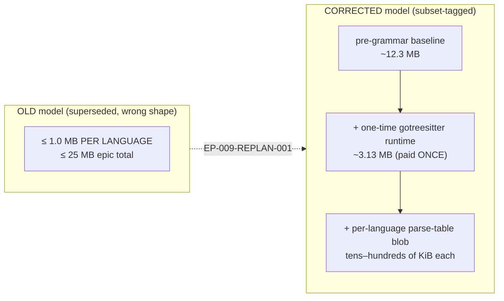
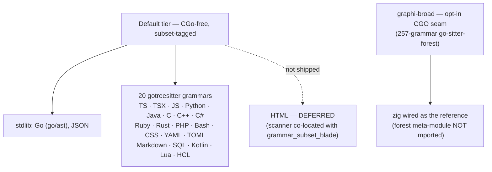

# EP-009 Consolidation — Curated language tier, single budget re-pin (SW-057)

> **[DOC] for SW-057 (EP-009 Slice 6, convergence).** This is the before/after record
> for the consolidation slice: the single `bench-budget.yml` re-pin against the corrected
> (subset-tagged) size model, the OQ1/FU-2 status flip, and the absorbed doc corrections
> from SW-053..056 reviews. AC4.

## Why this slice exists

EP-009 (FU-2) fanned grammar work out across parallel language workers (SW-053..056),
each measuring its own per-language binary delta against a planning envelope in
[`bench/lang-budget.md`](../bench/lang-budget.md). SW-057 is the **closing convergence
slice** that runs after all workers merge: it sums the real shipped total **once**,
re-pins the enforced budget gate against it, flips the OQ1/FU-2 status, and reconciles
the docs that drifted during the fan-out.

## Before / after

### Binary budget (the load-bearing change)

| | Before (entering SW-057) | After (SW-057) |
|---|---|---|
| `binary_size_bytes` baseline | `18,500,000` (EP-008 `2026-06-23-v2`) | `28,615,410` (`2026-06-24-ep009`) |
| `binary_size_bytes` budget | `20,000,000` | `30,000,000` |
| What the gate measured | the **all-206** untagged `./cmd/graphi` build (~46 MB) — the WRONG model | the **subset-tagged** shipped default (20 registered blobs) |
| Gate result against the merged tier | **FAIL** (measured > budget) | **PASS** (measured = baseline, < budget, < 50 MB) |

Two things were wrong before this slice and are fixed here:

1. **The pinned baseline was below the merged total.** The accumulated tier-1 subset
   default measured **28,615,410 B** (`cmd/bench` harness, go1.26.3 / darwin-arm64) — above
   the old pinned baseline `18,500,000` and the old budget `20,000,000`. The gate failed
   today against the merged build. The re-pin is therefore **load-bearing**, not cosmetic.
2. **The gate was measuring the wrong binary.** The `cmd/bench` harness built the measured
   binary with **no tags**, so it stat'd the **all-206** default embed (~46 MB), not the
   shipped subset-tagged build. SW-057 wires
   [`internal/release.DefaultGrammarSubsetTags`](../internal/release/build.go) into the
   bench harness (`internal/bench` now builds the measured binary subset-tagged), so the
   gate enforces the **subset model** that the shipped binary actually uses.

### The corrected size model

The old "≤ 1.0 MB per language" envelope assumed each language carried an independent
cost. That is the wrong shape: the `gotreesitter` `grammars` package embeds **all 206**
blobs by default (gated `!grammar_subset`), so naively registering one grammar pulls the
whole ~24.5 MiB blob directory in. With **subset build tags** the binary embeds only the
selected blobs, and the cost decomposes into a **one-time runtime** (paid once for the
whole epic) plus a **small per-blob marginal cost**. The shipped default
(`-tags 'grammar_subset grammar_subset_<lang> …'`) embeds exactly the 20 registered blobs
— never the all-206 embed, which is prohibited in the shipped default and prevented by the
`release`-CI blob-set assertion.

> **Flag note.** Two measured numbers appear in the worker history vs the gate. The
> per-worker SW-053/054 tables used `-ldflags="-s -w"` (symbol-stripped → ~19 MB for 20
> blobs). The **enforced gate** measures the **shipped** binary the canonical `cmd/release`
> path produces — `-trimpath`, version-stamped, **without** `-s -w` — which is
> **28,615,410 B**. The gate is pinned against the number users actually ship.

### Shipped default language set (after)

- **Default tier:** Go + JSON (stdlib, no blob) + **20** subset-tagged pure-Go grammars.
  Full per-language blob deltas are recorded in
  [`epics/EP-009/epic.md`](../../../projects/graphi/epics/EP-009/epic.md) (artifacts root)
  and mirrored in [`bench/lang-budget.md`](../bench/lang-budget.md).
- **HTML deferred** — not shipped (subset-isolation blocker; its scanner core is
  co-located with `grammar_subset_blade` upstream).
- **Dockerfile / Protobuf / GraphQL** — removed from the committed tier-1 set (re-plan
  Human Decision #2; follow-up).
- **`zig` / broad long tail** — out of the default tier; available only in `graphi-broad`.

## Absorbed doc corrections (SW-053..056 review findings)

| Finding | What was wrong | Fix in SW-057 |
|---|---|---|
| **R1-02 / R2-01** | `core/parse/defaults.go` `RegisterDefaults` header cited the **falsified** "maintained pure-Go subset of go-sitter-forest" | Header now says the pure-Go `gotreesitter` runtime + embedded blobs via subset build tags (go-sitter-forest is entirely CGO; no pure-Go subset). |
| **SW-056-COV-001** | `epic.md` + `lang-budget.md` + `readme.md` claimed `graphi-broad` "wires the 257-grammar set" | Honest wording: the broad lane opens a **257-grammar CGO seam** but wires **one** grammar (`zig`) as the reference; the forest meta-module is intentionally not imported. Reconciled in all three files. |
| **tier-1 list cleanup** | `lang-budget.md` frozen list still named Dockerfile / Protobuf / GraphQL as tier-1 | Removed from tier-1 with a reconciliation note; the frozen committed set is exactly the 20 subset-tagged languages. |
| **R2-02** (record-only) | TOML/Lua subset lexers reference `firstNonZeroSymbol` from the java-gated `java_lexer.go`; isolated `grammar_subset_toml`/`_lua` builds fail without java | No graphi change required — the shipped default includes `grammar_subset_java`, so the accumulated set builds green. Documented in `lang-budget.md`. |
| **SW-055 hygiene** | a stray `testgate` Mach-O binary was committed at repo root, not gitignored | `git rm --cached testgate` + added `/testgate` (and `/graphi-broad`, `/graphi-default`) to `.gitignore`. |

## Verification (run during SW-057)

- `CGO_ENABLED=0 go build ./...` — green.
- Subset-tagged `./cmd/graphi` build — green; **28,598,866 B** (`-trimpath`), shipped
  `cmd/release` build **28,615,410 B**, both **< 50 MB** (~21 MB headroom).
- Budget gate (`cmd/bench`) — **PASS** at `baseline_version: 2026-06-24-ep009`.
- `internal/cgoconformance` — PASS (no CGO grammar reachable from the default build).
- `core/parse` no-CGO `AssertPureGoDefaults` guard (incl. the language-set drift test) —
  PASS.
- `CGO_ENABLED=1 go build -tags graphi_broad ./...` — green.
- Full default suite `CGO_ENABLED=0 go test ./...` — green (40 packages ok, 0 failures;
  the two `internal/mcpconfig` root-perms tests pass under the non-root runner).
