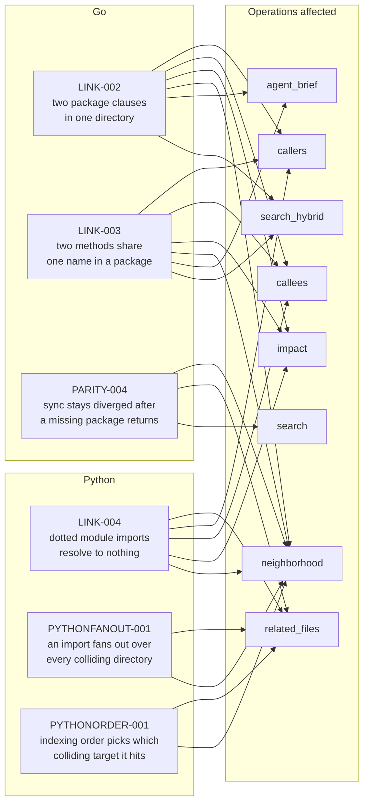

# Known defects and limits

**How to read the diagram.** Left column: the six open defects, grouped by the
language they can occur in — a Go defect cannot affect a Python answer and vice
versa, so the language decides whether a defect applies to you at all. Right
column: the operations whose answers a defect can degrade. An operation that no
arrow reaches is unaffected by every defect **as this page maps them today** —
the arrows are a table of contents drawn from the defect text below, not an
independent proof of absence, so read the entry before you conclude an operation
is safe. `agent_brief` and `search_hybrid` appear because LINK-002 and LINK-003
degrade degree-ranked output; the same two defects leave `references`, `imports`
and `search` untouched, while PARITY-004 does move `search` — it changes rank
*scores*, not the match set. The two Python fan-out defects reach only the two
operations that read file→file `imports` edges; `impact` was measured on the
reproduction fixture and was **not** affected by them.

`graphi doctor` carries the machine-checked half of this disclosure, under its
`known-defects` check. As of 2026-08-26 it reports **all six** defects on this
page — LINK-002, LINK-003, LINK-004, PARITY-004, PYTHONFANOUT-001 and
PYTHONORDER-001 — and the two lists are held identical by a test
(`internal/doctor/checks_test.go::TestKnownDefectsDisclosureSetIsPinned`), which
extracts the ids from both surfaces and fails on any difference. So a future open
defect cannot reach one surface without the other, and neither list can be
retracted alone. D8, as amended on 2026-08-25, is these two surfaces together:
this page is the human-readable half, the doctor check is the machine-checked
half, and a disclosure is retracted **only** in the change that closes the
defect.

## Open defects

These are unfixed. Each entry states what goes wrong, what it costs where that
has been measured, whether a workaround exists, and the record that holds the
evidence.

Two of them — PYTHONFANOUT-001 and PYTHONORDER-001 — are marked **soundness**
defects. That word is doing work: they emit edges that are *wrong*, not merely
edges that are missing. A recall defect makes an answer incomplete; a soundness
defect makes it false, and a reader who trusts the tool has no way to tell which
of the returned edges is the fabricated one.

- **OPEN defect LINK-002 — a Go directory with two package clauses loses
  `recv.Method` calls.** When a directory declares two package clauses — most
  often a package beside its **external `_test` package** (`package shop` and
  `package shop_test`) — graphi keeps only one of them, and methods under the
  losing clause become invisible to the *heuristic* receiver-method call
  resolver. `callers`, `callees`, `impact`, `neighborhood` and degree-ranked
  output — which is **`agent_brief`** (one of the 12 frozen GA operations) and
  **`search_hybrid`** — then return a confident but **incomplete** answer, with
  no skip and no diagnostic. **It also emits wrong edges.** When the surviving clause happens to
  declare a method with the same name, the call is not dropped but **redirected**
  to that unrelated method — so a `c.Reset()` on a `*shop.Cart` can point at
  `shop_test.Fixture.Reset`. The wrong edge is always at the `heuristic` tier
  (confidence 0.6), never `confirmed`; under `-profile balanced` (the default)
  and `-profile deep` the correct `confirmed` edge is emitted alongside it, but
  under `-profile fast` the wrong edge is the only one you get. The defect is
  deterministic for a given tree and reproduces under all three profiles.
  Measured on graphi's own repository: **136 of 1 979 method declarations
  (6.9 %)** unreachable, 108 of them in one directory; **21 of 105** directories
  declaring methods hold more than one package clause and **11** lose methods
  today. How often the *redirection* happens is **not** measured. `references`,
  `imports` and `search` are unaffected. **Workaround:** where the receiver's type is
  import-qualified (`c *shop.Cart`) the Go type-checker resolves the call
  instead and the edge is `confirmed` — this holds under `-profile balanced`
  (the default) and `-profile deep`, but **not** under `-profile fast`, which
  skips type resolution. Record:
  [docs/rc/link-002-clause-by-dir-recall.md](rc/link-002-clause-by-dir-recall.md).
- **OPEN defect LINK-003 — two Go methods sharing a name in one package shadow
  each other.** The same *heuristic* receiver-method resolver keeps only one
  entry per `(package, method-name)` pair, so where a package declares
  `func (a *A) String()` **and** `func (b *B) String()`, one of them is
  unreachable and every unqualified `x.String()` call resolves to whichever won —
  a **wrong** `heuristic`-tier edge, with no package-clause collision needed.
  Same operations affected as LINK-002, same `heuristic`-tier confinement, same
  workaround (import-qualified receivers resolve through go/types at `confirmed`
  tier under `-profile balanced`/`deep`; `-profile fast` has no cover). Measured
  on graphi's own repository: **663 of 1 979 method declarations (33.5 %)** are
  unreachable *or* shadowed once both defects are counted, versus 136 (6.9 %) for
  LINK-002 alone. Filed 2026-08-19; **not fixed**, and the eventual fix must
  close both defects together. Record: §10 of
  [docs/rc/link-002-clause-by-dir-recall.md](rc/link-002-clause-by-dir-recall.md).
- **OPEN defect LINK-004 — Python dotted module imports resolve to nothing.**
  `from pkg.util import helper` and `import pkg.util` — module paths naming a
  module *inside* a package, and the two commonest import forms in real Python —
  produce **no edge at all**: no `calls` edge and no `imports` edge. The linker
  keys an import path on its **last dotted segment** (`pkg.util` → `util`) while
  a symbol's package clause is its **parent directory** base (`pkg`), and the two
  coincide only for single-segment module paths. So `related_files`, `callers`,
  `callees`, `impact` and `neighborhood` silently lose those relationships — with
  no skip and no diagnostic, exactly as if the import were not there.
  **Single-segment forms are unaffected and all resolve:** `import util`,
  `from util import helper`, `from pkg import util`, `from pkg import helper`.
  **Workaround:** import the package, not the module — rewrite
  `from pkg.util import helper` as `from pkg import util` and call
  `util.helper()`, which resolves *and* additionally emits the file→file
  `imports` edge. Verified against the built CLI, including the negative case.
  How much of a real Python repository's import graph this loses is **not
  measured**. Filed 2026-08-19 (SW-183); **not fixed**. Record: §3 of
  [docs/rc/capability-audit-2026-08-19.md](rc/capability-audit-2026-08-19.md).
- **OPEN defect PARITY-004 — restoring a Go package that was missing when the
  index was built leaves `sync` permanently diverged from `rebuild`.** If you
  run `graphi rebuild` while an intra-module import points at a package that
  does not exist in the tree (mid-refactor, a deleted directory, a partial
  checkout), the importer's re-link record is stored under the import path
  rather than the directory, where the incremental cascade can never find it.
  Restore the package and `graphi sync`: the importer is **not** re-linked, so
  a stale `external` node for the once-missing symbol and its `heuristic`
  `calls` edge survive beside the now-correct `confirmed` edge, and the
  `imports` edge a rebuild emits is missing. **The surviving edge is not merely
  stale, it is false**: its reason still reads *"external calls (unresolved
  import example.com/m/tax)"* while a `confirmed` edge to the now-resolved
  `tax.Rate` sits beside it in the same graph — the import is resolved, and the
  edge says it is not. Reproduced through the CLI:
  `graphi sync` settles at 7 nodes where `graphi rebuild` over the identical
  tree gives 6, and three further syncs do not repair it. **What that costs, as
  measured on that hermetic fixture rather than inferred:** `neighborhood` on
  the importer loses the `imports` edge (5 edges against a rebuild's 6);
  `related_files` returns the same files but in a different **rank order**, with
  a weaker reason and less evidence; `search` returns the **same matches in the
  same order but with different `rank` scores** (e.g. for query `tax`, sync
  `-0.3408 / -0.2865` against rebuild `-0.7652 / -0.6402`, deterministic over
  three runs), because `search` excludes external nodes from its *results* but
  **not from its FTS5 corpus** — the stale node is a seventh document where a
  rebuild has six, and BM25 scores every other document against corpus-wide
  statistics, so all of them move. On this two-result fixture the ordering
  happens to survive; **a reordering is not excluded on a larger tree**, since
  the shift is not a uniform monotone one (the gap between the two `tax` scores
  is 0.054 on the sync side against 0.125 on the rebuild side).
  `callers`, `callees`, `impact` and `definition` **were identical** — but that
  was checked **by node id, not by qualified name**: by qualified name every one
  of these operations returns `not_found` on *both* sides, which would
  "confirm" identity vacuously. Comparing every node id present in both graphs
  across all five structural operations plus `impact`, the identical results
  include **twelve non-empty ones** — `callers` on `tax.Rate` and on
  `shop.price`, `callees` on `shop.Checkout`, `impact` on `tax.Rate` and on
  `shop.price`, `definition` ×4 and `neighborhood` ×3 — so the agreement is
  real and not an artifact of both sides returning nothing. (`references` is
  empty on both sides on this fixture and therefore proves nothing about it.)
  The stale node and edge are still
  visible to the taint analyzer, which does read external nodes. **Workaround:
  run `graphi rebuild` once after restoring a package that was missing at index
  time** — verified: the rebuild converges to 6 nodes and 0 external nodes.
  Filed 2026-08-19; **not fixed**. Record:
  `docs/adr/0004-ingest-recovery-disposition.md` §"ADDED 2026-08-19", D3.
- **OPEN defect PYTHONFANOUT-001 — a Python import fans out over every in-repo
  directory whose name collides with it. This is a SOUNDNESS defect: the extra
  edges are wrong, not missing.** A Python `import <name>` resolves `<name>` to
  a *package clause* and then emits a file→file `imports` edge to **every file
  node in every directory declaring that clause** — including when `<name>` is a
  stdlib or third-party module that names nothing in the repository at all. So
  `import typing as t` acquires edges into in-repo `tests/typing/typing_*.py`.
  **This contradicts [readme.md](../readme.md) lines 26–28**, which promise that
  "stdlib and third-party targets are recorded, but deliberately not navigable":
  a stdlib import that acquires edges into in-repo files is exactly the
  navigability that sentence denies, and a `related_files` caller following one
  of those edges is navigating from `typing` into the repository. Measured on
  **flask 3.0.0: 70 spurious `imports` edges, 8.0 % of its 879.** `logging`,
  `json`, `ast`, `os`, `re` and `csv` are equally susceptible — the trigger is a
  name collision, not anything about `typing`. Reproduced on a hermetic fixture
  through the built CLI: `related_files` on the importer returned **4 of its 5
  results spurious**, and `neighborhood` on the same file returned **4 spurious
  `heuristic`-tier (0.6) `imports` edges** whose reason reads *"file imports
  package typing"*. `impact` was measured on that fixture in both directions and
  was **not** affected. **Workaround: remove the collision** — rename the in-repo
  directory so its base name no longer matches an imported module. Verified
  against the built binary including the negative case: renaming `tests/typing`
  to `tests/typehints` took `related_files` from 5 results to 1 and **kept** the
  true `imports` edge, while the same tree before the rename returned 4 of 5
  spurious. `-profile fast` also removes the spurious edges, but it removes
  **every** `imports` edge, true ones included (verified: the surviving true
  relation drops from `calls×1, imports×1` to `calls×1`) — that switches the
  feature off rather than working around the defect. Filed 2026-08-20 (SW-192);
  **not fixed** — the fix is module-relative directory lookup, the way ADR 0009
  gave Go, and carries its own ADR and candidate move. Record: §6 of
  [docs/rc/python-f5-measurement.md](rc/python-f5-measurement.md).
- **OPEN defect PYTHONORDER-001 — which colliding target each spurious edge
  lands on is decided by indexing order. Also a SOUNDNESS defect, and disjoint
  from the one above.** PYTHONFANOUT-001 is that the fan-out exists at all;
  PYTHONORDER-001 is that **where** each edge lands is not decided by anything in
  your source. Measured on flask: the same 70 spurious edges distribute
  **24 / 24 / 22** over the three `tests/typing/typing_*.py` targets at one
  candidate and **23 / 24 / 23** at another. The total, the importer set and the
  fan-out verdict are stable; the *distribution* is not, and the commit that
  moved it (SW-188) touched only JVM paths. Both dispatches agree with each other
  at each candidate, which is why the project's two-dispatch determinism
  discipline **cannot see this**: the edge set is reproducible by luck rather
  than by construction, against a convention that makes determinism first-class
  and carves out no exception for `heuristic`-tier edges. Same contradiction of
  [readme.md](../readme.md) lines 26–28 as PYTHONFANOUT-001, and the same
  affected operations — `related_files` and `neighborhood` on Python.
  **There is no workaround that makes the distribution stable.** Removing the
  collision removes the fan-out, and with it any set of tied candidates to order
  (verified against the built binary as PYTHONFANOUT-001's workaround above) —
  but that is avoidance of the trigger, not a fix, and this defect must **not**
  be recorded as closed by assuming PYTHONFANOUT-001's fix closes it. **Not
  measured, deliberately:** whether the ordering is stable on a different machine
  or filesystem (every observation is one runner class), and whether the other
  `clausePackageFileNodes` consumers (`c_sharp`, `rust`) exhibit it. Filed
  2026-08-24; **not fixed**. Record: §12 of
  [docs/rc/python-f5-measurement.md](rc/python-f5-measurement.md).

## Limits by design

The bullets below are **not** defects. They are declared boundaries of what
graphi models — decided, recorded in an ADR, and stable. Nothing here is
scheduled to change.

- **External calls are not navigable.** Calls into the stdlib or third-party
  packages are recorded as interned external nodes (visible to the taint
  analyzer) but excluded from callers/callees/references/impact — graphi does
  not claim call-graph coverage over code it has not indexed.
  See [docs/external-nodes.md](external-nodes.md).
- **Cross-file edges are heuristic-tier** for Preview languages; Go alone
  additionally gets type-checker-`confirmed` edges.
- **Git-derived signals need local history.** `hotspots`, `change_impact`'s
  co-change section and the git-history/reviewer analyzers read a bounded
  window of the local `git log` (surface boundary only — the engine never
  executes anything). Outside a git repository or in attach mode (`-db`)
  they return a typed unavailable/empty outcome instead of guessing.
- **Go `imports` edges resolve by module path** (ADR 0009): an import links to
  the one directory its module path declares, across every `go.mod` in the
  tree (nested modules own their subtrees). Directories that merely share a
  package clause never cross-contaminate an importer's edge set. This closed
  defect PARITY-002 (`sync` could diverge from `rebuild` on `imports` edges on
  clause-colliding repositories); the measurement record is
  [docs/rc/parity-matrix-real-repo.md](rc/parity-matrix-real-repo.md).
  ADR 0009 decides **which directory** an import resolves to, and that half is
  unchanged; **which files inside it are targets** is ADR 0011's question, and
  that is what the next bullet narrows.
- **An `imports` edge targets the imported package's SOURCE files** (ADR 0011):
  membership is decided on the file extension, so a `README.md`, a
  `.golangci.yml` or a `Makefile` sitting in the resolved directory is not a
  target. For Go the set is `.go` minus `_test.go` — a test file is a package
  member but is not importable, the same ruling the type-checked layer already
  made. This closed defect LINK-001, under which an edge targeted *every* file in
  the directory (measured on pinned clones: 44 of 340 `imports` edges on cobra
  pointed at `.md`/`.yml`; 2 120 on grpc-go at `.md`/`.sh`). **Two limits it
  deliberately accepts**, both measured rather than reasoned: (1) a non-Go build
  input sitting in the package directory — a `.sql`, `.md`, `.yml`, `.toml`,
  `.css` or `.sh`, embedded via `//go:embed` or merely co-located — and a cgo
  package's `.c`/`.h`, lose their only graph path, because graphi models no
  embed, codegen or cgo relation; (2) consequently `related-files` on a `.md` or
  `.yml` **anchor** now returns an explicit empty outcome where it used to list
  the importing packages, because that inbound edge was the file's only
  cross-file path. Upgrading an existing index needs `graphi rebuild` — `sync`
  reports "up to date" and keeps the old edges. Record:
  [docs/adr/0011-imports-edge-targets-package-source-files.md](adr/0011-imports-edge-targets-package-source-files.md).
- **`imports` edges are per-importer under every profile that keeps them**
  (ADR 0010): each file that imports a package gets its own edge, carrying its
  own `file:line` evidence. The `balanced` profile used to collapse them to one
  edge per target from a representative importer, which dropped true edges and
  made `sync` settle a superset of `rebuild`'s edge set (closed defect
  PARITY-003; `fast` still omits `imports` edges entirely). Record:
  [docs/rc/parity-matrix-real-repo.md](rc/parity-matrix-real-repo.md).
