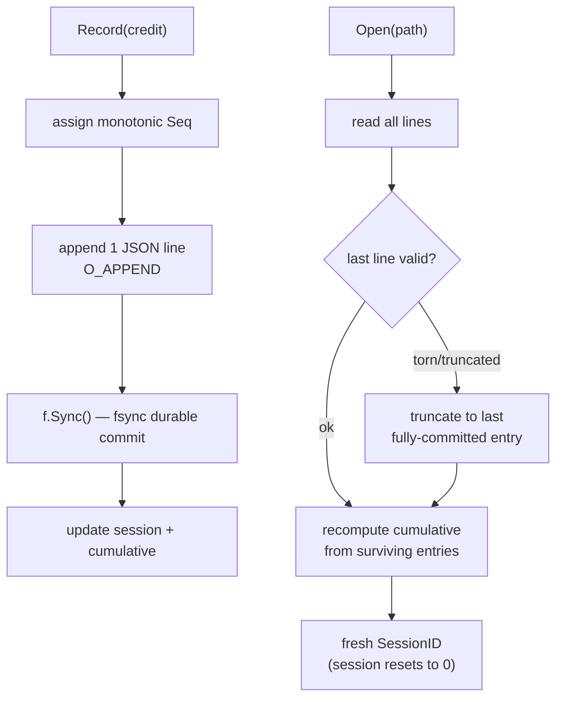

# Savings Ledger Persistence (SW-019)

> Epic EP-003 · Token-Savings Ledger & Token-Efficient Context
> Package: `engine/ledger`

## Before

graphi can compute a per-call USD savings figure (SW-018), but nothing **persisted**
it. Every daemon restart would reset the "Saved $X this session" and lifetime
totals, and there was no protection against a crash mid-write corrupting the
number or a replay double-counting it. The headline ledger claim had no
durability behind it.

## After

`engine/ledger` durably persists every per-call USD savings entry and rolls them
into per-session and cumulative totals that survive daemon restarts with **full
integrity**:

### Key integrity properties

- **Atomic, durable commit** — the store is an **append-only JSONL journal**, one
  `Entry{Seq, SessionID, CallID, Model, MicroUSD, Priced}` per line. Every append
  is committed with `Sync()` (fsync); a crash mid-commit never counts a partial
  entry.
- **Torn-write recovery** — on `Open`, a torn final line (truncated / invalid JSON
  from a mid-commit crash) is truncated to the last fully-committed consistent
  state. The ledger recovers; it never corrupts.
- **Count-once via monotonic Seq** — each entry carries a monotonic `Seq`. On
  reload, a line whose `Seq` is not strictly greater than the previous is treated
  as a torn-tail artifact and dropped. No double-count, no replay/drift.
- **Recompute-from-journal** — the cumulative total is recomputed from the
  journal on every `Open` (no cached total that could drift): **cumulative == sum
  of all sessions == sum of all entries**.
- **Clean session boundary** — a fresh session after restart starts its
  per-session total at **0** while the cumulative total **continues from the
  restored prior value**.
- **Local-only / deterministic** — all operations use deterministic local storage;
  remote journal paths are rejected; no network (static no-`net`-import guard).

## Why these decisions

- **Append-only JSONL + fsync over SQLite** — a single-writer append-only journal
  with per-append fsync is the simplest durable store that satisfies the
  torn-write recovery AC, and it is byte-deterministic (no SQL, no page
  structure). SQLite is available as a future sidecar but is unnecessary here and
  would add nondeterminism risk.
- **Recompute-from-journal every Open** — a cached cumulative total could drift
  from the on-disk truth after a crash. Recomputing from the surviving entries on
  every open makes the rollup self-evidently correct (the test proves
  `cumulative == Σ sessions == Σ entries`).
- **Decoupled from price/meter** — the ledger takes a local `Credit` (priced
  fields + call id), so it does not import `engine/price` or `engine/meter`. It is
  a pure durable store of USD figures; pricing/metering stay swappable.
- **Deterministic SessionID** — derived from the journal (`sess-N`, N = max
  existing + 1) rather than a UUID or wall-clock, so session ids are stable and
  ordered without randomness.

## Scope boundary

This story persists entries and rolls up totals. The **anti-gaming cap + MCP/CLI
readout** ("Saved $X this session" over both surfaces) is SW-020, which composes
on this ledger.
