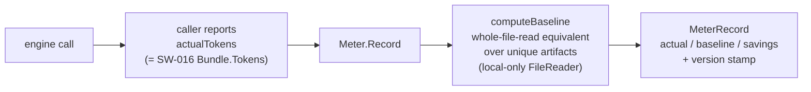

# Per-Call Token Metering

> Part of the Token-Savings Ledger & Token-Efficient Context work.
> Package: `engine/meter`

This document explains how graphi measures token savings on a per-call basis.
It's for contributors working on `engine/meter` or anyone tracing where the
"saved $X" figure ultimately comes from.

## Before

graphi can assemble a winnowed, token-efficient context bundle, but it had
**no per-call record** of the tokens a call actually consumed versus what a
file-reading agent would have spent. There was no honest, structured
token-savings signal to price, persist, or report — the headline "saved $X"
claim had no provenance behind it.

## After

`engine/meter` wraps a token-efficient engine call and emits a structured,
honest, **frozen-baseline per-call token-savings record**:

### Key properties

- **Caller reports actual tokens** — graphi is local-first and never calls an
  LLM itself, so the tokens it contributed to a call are the assembled context
  bundle's tokens (`engine/context.Bundle.Tokens`). The meter records what the
  caller reports; it **never invents** actual tokens.
- **Frozen, version-stamped baseline** — `BaselineMethodVersion =
  "whole-file-read-v1"`. The baseline value is a pure function of (artifacts,
  file bytes) and the version. The version is captured at emit time
  (`MeterRecord.BaselineVersion`), so prior records stay attributable to the
  method that produced them even after the method changes — there's no silent
  recomputation.
- **Honest unavailable, not favorable fabrication** — when a baseline cannot be
  honestly determined (empty artifacts), the record marks `BaselineAvailable =
  false` and reports zero savings. Genuine read errors fail closed (error).
- **Raw savings, no clamp here** — `SavingsTokens = baseline − actual`,
  reported raw and may be **negative** (graphi used more than a whole-file
  read would have). Clamping is a ledger concern, not a meter concern.
- **No double-count** — the meter is **stateless across calls**. Each
  `Record()` emits exactly one record for exactly one call, and the caller
  owns a unique `CallID`. There's no aggregation or dedupe here; rollup
  happens downstream in the ledger.
- **Local-first / hermetic** — the only I/O path is `LocalFileReader`, which
  reads from disk only and **rejects remote sources** (`http(s)://`). No
  wall-clock, no network. A static test guards against any `"net"` import.

## Why these decisions

- **Package `engine/meter`, decoupled from `engine/context`** — the caller
  passes the already-computed `actualTokens`, so meter does not import
  context. This keeps each package's responsibilities bounded and avoids
  coupling record emission to the bundle type.
- **Baseline = whole-file token sum over unique paths** — the deterministic,
  faithful measure of "what a file-reading agent would have spent." Dedup
  within one baseline prevents counting the same file twice.
- **Negative savings reported raw** — honesty over vanity. A clamp here would
  hide real regressions; the anti-gaming cap belongs at the ledger, where the
  per-op/session bounds are defined.
- **Version captured at emit, not re-derived on read** — a record is immutable
  evidence of the method that produced it; a future method bump never
  rewrites history.

## Scope boundary

This capability emits the raw per-call token signal only. Related work that
builds on this record, but lives elsewhere, includes pricing it in USD,
persisting it with rollup and cross-restart integrity, and the anti-gaming cap
and readout. The anti-gaming/baseline-honesty audit test suite is owned by a
separate epic.
