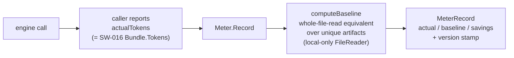

# Per-Call Token Metering (SW-017)

> Epic EP-003 · Token-Savings Ledger & Token-Efficient Context
> Package: `engine/meter`

## Before

graphi can now assemble a winnowed, token-efficient context bundle (SW-016), but
it had **no per-call record** of the tokens a call actually consumed versus what
a file-reading agent would have spent. There was no honest, structured
token-savings signal to price, persist, or report — the headline "saved $X"
claim had no provenance behind it.

## After

`engine/meter` wraps a token-efficient engine call and emits a structured,
honest, **frozen-baseline per-call token-savings record**:

### Key properties

- **Caller reports actual tokens** — graphi is local-first and never calls an LLM
  itself, so the tokens it contributed to a call are the assembled context
  bundle's tokens (`engine/context.Bundle.Tokens`, SW-016). The meter records
  what the caller reports; it **never invents** actual tokens.
- **Frozen, version-stamped baseline** — `BaselineMethodVersion =
  "whole-file-read-v1"`; the baseline value is a pure function of (artifacts,
  file bytes) and the version. The version is captured at emit time
  (`MeterRecord.BaselineVersion`) so prior records stay attributable to the
  method that produced them even after the method changes (no silent
  recomputation).
- **Honest unavailable, not favorable fabrication** — when a baseline cannot be
  honestly determined (empty artifacts) the record marks `BaselineAvailable =
  false` and reports zero savings. Genuine read errors fail-closed (error).
- **Raw savings (no clamp here)** — `SavingsTokens = baseline − actual`, reported
  raw and may be **negative** (graphi used more than whole-file). Clamping is a
  ledger concern (SW-020), not a meter concern.
- **No double-count** — the meter is **stateless across calls**. Each `Record()`
  emits exactly one record for exactly one call; the caller owns a unique
  `CallID`. No aggregation, no dedupe (rollup is SW-019's job).
- **Local-first / hermetic** — the only I/O path is `LocalFileReader`, which
  reads from disk only and **rejects remote sources** (`http(s)://`). No
  wall-clock, no network. A static test guards against any `"net"` import.

## Why these decisions

- **Package `engine/meter`, decoupled from `engine/context`** — the caller passes
  the already-computed `actualTokens`, so meter does not import context. This
  keeps each package's writes bounded and avoids coupling the record emission to
  the bundle type.
- **Baseline = whole-file token sum over unique paths** — the deterministic,
  faithful "what a file-reading agent would have spent." Dedup within one
  baseline prevents counting the same file twice.
- **Negative savings reported raw** — honesty over vanity. A clamp here would
  hide real regressions; the anti-gaming cap belongs at the ledger where the
  per-op/session bounds are defined (SW-020).
- **Version captured at emit, not re-derived on read** — a record is immutable
  evidence of the method that produced it; a future method bump never rewrites
  history.

## Scope boundary

This story emits the raw per-call token signal only. **Pricing** it in USD
(SW-018), **persisting** it with rollup + cross-restart integrity (SW-019), and
the **anti-gaming cap + readout** (SW-020) compose on this record. The
anti-gaming/baseline-honesty **audit test suite** is owned by EP-002 (SW-011).
