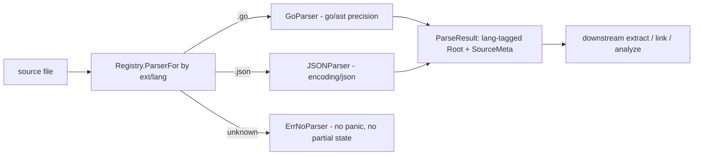

# Parse Registry — Before / After (SW-001)

This document satisfies the `[DOC]` acceptance criterion for SW-001: it records the
state **before** and **after** this story and explains **why** the changes were made.

## Before

`workspace/graphi` contained only `readme.md`. There was no Go module, no parse
boundary, and no way to turn a source file into an AST. Every downstream graphi
capability (ingest → extract → link → analyze) was blocked on a single missing
foundation: a deterministic, pluggable entry point for parsing.

## After

A Go 1.26 module (`github.com/samibel/graphi`, `CGO_ENABLED=0`) with a pure-leaf
`core/parse` package that is the single parse boundary for the whole engine:

- `Parser` interface + normalized `ParseResult` (language-tagged tree + source
  metadata: path, language, content-hash, size) — `core/parse/parse.go`.
- Concurrency-safe `Registry` mapping extension/language → `Parser`, with
  `Register`, `ParserFor`, `ParserForLang`, and a convenience `Parse` —
  `core/parse/registry.go`.
- Typed `ErrNoParser` sentinel for unknown types: no panic, no partial state,
  idempotent miss path.
- Native **Go-AST precision path** (`go/parser`/`go/ast`/`go/token`, CGo-free)
  routing `.go` — `core/parse/parser_go.go`.
- A second distinct stdlib parser (JSON via `encoding/json`) routing `.json` —
  `core/parse/parser_json.go` — registered through the same interface to prove
  open/closed pluggability.
- Minimal `cmd/graphi` main so the default binary builds and is measurable.

## Why

- **Pluggable registry (open/closed).** Languages are the primary axis of variation.
  A registry keyed on extension/language lets new parsers (tree-sitter tier-1
  grammars, the opt-in CGO `graphi-broad` bundle) register against one stable
  interface without editing existing parser code. This mirrors the project's
  plug-in-registry architecture pattern.
- **Pure leaf, CGo-free.** `core/parse` imports no `engine`/`surfaces` packages and
  only the Go standard library, honoring the strict `cmd → surfaces → engine →
  core` direction and the local-first contract (CGo-free, zero outbound network,
  no eval/exec/shell). The default build is `CGO_ENABLED=0`.
- **Determinism.** A single `contentHash` helper anchors provenance: same input →
  same hash. (FNV-1a 64-bit stdlib placeholder for the canonical xxhash64, swappable
  behind that one helper.)
- **Safety.** Each parser recovers from backend panics and honors context
  cancellation, so one malformed file cannot crash the caller — the `core/parse`
  half of the planned two-layer guard (the engine-side timeout/size guard lands
  with `engine/ingest`).

## Flow

## Deferred (tracked, not silently dropped)

Full tree-sitter grammar integration is deferred behind the stable `Parser`
interface; rationale and the measured CGo-free baseline size are recorded in
`docs/adr/0001-parser-tier1-and-sizing.md`.
