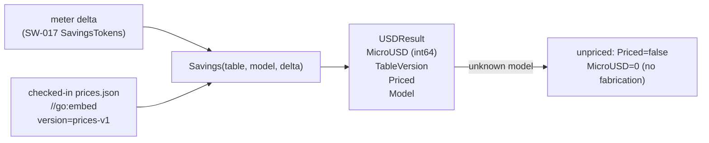

# USD Pricing (SW-018)

> Epic EP-003 · Token-Savings Ledger & Token-Efficient Context
> Package: `engine/price`

## Before

graphi can meter per-call token savings against a frozen baseline (SW-017), but
the savings were still in **tokens**, not dollars. The brief's headline first-run
wow — "It saved me $X this session" — had no concrete, reproducible USD figure
behind it, and no pricing source that could be audited.

## After

`engine/price` converts a metered token-savings delta into an honest,
reproducible USD figure using a **checked-in, version-stamped price table**
embedded in the binary:

### Key properties

- **Sole source, checked-in, version-stamped** — `engine/price/data/prices.json`
  is embedded via `//go:embed` and stamped with `version: "prices-v1"`. There is
  **never** an outbound pricing lookup; every figure traces back to an exact,
  versioned rate.
- **Integer micro-USD fixed-point** — rates and results are `int64` micro-USD
  (1e6 = $1). This avoids floating-point rounding inflation entirely; the
  per-call computation is an **exact integer multiply** (`delta × rate`) with no
  rounding step that could inflate a figure.
- **Honest unpriced degradation** — an unknown model returns `Priced=false`,
  `MicroUSD=0`, no error, no fabricated number, no implicit default. The caller
  decides how to present it.
- **Fail-fast on malformed tables** — missing version, empty models, negative
  rates, or bad JSON yield an explicit error at load (`ErrMalformedTable`); the
  package never silently uses stale or partial rates.
- **Negative deltas stay negative** — an overrun (SW-017 negative savings)
  produces negative USD honestly; no clamping here (the anti-gaming cap is
  SW-020).
- **Per-session accumulation** — a `Session` helper sums per-call `USDResult`
  figures into a deterministic per-session total (integer add, model-attributable).
- **Local-first / hermetic** — `LoadFromPath` rejects remote sources; a static
  test guards against any `"net"` import.

## Why these decisions

- **Integer fixed-point over float** — per-token rates are tiny (fractions of a
  cent); `float64` can drift or round favorably. Micro-USD integers keep every
  figure exact and byte-comparable.
- **No implicit default for unknown models** — silently substituting a default
  rate would fabricate a favorable figure for any model name. The honest answer
  for an unpriced model is "unpriced", flagged.
- **Exact multiply, no rounding** — at micro-USD resolution, `delta × rate` needs
  no rounding; adding a rounding step would only create an inflation risk.
  `FormatUSD` (display only) rounds **toward zero** so a displayed figure never
  exceeds the exact value.
- **Embedded over file path** — embedding makes the table part of the binary
  (reproducible builds, SW-013), so there's no runtime file lookup and no path
  to tamper with. `LoadFromPath` exists for tests/custom deployments.

## Scope boundary

This story computes per-call USD and a per-session running sum. **Cross-restart
cumulative** persistence with full integrity is SW-019; the **anti-gaming cap +
MCP/CLI readout** is SW-020. Network price feeds are explicitly out — local-only
forever.
