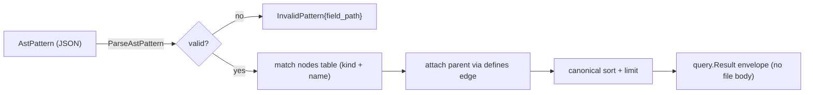
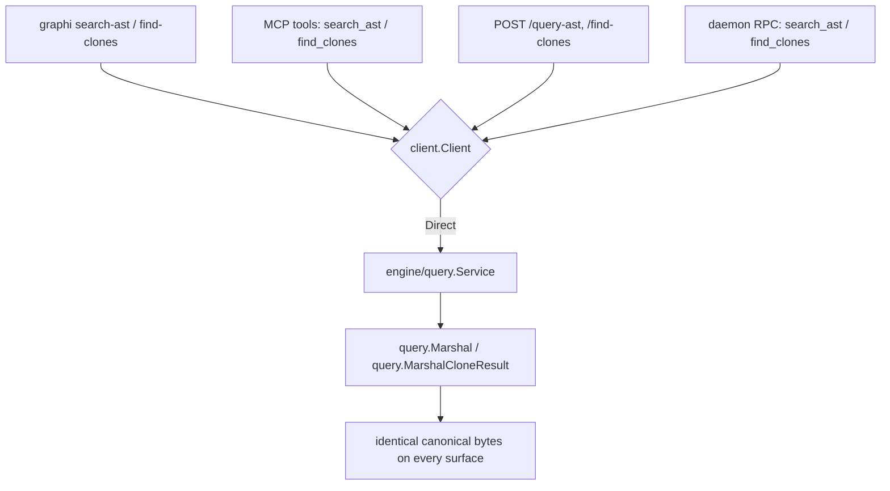

# graphi query language

This doc covers the shapes of query graphi's engine understands, and how
`search_ast` (structural AST search) and `find_clones` (clone detection) work
under the hood. It's aimed at contributors extending the query surface, and at
anyone curious how a query stays byte-identical across the CLI, MCP, HTTP, and
daemon surfaces.

graphi answers two shapes of query, kept deliberately separate so each surface
(CLI / MCP / HTTP / daemon) routes them through exactly one engine path:

| Shape | Input | Engine entry | Examples |
|---|---|---|---|
| **Symbol queries** | a single node id | `query.Service.Dispatch(op, symbolID, depth)` | `callers`, `callees`, `references`, `definition`, `neighborhood`, hierarchy ops |
| **Pattern queries** | free text / a structured pattern | dedicated singleton methods | `search` (lexical), `search_ast` (structural) |

Symbol queries are enumerated in `engine/query.Operations`. Pattern queries are
**not** members of `Operations` (they take no symbol id); the surfaces advertise
them alongside the symbol queries as singletons.

## `search_ast` — AST structural search

`search_ast` matches a deterministic, JSON-serialisable structural pattern
against the parsed AST node table and returns only the
structural matches — never a file body or line-window blob. Each match carries:

- `id`, `kind`, `qualified_name`, `source_path`, `line`, `column` (verbatim node identity)
- `parent_kind`, `parent_name` — the immediate structural parent, resolved from
  the node's inbound `defines` edge (omitted when the node has no parent)

The result rides the canonical `query.Result` envelope (`operation`, `symbol`
— empty for a pattern query —, `outcome`, `nodes`, `edges`) and serializes through
the single `query.Marshal`, so two runs over the same index are byte-identical
and a full index and a caught-up incremental index produce identical bytes.

### Pattern grammar

```jsonc
{
  "kind":        "function",          // optional — restrict to nodes of this kind
  "name":        { "regex": "^handle_" },  // optional — see name matchers below
  "parent_kind": "type"               // optional — require the parent to be this kind
}
```

The field set is **closed**: an unknown field (e.g. `"callee"`) is rejected with
a typed `InvalidPattern` error carrying the offending field path — never a panic
and never a generic failure.

#### Name matchers

`name` accepts **at most one** of:

| Field | Semantics | Example |
|---|---|---|
| `eq` | exact match on the qualified name | `{ "eq": "pkg.Handler" }` |
| `glob` | `path.Match` glob (`*` matches a run of non-separator chars) | `{ "glob": "pkg.handle_*" }` |
| `regex` | RE2 regular expression (`regexp.MatchString`) | `{ "regex": "^pkg\\.handle_" }` |

Setting more than one is an `InvalidPattern` at field path `name`. An unparseable
`regex` is an `InvalidPattern` at field path `name.regex`.

### Determinism

Matches are emitted in canonical NodeId-ascending order (the store's native
order). When a `limit` is supplied it is applied **after** the canonical sort, so
the truncated set is always the canonical prefix — limiting never changes which
results lead.

### Before / after (SW-082)

- **Before:** structural questions ("every function whose name starts with
  `handle_`") required pulling file bodies and grepping — expensive in tokens for
  an AI agent.
- **After:** `search_ast` answers them structurally, returning node identity +
  parent context only. No new parser, no new ingest path — it reuses the EP-001
  AST node table and the existing canonical ordering.



This section covers the engine capability and its typed contract; wiring it into
every surface (the `format=ast` selector, the `graphi search-ast` subcommand,
the MCP tool, and the HTTP `kind` parameter) is covered under
[Surface exposure](#surface-exposure) below.

## `find_clones` — clone-group detection

`find_clones` reports groups of structurally similar fragments. Because the AST
node table is **identity-only** (no body, tokens, subtree, or line span), the
structural fingerprint of a fragment is derived from its **outbound edge set**
(`calls` + `references`) — there is no new parser, tokeniser, or ingest path.

### Clone types (Type-1/2/3 mapped to graphi's vocabulary)

| Type | Meaning | Detection |
|---|---|---|
| `exact` | identical structure and identifiers | identical multiset of `(edge_kind, target_name)` |
| `renamed` | identical structure, renamed identifiers | identical multiset of `(edge_kind, target_kind)` but differing names; the varying names are listed in `renamed_identifiers` |
| `structural` | near-clone (partial overlap) | Jaccard of the `(edge_kind, target_kind)` token sets ≥ `threshold` |

### Config (`CloneConfig`, defaults shown)

```jsonc
{
  "threshold":   0.8,                       // min Jaccard for `structural`
  "max_groups":  1000,                      // bound; over → typed Truncated flag, canonical prefix
  "clone_kinds": ["function", "method"],    // candidate node kinds
  "min_edges":   1                          // skip fragments with fewer outbound edges
}
```

Config follows the in-engine `engine/analysis/pdg.DefaultConfig()` value-struct
pattern (graphi has no `graphi.yaml` yet); the surface-level `clones.*` keys and
the `format=clones` selector are covered under
[Surface exposure](#surface-exposure) below.

### Envelope

```jsonc
{
  "operation": "find_clones",
  "groups": [
    { "id": "clone-<hash>", "type": "exact",
      "members": [ { "file": "...", "line": 10, "end_line": 10, "kind": "function", "name": "..." } ],
      "size": 2 }
  ],
  "truncated": false
}
```

Typed-empty is `{"operation":"find_clones","groups":[],"truncated":false}` — never
`null`. Determinism: members sort by `(file, line, kind, name)`; groups sort by
`(type, first member, id)`; `max_groups` truncation is applied **after** the
canonical sort, so the kept groups are the canonical prefix — identical across
runs and across full vs caught-up-incremental indexes.

> **v1 limitation (honest):** `end_line` equals `line` because the node table
> stores only a declaration line, not a span. And the edge-derived fingerprint
> is coarser than token-level clone detection — it captures the *call/reference
> shape* of a fragment, not its statement sequence. Both are documented tradeoffs
> of reusing the thin AST table rather than re-parsing bodies.


## Surface exposure

`search_ast` and `find_clones` (above) ship as engine capabilities first; this
section covers wiring them — plus the HNSW-gated semantic search path — through
**every** surface without growing the surface area or inventing per-surface
formatting.

### Before / after

- **Before:** `search_ast` and `find_clones` existed only on `engine/query.Service`;
  no CLI subcommand, MCP tool, HTTP route, or daemon RPC reached them. Semantic
  search was already surfaced but only over the brute-force index.
- **After:** both pattern queries are reachable from CLI, MCP, HTTP, and the daemon,
  and every surface returns **byte-identical** canonical bytes because each one routes
  through the single `surfaces/client.Client` seam to the same engine serializer
  (`query.Marshal` for `search_ast`, `query.MarshalCloneResult` for `find_clones`).



### Parity guarantee

The byte-identical contract is by construction, not by per-surface reformatting:

- **CLI** (`graphi search-ast '<json-pattern>'`, `graphi find-clones '<json-config>'`)
  reuses the existing fixed-query flag conventions (`-limit`, positional argument).
- **MCP** advertises `search_ast` and `find_clones` as tools carrying the explicit
  annotation set `readOnlyHint=true, destructiveHint=false, idempotentHint=true,
  openWorldHint=false`. They are singletons (not in `query.Operations`) because their
  input is a pattern/config, not an op+symbol pair.
- **HTTP** adds `POST /query-ast` (JSON pattern body, `?limit=`) and `POST /find-clones`
  (JSON config body) under the existing query surface — no new resource model. The
  canonical bytes ride the same `{"payload": …}` envelope as `/query` and `/compound`.
- **Daemon** dispatches new `search_ast` / `find_clones` methods on the existing socket
  RPC; the daemon-side handler is the same `Direct` client, so the bytes match.

A malformed pattern surfaces the engine's typed `InvalidPattern` (and a bad clone
config the typed `InvalidConfig`) **unchanged** — no surface invents a new error shape.
Cross-surface parity is locked by golden tests in `surfaces/parity_test.go`
(`TestParity_SearchAST`, `TestParity_FindClones`, `TestMCP_NewToolAnnotations`).
