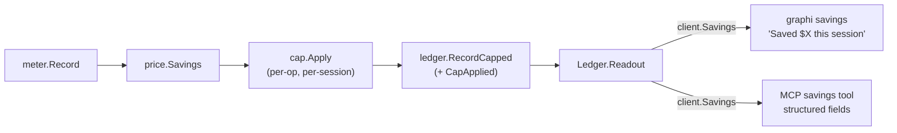

# Savings Cap & Ledger Readout

> Part of the Token-Savings Ledger & Token-Efficient Context work.
> Packages: `engine/cap`, `engine/ledger` (readout), `surfaces/{client,daemon,mcp,cli}`, `cmd/graphi`

This document covers the anti-gaming cap on reported savings and the "Saved
$X this session" readout exposed over MCP and CLI. It's for contributors
working on these surfaces or anyone verifying that the displayed savings
figure can't be inflated.

## Before

graphi could meter tokens, price them in USD, and persist them with
cross-restart integrity — but there was **no anti-gaming guardrail** and **no
way to read the ledger**. A single outlier (or gamed) call could balloon the
headline savings, and "Saved $X this session" was unreachable over either
surface.

## After

This work adds a pure anti-gaming **cap** and surfaces the honest "Saved $X
this session" readout over **both MCP and CLI**, with parity:

### Key properties

- **Pure anti-gaming cap** (`engine/cap`) — `Cap.Apply(contribution, sessionRunning)`
  clamps per-op (contribution → `PerOp`), then per-session (session total ≤
  `PerSession`); `0` means unlimited; the tighter bound wins. It only ever
  **reduces positive contributions** (the inflation risk) — honest overruns
  (negative contributions) pass through untouched.
- **Transparent + durable** — a capped contribution is recorded with `Entry.CapApplied`
  (backward-compatible), so the readout honestly indicates "a cap was applied"
  and **never presents the capped figure as the raw uncapped amount**. The flag
  survives restart.
- **Structured readout** — `Ledger.Readout()` carries per-call / per-session /
  cumulative micro-USD plus `SessionCapped` / `LastCallCapped` flags.
  `MarshalReadout` is the single canonical serializer.
- **MCP ↔ CLI parity** — both surfaces read the **same canonical readout** via
  `client.Client.Savings`, so figures are byte-identical for the same ledger
  state. The CLI additionally prints the headline `"Saved $X this session"` +
  per-call + cumulative (+ a cap-applied note when relevant).
- **Local-first / deterministic** — cap + readout use only local ledger state;
  no network; identical state → identical figures across runs and surfaces. A
  static guard asserts `engine/cap` has no `net` import.

## Why these decisions

- **Pure `engine/cap`, decoupled** — the cap is a deterministic policy over
  micro-USD figures with no I/O; it imports nothing from ledger, price, or
  meter. The daemon composes `meter → price → cap → ledger`, and the cap is
  one pure step in that chain, easy to test and impossible to side-effect.
- **Cap only reduces positives** — anti-gaming means preventing inflation. An
  honest overrun (negative savings) is already a reduction; clamping it would
  itself be dishonest, so negatives pass through untouched.
- **Canonical readout built once** — MCP and CLI share one serialization path
  (`client.Savings` → `MarshalReadout`), making parity structural rather than
  something each surface has to maintain separately.
- **`Entry.CapApplied` is backward-compatible** — `omitempty` keeps existing
  journals clean, and old entries default to `false`. Transparency becomes
  durable without a schema break.

## Scope boundary

This capability delivers the cap and readout surfaces along with the tested
compose path. Full **automatic** daemon wrapping of every engine call
(auto-registering the meter → price → cap → ledger flow) is a later
integration — the pure compose path is delivered and exercised end-to-end
here. Config-loading for cap bounds is a deployment concern: a caller supplies
`Cap` directly.
