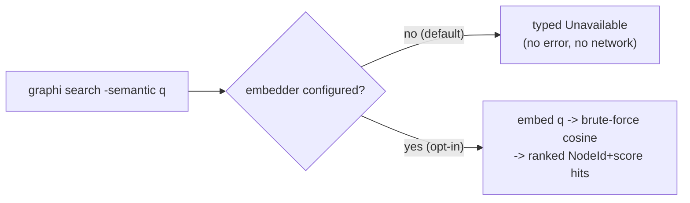

# Semantic search (optional, OFF by default)

Semantic (embedding-based) search is an **optional** capability that is **OFF by
default**. The default binary ships **no embedder**, stays **CGo-free**, and makes
**zero non-loopback network calls** — semantic search is only ever enabled when
*you* explicitly opt in. Until then it **degrades gracefully**: it never errors,
never dials the network, and never blocks the always-available lexical search.

## Before / after

| | Default build (no embedder) | After opting in |
|---|---|---|
| `graphi search -semantic <q>` | returns a typed `{"available":false,"reason":"no embedder configured; run \`graphi setup-embedder ...\`"}` response — no error, no network | embeds the query and returns cosine-ranked hits citing `node_id` + `score` |
| Lexical `graphi search <q>` | always available | unchanged, always available |
| Binary | CGo-free, no embedder, zero egress | CGo-free unless you build the ONNX flavor; loopback-only if you use Ollama |

The unavailable response is produced by a **single engine-owned type**
(`engine/search.SemanticResponse`) and is **byte-identical across the CLI, MCP, and
HTTP surfaces**, so surfaces can never drift.



## How to enable it

Run `graphi setup-embedder` for copy-pasteable instructions. You opt in by setting
the `GRAPHI_EMBEDDER` environment variable, then re-indexing with embeddings:

```sh
# Option A — Ollama (loopback-only, opt-in). Requires a local Ollama daemon.
export GRAPHI_EMBEDDER=ollama                 # defaults to 127.0.0.1:11434
# or pin the loopback endpoint explicitly:
export GRAPHI_EMBEDDER=ollama:127.0.0.1:11434

# Option B — ONNX (local, CGO). Requires a build with the embed_onnx tag:
#   go build -tags embed_onnx ./cmd/graphi
export GRAPHI_EMBEDDER=onnx:/path/to/model.onnx

# Then embed the graph and query (share one durable store + meta sidecar so the
# generated vectors survive between the index and search invocations):
mkdir -p ~/.graphi
graphi index --semantic -root ./my-repo -db ~/.graphi/graph.db -meta ~/.graphi/meta
graphi search -semantic "where do we validate auth tokens" -db ~/.graphi/graph.db -meta ~/.graphi/meta
```

`graphi index --semantic` embeds every node (keyed by `node_id`) and persists the
vectors to a durable `vectors` table in the `-meta` sidecar, tagged with the
embedder identity + dimension. `graphi search -semantic` then reloads those vectors
from that sidecar on startup — a pure local read, **no re-embedding and no embedder
dial** — and returns cosine-ranked hits. With **no** embedder configured,
`graphi index --semantic` reports `unavailable — no embedder configured` (no error,
no network) and lexical indexing/search is unaffected.

## Safety guarantees that hold regardless of configuration

- **Ollama is loopback-only and fail-closed.** A non-loopback host is **rejected at
  construction** (in addition to the runtime canary dial interceptor —
  defense-in-depth). It is never constructed on the default path.
- **ONNX (CGO) is build-tag-gated** behind `//go:build embed_onnx` and is **provably
  absent** from the default binary (verified by both the `internal/cgoconformance`
  import-graph scan and a registration-level no-CGO guard).
- **Brute-force cosine** over an in-memory index is intentional for this first cut;
  HNSW / approximate-nearest-neighbour indexing is an explicit follow-up.
