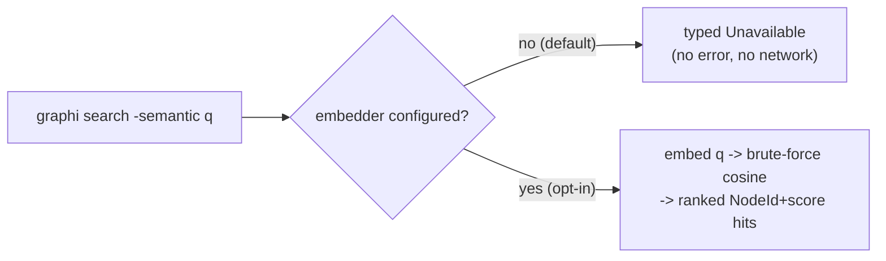

# Semantic search (optional, OFF by default)

Semantic (embedding-based) search is an **optional** capability that is **OFF by
default**. The default binary ships **no embedder**, stays **CGo-free**, and makes
**zero non-loopback network calls** — semantic search is only ever enabled when
*you* explicitly opt in. Until then it **degrades gracefully**: it never errors,
never dials the network, and never blocks the always-available lexical search.

## Before / after

| | Default build (no embedder) | After opting in |
|---|---|---|
| `graphi search -semantic <q>` | returns a typed `{"available":false,"reason":"no embedder configured; run \`graphi setup-embedder ...\`"}` response — no error, no network | embeds the query and returns cosine-ranked hits citing `node_id` + `score` |
| Lexical `graphi search <q>` | always available | unchanged, always available |
| Binary | CGo-free, no embedder, zero egress | CGo-free unless you build the ONNX flavor; loopback-only if you use Ollama |

The unavailable response is produced by a **single engine-owned type**
(`engine/search.SemanticResponse`) and is **byte-identical across the CLI, MCP, and
HTTP surfaces**, so surfaces can never drift.


```mermaid
flowchart LR
  Q["graphi search -semantic q"] --> S{embedder configured?}
  S -- "no (default)" --> U["typed Unavailable\n(no error, no network)"]
  S -- "yes (opt-in)" --> E["embed q -> brute-force cosine\n-> ranked NodeId+score hits"]
```

## How to enable it

Run `graphi setup-embedder` for copy-pasteable instructions. You opt in by setting
the `GRAPHI_EMBEDDER` environment variable, then re-indexing with embeddings:

```sh
# Option A — Static (pure-Go, CGo-free, daemon-less; the recommended Labs path).
# SW-262: `graphi setup-embedder static:potion-code-16M-v2@<rev>` downloads
# the four pinned files from HuggingFace over HTTPS, verifies their SHA-256
# against the in-tree pin table, and writes them to
# $XDG_CACHE_HOME/graphi/models/potion-code-16M-v2@<rev>/. The downloader is
# the only entry point that initiates network I/O — index/search/MCP/HTTP
# read the cached artifact and never dial. The embedder is batch-invariant
# (a node's vector does not depend on which other nodes share its embedding
# chunk), and its dim is read from the artifact, never hard-coded.
graphi setup-embedder static:potion-code-16M-v2@e9d2a44ca6a05ac6685f3b23709ea57eb7352d5b
export GRAPHI_EMBEDDER=static:potion-code-16M-v2@e9d2a44ca6a05ac6685f3b23709ea57eb7352d5b

# Option B — Ollama (loopback-only, opt-in). Requires a local Ollama daemon.
export GRAPHI_EMBEDDER=ollama                 # defaults to 127.0.0.1:11434
# or pin the loopback endpoint explicitly:
export GRAPHI_EMBEDDER=ollama:127.0.0.1:11434

# Option C — ONNX (local, CGO). Requires a build with the embed_onnx tag:
#   go build -tags embed_onnx ./cmd/graphi
export GRAPHI_EMBEDDER=onnx:/path/to/model.onnx

# Air-gapped install (AC-6): point `setup-embedder` at a pre-staged directory.
# The directory is validated against the pin table; a hash mismatch is an
# error, not a warning. No network is consulted.
graphi setup-embedder static:potion-code-16M-v2@<rev> --local /mnt/artifacts/potion-code-16M-v2

# Then embed the graph and query (share one durable store + meta sidecar so the
# generated vectors survive between the index and search invocations; these are
# explicit teaching paths — graphi's auto-managed store lives at
# ~/.graphi/<fingerprint>/db.sqlite and `graphi sync` maintains it for you):
mkdir -p ~/.graphi
graphi index --semantic -root ./my-repo -db ~/.graphi/graph.db -meta ~/.graphi/meta
graphi search -semantic "where do we validate auth tokens" -db ~/.graphi/graph.db -meta ~/.graphi/meta
```

When `GRAPHI_STATIC_MODEL_DIR` (or the equivalent selector argument) points
at a local artifact directory the loader reads the cached bytes and validates
the SHA-256 against the pin table; a mismatch surfaces as a typed error (the
air-gapped path, AC-6).

On the first semantic search after process start, the static embedder loads the
local model and verifies the pinned file hashes before freshness and empty-query
short circuits; that result is memoised for later queries. If the artifact is
absent while the semantic generation is also stale or corrupt, the artifact
setup command takes precedence because installing the model is required before
the generation can be rebuilt. Once the artifact is present, the generation's
own `graphi index --semantic` repair reason is returned.

`graphi index --semantic` embeds the eligible symbol nodes of the graph
(keyed by `node_id`) and persists the vectors to a durable `vectors` table in
the `-meta` sidecar, tagged with the embedder identity + dimension. The set
of eligible nodes is exactly the set the v3 builder produces (see "Document
schema (v3)" below); generated paths and the file/package/external artefact
nodes are deliberately excluded so the durable set cannot serve a vector for
a node the rest of the engine treats as unsearchable. `graphi search -semantic`
then reloads those vectors from that sidecar on startup — a pure local read,
**no re-embedding and no embedder dial** — and returns cosine-ranked hits.
With **no** embedder configured, `graphi index --semantic` reports
`unavailable — no embedder configured` (no error, no network) and lexical
indexing/search is unaffected.

## Document schema (v3)

`graphi index --semantic` no longer embeds the name-only v1 text (`Kind + " " +
QualifiedName`, `engine/embed.NodeText`, now deprecated and kept only for the SW-261
migration comparison). It embeds one **`SemanticDocument` v3** per symbol node
(`engine/embed.BuildDocument`), cut from the parser's **`SourceSpan`** — a non-identity
sidecar on `core/parse.ParseResult.Spans` keyed by node id. Node identity, the graph and
every default-path byte are unchanged; **only the `--semantic` path consumes spans.**

Fields: `document_id` (xxhash64 over `node_id + text_hash + document_schema`), `node_id`,
`language`, `kind`, `qualified_name`, `path`, `start_byte`/`end_byte` (0-based, end
exclusive), `start_line`/`end_line` (1-based, inclusive), `span_method`, `text_hash`
(xxhash64 of `text`), `document_schema` (`"v3"`), `text`, `truncated`, `bound` (one of
`tokens`, `bytes`, `none` — which bound closed the gap), the structured `capsule`,
and admission metadata (`admission_token_count`, `admission_limit`,
`admission_algorithm_id`). `document_schema` is `"v3"`.

`text` is assembled in a fixed order so identical source yields byte-identical documents:

1. `kind qualified_name`
2. the path split on `/` and joined by spaces (`internal greet hello.go`)
3. the node's annotations (decorator/annotation names from node metadata), when any
4. the leading doc comment, when any
5. the parser-provided declaration signature (including attached decorators), when any
6. the post-signature body, when any

Bounds: the active adapter's `embed.Admission` implementation owns tokenization,
the usable token limit, and the exact bytes inference consumes. The pinned static
adapter applies the model's character boundary and its uncapped raw-token stream
before returning a prefix of at most 512 tokenizer tokens; Ollama sends
`truncate:false` and treats the server as final authority. A hard
`MaxCapsuleBytes` = 16 KiB resource cap always runs. Body bytes may be cut, but
the header, annotations, doc comment, and signature are an indivisible mandatory
prefix: if that prefix cannot fit, the build fails with a typed admission error
instead of indexing a partial signature. A cut sets `truncated: true`; a large
declaration stays **one** document (chunk-and-index remains out of scope).

Span methods:

- `ast` — exact. Go (`go/ast`: `Doc.Pos()` … `End()` plus parser-owned doc and
  signature sub-spans; multiline function/type signatures end just after their
  opening brace) and TypeScript (tree-sitter declaration bounds widened to the
  enclosing `export_statement`, attached decorators and adjacent leading doc
  comments, with separate doc/signature sub-spans).
- `window` — the fallback for every other parser: from the node's line, at most
  `SpanWindowMaxLines` (40) lines, clipped at the next declaration's start line and at end
  of file. **Same-line clipping** — when the next declaration shares the line, the
  predecessor's window is also clipped at the successor's start BYTE (column →
  byte), validated against THAT LINE'S start/end boundary so a column past the
  line's end cannot slip through. **Fail-closed absence** — when the same-line
  ordering cannot be established (the predecessor's column is unknown, the
  successor's column is unknown, or the successor's column lies past its own
  line's end), the predecessor emits NO window rather than an unverifiable one
  that would silently leak the successor's body. Window is a labelled heuristic,
  never presented as an AST fact; its share is reported per run
  (`span_method_share` in the SW-258 retrieval report and on the
  `graphi index --semantic` summary line).

Excluded from documents (counted by reason, never embedded as a name-only stand-in):
paths matching the shared vendor/generated classification (`engine/classify.IsGeneratedPath`
— the one classifier), `file`, `package` and `external` artefact nodes, and nodes for which no
span could be established (`no_span`) — the fail-closed absence above means such a node gets no
document and therefore no vector, rather than a guessed window.

## Generation / freshness contract (SW-261)

The semantic generation pass persists vectors under a **fingerprint** that names
the embedding space exactly:

```
{ model_id, revision, model_sha256, tokenizer_sha256, dim,
  document_schema, chunker_config, graph_generation }
```

A fingerprint is canonicalised by a length-prefixed, line-delimited encoding
(per-field `<len>:<value>` joined by `\n`), so a `|`-bearing value cannot
collide with the field separator. The generation id is the full
sha256 hex of the canonical string with a `v<n>-` schema prefix; two
fingerprints differing in any field produce distinct ids and never share a
generation.

Reload validates the fingerprint against the requested one and returns the
**closed state vocabulary**:

- `missing` — no active generation. The search service answers the typed
  unavailable response with `reason: "semantic index unavailable: run graphi
  index --semantic"`. No vectors are served.
- `stale` — the active generation exists but its fingerprint does not match
  (model, schema, chunker, or graph generation moved). The service answers
  `"semantic index stale: run graphi index --semantic"`. No vectors are
  served. The mismatch is the exact embedding-space mixing the story exists
  to prevent.
- `corrupt` — fingerprint matches but row count, dim, or a referenced node
  fails validation. Every row's vector dim is checked (the previous
  single-sample check missed drift in non-sampled rows). The service
  answers `"semantic index corrupt: run graphi index --semantic"`.
- `ready` — fingerprint matches and every check passed. Vectors are served.

### Graph identity (which "graph" do the vectors correspond to?)

The fingerprint's `graph_generation` field is sourced from the graphstore's
`index.commit_generation` metadata key. The ingest pipeline advances this
key on every committed graph mutation — full pass **and** incremental — so
the value moves on every graph change. Build and reload consume the same
key, so a freshly built semantic generation reloads as `ready`; any
subsequent graph change advances the counter and the next reload reads
`stale`. The fallback chain for stores with no full pass yet (only the
placeholder) is visible to the operator.

A store that has never seen a graphi pass has no
`index.commit_generation` entry; the runtime substitutes the documented
placeholder so a fresh store is visibly flagged, not silently classified
`ready`.

### Cross-process guarantee (AC-5/AC-6)

The `--semantic` Build/Commit flow holds the **cross-process ingest lock**
(`internal/ingestlock`) for the entire `Begin → Upsert → Commit/Abort`
sequence. Two graphi processes on the same meta directory cannot race: the
loser waits at SQLite-level `BEGIN IMMEDIATE` until the winner's
generation commits, then either:

- warm-starts over the certified active generation (its `Begin` sees a clean
  active pointer and proceeds), or
- sees the prior active generation as `stale` (the fingerprint's graph
  identity has advanced) and is told to re-build.

The store's per-process `buildMu`/`liveBuilds` alone do NOT deliver this
guarantee — a second handle would see a live foreign staging row and
delete it as a stale leftover. The ingest lock is the authoritative
mechanism; the runtime helper `BuildSemanticGeneration` (used by
`graphi index --semantic`) is the single owner.

**Documented limit:** the AC-5/AC-6 guarantee applies to **operations that
go through `graphi index --semantic`** (or the runtime helper). A bare
`GenerationStore.Begin/Commit` against the same SQLite file from two
independently opened handles, without the runtime helper, will still see
the cross-process symptom the review caught — by design: the store's
seam is the persistence boundary; the cross-process serialisation is a
caller concern (the runtime wires it). The conformance suite
(`TestContract_CrossHandleSerialisesBuilds`) exercises the property
at the store layer with two concurrently-open handles and pins the
runtime-helper-driven outcome (the foreign staging row is observable
to the second handle; the runtime helper is what suppresses it).

### Carry-forward (AC-4)

When a `ready` generation exists under the **same embedding-space
fingerprint**, the generation pass reuses prior rows whose `text_hash`
matches the current document. The match is a point-probe against the prior
generation by NodeID (the `RowLoader.LoadRow` seam), not a materialised
whole-generation map, per the working-set rule. A stale / corrupt / missing
state forces a full re-embed — there is no path that loads prior rows from
a non-ready generation, which is the embedding-space mixing the story
exists to prevent.

A reused row counts as `Reused`, not `Embedded`. The summary line on
`graphi index --semantic` reports both:
`<n> embedded, <r> reused, <s> skipped`. `Purged` is the count of
prior-generation rows that no longer appear in the new generation's
row set — prior rows whose node disappeared from the graph AND
prior rows that were re-embedded (not carried forward). The
arithmetic is `Purged = priorRowCount - (Embedded + Reused)` so a
correctly re-embedded row is not counted as purged.

## Safety guarantees that hold regardless of configuration

- **Ollama is loopback-only and fail-closed.** A non-loopback host is **rejected at
  construction** (in addition to the runtime canary dial interceptor —
  defense-in-depth). It is never constructed on the default path.
- **ONNX (CGO) is build-tag-gated** behind `//go:build embed_onnx` and is **provably
  absent** from the default binary (verified by both the `internal/cgoconformance`
  import-graph scan and a registration-level no-CGO guard).
- **Brute-force cosine** over an in-memory index is intentional for this first cut;
  HNSW / approximate-nearest-neighbour indexing is an explicit follow-up.
