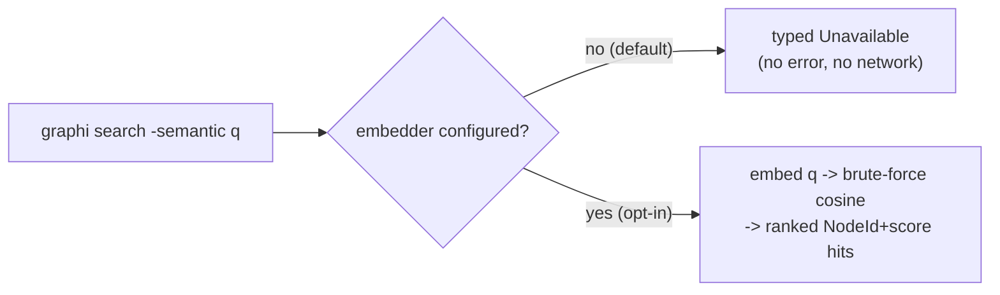

# Semantic search (optional, OFF by default)

Semantic (embedding-based) search is an **optional** capability that is **OFF by
default**. The default binary ships **no embedder**, stays **CGo-free**, and makes
**zero non-loopback network calls** — semantic search is only ever enabled when
*you* explicitly opt in. Until then it **degrades gracefully**: it never errors,
never dials the network, and never blocks the always-available lexical search.

## Before / after

| | Default build (no embedder) | After opting in |
|---|---|---|
| `graphi search -semantic <q>` | returns a typed `{"available":false,"reason":"no embedder configured; run \`graphi setup-embedder ...\`"}` response — no error, no network | embeds the query and returns cosine-ranked hits citing `node_id` + `score` |
| Lexical `graphi search <q>` | always available | unchanged, always available |
| Binary | CGo-free, no embedder, zero egress | CGo-free unless you build the ONNX flavor; loopback-only if you use Ollama |

The unavailable response is produced by a **single engine-owned type**
(`engine/search.SemanticResponse`) and is **byte-identical across the CLI, MCP, and
HTTP surfaces**, so surfaces can never drift.


```mermaid
flowchart LR
  Q["graphi search -semantic q"] --> S{embedder configured?}
  S -- "no (default)" --> U["typed Unavailable\n(no error, no network)"]
  S -- "yes (opt-in)" --> E["embed q -> brute-force cosine\n-> ranked NodeId+score hits"]
```

## How to enable it

Run `graphi setup-embedder` for copy-pasteable instructions. You opt in by setting
the `GRAPHI_EMBEDDER` environment variable, then re-indexing with embeddings:

```sh
# Option A — Ollama (loopback-only, opt-in). Requires a local Ollama daemon.
export GRAPHI_EMBEDDER=ollama                 # defaults to 127.0.0.1:11434
# or pin the loopback endpoint explicitly:
export GRAPHI_EMBEDDER=ollama:127.0.0.1:11434

# Option B — ONNX (local, CGO). Requires a build with the embed_onnx tag:
#   go build -tags embed_onnx ./cmd/graphi
export GRAPHI_EMBEDDER=onnx:/path/to/model.onnx

# Then embed the graph and query (share one durable store + meta sidecar so the
# generated vectors survive between the index and search invocations; these are
# explicit teaching paths — graphi's auto-managed store lives at
# ~/.graphi/<fingerprint>/db.sqlite and `graphi sync` maintains it for you):
mkdir -p ~/.graphi
graphi index --semantic -root ./my-repo -db ~/.graphi/graph.db -meta ~/.graphi/meta
graphi search -semantic "where do we validate auth tokens" -db ~/.graphi/graph.db -meta ~/.graphi/meta
```

`graphi index --semantic` embeds the eligible symbol nodes of the graph
(keyed by `node_id`) and persists the vectors to a durable `vectors` table in
the `-meta` sidecar, tagged with the embedder identity + dimension. The set
of eligible nodes is exactly the set the v2 builder produces (see "Document
schema (v2)" below); generated paths and the file/package/external artefact
nodes are deliberately excluded so the durable set cannot serve a vector for
a node the rest of the engine treats as unsearchable. `graphi search -semantic`
then reloads those vectors from that sidecar on startup — a pure local read,
**no re-embedding and no embedder dial** — and returns cosine-ranked hits.
With **no** embedder configured, `graphi index --semantic` reports
`unavailable — no embedder configured` (no error, no network) and lexical
indexing/search is unaffected.

## Document schema (v2)

`graphi index --semantic` no longer embeds the name-only v1 text (`Kind + " " +
QualifiedName`, `engine/embed.NodeText`, now deprecated and kept only for the SW-261
migration comparison). It embeds one **`SemanticDocument` v2** per symbol node
(`engine/embed.BuildDocument`), cut from the parser's **`SourceSpan`** — a non-identity
sidecar on `core/parse.ParseResult.Spans` keyed by node id. Node identity, the graph and
every default-path byte are unchanged; **only the `--semantic` path consumes spans.**

Fields: `document_id` (xxhash64 over `node_id + text_hash + document_schema`), `node_id`,
`language`, `kind`, `qualified_name`, `path`, `start_byte`/`end_byte` (0-based, end
exclusive), `start_line`/`end_line` (1-based, inclusive), `span_method`, `text_hash`
(xxhash64 of `text`), `document_schema` (`"v2"`), `text`, `truncated`, `bound` (one of
`tokens`, `bytes`, `none` — which bound closed the gap, see Bounds below).

`text` is assembled in a fixed order so identical source yields byte-identical documents:

1. `kind qualified_name`
2. the path split on `/` and joined by spaces (`internal greet hello.go`)
3. the node's annotations (decorator/annotation names from node metadata), when any
4. the body: the span's bytes — the full declaration **including its leading doc comment
   and attached decorators**, trailing whitespace trimmed

Bounds: `MaxDocumentTokens` = 512 tokens of the active embedder's tokenizer
when the embedder exposes one (`embed.TokenizingEmbedder`); when it does not,
the byte cap alone runs (no whitespace-token approximation), and the document
records which bound closed the gap in its `bound` field (`tokens`, `bytes`,
`none`). A hard `MaxDocumentBytes` = 16 KiB cap always runs. A cut sets
`truncated: true`; a large declaration stays **one** document (multi-chunk is
backlog until an eval gap is measured).

Span methods:

- `ast` — exact. Go (`go/ast`: `Doc.Pos()` … `End()`; a multi-spec `var (...)`/`const (...)`
  block yields per-spec spans with each spec's own doc) and TypeScript (tree-sitter node
  bounds widened to the enclosing `export_statement`, preceding sibling decorators and an
  adjacent leading doc comment).
- `window` — the fallback for every other parser: from the node's line, at most
  `SpanWindowMaxLines` (40) lines, clipped at the next declaration's start line and at end
  of file. **Same-line clipping** — when the next declaration shares the line, the
  predecessor's window is also clipped at the successor's start BYTE (column →
  byte), validated against THAT LINE'S start/end boundary so a column past the
  line's end cannot slip through. **Fail-closed absence** — when the same-line
  ordering cannot be established (the predecessor's column is unknown, the
  successor's column is unknown, or the successor's column lies past its own
  line's end), the predecessor emits NO window rather than an unverifiable one
  that would silently leak the successor's body. Window is a labelled heuristic,
  never presented as an AST fact; its share is reported per run
  (`span_method_share` in the SW-258 retrieval report and on the
  `graphi index --semantic` summary line).

Excluded from documents (counted by reason, never embedded as a name-only stand-in):
paths matching the shared vendor/generated classification (`engine/classify.IsGeneratedPath`
— the one classifier), and `file`, `package` and `external` artefact nodes.

## Safety guarantees that hold regardless of configuration

- **Ollama is loopback-only and fail-closed.** A non-loopback host is **rejected at
  construction** (in addition to the runtime canary dial interceptor —
  defense-in-depth). It is never constructed on the default path.
- **ONNX (CGO) is build-tag-gated** behind `//go:build embed_onnx` and is **provably
  absent** from the default binary (verified by both the `internal/cgoconformance`
  import-graph scan and a registration-level no-CGO guard).
- **Brute-force cosine** over an in-memory index is intentional for this first cut;
  HNSW / approximate-nearest-neighbour indexing is an explicit follow-up.
