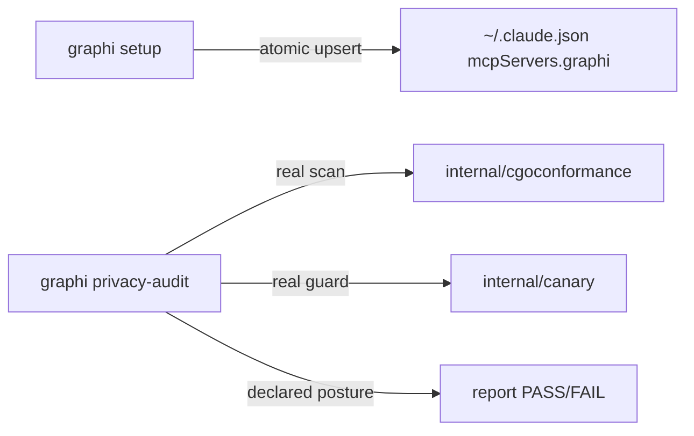

# `graphi setup` + `graphi privacy-audit`

> One-command Claude Code MCP onboarding + local-first privacy proof.

This document covers two CLI subcommands — `graphi setup` and `graphi
privacy-audit` — for contributors and users who want to understand how graphi
registers itself with Claude Code and how it proves its local-first privacy
claims.

## Before / After

| | Before | After |
|---|---|---|
| **MCP onboarding** | manual JSON edit of `~/.claude.json` | `graphi setup` — idempotent, atomic, one command |
| **Privacy posture** | implicit (enforced in CI, not user-visible) | `graphi privacy-audit` — readable pass/fail from real facts |
| **Dry-run** | — | `graphi setup --dry-run` previews the exact change |

## Why

The launch goal is simple: on a fresh machine, a user can get a configured
Claude Code MCP tool and a confirmed privacy posture in two commands. `setup`
removes the manual-config error surface. `privacy-audit` makes the
local-first contract inspectable on the user's own machine, built from
**real build facts** (a CGo scan and a canary egress guard) rather than a
hardcoded "OK" string.

## `graphi setup`

Resolves the config path (`$CLAUDE_CONFIG_PATH` → `~/.claude.json`) and
upserts the graphi MCP stdio entry
(`{"type":"stdio","command":"<graphi>","args":["mcp"]}`). The write is
**atomic** (temp file + rename) and **non-destructive** (it preserves all
unknown keys and sibling `mcpServers.*` entries). It reports `created`,
`updated`, or `unchanged`.

```bash
graphi setup                 # register this binary (idempotent)
graphi setup --dry-run       # preview, no write
graphi setup --binary /opt/graphi/bin/graphi
```

## `graphi privacy-audit`

Assembles the proof from real facts and exits non-zero on any violation:

- **CGo-free** — a real `internal/cgoconformance.CgoUsingPackages` scan of the
  build graph (the same engine the CI gate uses).
- **Zero outbound** — references `internal/canary`'s dial-attempt guard
  (loopback-only, asserted on attempt) and confirms the surface union covers
  all surfaces; the full hermetic run is `graphi canary` in CI.
- **No telemetry / no accounts / no external services** — explicit statements,
  each labeled `verified` or `declared` honestly.



Both subcommands are stdlib-only and **fully offline** — no network calls during
setup or audit.

## Tests

Covered by `internal/mcpconfig` (create/update/unchanged, non-destructive,
atomic-on-error, dry-run-writes-nothing, path resolution) and `internal/audit`
(clean-graph PASS, CGo evidence cites the real scan, zero-outbound evidence
cites the dial-attempt guard). Passes under `-race`.
