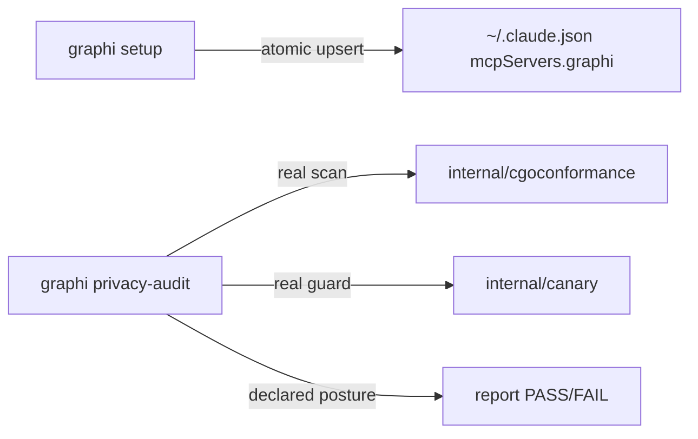

# `graphi setup` + `graphi privacy-audit` (SW-044)

> One-command Claude Code MCP onboarding + local-first privacy proof.

## Before / After

| | Before SW-044 | After SW-044 |
|---|---|---|
| **MCP onboarding** | manual JSON edit of `~/.claude.json` | `graphi setup` — idempotent, atomic, one command |
| **Privacy posture** | implicit (enforced in CI, not user-visible) | `graphi privacy-audit` — readable pass/fail from real facts |
| **Dry-run** | — | `graphi setup --dry-run` previews the exact change |

## Why
The EP-008 launch criterion is: fresh machine → configured Claude Code MCP tool +
confirmed privacy posture in two commands. `setup` removes the manual-config
error surface; `privacy-audit` makes the local-first contract inspectable on the
user's machine from **real build facts** (CGo scan + canary egress guard), not a
hardcoded "OK" string (AC-4).

## `graphi setup`
Resolves the config path (`$CLAUDE_CONFIG_PATH` → `~/.claude.json`), upserts the
graphi MCP stdio entry (`{"type":"stdio","command":"<graphi>","args":["mcp"]}`)
**atomically** (temp + rename) and **non-destructively** (preserves all unknown
keys + sibling `mcpServers.*`). Reports `created` / `updated` / `unchanged`.

```bash
graphi setup                 # register this binary (idempotent)
graphi setup --dry-run       # preview, no write
graphi setup --binary /opt/graphi/bin/graphi
```

## `graphi privacy-audit`
Assembles the proof from real facts and exits non-zero on any violation:

- **CGo-free** — a real `internal/cgoconformance.CgoUsingPackages` scan of the
  build graph (the same engine the CI gate uses).
- **Zero outbound** — references `internal/canary`'s dial-attempt guard
  (loopback-only, asserted on attempt) + asserts the surface union covers the
  surfaces; the full hermetic run is `graphi canary`/CI.
- **No telemetry / no accounts / no external services** — explicit statements,
  each labeled `verified` or `declared` honestly.



Both subcommands are stdlib-only and **fully offline** — no network calls during
setup or audit.

## Tests
`internal/mcpconfig` (create/update/unchanged, non-destructive, atomic-on-error,
dry-run-writes-nothing, path resolution) and `internal/audit` (clean-graph PASS,
CGo evidence cites the real scan, zero-outbound evidence cites the dial-attempt
guard). `-race` green.
