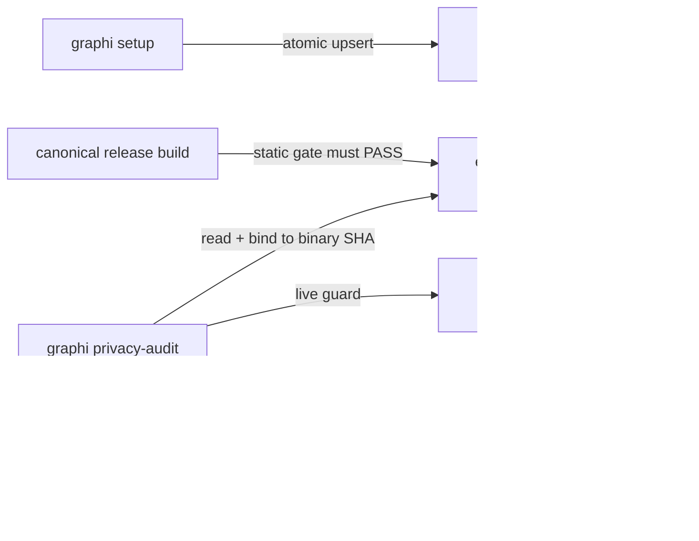

# `graphi setup` + `graphi privacy-audit`

> One-command Claude Code MCP onboarding + local-first privacy proof.

This document covers two CLI subcommands — `graphi setup` and `graphi
privacy-audit` — for contributors and users who want to understand how graphi
registers itself with Claude Code and how the shipped binary reports its
local-first privacy evidence.

## Before / After

| | Before | After |
|---|---|---|
| **MCP onboarding** | manual JSON edit of `~/.claude.json` | `graphi setup` — idempotent, atomic, one command |
| **Privacy posture** | implicit (enforced in CI, not user-visible) | `graphi privacy-audit` — build-scoped static evidence plus a live runtime check |
| **Dry-run** | — | `graphi setup --dry-run` previews the exact change |

## Why

The launch goal is simple: on a fresh machine, a user can get a configured
Claude Code MCP tool and a confirmed privacy posture in two commands. `setup`
removes the manual-config error surface. `privacy-audit` makes the
local-first contract inspectable without requiring an installed Go toolchain
or a source checkout. Static properties are measured before the canonical
release build and embedded with their source revision and evidence digest; the
runtime egress check remains a live observation. Neither path uses the network.

## `graphi setup`

Resolves the config path (`$CLAUDE_CONFIG_PATH` → `~/.claude.json`) and
upserts the graphi MCP stdio entry
(`{"type":"stdio","command":"<graphi>","args":["mcp"]}`). The write is
**atomic** (temp file + rename) and **non-destructive** (it preserves all
unknown keys and sibling `mcpServers.*` entries). It reports `created`,
`updated`, or `unchanged`.

```bash
graphi setup                 # register this binary (idempotent)
graphi setup --dry-run       # preview, no write
graphi setup --binary /opt/graphi/bin/graphi
```

## `graphi privacy-audit`

The default command reports evidence about the binary being executed:

- **CGo-free build** — the canonical builder records that it forced
  `CGO_ENABLED=0` for the artifact.
- **No telemetry** — before linking, the builder must run
  `internal/canary`'s telemetry-import denylist and type-checked outbound-dial
  scan over the default source graph. A finding, scanner error, missing source
  revision, or missing evidence digest stops the build; no attestation is
  produced.
- **Zero outbound** — a live representative operation runs under the local
  platform's loopback-only isolator. An unavailable isolator remains
  `UNVERIFIED`, never PASS.
- **No accounts / no external services** — explicit posture declarations,
  labeled as declarations rather than runtime measurements.

The embedded record carries the source commit, whether the source was modified,
and a deterministic digest of the dependency names, `go.mod`/`go.sum`, and
non-test Go sources inspected by the static gate. At runtime the command also
hashes its own executable. Every field in that record which the Go toolchain
independently recorded into the same binary — the source revision, the
`vcs.modified` source state, the `CGO_ENABLED` setting, the `-tags` build-tag
set and the target platform — is cross-checked against `debug.ReadBuildInfo()`;
any disagreement downgrades the static claims to `UNVERIFIED` rather than
accepting the record's own word. The evidence digest is the one field with no
in-binary ground truth: reproducing it needs the source tree, which is what the
recipe below is for. It states explicitly that this embedded record is
not an independent signature: a sceptical user checks `binary_sha256` against
the release's `SHA256SUMS` and published build provenance, or reproduces the
source scan from the named commit.

The report prints the exact `build_tags` used for the attested dependency graph.
From the named checkout, the static artifact can be reproduced offline with:

```bash
CGO_ENABLED=0 go run ./cmd/canary \
  -tags '<comma-separated build_tags>' -goos '<target goos>' -goarch '<target goarch>' gate
```

An ordinary `go build` or `go install` does not receive the canonical builder's
attestation. Outside a graphi checkout it therefore reports the two static
claims as `UNVERIFIED` with the actual remediation, rather than leaking a
`go list` exit status or pretending to pass.

Developers can deliberately inspect a checkout instead:

```bash
graphi privacy-audit --source
graphi privacy-audit --source --target ./cmd/graphi/
```

Those rows are labeled `developer source scan; not the running binary`. A PASS
there describes the checkout only and cannot be mistaken for an attestation
about the executable.


```mermaid
flowchart LR
    A[graphi setup] -->|atomic upsert| C[~/.claude.json mcpServers.graphi]
    B[canonical release build] -->|static gate must PASS| G[embedded source-bound evidence]
    P[graphi privacy-audit] -->|read + bind to binary SHA| G
    P -->|live guard| N[internal/canary runtime isolator]
    P -->|--source| S[developer checkout scan]
    P -->|declared posture| O[report PASS/FAIL]
```

Both subcommands are stdlib-only and **fully offline** — no network calls during
setup or audit.

## Tests

Covered by `internal/mcpconfig` (create/update/unchanged, non-destructive,
atomic-on-error, dry-run-writes-nothing, path resolution), `internal/audit`
(attestation binding, source-scope labeling, sanitised UNVERIFIED, live egress
tri-state), `internal/buildattest` (closed schema, PASS-only encoding), and
`internal/release` (canonical binary remains statically verifiable outside any
module). Passes under `CGO_ENABLED=0`.
