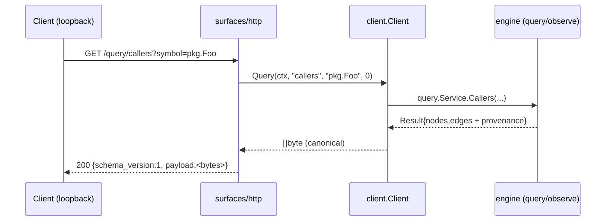
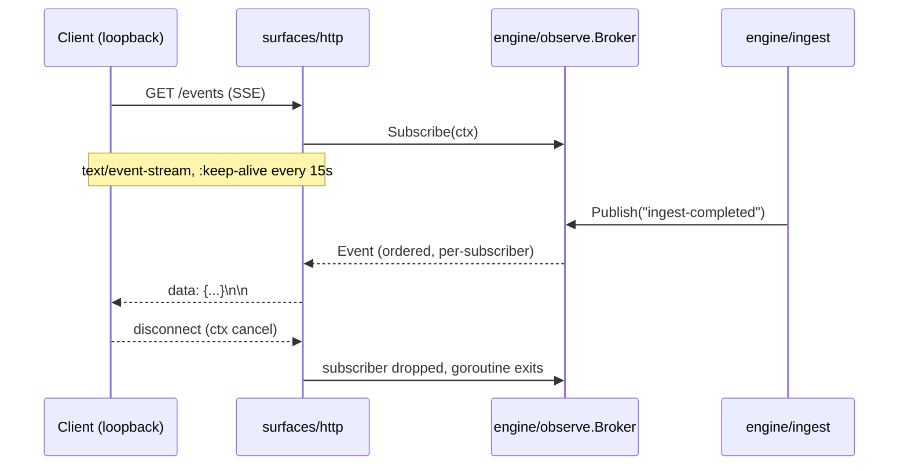
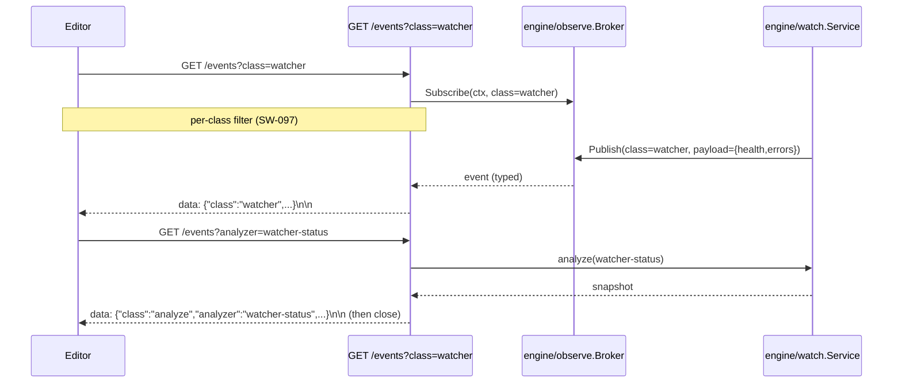

# HTTP/SSE Surface (`surfaces/http`)

> Story: **SW-039** (EP-008) — read-only HTTP REST + SSE surface over the shared engine.
> Extended in **SW-104** (EP-017 capstone) with the SSE `?analyzer=` one-shot
> analysis frame and in **EP-018** (SW-105…SW-108) with the
> `/prs/*`, `/branches/compare`, and `/reviews/critique` PR-tool endpoints.

## Before / After

| | Before SW-039 | After SW-039 | After EP-015/EP-016/EP-017/EP-018 |
|---|---|---|---|
| **Transports** | CLI, Unix-socket daemon, MCP stdio | + **HTTP REST + SSE** over loopback | + **MCP streamable-HTTP** (SW-098) + **per-class SSE** (SW-097) + **PR-tool endpoints** (SW-105…SW-108) |
| **TS/web/IDE backend** | none (no transport for SW-040 web client / SW-043 VS Code ext) | stable, versioned HTTP contract these surfaces consume | unchanged; consumers can pin to the same envelope |
| **Freshness/events** | none (no observer) | `engine/observe` broker; ingest publishes lifecycle events; SSE streams them | + per-class subscriptions (`class=ingest`, `class=analyze`, `class=overlay`, `class=watcher`, `class=community`) and a one-shot `?analyzer=<name>` analysis frame on `/events` |
| **Code reuse** | each surface delegates to `client.Client` | HTTP delegates to the **same** `client.Client` seam → byte-identical answers (parity) | unchanged; every new endpoint rides the same shared client |

## Why

EP-008's downstream surfaces (TS/React web client, VS Code extension) need a
**transport that runs in a browser/extension runtime** — stdio (MCP) and a
Unix-socket RPC (daemon) cannot. HTTP is the universal consumer boundary. To
avoid surface-forked logic, the HTTP layer delegates to the **same**
`client.Client` interface the CLI/MCP/daemon use, so every answer — including
per-edge provenance (`confidence`, `confidence_tier`, `reason`, `evidence`) — is
byte-identical across surfaces. SSE gives those clients a **streamed freshness**
channel (no polling) over a new, generic `engine/observe` broker.

## Contract

### Envelope
Every data response is wrapped in a versioned envelope so consumers can detect
drift. `payload` carries the engine's canonical serialized bytes **verbatim** —
the same bytes MCP/CLI return:

```json
{ "schema_version": 1, "payload": { /* engine result */ } }
```

### REST routes (all read-only; non-GET → 405)
| Method | Route | Delegates to | Epic |
|---|---|---|---|
| GET | `/healthz` | — (liveness) | EP-008 |
| GET | `/contract` | capability negotiation document | EP-008 |
| GET | `/query/{op}?symbol=&depth=` | `client.Query` (`{op}` ∈ callers/callees/references/definition/neighborhood/implementers/implements/overrides/subtypes/supertypes) | EP-001 / EP-011 |
| POST | `/compound` | `client.Compound` (Cypher-style) | EP-011 |
| POST | `/query-ast` | `client.SearchAST` | EP-013 |
| POST | `/find-clones` | `client.FindClones` | EP-013 |
| GET | `/search?q=&limit=` | `client.Search` | EP-001 |
| GET | `/search/semantic?q=&limit=` | `client.SearchSemantic` (graceful-skip when no embedder) | EP-001 / FU-3 |
| GET | `/analyze/{analyzer}?symbol=&direction=&max-nodes=` | `client.Analyze` (incl. `impact`, `call-chain`, `concept`, `metrics`, `batched`, `taint`, `pdg`, `interproc`, `contracts`, `git-history`, `pr-risk`, `pr-signals`, `pr-questions`, `communities`, `notebook-ingest`, `taint-query`, `watcher-status`, `triage-prs`, `conflicts-prs`, `suggest-reviewers`, `compare-branches`, `critique-review`) | EP-004 / EP-005 / EP-007 / EP-017 / EP-018 |
| GET | `/prs` | `client.ListPRs` (read-only forge enumeration) | EP-018 / SW-105 |
| GET | `/prs/triage` | `client.TriagePRs` (single-pass graph-derived ranking) | EP-018 / SW-105 |
| GET | `/prs/conflicts` | `client.ConflictsPRs` (textual + graph-semantic + asymmetric contract-dependency) | EP-018 / SW-106 |
| GET | `/prs/suggest-reviewers` | `client.SuggestReviewers` (ownership/churn + affected-subgraph proximity) | EP-018 / SW-107 |
| GET | `/branches/compare?base=&head=` | `client.CompareBranches` (graph-level diff, keyed by canonical NodeId) | EP-018 / SW-107 |
| GET | `/reviews/critique?diff=&pr=` | `client.CritiqueReview` (graph-evidence critique of an existing PR review) | EP-018 / SW-108 |
| POST | `/memory` | `client.Memory` (store / recall / forget) | EP-012 |
| POST | `/distill` | `client.Distill` (session distillation) | EP-012 |
| POST | `/skillgen` | `client.SkillGen` (deterministic skill generation) | EP-012 |
| GET | `/events` (SSE) | `engine/observe` broker; per-class subscriptions | EP-008 / SW-097 / SW-104 |
| GET | `/wiki` | `client.WikiIndex` (community-driven) | EP-008 / EP-017 |
| GET | `/wiki/c/{id}` | `client.WikiPage` | EP-008 / EP-017 |
| GET | `/` | SPA (bundled `webui_embed` build) or notice page | EP-008 |

### Schema-version drift gate (EP-002 / R5)
A request header `X-Graphi-Schema-Version: N` where `N != 1` → **412 Precondition
Failed** (envelope still echoes the current version). Absent header = no
negotiation (pass-through).

### SSE — `GET /events`
- `Content-Type: text/event-stream`; `:keep-alive` comment every 15s.
- Each event: `data: {"type":"ingest-completed","ts":"...","payload":{...}}\n\n`.
- **Per-class subscriptions (SW-097).** The optional `?class=<name>` query
  parameter filters the stream to a single class: `ingest`, `analyze`,
  `overlay`, `watcher`, `community`. Absent or empty `class` = firehose.
  Classes are defined in `engine/observe/class.go`; the broker drops the
  request silently if the class is unknown (defense-in-depth — never errors
  on a misconfigured subscriber).
- **One-shot analysis frame (SW-104).** With `?analyzer=<name>` the
  connection terminates after the next matching analysis frame is delivered
  (e.g. `?analyzer=watcher-status` returns the current watcher health and
  closes). This is the right shape for an editor polling on a low frequency
  without holding a long-lived SSE connection.
- **Backpressure:** subscriber buffer = 16; a slow subscriber's events are
  dropped (never blocked) — loss-tolerant by design (read-only freshness stream).
- **Lifecycle:** on client disconnect the request context cancels, the broker
  drops the subscriber, and the handler goroutine exits — no leak.

## Local-first / zero-outbound contract
- The listen address **must** be loopback (`127.0.0.1` / `localhost` / `::1`).
  Both `http.ListenAndServe` **and** `cmd/graphi runHTTP` validate this **before**
  binding and refuse non-loopback addresses.
- The surface makes **zero outbound** connections; it only accepts inbound
  loopback connections and calls the in-process engine. No telemetry, no fetch.
- **Zero-egress enforcement guard (SW-099).** The central loopback/egress
  chokepoint (`surfaces/guard`) rejects any non-loopback `Dial` at the
  surface boundary — fail-closed, with a live netns canary
  (`internal/canary/gate.go`) as a defense-in-depth layer. This is the same
  guard every other surface rides, so HTTP cannot be a back-door.

## Data flow







## Run

```bash
# loopback HTTP + SSE; in-memory store; ingest a repo so SSE has a producer
graphi http -addr 127.0.0.1:8080 -db "" -root ./myrepo

# against a durable store, custom meta sidecar
graphi http -addr 127.0.0.1:8080 -db ./graph.db -root ./myrepo -meta ./meta
```

## Parity proof (tests)
`surfaces/http/server_test.go` asserts `envelope.payload == client.Query(...)`
**byte-for-byte** for every op + representative symbols — the strongest possible
proof that the HTTP surface returns the same answers (and provenance) as MCP/CLI.
Additional tests cover the 412 schema gate, 405 read-only enforcement, SSE
ordering, goroutine-leak-free disconnect, cold-start P95 < 100ms, and the
loopback-only bind refusal.
