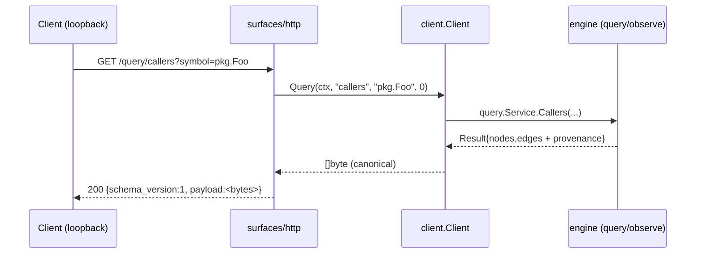
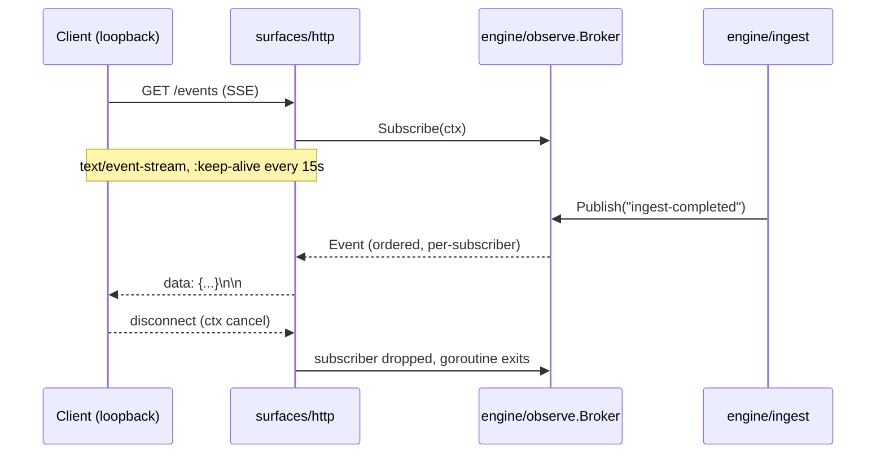

# HTTP/SSE Surface (`surfaces/http`)

> Story: **SW-039** (EP-008) — read-only HTTP REST + SSE surface over the shared engine.

## Before / After

| | Before SW-039 | After SW-039 |
|---|---|---|
| **Transports** | CLI, Unix-socket daemon, MCP stdio | + **HTTP REST + SSE** over loopback |
| **TS/web/IDE backend** | none (no transport for SW-040 web client / SW-043 VS Code ext) | stable, versioned HTTP contract these surfaces consume |
| **Freshness/events** | none (no observer) | `engine/observe` broker; ingest publishes lifecycle events; SSE streams them |
| **Code reuse** | each surface delegates to `client.Client` | HTTP delegates to the **same** `client.Client` seam → byte-identical answers (parity) |

## Why

EP-008's downstream surfaces (TS/React web client, VS Code extension) need a
**transport that runs in a browser/extension runtime** — stdio (MCP) and a
Unix-socket RPC (daemon) cannot. HTTP is the universal consumer boundary. To
avoid surface-forked logic, the HTTP layer delegates to the **same**
`client.Client` interface the CLI/MCP/daemon use, so every answer — including
per-edge provenance (`confidence`, `confidence_tier`, `reason`, `evidence`) — is
byte-identical across surfaces. SSE gives those clients a **streamed freshness**
channel (no polling) over a new, generic `engine/observe` broker.

## Contract

### Envelope
Every data response is wrapped in a versioned envelope so consumers can detect
drift. `payload` carries the engine's canonical serialized bytes **verbatim** —
the same bytes MCP/CLI return:

```json
{ "schema_version": 1, "payload": { /* engine result */ } }
```

### REST routes (all read-only; non-GET → 405)
| Method | Route | Delegates to |
|---|---|---|
| GET | `/healthz` | — (liveness) |
| GET | `/query/{op}?symbol=&depth=` | `client.Query` (`{op}` ∈ callers/callees/references/definition/neighborhood) |
| GET | `/search?q=&limit=` | `client.Search` |
| GET | `/analyze/{analyzer}?symbol=&direction=&max-nodes=` | `client.Analyze` |

### Schema-version drift gate (EP-002 / R5)
A request header `X-Graphi-Schema-Version: N` where `N != 1` → **412 Precondition
Failed** (envelope still echoes the current version). Absent header = no
negotiation (pass-through).

### SSE — `GET /events`
- `Content-Type: text/event-stream`; `:keep-alive` comment every 15s.
- Each event: `data: {"type":"ingest-completed","ts":"...","payload":{...}}\n\n`.
- **Backpressure:** subscriber buffer = 16; a slow subscriber's events are
  dropped (never blocked) — loss-tolerant by design (read-only freshness stream).
- **Lifecycle:** on client disconnect the request context cancels, the broker
  drops the subscriber, and the handler goroutine exits — no leak.

## Local-first / zero-outbound contract
- The listen address **must** be loopback (`127.0.0.1` / `localhost` / `::1`).
  Both `http.ListenAndServe` **and** `cmd/graphi runHTTP` validate this **before**
  binding and refuse non-loopback addresses.
- The surface makes **zero outbound** connections; it only accepts inbound
  loopback connections and calls the in-process engine. No telemetry, no fetch.

## Data flow





## Run

```bash
# loopback HTTP + SSE; in-memory store; ingest a repo so SSE has a producer
graphi http -addr 127.0.0.1:8080 -db "" -root ./myrepo

# against a durable store, custom meta sidecar
graphi http -addr 127.0.0.1:8080 -db ./graph.db -root ./myrepo -meta ./meta
```

## Parity proof (tests)
`surfaces/http/server_test.go` asserts `envelope.payload == client.Query(...)`
**byte-for-byte** for every op + representative symbols — the strongest possible
proof that the HTTP surface returns the same answers (and provenance) as MCP/CLI.
Additional tests cover the 412 schema gate, 405 read-only enforcement, SSE
ordering, goroutine-leak-free disconnect, cold-start P95 < 100ms, and the
loopback-only bind refusal.
