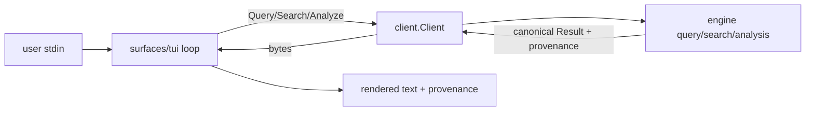

# TUI Surface (`surfaces/tui`) — SW-042

> Interactive terminal surface over the shared engine. stdlib-only (no terminal-framework dependency).

## Before / After

| | Before SW-042 | After SW-042 |
|---|---|---|
| **Terminal surface** | CLI is one-shot (one query per invocation) | **interactive** TUI session: select, explore, blast, search |
| **Explore loop** | re-run `graphi query` per question | live `select` → `neighbors` → `blast` without re-launching |
| **Parity** | CLI/MCP/HTTP/daemon | + **TUI** — same `client.Client` seam, byte-identical answers + provenance |

## Why
A terminal-native explore loop (select a symbol, walk its neighborhood, run
blast-radius, search) without re-invoking the binary per query. It uses pi's
`tui` as a structural reference (read/eval/print loop, command dispatch) while
keeping graphi's Engine as the single source of truth. It adds **no new
dependency** (no `tcell`/`bubbletea`/`tview`) — preserving the CGo-free, static,
minimal-dependency build — and holds **zero** query/analysis logic of its own.

## Commands
```
select <id>          focus a symbol
neighbors [N]        neighborhood (N hops) of the focused symbol
callers|callees|references|definition   directed lookups
blast                blast-radius / impact (reverse) of the focused symbol
search <query>       lexical/symbol search
provenance           explain the provenance fields shown on edges
help | quit
```
Edges render the engine's provenance verbatim: `confidence_tier`, `confidence`,
`reason`, `evidence` — identical to CLI/MCP/HTTP output.

## Parity & safety
- **Parity by construction:** the TUI calls the same `client.Client.Query/Search/Analyze`
  methods; a test asserts it invokes the client identically to a direct call and
  renders the client's payload bytes verbatim.
- **Zero outbound:** in-process client only; no network.
- **Robust:** Engine errors are caught and rendered; the loop never crashes.



## Run
```bash
graphi tui            # interactive session (in-process engine)
echo -e 'help\nquit' | graphi tui
```

## Tests
`surfaces/tui/tui_test.go`: neighbors/blast/search render + provenance present;
error-path (loop continues); parity (client invoked identically; payload bytes
rendered); missing-select guard; unknown-command; quit/EOF exit. `-race` green.
