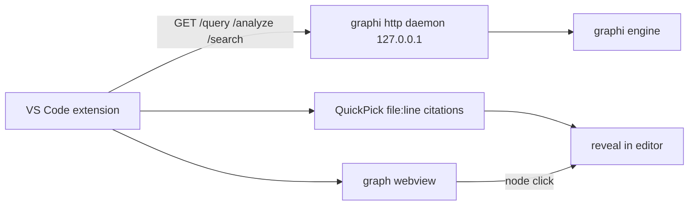

# VS Code Extension (`extensions/vscode/`) — SW-043

> Read-only code-intelligence + visualization inside the IDE. Local-first: talks only to the local graphi daemon (loopback).

## Before / After

| | Before SW-043 | After SW-043 |
|---|---|---|
| **IDE integration** | none | blast-radius, search, graph webview in VS Code |
| **Backend** | n/a | SW-039 HTTP contract only (loopback daemon) |
| **Citations** | n/a | `file:line` → click-navigable in the editor |
| **Network** | n/a | loopback-only (asserted at construction); zero outbound |

## Why
Surfacing graphi's code-intelligence inside Devon's editor (Devon is the target
user per the story): cursor on a symbol → see its blast-radius with clickable
citations; search symbols and jump to them; visualize the neighborhood in a
webview — all without leaving the IDE, all read-only, all local.

## Architecture
- **Standalone TS package** under `extensions/vscode/`; depends only on the `vscode` API + the SW-039 HTTP contract (re-declared in `src/contract.ts`). **No Engine/core internals.**
- **Read-only by construction:** `src/graphiClient.ts` exposes only `getNeighborhood/getImpact/search/health` — no write/refactor/undo verbs exist, so the extension cannot mutate the graph or workspace.
- **Loopback-enforced:** `assertLoopback()` rejects non-loopback daemon URLs at construction (mirrors SW-039's `http.AssertLoopback`); zero outbound.
- **Robust:** daemon-unreachable → status-bar "offline" + actionable Retry; commands never throw out (no IDE crash).

## Commands
| Command | Action |
|---|---|
| `graphi: Show blast-radius` | cursor symbol → `/analyze/impact` → QuickPick of impacted `file:line` citations → click navigates |
| `graphi: Search symbols` | input → `/search` → QuickPick with `file:line` → navigate |
| `graphi: Show graph (webview)` | cursor symbol → `/query/neighborhood` → SVG graph webview; node click reveals citation |
| `graphi: Retry daemon connection` | re-checks the daemon URL |



## Local-first / zero-outbound
- Daemon URL MUST be loopback (`127.0.0.1`/`localhost`/`::1`); asserted at construction, non-loopback refused.
- No telemetry, no remote scripts in the webview (local resources only).

## Build / test
```bash
cd extensions/vscode && npm install
npm run compile     # tsc -> out/ (extension compiles against vscode API + contract)
npm test            # vitest: loopback-enforcement + citation mapping
# run the daemon: graphi http -addr 127.0.0.1:8080 ...
```

## Tests
- **Build proof:** `npx tsc -p ./` compiles to `out/` against the `vscode` API + the typed SW-039 contract.
- **Unit (vitest):** `graphiClient.test.ts` (loopback acceptance/refusal + construction fail-fast), `citations.test.ts` (impact → `file:line` citations; missing-node tolerated). 7/7 green.
