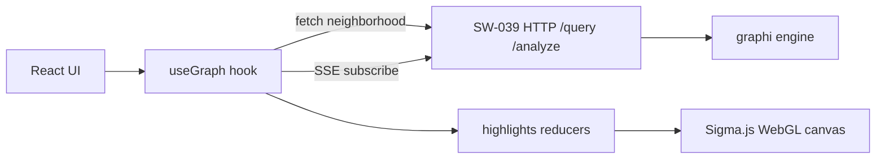

# Web Client (`web/`) — SW-040

> TS/React + Sigma.js/Graphology graph visualization with blast-radius & citation highlights. Consumes the SW-039 HTTP/SSE surface as its only backend boundary.

## Before / After

| | Before SW-040 | After SW-040 |
|---|---|---|
| **In-browser viz** | none | Sigma.js WebGL graph canvas |
| **Backend contract** | n/a | SW-039 HTTP/SSE only (no Go/WASM, no shared code) |
| **Highlights** | n/a | blast-radius (red) + citation/provenance (amber), distinct |

## Why
A browser-native, interactive view of the code graph: load a neighborhood, click
a symbol to see its blast-radius, and visually distinguish citation/provenance —
all driven by the **same** HTTP/SSE contract the daemon serves, so the client
holds no engine logic and can evolve independently of the Go backend.

## Architecture
- **Stack:** Vite + React 18 + TypeScript (strict). Graphology (graph model) + Sigma.js v3 (WebGL).
- **Contract:** `src/graphiClient.ts` is the single backend boundary — typed wrappers over `/query/neighborhood`, `/analyze/impact`, and `/events` (SSE) mirroring the SW-039 envelope.
- **Highlights:** pure reducers in `src/highlights.ts` (`applyBlast`, `applyCitation`, `clearHighlights`) — framework-agnostic, unit-tested; wired into Sigma reducers in `GraphView.tsx`.
- **Incremental:** SSE `ingest-*` events trigger a neighborhood refetch merged into the live graph (no reload, no interaction block).



## Distinct highlight styles (AC-3)
- **blast-radius** → red nodes (`#dc2626`), enlarged (`size 14`)
- **citation/provenance** → amber nodes (`#d97706`) + arrowed amber edges for edges pointing into the selected symbol
- **clear** → all attributes reset to defaults

## Local-first / zero-outbound
The client dials only the configured `VITE_GRAPHI_URL` (loopback daemon). The dev
server proxies API/SSE to `127.0.0.1:8080`. No telemetry, no runtime CDNs (all
assets bundled at build).

## Run
```bash
cd web && npm install
graphi http -addr 127.0.0.1:8080 -db ./graph.db -root ./myrepo   # in another terminal
npm run dev          # http://localhost:5173/?symbol=pkg.Func
npm run build        # production bundle (proof of compilability)
npm test             # highlights reducer unit tests
```

## Tests
- **Build proof (compile-time parity):** `npm run build` = `tsc --noEmit && vite build` — the typed envelope consumption compiles end-to-end.
- **Unit (vitest):** `highlights.test.ts` — blast marks impacted; citation distinct from blast and flags incident nodes; clear resets all.
