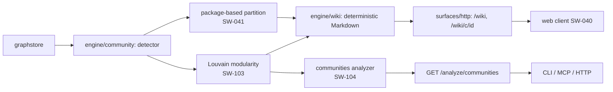

# Wiki Surface

> A self-generating wiki built from code-graph communities, served over HTTP,
> for browsing an unfamiliar codebase without writing queries. Later extended
> with deterministic Louvain community detection, surfaced through the
> analysis dispatcher as the `communities` analyzer.

## Before / after

| | Before | After initial wiki surface | After Louvain support |
|---|---|---|---|
| **Browsing the graph** | query/search per question | **self-generated wiki**: one page per package + index | unchanged; consumers can also request Louvain-grouped pages |
| **Community detection** | none | deterministic package-based partition (`engine/community`) | + **Louvain** community detection behind a single grouping seam (`core/community/louvain.go`, `engine/community/detector.go`) |
| **Cross-links** | none | real inter-package edges → navigable neighbor links | unchanged |
| **Determinism** | n/a | byte-for-byte identical output for the same graph | + Louvain is deterministic (no random seed) and surfaces a canonical community ordering |

## Why

The wiki surface gives a browsable overview of the codebase derived **from
graph facts only** — no LLM, no network. Community detection groups symbols
by their structural package; each package becomes a wiki page listing
members, internal edges, representatives, and cross-links to dependent
packages. The same graph always yields the same wiki (deterministic), so
it is reproducible and diffable.

### Community detection: package-based, then Louvain

An early design considered reusing an existing community-detection routine,
but none existed in the codebase. Weakly-connected components (WCC) were
evaluated and rejected: WCC collapses every connected node into one
component, leaving **no inter-community edges** — which would make
cross-links between pages impossible.

**Package-based partitioning** (the qualified-name prefix before the final
`.`) was chosen instead. It is deterministic, stable, and preserves
inter-package edges, so neighbor cross-links can be derived from real graph
facts. It is also the natural "community" for a code graph — one wiki page
per package.

**Louvain community detection was added later** as a second,
structurally-different grouping behind the same seam
(`engine/community/detector.go` + `core/community/louvain.go`). Louvain
maximizes modularity over the call/reference edge weight and produces
communities that are not aligned with the package boundary — useful for
spotting cross-cutting concerns, hub packages, and hidden coupling. Both
groupings are deterministic, byte-stable, and exposed through the
`communities` analyzer.

## Contract
- `GET /wiki` → index (all communities + member counts), `text/markdown`, 200.
- `GET /wiki/c/{id}` → one community page (members, internal edges, representatives, neighbor cross-links), `text/markdown`, 200; unknown id → 404.

Pages are pure Markdown derived from graph facts; no natural-language synthesis.

## Determinism & safety
- **Deterministic:** all iteration sorted (by NodeId / package key / community ID); no `time.Now()`, no random seed. `TestGenerate_Deterministic_ByteIdentical` asserts byte-for-byte equality across runs.
- **No network / no LLM:** `engine/community` + `engine/wiki` import only `core/model` + `core/graphstore`; HTTP serving reuses the loopback-only HTTP surface's server.
- **Read-only:** generation never mutates the graph.

## Tests
`engine/community` (package grouping, deterministic, empty, packageKey), `engine/wiki` (index + one page per community, members, cross-links, byte-identical determinism, unknown-page 404), `surfaces/http` (/wiki + /wiki/c/{id} as text/markdown 200; unknown 404; no-store 404). `-race` green.
