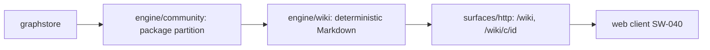

# Wiki Surface — SW-041

> Self-generating wiki from code-graph communities. Served over HTTP (SW-039).

## Before / After

| | Before SW-041 | After SW-041 |
|---|---|---|
| **Browsing the graph** | query/search per question | **self-generated wiki**: one page per package + index |
| **Community detection** | none | deterministic package-based partition (`engine/community`) |
| **Cross-links** | none | real inter-package edges → navigable neighbor links |
| **Determinism** | n/a | byte-for-byte identical output for the same graph |

## Why
A browsable overview of the codebase derived **from graph facts only** — no LLM,
no network. Community detection groups symbols by their structural package; each
package becomes a wiki page listing members, internal edges, representatives, and
cross-links to dependent packages. The same graph always yields the same wiki
(deterministic), so it is reproducible and diffable.

### Community detection: package-based (design decision)
The draft said "reuse the existing community-detection routine", but **none
existed**. Weakly-connected components (WCC) were evaluated and rejected: WCC
collapses every connected node into one component, leaving **no inter-community
edges** — so AC-3's cross-links would be impossible. **Package-based partitioning**
(the qualified-name prefix before the final `.`) is deterministic, stable, and
preserves inter-package edges, making neighbor cross-links derivable from real
graph facts. It is also the natural "community" for a code graph (one wiki page
per package). Richer clustering (Louvain/modularity) is a documented fast-follow.

## Contract
- `GET /wiki` → index (all communities + member counts), `text/markdown`, 200.
- `GET /wiki/c/{id}` → one community page (members, internal edges, representatives, neighbor cross-links), `text/markdown`, 200; unknown id → 404.

Pages are pure Markdown derived from graph facts; no natural-language synthesis.

## Determinism & safety
- **Deterministic:** all iteration sorted (by NodeId / package key / community ID); no `time.Now()`, no random seed. `TestGenerate_Deterministic_ByteIdentical` asserts byte-for-byte equality across runs.
- **No network / no LLM:** `engine/community` + `engine/wiki` import only `core/model` + `core/graphstore`; HTTP serving reuses the loopback-only SW-039 server.
- **Read-only:** generation never mutates the graph.

## Tests
`engine/community` (package grouping, deterministic, empty, packageKey), `engine/wiki` (index + one page per community, members, cross-links, byte-identical determinism, unknown-page 404), `surfaces/http` (/wiki + /wiki/c/{id} as text/markdown 200; unknown 404; no-store 404). `-race` green.
