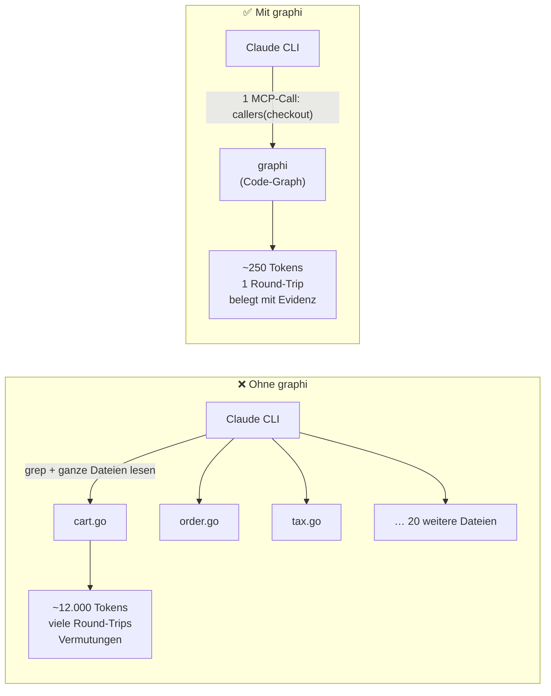
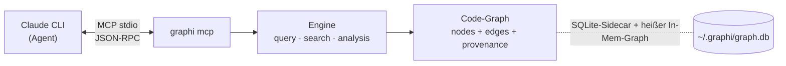
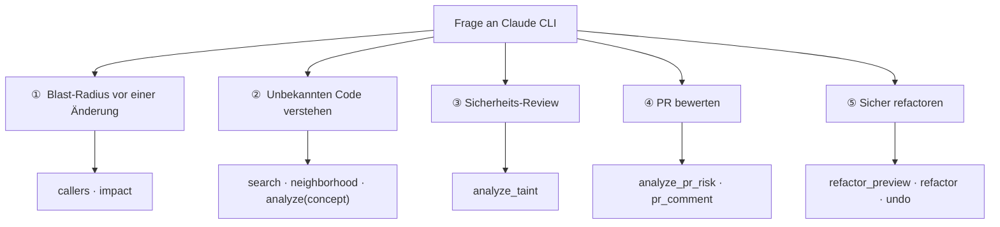

# Tutorial: graphi mit der Claude CLI als Agent

> Beispiel-Repository: **dieses Repo (`samibel/graphi`)**. Agent: **Claude CLI** (`claude`).
> Ziel: verstehen, *warum* graphi einem KI-Agenten hilft — und es in ~2 Minuten selbst nutzen.

Eine begleitende, detaillierte Visualisierung liegt als Excalidraw-Datei daneben:
[`graphi-claude-flow.excalidraw`](graphi-claude-flow.excalidraw) (in [excalidraw.com](https://excalidraw.com) öffnen → *Open*).

---

## 1. Das Problem (warum ein Agent ohne graphi langsam ist)

Wenn die Claude CLI eine Frage wie *„Wer ruft `checkout` auf, und was bricht, wenn ich es ändere?"* beantworten soll, muss sie ohne graphi **greppen und ganze Dateien lesen**. Das ist langsam, teuer (viele Tokens) und unsicher — sie *rät* aus dem, was sie zufällig gelesen hat.



**Der Kern:** graphi parst das Repo **einmal** in einen deterministischen **Code-Graphen** — Knoten sind Symbole (Funktionen, Typen, Dateien), Kanten sind Beziehungen (`calls`, `references`, `defines`, `imports`). Jede Frage des Agenten wird zu **einem** gezielten Graph-Lookup statt zu einer Lesetour durch das halbe Repo.

---

## 2. Der Vorteil in einem Satz

> **graphi gibt der Claude CLI exakte, mit Evidenz belegte Antworten über das ganze Repo in einem Aufruf — lokal, in unter 100 ms, mit deutlich weniger Tokens.**

Fünf konkrete Vorteile:

| Vorteil | Was es für den Agenten bedeutet |
|---|---|
| **Weniger Tokens** | Statt ganze Dateien zu lesen, kommt nur das relevante Symbol + Evidenz zurück. graphi führt sogar ein **USD-Sparbuch** (`savings`). |
| **Exakt statt geraten** | Deterministischer Graph mit stabilen IDs — kein probabilistisches RAG. |
| **Vertrauenswürdig** | Jede Kante trägt **Provenance**: `confidence_tier` (heuristic/derived/confirmed) + Grund + Evidenz (`datei.go:zeile`). |
| **Schnell & frisch** | Heißer Daemon-Graph, Cold-Start P95 < 100 ms, inkrementell frisch ≤ 2 s. |
| **Lokal-first** | Kein Byte verlässt die Maschine: zero outbound network, keine Telemetrie, CGo-frei, ein Binary. |

---

## 3. Setup: graphi an die Claude CLI anschließen

graphi spricht mit Agenten über **MCP (stdio)**. Ein Befehl genügt — er trägt graphi idempotent, atomar und offline in die Claude-Konfiguration ein.

```bash
# 1) graphi bauen (CGo-frei, ein Binary)
CGO_ENABLED=0 go build -o graphi ./cmd/graphi

# 2) Einen durchsuchbaren Graphen dieses Repos anlegen (persistente SQLite-DB)
mkdir -p ~/.graphi
./graphi http -db ~/.graphi/graph.db -root . -addr 127.0.0.1:8080
#   warten bis "listening …", dann Ctrl-C — die DB ist jetzt gebaut.

# 3) graphi als MCP-Server bei der Claude CLI registrieren
./graphi setup
#   → schreibt den stdio-MCP-Eintrag nach ~/.claude.json und nennt den Pfad.

# 4) claude neu starten — graphi-Tools sind jetzt sichtbar.
```

Wie das zusammenspielt:



> Für nicht-Claude-MCP-Clients: direkt `./graphi mcp -db ~/.graphi/graph.db` als Server starten.

---

## 4. Wie ein einzelner Aufruf abläuft

Beispiel: Claude soll wissen, wer `checkout` aufruft.

```mermaid
sequenceDiagram
    participant U as Du
    participant C as Claude CLI
    participant G as graphi (MCP)
    participant Gr as Code-Graph

    U->>C: "Was bricht, wenn ich checkout ändere?"
    C->>G: tools/call callers { symbol: "shop/cart.checkout" }
    G->>Gr: Lookup eingehende calls-Kanten
    Gr-->>G: [order.place, api.handleCheckout] + Evidenz
    G-->>C: Symbole + tier/reason/evidence (wenige Tokens)
    C->>G: tools/call impact { symbol: "shop/cart.checkout", direction: "reverse" }
    G-->>C: Blast-Radius (alle abhängigen Symbole)
    C-->>U: "checkout wird von 2 Stellen genutzt; Blast-Radius: …"
```

Die Antwort enthält **Provenance**, z. B.:

```
checkout —calls→ price     tier: derived     evidence: shop/cart.go:42
```

So kann der Agent (und du) der Antwort *trauen*, statt sie zu glauben.

---

## 5. Der Werkzeugkasten (was Claude bekommt)

Alle Tools sind standardmäßig **read-only**. Echte MCP-Tool-Namen, gruppiert:

- **Struktur:** `callers`, `callees`, `references`, `definition`, `neighborhood`
- **Suche:** `search`, `search_semantic`
- **Analyse:** `impact`, `analyze_taint`, `analyze_pdg`, `analyze_interproc`, `analyze_contracts`, `analyze_githistory`
- **PR-Review:** `analyze_pr_risk`, `analyze_pr_signals`, `analyze_pr_questions`, `pr_comment`
- **Editieren (opt-in) & Auslesen:** `refactor_preview`, `refactor`, `undo`, `savings`

---

## 6. Use Cases (an diesem Repo)

Jeder Use Case = was du Claude sagst → welches Tool greift → warum es hilft.



### ① „Was bricht, wenn ich das ändere?" — Blast-Radius
> **Prompt an Claude:** *„Ich will `engine/ingest.IngestAll` umbauen. Wer hängt davon ab?"*
> Claude ruft `callers` + `impact (reverse)` auf → bekommt **alle** abhängigen Symbole im Repo, mit Evidenz. Kein Raten, kein halbes Repo lesen.

### ② „Wo wird X gemacht?" — fremden Code verstehen
> **Prompt:** *„Wo wird in diesem Repo der Cross-File-Linker angestoßen?"*
> Claude nutzt `search` + `neighborhood` (und `analyze` mit dem `concept`-Analyzer) → landet direkt bei `engine/link` und `engine/ingest/ingest.go`, statt sich durch Ordner zu klicken.

### ③ Sicherheits-Review — Taint-Analyse
> **Prompt:** *„Gibt es einen Pfad von einer Eingabequelle zu einem gefährlichen Sink?"*
> Claude ruft `analyze_taint` → flow-sensitive Quelle→Sink-Pfade mit Sanitizer-Erkennung. (graphi hält dafür sogar ein gelabeltes Korpus mit 100 %-Recall-CI-Gate vor.)

### ④ PR-Review als Graph-Problem
> **Prompt:** *„Wie riskant ist dieser Diff und welche Fragen sollte ich stellen?"*
> Claude ruft `analyze_pr_risk` / `analyze_pr_signals` / `analyze_pr_questions` → risiko-bewerteter Diff mit Hub-/Bridge-/Surprise-Signalen; `pr_comment` postet einen Sticky-Kommentar + Merge-Gate.

### ⑤ Sicher refactoren
> **Prompt:** *„Benenne `price` in `cost` um — über alle Aufrufstellen."*
> Claude ruft `refactor_preview` (zeigt den Plan) → `refactor` (atomare Saga mit Rollback) → bei Bedarf `undo`. Voll-vs-inkrementell bleibt byte-identisch.

---

## 7. Der „Wow"-Moment: das USD-Sparbuch

graphi misst pro Aufruf, wie viele Tokens es gegenüber dem „ganze-Datei-lesen"-Baseline gespart hat, bepreist das mit einer **eingebetteten** Preistabelle (kein Netz) und führt ein durables Sparbuch — auch über Daemon-Neustarts hinweg:

```bash
./graphi savings
# →  ⚡  Saved $0.42 this session  (cumulative $3.10)
```

Das ist konkret, ehrlich (Baseline ist versioniert/auditierbar) und einzigartig.

---

## 8. Die Garantie (lokal-first, beweisbar)

```bash
./graphi privacy-audit
# CONFIRMED → null ausgehender Netzwerkverkehr beobachtet
```

Zero outbound network · keine Telemetrie · keine Accounts · CGo-freier Default-Build · ein statisches Binary · alle Server loopback-only. In CI durch einen egress-verweigernden Canary erzwungen.

---

## Zusammenfassung

graphi verwandelt „der Agent liest sich durchs Repo" in „der Agent fragt den Graphen": **ein Aufruf, wenige Tokens, belegte Antwort, unter 100 ms, alles lokal.** Setup ist ein Befehl (`graphi setup`), und das USD-Sparbuch macht den Nutzen sofort sichtbar.

> Visualisierung: [`graphi-claude-flow.excalidraw`](graphi-claude-flow.excalidraw)
