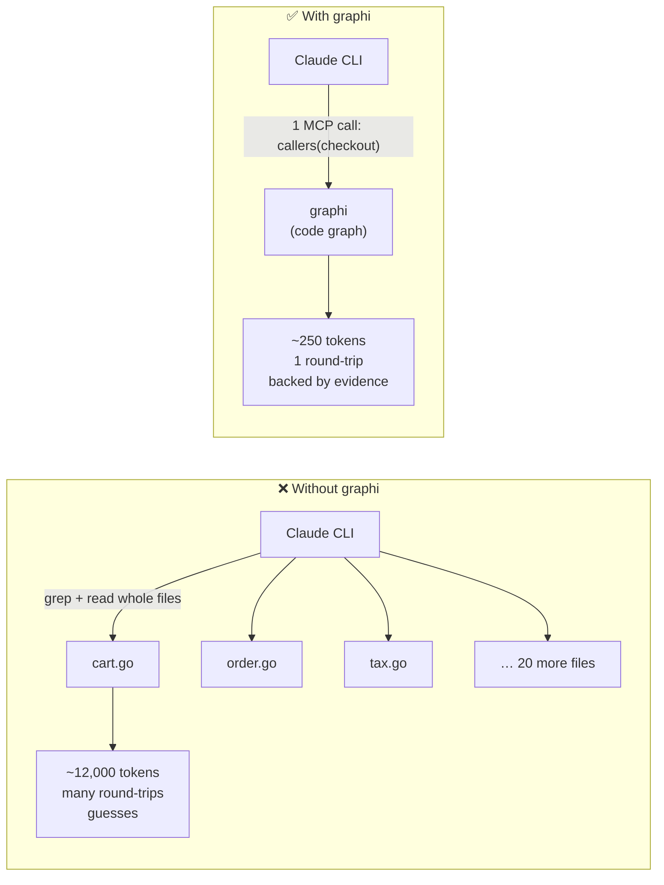
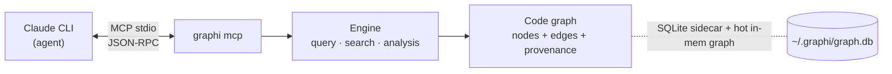
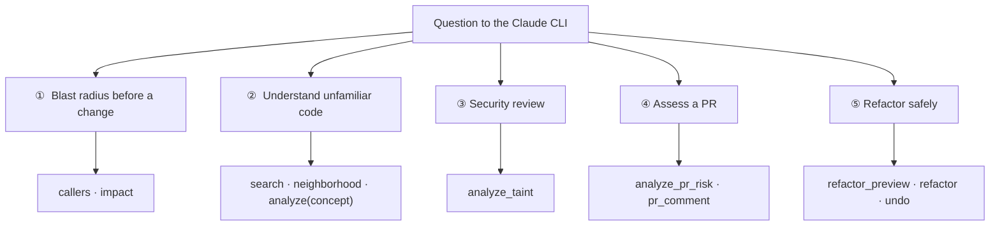

# Tutorial: graphi with the Claude CLI as the agent

> Example repository: **this repo (`samibel/graphi`)**. Agent: **Claude CLI** (`claude`).
> Goal: understand *why* graphi helps an AI agent — and use it yourself in ~2 minutes.

A companion, detailed visualization lives next to this file as an Excalidraw diagram:
[`graphi-claude-flow.excalidraw`](graphi-claude-flow.excalidraw) (open it in [excalidraw.com](https://excalidraw.com) → *Open*).

---

## 1. The problem (why an agent is slow without graphi)

When the Claude CLI has to answer a question like *"Who calls `checkout`, and what breaks if I change it?"*, without graphi it must **grep and read whole files**. That is slow, expensive (many tokens), and unreliable — it *guesses* from whatever it happened to read.



**The core idea:** graphi parses the repo **once** into a deterministic **code graph** — nodes are symbols (functions, types, files), edges are relationships (`calls`, `references`, `defines`, `imports`). Every agent question becomes **one** targeted graph lookup instead of a reading tour through half the repo.

---

## 2. The advantage in one sentence

> **graphi gives the Claude CLI exact, evidence-backed answers across the whole repo in a single call — locally, in under 100 ms, with far fewer tokens.**

Five concrete advantages:

| Advantage | What it means for the agent |
|---|---|
| **Fewer tokens** | Instead of reading whole files, only the relevant symbol + evidence comes back. graphi even keeps a **USD savings ledger** (`savings`). |
| **Exact, not guessed** | A deterministic graph with stable IDs — no probabilistic RAG. |
| **Trustworthy** | Every edge carries **provenance**: a `confidence_tier` (heuristic/derived/confirmed) + a reason + evidence (`file.go:line`). |
| **Fast & fresh** | A hot daemon-resident graph, cold-start P95 < 100 ms, incremental freshness ≤ 2 s. |
| **Local-first** | Not a byte leaves the machine: zero outbound network, no telemetry, CGo-free, a single binary. |

---

## 3. Setup: connect graphi to the Claude CLI

graphi talks to agents over **MCP (stdio)**. One command is enough — it registers graphi into the Claude config idempotently, atomically, and offline.

```bash
# 1) Build graphi (CGo-free, a single binary)
CGO_ENABLED=0 go build -o graphi ./cmd/graphi

# 2) Build a queryable graph of this repo (persistent SQLite db)
mkdir -p ~/.graphi
./graphi http -db ~/.graphi/graph.db -root . -addr 127.0.0.1:8080
#   wait for "listening …", then Ctrl-C — the db is now built.

# 3) Register graphi as an MCP server in the Claude CLI
./graphi setup
#   → writes the stdio MCP entry into ~/.claude.json and prints the path.

# 4) Restart claude — graphi's tools are now visible.
```

How it fits together:



> For non-Claude MCP clients: start the server directly with `./graphi mcp -db ~/.graphi/graph.db`.

---

## 4. How a single call works

Example: Claude wants to know who calls `checkout`.

```mermaid
sequenceDiagram
    participant U as You
    participant C as Claude CLI
    participant G as graphi (MCP)
    participant Gr as Code graph

    U->>C: "What breaks if I change checkout?"
    C->>G: tools/call callers { symbol: "shop/cart.checkout" }
    G->>Gr: look up incoming calls edges
    Gr-->>G: [order.place, api.handleCheckout] + evidence
    G-->>C: symbols + tier/reason/evidence (few tokens)
    C->>G: tools/call impact { symbol: "shop/cart.checkout", direction: "reverse" }
    G-->>C: blast radius (all dependent symbols)
    C-->>U: "checkout is used in 2 places; blast radius: …"
```

The answer carries **provenance**, e.g.:

```
checkout —calls→ price     tier: derived     evidence: shop/cart.go:42
```

So the agent (and you) can *trust* the answer instead of believing it.

---

## 5. The toolbox (what Claude gets)

All tools are read-only by default. Real MCP tool names, grouped:

- **Structure:** `callers`, `callees`, `references`, `definition`, `neighborhood`
- **Search:** `search`, `search_semantic`
- **Analysis:** `impact`, `analyze_taint`, `analyze_pdg`, `analyze_interproc`, `analyze_contracts`, `analyze_githistory`
- **PR review:** `analyze_pr_risk`, `analyze_pr_signals`, `analyze_pr_questions`, `pr_comment`
- **Edit (opt-in) & readout:** `refactor_preview`, `refactor`, `undo`, `savings`

---

## 6. Use cases (on this repo)

Each use case = what you tell Claude → which tool fires → why it helps.



### ① "What breaks if I change this?" — blast radius
> **Prompt to Claude:** *"I want to rework `engine/ingest.IngestAll`. What depends on it?"*
> Claude calls `callers` + `analyze` (with `analyzer: "impact"` and `direction: "reverse"`) → gets **all** dependent symbols across the repo, with evidence. No guessing, no reading half the repo.

### ② "Where is X handled?" — understand unfamiliar code
> **Prompt:** *"Where is the cross-file linker triggered in this repo?"*
> Claude uses `search` + `neighborhood` (and `analyze` with the `concept` analyzer) → lands directly on `engine/link` and `engine/ingest/ingest.go` instead of clicking through folders.

### ③ Security review — taint analysis
> **Prompt:** *"Is there a path from an input source to a dangerous sink?"*
> Claude calls `analyze_taint` → flow-sensitive source→sink paths with sanitizer detection. (graphi even keeps a labeled corpus with a 100%-recall CI gate for this.)

### ④ PR review as a graph problem
> **Prompt:** *"How risky is this diff, and which questions should I ask?"*
> Claude calls `analyze_pr_risk` / `analyze_pr_signals` / `analyze_pr_questions` → a risk-scored diff with hub/bridge/surprise signals; `pr_comment` posts a sticky comment + merge gate.

### ⑤ Refactor safely
> **Prompt:** *"Rename `price` to `cost` — across all call sites."*
> Claude calls `refactor_preview` (shows the plan) → `refactor` (atomic saga with rollback) → `undo` if needed. Full-vs-incremental stays byte-identical.

---

## 7. The "wow" moment: the USD savings ledger

graphi measures, per call, how many tokens it saved versus the "read whole files" baseline, prices it with an **embedded** price table (no network), and keeps a durable ledger — even across daemon restarts:

```bash
./graphi savings
# →  ⚡  Saved $0.42 this session  (cumulative $3.10)
```

It is concrete, honest (the baseline is versioned/auditable), and unique.

---

## 8. The guarantee (local-first, provable)

```bash
./graphi privacy-audit
# CONFIRMED → zero outbound network traffic observed
```

Zero outbound network · no telemetry · no accounts · CGo-free default build · a single static binary · all servers loopback-only. Enforced in CI by an egress-denied canary.

---

## Summary

graphi turns "the agent reads through the repo" into "the agent asks the graph": **one call, few tokens, an evidence-backed answer, under 100 ms, all local.** Setup is a single command (`graphi setup`), and the USD savings ledger makes the value visible right away.

> Visualization: [`graphi-claude-flow.excalidraw`](graphi-claude-flow.excalidraw)
