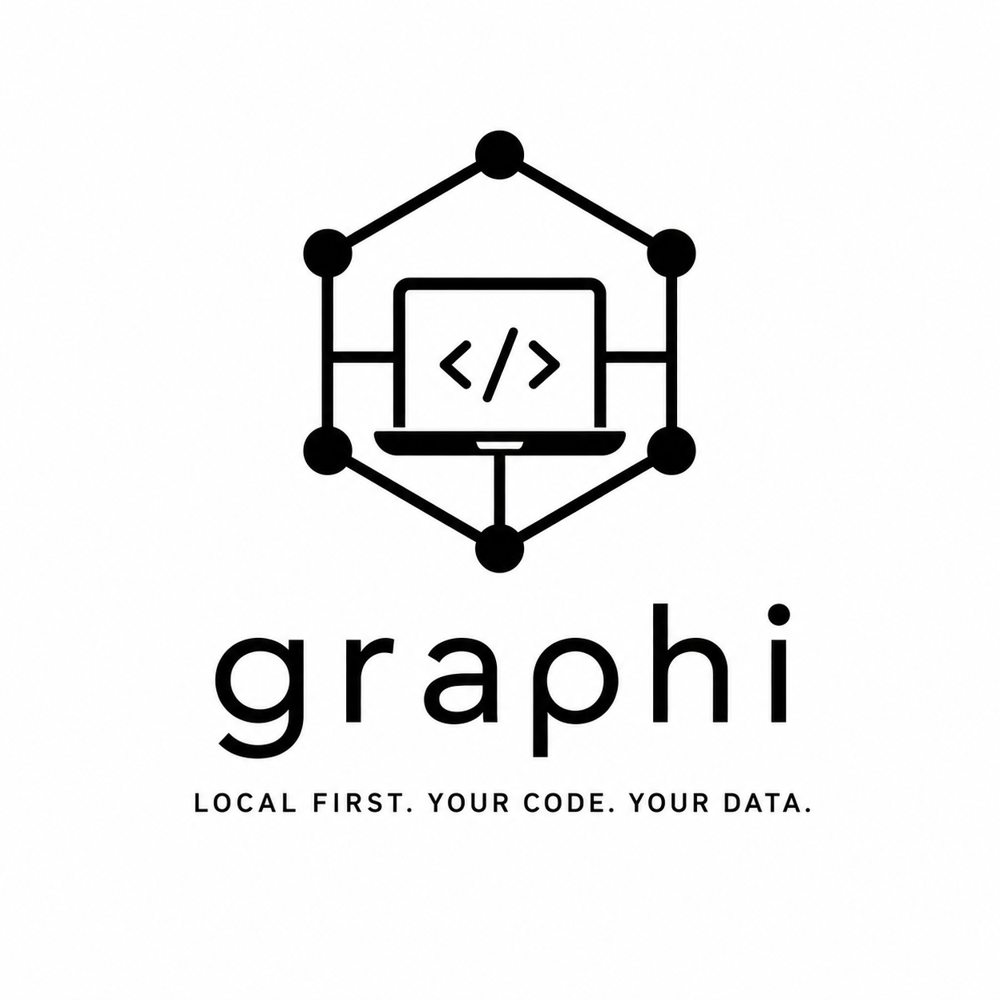
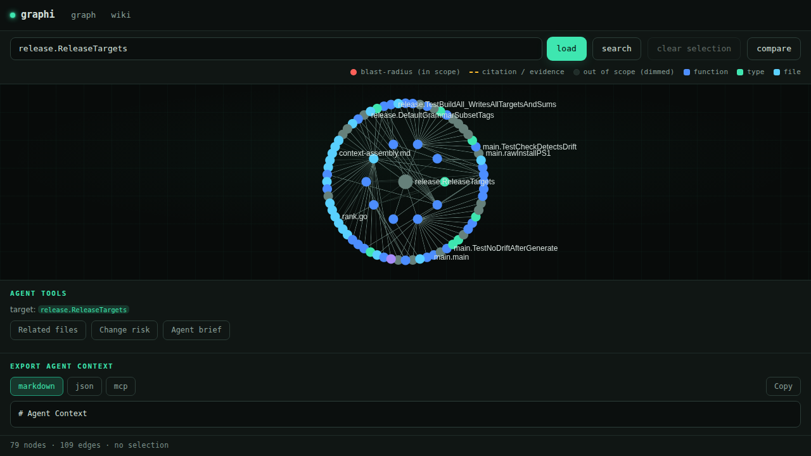
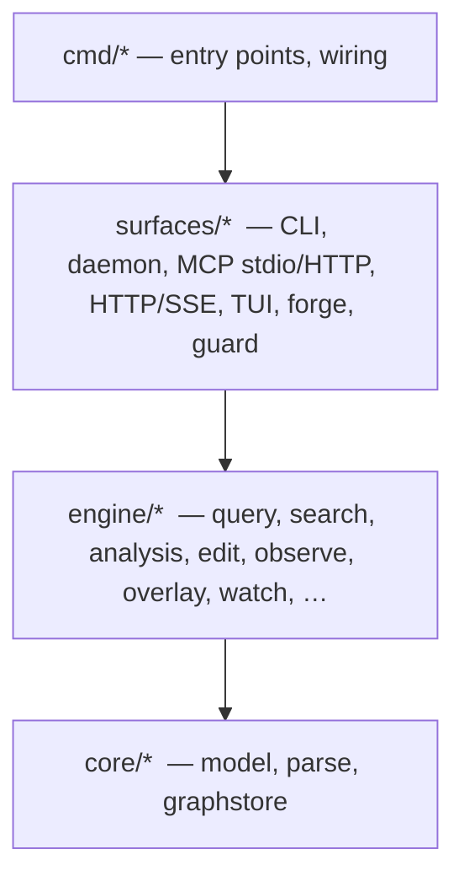

<p align="center">
  
</p>

<h1 align="center">graphi</h1>

> Local-first, CGo-free code-intelligence engine. Parse a repository into a deterministic, provenance-backed code graph and answer structural and semantic questions over an agent-first **MCP (stdio)** + **CLI** surface — without a single byte leaving your machine.

[](#the-local-first-contract)
[](#the-local-first-contract)
[](#license)

An AI coding agent that greps and re-reads your whole codebase on every question
is slow, expensive, and still guessing. graphi indexes the repo once into a
graph — symbols as nodes, calls/references/imports as edges — and answers
"who calls this," "what breaks if I change it," and "how are these two
functions connected" in one round-trip, entirely on your machine. Structural
answers cover the symbols your repo defines: stdlib and third-party targets
are recorded, but deliberately not navigable (see
[docs/external-nodes.md](docs/external-nodes.md)).

## Quick start

**Step 1 — install.** One line, checksum-verified, no sudo (installs the prebuilt
CGo-free binary to `~/.local/bin`):

```bash
curl -fsSL https://raw.githubusercontent.com/samibel/graphi/main/install.sh | sh
```

On Windows, use the PowerShell installer instead:

```powershell
iwr -useb https://raw.githubusercontent.com/samibel/graphi/main/install.ps1 | iex
```

**Step 2 — run it in your repo.**

```bash
cd your-repo && graphi
```

Your browser opens with the interactive code graph (on a headless box, or with
`--no-browser` / `GRAPHI_NO_BROWSER`, graphi prints the local URL instead).
Click any node to see its blast radius: impacted symbols light up red, the
evidence-bearing edges amber — while the agent-context export fills with the
selection.

<p align="center">
  
</p>

### Everyday use

```bash
# Short verbs over the symbol under your cursor
graphi callers <symbol>      # who calls it
graphi impact  <symbol>      # what a change to it affects
graphi ui                    # explicitly serve the graph + open the browser
graphi claude                # wire graphi into Claude Code (MCP)
graphi setup                 # wire every detected local MCP client (Claude Code, Copilot, Cursor, Windsurf, Claude Desktop)

# Update to the latest release (user-initiated; never automatic)
graphi upgrade
```

## Measured, not asserted

graphi's headline results come from before/after field tests against a
known-vulnerable Go app and an 11.7k-file monorepo. Every row of the
[Real-World Report Card](docs/real-world-report.md) names the command that
reproduces it:

| Metric | Before | After |
|---|---|---|
| Taint recall (vuln-go; taint is a Labs analyzer) | **0/4**, silent all-clear | **5/5**, 0 false positives |
| Import edges per node (11.7k-file monorepo) | 15.56 (→ 4.27M edges) | **0.96** |
| Storage bytes per edge | ~500 (→ 2.3 GB) | **226.7** |
| False "dead symbol" warnings on entry points | very many | **0** |

The internal release gate (≥ 90 overall, no area below 80, published with
`"self_reported": true`) is a self-measured, in-repo quality ratchet — **not**
an independent rating, and no faster-or-more-accurate-than-competitor claim is
made anywhere. Checked-in run evidence lives under
[docs/eval/runs/](docs/eval/runs).

## What is GA (and what is not)

graphi's supported surface is deliberately narrow.
**[`docs/stability-tiers.md`](docs/stability-tiers.md) is the single canonical
definition** of the GA / Preview / Labs / Source-only tiers; this is the summary.

**GA — the entire promise:**

- **12 frozen operations:** `index`, `search`, `definition`, `callers`, `callees`,
  `references`, `neighborhood`, `impact`, `agent_brief`, `related_files`,
  `explain_symbol`, `change_risk`.
- **Go only.** Go is the only GA language.
- **CLI + MCP stdio only**, in the CGo-free default binary.

**Not GA:** every other language is **Preview** (shipped and usable, unproven);
HTTP/SSE, the daemon, web UI, TUI, VS Code extension, GitHub Action, refactorings,
taint, agent memory and semantic search are **Labs** (opt-in: `graphi mcp -labs`,
`GRAPHI_HTTP_LABS=1`); the wiki is Source-only. **SaaS does not exist** — nothing
is hosted, there is no service to sign up for.

**Known limits, by design:**

- **External calls are not navigable.** Calls into the stdlib or third-party
  packages are recorded as interned external nodes (visible to the taint
  analyzer) but excluded from callers/callees/references/impact — graphi does
  not claim call-graph coverage over code it has not indexed.
  See [docs/external-nodes.md](docs/external-nodes.md).
- **Cross-file edges are heuristic-tier** for Preview languages; Go alone
  additionally gets type-checker-`confirmed` edges.

> In the machine-checked [coverage matrix](docs/coverage-matrix.md) the `tier`
> column answers a different question ("is this one of the 12 frozen
> operations?"), so parser and surface rows read `labs` despite being the GA
> scope — see the note in the matrix itself.

## When to use graphi — and when not

**Use graphi if:**

- you want an MCP-compatible code-graph backend that runs **on the user's
  machine** with zero outbound network — no accounts, no telemetry, no cloud
  indexer;
- your codebase must not leave the machine (compliance, data-residency,
  air-gapped CI);
- you want one CGo-free static binary that drops into any environment.

**Use something else if:**

- you need deep dataflow/taint analysis **across external libraries** — use
  CodeQL;
- you need thousands of ready-made security rules — use Semgrep;
- you need cross-repository code search over an enterprise monorepo estate —
  use Sourcegraph.

graphi's niche is fast, local, structural ground truth for agents and
developers — it does not try to replace those tools.

## Language support

**Go is GA; 21 further languages ship as Preview** (TypeScript/JSX, JavaScript,
Python, Java, Kotlin, C#, C, C++, Rust, Ruby, PHP, Lua, Bash, SQL, JSON, CSS,
YAML, TOML, Markdown, HCL); HTML is deferred. The full per-language table —
which node kinds, which edge tiers, and how cross-file resolution works
language by language — is in
[docs/language-support.md](docs/language-support.md). An opt-in CGO flavor
(`graphi-broad`) opens the go-sitter-forest grammar seam for trusted input;
see [docs/graphi-broad.md](docs/graphi-broad.md) including its security
warning.

## Semantic search (optional, OFF by default)

The default binary ships **no embedder** and makes zero non-loopback network
calls; `graphi search -semantic` degrades gracefully to a typed "unavailable"
response until you explicitly opt in (local Ollama endpoint or an opt-in ONNX
build). Setup and the guarantees that hold either way:
[docs/semantic-search.md](docs/semantic-search.md).

## The local-first contract

| Guarantee | What it means for you |
|---|---|
| **Zero outbound network** | The engine makes no non-loopback network calls. Your code stays on disk. |
| **No telemetry** | Nothing is reported anywhere — no usage data, no phone-home. |
| **No accounts, no external services** | A single static binary; nothing to sign up for. |
| **CGo-free default build** | Builds anywhere Go does, with no C toolchain required. |
| **Single static binary** | One self-contained executable, easy to drop into any environment. |

The Stable default tier runs with no accounts and no outbound network access.
Explicitly configured Labs/forge or embedder features may contact their
configured service; they are not part of that default claim. The proof is
runnable: `graphi privacy-audit`.

## Subcommands (the short list)

| Command | Tier | What it does |
|---|---|---|
| `graphi` | labs | Zero-config: index the current repo and open the web UI |
| `graphi index -root <repo>` | **GA** | Build/refresh the durable graph store |
| `graphi callers\|callees\|references\|definition\|neighborhood <symbol>` | **GA** | Structural queries |
| `graphi impact <symbol>` | **GA** | Blast radius of a change (in-repo) |
| `graphi search <query>` | **GA** | Lexical / symbol search |
| `graphi agent-brief` · `explain-symbol` · `related-files` · `change-risk` | **GA** | Cited agent-context operations |
| `graphi mcp` | **GA** | MCP stdio server (the agent-first surface) |
| `graphi setup` | labs | Wire graphi into local MCP clients |
| `graphi analyze <analyzer>` | labs | Deep analyzers (taint, pdg, call-chain, …) |
| `graphi daemon` · `http` · `tui` | labs | Hot-index daemon, loopback HTTP/SSE, terminal UI |
| `graphi upgrade` | labs | Update to the latest release (never automatic) |

Every subcommand with flags and tier tags: [docs/cli-reference.md](docs/cli-reference.md)
or `graphi help`.

## Architecture



- **One engine, many surfaces.** Every surface (CLI, daemon, MCP stdio, HTTP/SSE)
  shares the same `surfaces/client.Client` — no surface holds query logic of its
  own, so they cannot diverge.
- **Layered by direction** (CI-enforced): lower layers never depend on higher
  ones; `core/parse` and `core/graphstore` are pure leaves.
- **Data flow:** source repo → incremental ingest → graphstore (hot in-memory
  graph + durable SQLite sidecar) → query / search / analysis → surfaces.

Full design: [docs/architecture-plan.md](docs/architecture-plan.md).

## Documentation

| Doc | What it is |
|---|---|
| [docs/HOWTO.md](docs/HOWTO.md) | Install, build from source, index a repo, use every surface |
| [docs/stability-tiers.md](docs/stability-tiers.md) | **Canonical** GA / Preview / Labs / Source-only definition |
| [docs/real-world-report.md](docs/real-world-report.md) | The honest before/after field-test record |
| [docs/FEATURES.md](docs/FEATURES.md) | Complete catalogue: every MCP tool, subcommand, endpoint, analyzer |
| [docs/coverage-matrix.md](docs/coverage-matrix.md) | Machine-checked capability inventory (drift breaks the build) |
| [docs/](docs/) | Documentation map and deeper subsystem docs |

## License

Licensed under the [Apache License 2.0](./LICENSE). Third-party attributions are
listed in [`NOTICE`](./NOTICE) — note that the optional `graphi-broad` flavor links
go-sitter-forest grammars under their own upstream licenses.
