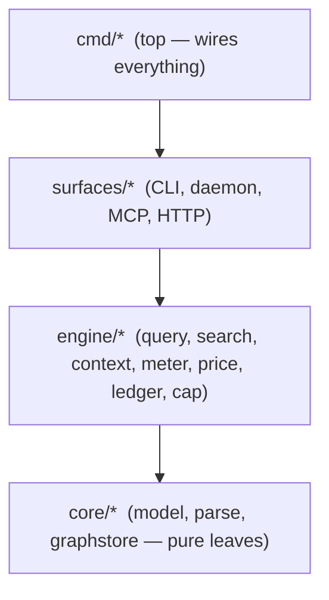

# graphi

> Local-first, CGo-free code-intelligence engine. Parse source into a deterministic, provenance-backed graph and answer structural questions over an agent-first **MCP (stdio)** + **CLI** surface — without a single byte leaving your machine.

[](docs/ci/cgo-conformance.md)
[](docs/ci/egress-canary.md)
[](#license)

---

## What is graphi?

`graphi` is a code-intelligence engine you run entirely on your own machine. It parses a repository into a canonical code graph (nodes = symbols, edges = calls/references/definitions), keeps it hot in a daemon, and answers structural questions — *who calls this? where is X defined? what references Y?* — in one round-trip instead of grepping and reading whole files.

Every edge carries **provenance**: a `confidence_tier` (heuristic / derived / confirmed), a `reason`, and `evidence`, plus a deterministic `xxhash64` id — so callers can trust each relationship rather than guessing.

It is built for AI coding agents (Aria) and builders (Devon) who want a stable, read-only graph backend they can query without owning parsing or indexing, and for privacy-sensitive self-hosters (Sam) who need to *prove* nothing leaves the machine.

## The local-first contract

These are not aspirations — they are **CI-enforced**:

| Guarantee | How it's enforced |
|---|---|
| **Zero outbound network** | Hermetic egress-denied canary runs the whole surface under network denial and asserts zero non-loopback packets ([`docs/ci/egress-canary.md`](docs/ci/egress-canary.md)). |
| **No telemetry** | Zero-telemetry gate fails CI on any outbound call in the default build. |
| **No accounts, no required external services** | Single static binary; nothing to sign up for. |
| **CGo-free default build** | `CGO_ENABLED=0` build conformance gate is green ([`docs/ci/cgo-conformance.md`](docs/ci/cgo-conformance.md)). |
| **Single static binary < 50 MB** | Size budget pinned and regression-gated ([`docs/ci/bench.md`](docs/ci/bench.md)). |

License: **Apache-2.0**.

## Architecture

`graphi` is a layered `go.work` monorepo with a **mechanically enforced** dependency direction:



- **Rule:** `cmd → surfaces → engine → core`. Lower layers may never import higher ones; `core/parse` and `core/graphstore` are pure leaves.
- **Enforcement:** the rule is not just documented — [`internal/layerguard`](internal/layerguard) parses the import graph and fails CI on any upward/sideways edge (story SW-013). Same-layer `engine → engine` imports (e.g. the context engine consuming the search layer) are allowed and verified.
- **One engine, four surfaces:** a single `Engine` runtime serves the CLI, the Unix-socket daemon, the MCP stdio server, and HTTP — no surface holds query/search logic of its own.

**Data flow:** source repo → incremental ingest pipeline (content-hash, worker-pool) → graphstore (hot in-memory memgraph + SQLite durable sidecar with WAL/FTS5) → query / search / context-shaping + savings ledger → surfaces.

> Headline metric note: graphi's target is **~50× fewer tokens** than a file-reading agent. This figure is **eval-gated** — it must be validated by the independent token-parity harness in [`docs/ci/eval.md`](docs/ci/eval.md) before any public claim. Until then, treat it as a *target pending validation*, not a proven number.

## What's been built (EP-001 – EP-003)

The three foundational epics are the spine of the project. Their stories are at the **`approved` human gate** (pending `/scrum-approve` to transition to `done`) — not yet "shipped" or "released".

### EP-001 — Foundation Engine (Parse → Graph → Query → Search)
*Stories SW-001 … SW-007 · status: `in-progress`*

The deterministic, provenance-backed code-intelligence spine everything else builds on.

- Curated **CGo-free tier-1 parser set** + pluggable parser registry ([`docs/parse-registry.md`](docs/parse-registry.md), [`docs/adr/0001-parser-tier1-and-sizing.md`](docs/adr/0001-parser-tier1-and-sizing.md)).
- Canonical **node/edge model** with `xxhash64` ids and `confidence_tier` + `reason` + `evidence` on every edge.
- **Graphstore:** in-memory hot memgraph + SQLite (WAL/FTS5) durable sidecar + snapshot/load; pluggable backend.
- **Structural query API:** callers / callees / references / definition / neighborhood.
- **Lexical/symbol search** over SQLite FTS5.
- **Incremental ingest** with content-cache + dirty-flag (freshness ≤ 2 s target; full-vs-incremental graphs byte-identical).
- **Daemon** (Unix socket) + **MCP stdio** + **CLI** surfaces (cold-start P95 < 100 ms target).

### EP-002 — Local-First Trust, DevOps & Eval Harness
*Stories SW-008 … SW-013 · status: `in-progress`*

Makes the two core promises — *local-first by contract* and *token efficiency* — **provable, not claimed**.

- **Hermetic egress-denied canary** + **zero-telemetry gate** ([`docs/ci/egress-canary.md`](docs/ci/egress-canary.md)).
- **CGo-free build conformance** gate ([`docs/ci/cgo-conformance.md`](docs/ci/cgo-conformance.md)).
- **Budget-gated benchmarks** (cold-start P95, full-index, freshness, binary size) vs pinned baselines — CI fails on regression ([`docs/ci/bench.md`](docs/ci/bench.md)).
- **Savings-ledger audit suite** — frozen baseline, independent recompute, anti-gaming cap, cross-restart integrity, local-only price table ([`docs/ci/ledgeraudit.md`](docs/ci/ledgeraudit.md)).
- **Token-parity eval harness** + per-capability coverage matrix that gates the public ~50× claim ([`docs/ci/eval.md`](docs/ci/eval.md)).
- **Workspace CI**, **layer-direction enforcement**, and **reproducible release packaging** of the single static binary ([`docs/ci/release.md`](docs/ci/release.md)).

### EP-003 — Token-Savings Ledger & Token-Efficient Context
*Stories SW-016 … SW-020 · status: `delivered` (awaiting approve→done)*

Delivers the headline "It saved me $X this session" — token efficiency as a first-class subsystem.

- **SW-016** — Winnowed, citation-backed **context assembly**: ranked, budget-bounded evidence snippets instead of whole files ([`docs/context/context-assembly.md`](docs/context/context-assembly.md)).
- **SW-017** — Per-call **token metering** against a frozen, version-stamped baseline ([`docs/meter/metering.md`](docs/meter/metering.md)).
- **SW-018** — Local, version-stamped **USD price table** + deterministic savings computation ([`docs/price/pricing.md`](docs/price/pricing.md)).
- **SW-019** — Cross-restart **ledger persistence** with durable cumulative rollup + torn-write recovery ([`docs/ledger/persistence.md`](docs/ledger/persistence.md)).
- **SW-020** — **Anti-gaming cap** + honest MCP/CLI ledger readout ("Saved $X this session") ([`docs/savings/cap-readout.md`](docs/savings/cap-readout.md)).

> Epics EP-004 – EP-008 (semantic/impact analysis, taint/PDG, contracts, HTTP/SSE, web/TUI/VS Code) are planned but **not yet delivered** and are intentionally out of this README's scope.

## Build & run

### Prerequisites
- **Go 1.26**+
- No C toolchain required (the default build is CGo-free).

### Build

```bash
# Canonical CGo-free build of the whole workspace
CGO_ENABLED=0 go build ./...

# Verify the layer-direction contract is intact (CI does this too)
CGO_ENABLED=0 go run ./cmd/layerguard
```

### Subcommands

The single `graphi` binary dispatches these subcommands (each takes optional `-db <path>` for a SQLite store or `-daemon <socket>` to talk to a hot daemon):

| Subcommand | Purpose |
|---|---|
| `graphi query <op> -symbol <id> [-depth N]` | Structural query. `<op>` ∈ `callers \| callees \| references \| definition \| neighborhood`. |
| `graphi search [-limit N] <query>` | Lexical/symbol search over FTS5. |
| `graphi mcp` | Run the MCP **stdio** server (the agent-first surface). |
| `graphi daemon start\|stop\|status [-socket path] [-db path]` | Manage the hot-index Unix-socket daemon. |
| `graphi savings [-ledger path]` | Print the savings-ledger readout: "Saved $X this session" + per-call + cumulative (anti-gaming-capped). |
| `graphi version` | Print the version/commit/date stamped into the binary. |
| `graphi parse <file>` | Parse a single file (default if no subcommand is given). |

Examples:

```bash
# Start the daemon over an in-memory store
graphi daemon start -socket /tmp/graphi.sock

# Ask "who calls this symbol?" over the daemon
graphi query callers -symbol p.MyFunc -daemon /tmp/graphi.sock

# Run the MCP stdio server (point your MCP client at this binary)
graphi mcp -db ~/.graphi/graph.db

# Read the savings ledger
graphi savings -ledger ~/.graphi/ledger.jsonl
```

## Documentation

Deeper docs live under [`docs/`](docs/) — the README links rather than duplicates them:

- **Decisions:** [`docs/adr/0001-parser-tier1-and-sizing.md`](docs/adr/0001-parser-tier1-and-sizing.md)
- **CI gates:** [`egress-canary`](docs/ci/egress-canary.md), [`cgo-conformance`](docs/ci/cgo-conformance.md), [`bench`](docs/ci/bench.md), [`eval`](docs/ci/eval.md), [`ledgeraudit`](docs/ci/ledgeraudit.md), [`release`](docs/ci/release.md)
- **Capabilities:** [`parse-registry`](docs/parse-registry.md), [`context-assembly`](docs/context/context-assembly.md), [`metering`](docs/meter/metering.md), [`pricing`](docs/price/pricing.md), [`ledger-persistence`](docs/ledger/persistence.md), [`cap-readout`](docs/savings/cap-readout.md)

## Why these decisions

- **Local-first, enforced not promised.** Privacy and trust are load-bearing for graphi's users; a CI-gated egress canary + CGo-free gate make "nothing leaves your machine" a verifiable property, not marketing. See EP-002.
- **CGo-free default.** A single static binary that builds anywhere Go does, with no C toolchain dependency — the easiest possible install for agents and IDEs. (An opt-in `graphi-broad` CGO build with the full 257-grammar set is a separate track.)
- **Provenance on every edge.** Code graphs are only useful if you can trust them; `confidence_tier` + `reason` + `evidence` + deterministic ids let callers weight each relationship rather than treat the graph as ground truth.
- **Token efficiency as a first-class subsystem.** The whole point for an agent user is spending far fewer tokens than reading whole files — but the savings claim is held behind an eval gate until EP-002 proves it, so the number is honest when it lands.

## Status

| Epic | Stories | Status |
|---|---|---|
| EP-001 Foundation Engine | SW-001…SW-007 | `in-progress` — stories at the `approved` human gate |
| EP-002 Local-First Trust / DevOps / Eval | SW-008…SW-013 | `in-progress` — stories at the `approved` human gate |
| EP-003 Token-Savings Ledger & Context | SW-016…SW-020 | `delivered` — awaiting `/scrum-approve` → `done` |

All listed stories have passed their verify + review gates under `CGO_ENABLED=0`; none have been signed off to `done` yet.

## License

Apache-2.0.
