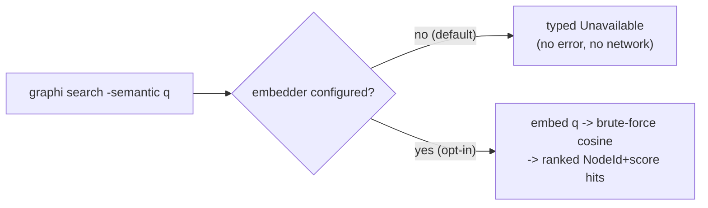
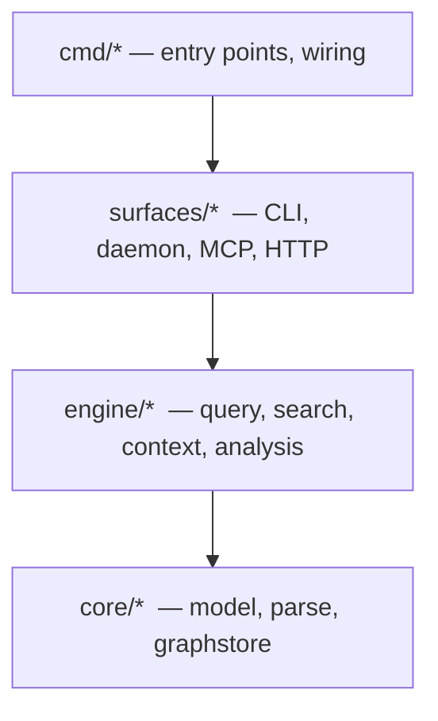

# graphi

> Local-first, CGo-free code-intelligence engine. Parse a repository into a deterministic, provenance-backed code graph and answer structural and semantic questions over an agent-first **MCP (stdio)** + **CLI** surface — without a single byte leaving your machine.

[](#advanced--from-source)
[](#the-local-first-contract)
[](#license)

---

## Quick start (2 steps)

**Step 1 — install.** One line, checksum-verified, no sudo (installs the prebuilt
CGo-free binary to `~/.local/bin`):

```bash
curl -fsSL https://raw.githubusercontent.com/samibel/graphi/main/install.sh | sh
```

On Windows, use the PowerShell installer instead:

```powershell
iwr -useb https://raw.githubusercontent.com/samibel/graphi/main/install.ps1 | iex
```

**Step 2 — run it in your repo.**

```bash
cd your-repo && graphi
```

Your browser opens with the interactive code graph, plus a "Saved $X this session"
savings readout. On a headless box / over SSH (or with `--no-browser` /
`GRAPHI_NO_BROWSER`), graphi prints the local URL instead of opening a browser.

<!-- TODO: screenshot/GIF of the graph UI -->

### Everyday use

```bash
# Short verbs over the symbol under your cursor
graphi callers <symbol>      # who calls it
graphi impact  <symbol>      # what a change to it affects
graphi ui                    # explicitly serve the graph + open the browser
graphi claude                # wire graphi into Claude Code (MCP)
graphi setup                 # wire every detected local MCP client (Claude Code, Copilot, Cursor, Windsurf, Claude Desktop)

# Update to the latest release (user-initiated; never automatic)
graphi upgrade
```

Other ways to install:

```bash
# Homebrew (macOS / Linux) — from the shipped formula (or a future samibel/homebrew-tap)
brew install --formula packaging/homebrew/graphi.rb

# Developer fallback (builds from source via the Go toolchain)
go install github.com/samibel/graphi/cmd/graphi@latest
```

```powershell
# Scoop (Windows) — from the shipped manifest (or a future bucket)
scoop install packaging/scoop/graphi.json
```

The bundled release embeds the web UI (no Node needed). A plain `go build` from
source shows a notice page instead of the UI — see
[Advanced / from source](#advanced--from-source).

---

## What is graphi?

`graphi` is a code-intelligence engine you run entirely on your own machine. Point it at a repository and it parses the source into a canonical **code graph** — nodes are symbols (functions, types, files), edges are the relationships between them (calls, references, definitions). It keeps that graph hot in a background daemon and answers questions about your codebase in a single round-trip instead of grepping and reading whole files:

- *Who calls this function? What does it call?*
- *Where is this symbol defined? What references it?*
- *If I change this, what else is affected?*
- *How do two functions connect? Which symbols are the riskiest hubs?*

Every relationship in the graph carries **provenance** — a confidence tier (heuristic / derived / confirmed), a reason, and supporting evidence — so you can trust each edge rather than guess at it.

graphi is built for two audiences:

- **Developers** who want fast, structural answers about an unfamiliar or large codebase, on the command line.
- **AI coding agents** that need a stable, read-only graph backend to query over MCP — without owning parsing or indexing themselves, and without sending code to a third party.

Everything runs locally. No accounts, no telemetry, no network calls.

## Capabilities

graphi grows from a structural core into semantic and deep analysis. Each capability is queryable today through the CLI and the MCP server.

### Core code graph

- **Parse to graph** — turn a repository into a canonical node/edge model with deterministic ids and provenance on every edge.
- **Structural queries** — callers, callees, references, definition, and neighborhood for any symbol.
- **Lexical & symbol search** — fast full-text search across symbols and source.
- **Semantic search (optional, OFF by default)** — embedding-based search that is **off until you explicitly configure an embedder**; the default binary ships **no embedder** and degrades gracefully (see [Semantic search](#semantic-search-optional-off-by-default)).
- **Incremental indexing** — only changed files are re-parsed; the graph stays fresh as you edit.
- **Hot daemon** — keep the index in memory and query it over a local Unix socket for instant responses.

#### Language support

The parser registry is open/closed — languages plug in behind a stable seam
without touching existing code.

**Default tier (CGo-free, shipped binary).** Two stdlib parsers plus **20**
subset-tagged pure-Go `gotreesitter` grammars. The shipped default is built with
`-tags 'grammar_subset grammar_subset_<lang> …'`
([`internal/release.DefaultGrammarSubsetTags`](internal/release/build.go)) so only
these languages' grammar blobs are embedded — never the all-206 default embed.

| Language | Symbol nodes | Intra-file edges | Cross-file/package edges |
|---|---|---|---|
| **Go** | ✅ func / method / type / var / const / file | ✅ `defines`, `calls`, `references` | ✅ `calls` / `references` / `imports` (linker pass, heuristic tier) ¹ |
| JSON | structural (AST) | — | — |
| TypeScript · TSX/JSX · JavaScript | ✅ symbol nodes | ✅ intra-file | ✅ `calls` / `references` / `imports` (per-language resolver, heuristic tier) ² |
| **Python** | ✅ symbol nodes | ✅ intra-file | ✅ `calls` / `references` / `imports` (per-language resolver, heuristic tier) ² |
| Ruby · PHP · Lua | ✅ symbol nodes | ✅ intra-file | ✅ `calls` / `references` / `imports` (per-language resolver, heuristic tier) ² |
| Java · Kotlin · C# | ✅ symbol nodes | ✅ intra-file | ✅ `calls` / `references` / `imports` (per-language resolver, heuristic tier) ² |
| C · C++ · Rust | ✅ symbol nodes | ✅ intra-file | ✅ `calls` / `references` / `imports` (per-language resolver, heuristic tier) ² |
| Bash/Shell | ✅ symbol nodes | ✅ intra-file | ✅ `calls` / `imports` (per-language resolver, heuristic tier) ² |
| SQL | ✅ symbol nodes | ✅ intra-file | — (no provable cross-file refs at this tier; resolver skips+counts) ² |
| CSS · YAML · TOML · Markdown · HCL/Terraform | ✅ symbol nodes | ✅ intra-file | ⏳ per-language resolver (roadmap) ² |

> ¹ The cross-file / cross-package **linker pass** ([`engine/link`](engine/link), FU-1) is
> wired into ingest and resolves Go references against the fully-committed node set:
> same-package cross-file bare-ident calls/refs (`derived` tier) and cross-package
> selector calls (`pkg.Fn`, `recv.Method`) plus file→file `imports` (`heuristic` tier,
> with file:line evidence). It preserves the byte-identical full-vs-incremental invariant
> and the rename/move cascade. The linker is **never** `confirmed`: unresolved or ambiguous
> references are dropped deterministically, never fabricated.
>
> ² Intra-file extraction ships for every language above. FU-5 adds one per-language
> cross-file resolver (`resolve_<lang>.go`) over the same `engine/link` registry seam
> (Open/Closed — a new language is a new `Register` call in `link.New()`, never an edit
> to an existing resolver). Ingest dispatches the linker per language. **Shipped:**
> Go; **TypeScript family** (relative ESM imports, named/namespace bindings; non-relative/
> aliased specifiers and `tsconfig` paths are external → skipped — no path-mapping);
> **Python · Rust · Java · Kotlin** (clause-keyed module/FQN resolution — Python dotted
> modules, Rust `::` paths, Java/Kotlin FQNs key on their package segment); **C#**
> (`using` namespaces as ambient clauses); **C · C++** (`#include` translation units —
> file→file imports + ambient include-dir calls; **no overload resolution** → ambiguous
> calls skip+count); **Ruby · PHP · Lua · Bash** (relative `require`/`source` →
> file→file imports + same-/ambient-dir calls). **SQL** has no provable cross-file
> references at this tier, so its resolver deliberately resolves nothing (skip+count).
> Every cross-file edge is `heuristic` tier with file:line evidence and is **never**
> `confirmed`; unresolved/ambiguous references are dropped and counted, never fabricated.

> **Deferred / not in the default tier.**
> - **HTML** — has a pure-Go grammar but is **not subset-buildable in isolation** in
>   gotreesitter v0.20.2 (its scanner core is co-located with `grammar_subset_blade`
>   upstream), so it is **deferred** and **not shipped** in the default tier. Re-evaluate
>   when upstream splits the HTML scanner out.
> - **Dockerfile / Protobuf / GraphQL** — **not** in the committed tier-1 set (follow-up).
> - **`zig` and the broad long tail** — available **only** in the opt-in `graphi-broad`
>   CGO build (see below), never in the CGo-free default.

The frozen tier-1 list and the corrected (one-time runtime + per-blob) binary-budget
model live in [`bench/lang-budget.md`](bench/lang-budget.md); the EP-009 resolution and the
full per-language blob deltas are recorded in the epic.

#### The opt-in `graphi-broad` CGO flavor (broad coverage)

graphi ships in two flavors over the **same** `SymbolExtractor` contract:

- **Default (pure-Go).** The shipped binary is CGo-free: only the pure-Go
  `gotreesitter` runtime and the curated tier-1 grammars are reachable. No C
  toolchain is required and the default import graph provably contains no CGO
  package (CI-enforced — see below).
- **`graphi-broad` (opt-in CGO).** Built with `-tags graphi_broad` and
  `CGO_ENABLED=1`, this flavor opens the **257-grammar
  [`go-sitter-forest`](https://github.com/alexaandru/go-sitter-forest)** CGO *seam*
  (native C tree-sitter via `go-tree-sitter-bare`) over the *same* contract, so any
  broad grammar produces the same `file / function / method / type / variable /
  constant` vocabulary the default tier does. Today the lane wires **one** grammar —
  `zig` — as the reference; the 257-grammar `forest` meta-module is intentionally **not**
  imported (it would statically pull in hundreds of MB of generated C). Additional broad
  grammars are added one subpackage at a time.

**Before / after this slice (SW-056).** *Before:* the default pure-Go tier only —
broad coverage was not available. *After:* the opt-in `graphi-broad` CGO flavor opens
the `go-sitter-forest`-backed CGO seam over the same `SymbolExtractor` contract
(`zig` wired as the reference grammar), **build-tag isolated** so the default tier is
provably unaffected.

**Why a separate flavor.** `go-sitter-forest` is *wholly CGO*. Keeping it behind
the `graphi_broad` build tag gives broad language coverage **without compromising
the CGo-free default build**: every forest-touching file is `//go:build
graphi_broad`-tagged and never reached by an untagged import, so the default graph
stays pure-Go. This is enforced on two layers — a registration-level guard
(`parse.AssertPureGoDefaults`) and a static import-graph scan
(`internal/cgoconformance`, which proves `go-sitter-forest` is unreachable from
`./cmd/graphi`).

> [!WARNING]
> **Residual security limitation — read before enabling `graphi-broad`.**
> The broad flavor runs **native C** over your source. graphi's Go-side resource
> bounds (`recover`, the CST depth guard, `context` timeouts) do **NOT** contain a
> native-C crash, stack overflow, out-of-memory, or remote-code-execution in a C
> grammar: `recover` cannot catch a C `SIGSEGV`, a synchronous CGO call cannot be
> interrupted by a context deadline, and the depth guard bounds only the Go-side
> walk. Only `MaxFileSize` transfers to the C path. `graphi-broad` is therefore
> **opt-in, NOT memory-safety-isolated, and intended for trusted / CI input only.**
> Because `SetMaxParseDepth` is process-global and not honored by the C parser, the
> broad tier MUST NOT run concurrently in-process with a default tier relying on a
> different depth bound.
>
> This residual native-C crash/RCE risk is **explicitly accepted** for the opt-in
> lane (decision **SW-056-SEC-001**). Out-of-process / sandbox isolation
> (subprocess-per-parse with rlimit/cgroup + signal trapping and/or seccomp) is the
> named follow-up **SW-058**. Until SW-058 lands, do not point `graphi-broad` at
> untrusted source.

The broad lane keeps its supply-chain and runtime controls: `go-sitter-forest`
(and its grammar subpackages) are version-pinned in `go.sum` and `go mod verify`'d,
the lane builds **offline** (`GOPROXY=off`) after a one-time pin, and a live
loopback-only `netns` deny-egress job (with a tripwire) proves the broad smoke
parse performs zero outbound network at the C level — the static Go-AST canary is
structurally blind to a C `socket()`/`connect()`, so only the live netns job
credits the broad lane's zero-egress guarantee.

### Semantic analysis

Run with `graphi analyze <analyzer>`:

- **`impact`** — the set of symbols reachable from a change, forward (what it affects) or reverse (what affects it).
- **`call-chain`** — reconstruct the call path(s) connecting two symbols.
- **`concept`** — resolve a natural-language concept term to the graph locations that implement it.
- **`metrics`** — graph metrics that surface hubs, bridges, and high-centrality symbols.
- **`batched`** — impact, call-chain, and metrics for a symbol in a single combined response.

### Deep analysis

Also available through `graphi analyze <analyzer>`:

- **`taint`** — flow-sensitive taint tracking from sources to sinks.
- **`pdg`** — program dependence graph: data- and control-dependence edges within a function.
- **`interproc`** — interprocedural, fixpoint-based summary analysis across call boundaries.
- **`contracts`** — detect API/interface contracts and flag drift against them.
- **`git-history`** — repository-history signals such as code churn, co-change groups, and bus-factor.

## Semantic search (optional, OFF by default)

Semantic (embedding-based) search is an **optional** capability that is **OFF by
default**. The default binary ships **no embedder**, stays **CGo-free**, and makes
**zero non-loopback network calls** — semantic search is only ever enabled when
*you* explicitly opt in. Until then it **degrades gracefully**: it never errors,
never dials the network, and never blocks the always-available lexical search.

### Before / after

| | Default build (no embedder) | After opting in |
|---|---|---|
| `graphi search -semantic <q>` | returns a typed `{"available":false,"reason":"no embedder configured; run \`graphi setup-embedder ...\`"}` response — no error, no network | embeds the query and returns cosine-ranked hits citing `node_id` + `score` |
| Lexical `graphi search <q>` | always available | unchanged, always available |
| Binary | CGo-free, no embedder, zero egress | CGo-free unless you build the ONNX flavor; loopback-only if you use Ollama |

The unavailable response is produced by a **single engine-owned type**
(`engine/search.SemanticResponse`) and is **byte-identical across the CLI, MCP, and
HTTP surfaces**, so surfaces can never drift.



### How to enable it

Run `graphi setup-embedder` for copy-pasteable instructions. You opt in by setting
the `GRAPHI_EMBEDDER` environment variable, then re-indexing with embeddings:

```sh
# Option A — Ollama (loopback-only, opt-in). Requires a local Ollama daemon.
export GRAPHI_EMBEDDER=ollama                 # defaults to 127.0.0.1:11434
# or pin the loopback endpoint explicitly:
export GRAPHI_EMBEDDER=ollama:127.0.0.1:11434

# Option B — ONNX (local, CGO). Requires a build with the embed_onnx tag:
#   go build -tags embed_onnx ./cmd/graphi
export GRAPHI_EMBEDDER=onnx:/path/to/model.onnx

# Then embed the graph and query (share one durable store + meta sidecar so the
# generated vectors survive between the index and search invocations):
mkdir -p ~/.graphi
graphi index --semantic -root ./my-repo -db ~/.graphi/graph.db -meta ~/.graphi/meta
graphi search -semantic "where do we validate auth tokens" -db ~/.graphi/graph.db -meta ~/.graphi/meta
```

`graphi index --semantic` embeds every node (keyed by `node_id`) and persists the
vectors to a durable `vectors` table in the `-meta` sidecar, tagged with the
embedder identity + dimension. `graphi search -semantic` then reloads those vectors
from that sidecar on startup — a pure local read, **no re-embedding and no embedder
dial** — and returns cosine-ranked hits. With **no** embedder configured,
`graphi index --semantic` reports `unavailable — no embedder configured` (no error,
no network) and lexical indexing/search is unaffected.

Safety guarantees that hold regardless of configuration:

- **Ollama is loopback-only and fail-closed.** A non-loopback host is **rejected at
  construction** (in addition to the runtime canary dial interceptor —
  defense-in-depth). It is never constructed on the default path.
- **ONNX (CGO) is build-tag-gated** behind `//go:build embed_onnx` and is **provably
  absent** from the default binary (verified by both the `internal/cgoconformance`
  import-graph scan and a registration-level no-CGO guard).
- **Brute-force cosine** over an in-memory index is intentional for this first cut;
  HNSW / approximate-nearest-neighbour indexing is an explicit follow-up.

## The local-first contract

graphi is designed so that nothing leaves your machine:

| Guarantee | What it means for you |
|---|---|
| **Zero outbound network** | The engine makes no non-loopback network calls. Your code stays on disk. |
| **No telemetry** | Nothing is reported anywhere — no usage data, no phone-home. |
| **No accounts, no external services** | A single static binary; nothing to sign up for. |
| **CGo-free default build** | Builds anywhere Go does, with no C toolchain required. |
| **Single static binary** | One self-contained executable, easy to drop into any environment. |

## Advanced / from source

> Most users want the [two-step path above](#quick-start-2-steps). This section is
> for building graphi yourself from the Go toolchain — the opt-in CGO flavor, the
> embedded web UI, and running the individual surfaces by hand.

### Prerequisites

- **Go 1.26+**
- No C toolchain required — the default build is CGo-free.

### Build

```bash
# CGo-free build of the whole workspace
CGO_ENABLED=0 go build ./...

# Or build just the CLI binary
CGO_ENABLED=0 go build -o graphi ./cmd/graphi
```

#### Opt-in `graphi-broad` (CGO) build

The broad flavor requires a C toolchain and is **opt-in only** — read the residual
security limitation above before enabling it on untrusted source.

```bash
# Broad CGO flavor: 257-grammar go-sitter-forest over the same contract.
# Requires a C toolchain; intended for trusted / CI input only (SW-056-SEC-001).
CGO_ENABLED=1 go build -tags graphi_broad -o graphi-broad ./cmd/graphi
```

#### Bundled web UI (`webui_embed`)

The default build is **UI-free**: it needs no `web/dist` to compile and serves a
small notice page at `/`, keeping the binary size budget untouched. The **bundled
release** embeds the web UI (`go:embed`) behind the `webui_embed` build tag and
serves the single-page app at `/` over the **same loopback-only HTTP surface**
(existing API routes win by ServeMux specificity). Build it with the helper:

```bash
# Builds web/dist, copies it into the gitignored embed dir, and builds with the tag.
scripts/build-release-webui.sh
# (equivalent to: cd web && npm ci && npm run build; cp -R web/dist
#  surfaces/http/webui/dist; CGO_ENABLED=0 go build -tags webui_embed ./cmd/graphi)
```

### Run

```bash
# Parse a single file (also the default if no subcommand is given)
graphi parse path/to/file.go

# Start the hot-index daemon
graphi daemon start -socket /tmp/graphi.sock

# Ask "who calls this symbol?" over the daemon
graphi query callers -symbol p.MyFunc -daemon /tmp/graphi.sock

# Run impact analysis on a symbol
graphi analyze impact -symbol p.MyFunc -direction forward

# Run the MCP stdio server (point your MCP client at this binary)
graphi mcp -db ~/.graphi/graph.db
```

## Subcommands

The single `graphi` binary dispatches the subcommands below. Most accept `-db <path>` to open a SQLite store, or `-daemon <socket>` to talk to a running daemon.

| Subcommand | Purpose |
|---|---|
| `graphi parse <file>` | Parse a single file into the graph (default when no subcommand is given). |
| `graphi query <op> -symbol <id> [-depth N]` | Structural query. `<op>` is one of `callers`, `callees`, `references`, `definition`, `neighborhood`. |
| `graphi search [-limit N] [-semantic] <query>` | Lexical / symbol search; `-semantic` runs the optional embedding search (graceful-skip when no embedder is configured). |
| `graphi setup-embedder [<selector>]` | Print how to opt in to the optional semantic search (offline; semantic search stays OFF until you set `GRAPHI_EMBEDDER`). |
| `graphi analyze <analyzer> -symbol <id> [options]` | Run a semantic or deep analyzer (see below). |
| `graphi mcp` | Run the MCP **stdio** server (the agent-first surface). |
| `graphi daemon start\|stop\|status [-socket path] [-db path]` | Manage the hot-index Unix-socket daemon. |
| `graphi http [-addr 127.0.0.1:8080] [-db path] [-root repo] [-meta dir]` | Read-only HTTP REST + SSE surface (loopback-only). |
| `graphi tui [-db path] [-daemon socket]` | Interactive terminal surface (select / neighbors / blast / search). |
| `graphi setup [--client claude\|copilot\|cursor\|windsurf\|claude-desktop\|all] [--dry-run] [--binary path] [--config path]` | Register graphi's MCP stdio server into local MCP clients' configs (idempotent, atomic, offline). Default `--client all` wires Claude Code plus every other detected local client. Cloud agents (Devin, the Copilot coding agent) run remotely and can't reach a local stdio server, so they are out of scope. |
| `graphi privacy-audit [--target ./...]` | Print the local-first proof (real CGo scan + canary egress guard); non-zero on violation. |
| `graphi savings` | Print the session token-savings readout. |
| `graphi version` | Print the version / commit / build date stamped into the binary. |

### `graphi analyze`

```
graphi analyze [-db path] [-daemon socket] <analyzer> -symbol <id> \
  [-target <id>] [-concept <term>] [-direction forward|reverse] [-max-nodes N]
```

Available analyzers: `impact`, `call-chain`, `concept`, `metrics`, `batched`, `taint`, `pdg`, `interproc`, `contracts`, `git-history`.

```bash
# Reverse impact: what depends on this symbol?
graphi analyze impact -symbol p.MyFunc -direction reverse

# Call path between two symbols
graphi analyze call-chain -symbol p.Caller -target p.Callee

# Resolve a concept to graph locations
graphi analyze concept -symbol p.Root -concept "rate limiting"
```

## Architecture

graphi is a layered Go workspace with a single engine serving every surface:



- **One engine, many surfaces.** A single runtime serves the CLI, the Unix-socket daemon, the MCP stdio server, and the loopback HTTP/SSE surface — no surface holds query, search, or analysis logic of its own, so they can never diverge.
- **Layered by direction.** Lower layers never depend on higher ones; `core/parse` and `core/graphstore` are pure leaves.
- **Data flow.** source repo → incremental ingest → graphstore (hot in-memory graph + durable SQLite sidecar) → query / search / analysis → surfaces.

## Documentation

New here? The **[How-To guide](docs/HOWTO.md)** walks through install, indexing a
repo, and using every surface (CLI, HTTP/SSE, web client, TUI, VS Code, MCP).

The **[Architecture Plan](docs/architecture-plan.md)** is the single design entry
point — the layered model, data flow, parse/extract pipeline, provenance
contract, and the CI gates that enforce the local-first guarantees. The
**[capability coverage matrix](docs/coverage-matrix.md)** is the machine-checked,
CI-enforced inventory of every parser, analyzer, MCP tool, and surface graphi
actually ships (docs-vs-code drift breaks the build).

Deeper technical documentation lives under [`docs/`](docs/). Start there for parser details, the analysis subsystem, context assembly, and the engineering decisions behind graphi.

## License

Licensed under the [Apache License 2.0](./LICENSE). Third-party attributions are
listed in [`NOTICE`](./NOTICE) — note that the optional `graphi-broad` flavor links
the go-sitter-forest grammar set under its own upstream licenses.
