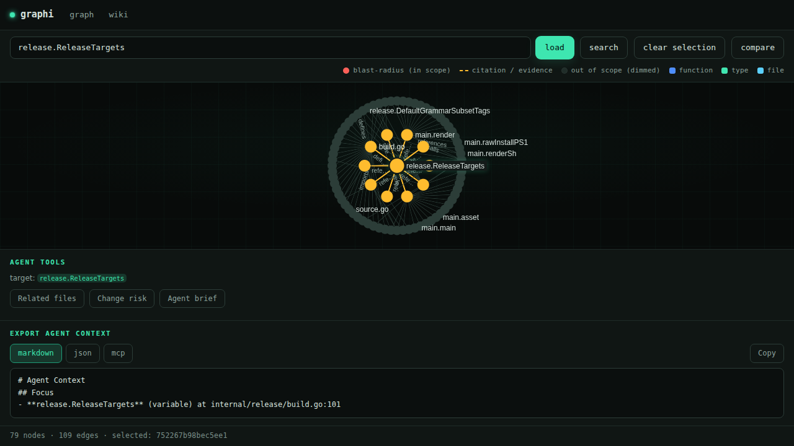
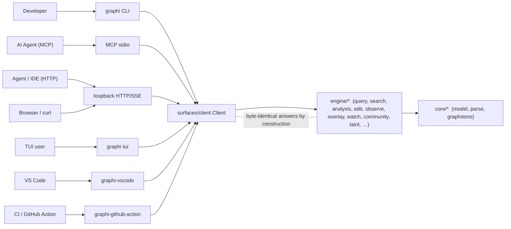
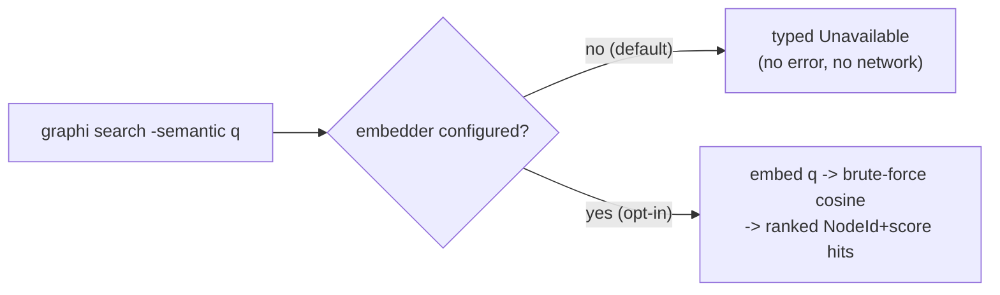
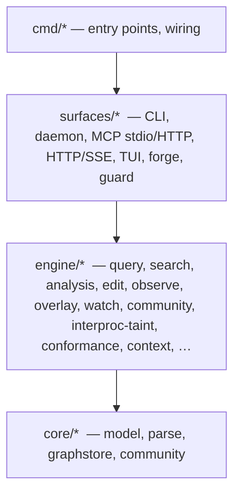

<p align="center">
  
</p>

<h1 align="center">graphi</h1>

> Local-first, CGo-free code-intelligence engine. Parse a repository into a deterministic, provenance-backed code graph and answer structural and semantic questions over an agent-first **MCP (stdio)** + **CLI** surface — without a single byte leaving your machine.

[](#advanced--from-source)
[](#the-local-first-contract)
[](#license)

An AI coding agent that greps and re-reads your whole codebase on every question
is slow, expensive, and still guessing. graphi indexes the repo once into a
graph — symbols as nodes, calls/references/imports as edges — and answers
"who calls this," "what breaks if I change it," and "how are these two
functions connected" in one round-trip, entirely on your machine.

---

<details>
<summary><strong>Contents</strong></summary>

- [Quick start (2 steps)](#quick-start-2-steps)
- [What is graphi?](#what-is-graphi)
- [What is GA (and what is not)](#what-is-ga-and-what-is-not)
- [Features](#features)
- [Capabilities](#capabilities)
  - [Core code graph](#core-code-graph) · [Language support](#language-support)
  - [Semantic analysis (labs)](#semantic-analysis-labs) · [Deep analysis (labs)](#deep-analysis-labs)
  - [PR review vertical (labs)](#pr-review-vertical-labs)
- [Semantic search (optional, off by default)](#semantic-search-optional-off-by-default)
- [The local-first contract](#the-local-first-contract)
- [Advanced / from source](#advanced--from-source)
- [Subcommands](#subcommands)
- [Architecture](#architecture)
- [Documentation](#documentation)
- [License](#license)

</details>

## Quick start (2 steps)

**Step 1 — install.** One line, checksum-verified, no sudo (installs the prebuilt
CGo-free binary to `~/.local/bin`):

```bash
curl -fsSL https://raw.githubusercontent.com/samibel/graphi/main/install.sh | sh
```

On Windows, use the PowerShell installer instead:

```powershell
iwr -useb https://raw.githubusercontent.com/samibel/graphi/main/install.ps1 | iex
```

**Step 2 — run it in your repo.**

```bash
cd your-repo && graphi
```

Your browser opens with the interactive code graph (embedded in release binaries
from the next release after v0.1.2; source builds need `scripts/build-release-webui.sh`),
and the terminal prints a "Saved $X this session" savings readout. On a headless
box / over SSH (or with `--no-browser` / `GRAPHI_NO_BROWSER`), graphi prints the
local URL instead of opening a browser.

<p align="center">
  
</p>

Click any node to see its blast radius: impacted symbols light up red, the
evidence-bearing (citation) edges amber, and everything out of scope dims —
while the agent-context export below fills with the selection.

<p align="center">
  
</p>

### Everyday use

```bash
# Short verbs over the symbol under your cursor
graphi callers <symbol>      # who calls it
graphi impact  <symbol>      # what a change to it affects
graphi ui                    # explicitly serve the graph + open the browser
graphi claude                # wire graphi into Claude Code (MCP)
graphi setup                 # wire every detected local MCP client (Claude Code, Copilot, Cursor, Windsurf, Claude Desktop)

# Update to the latest release (user-initiated; never automatic)
graphi upgrade
```

---

## What is graphi?

`graphi` is a code-intelligence engine you run entirely on your own machine.
Point it at a repository and it parses the source into a canonical **code
graph** — nodes are symbols (functions, types, files), edges are the
relationships between them (calls, references, definitions). It answers questions
about your codebase in a single round-trip instead of grepping and reading whole
files — and can optionally keep the graph hot in a background daemon (Labs):

- *Who calls this function? What does it call?*
- *Where is this symbol defined? What references it?*
- *If I change this, what else is affected?*
- *How do two functions connect? Which symbols are the riskiest hubs?*

Every relationship in the graph carries **provenance** — a confidence tier (heuristic / derived / confirmed), a reason, and supporting evidence — so you can trust each edge rather than guess at it.

graphi is built for two audiences:

- **Developers** who want fast, structural answers about an unfamiliar or large codebase, on the command line.
- **AI coding agents** that need a stable, read-only graph backend to query over MCP — without owning parsing or indexing themselves, and without sending code to a third party.

The Stable default tier runs locally with no accounts or telemetry and no
outbound network access. Explicitly configured Labs/forge or embedder features
may contact their configured service; they are not part of that default claim.

## What is GA (and what is not)

graphi's supported surface is deliberately narrow. **[`docs/stability-tiers.md`](docs/stability-tiers.md)
is the single canonical definition** of the GA / Preview / Labs / Source-only
tiers and of how they map onto the CI-enforced
[capability coverage matrix](docs/coverage-matrix.md). This section is a summary;
that file is the authority.

**GA — the entire promise:**

- **12 frozen operations:** `index`, `search`, `definition`, `callers`, `callees`,
  `references`, `neighborhood`, `impact`, `agent_brief`, `related_files`,
  `explain_symbol`, `change_risk`.
- **Go only.** Go is the only GA language.
- **CLI + MCP stdio only**, in the CGo-free default binary.

**Not GA:**

- **Every other language** (Python, TypeScript, Java, Rust, C/C++, …) is
  **Preview** — shipped and usable, running the same 12 operations, but outside
  the GA promise and unproven.
- **HTTP/SSE, the daemon, the web UI, the TUI, the VS Code extension, the GitHub
  Action / PR automation, refactorings, taint, agent memory and semantic search**
  are **Labs** — in-tree and advertised with a `[labs] ` prefix, but not something
  we stand behind. Labs is opt-in: MCP Labs tools need `graphi mcp -labs`, Labs
  HTTP routes need `GRAPHI_HTTP_LABS=1`.
- **The wiki** is **Source-only**: `engine/wiki` is in the tree, but no CLI
  subcommand and no MCP tool exposes it. It is not advertised and not supported.
- **SaaS** does not exist. Nothing is hosted; there is no service to sign up for.

> **Reading the matrix.** The coverage matrix's `tier` field answers only *"is this
> one of the 12 frozen operations?"* — so the `go`, `cli` and `mcp` rows all read
> `tier: labs` despite being the whole GA scope. That is structural (a parser or
> surface row is ineligible for `stable`), not a demotion. See
> [`docs/stability-tiers.md`](docs/stability-tiers.md) for why.

## Features

The full feature inventory — every MCP tool, CLI subcommand, HTTP endpoint, analyzer, and surface — is in **[`docs/FEATURES.md`](docs/FEATURES.md)**. This section is the elevator pitch.



### Highlights

> Of the surfaces below, only **CLI** and **MCP stdio** are GA. Everything else in
> this section — HTTP/SSE, the TUI, the web UI, VS Code, the GitHub Action,
> diagnostics, refactorings, taint, notebooks and the PR-tool suite — is **Labs**.
> See [What is GA](#what-is-ga-and-what-is-not).

- **One engine, many surfaces.** The GA surfaces (CLI, MCP stdio) and the Labs ones (loopback HTTP/SSE, TUI, web UI, VS Code, GitHub Action) share the same `surfaces/client.Client` interface. Surface parity is pinned for the operations covered by the parity suite; it is not a blanket claim that every transport frame is identical.
- **Live IDE transport (labs).** Versioned loopback REST/SSE lets an editor subscribe to ingest and analysis events; the in-memory editor-overlay subsystem tracks unsaved buffers and the zero-egress enforcement guard rejects any non-loopback dial at the surface boundary. A package-level MCP HTTP adapter exists for embedders, but no `graphi` CLI command currently serves it.
- **Diagnostics & code actions (labs).** `diagnose` runs graph-derived diagnostics (severity + suggested code-action), `inline` performs reference-correct inline refactor with a fail-safe block list, `safe_delete` gates on reference-safety before removing a symbol.
- **Notebooks, watcher, interproc taint, communities (labs).** `.ipynb` cell-provenance ingestion, an `fsnotify` watcher with bounded worker-pool and deterministic canonical-ordered apply, an interprocedural taint fixpoint over per-procedure gen/kill summaries (procedure-level label sets — not statement-level dataflow), and deterministic Louvain community detection behind a single grouping seam. Full-vs-incremental byte-parity is enforced as a conformance gate.
- **PR-tool suite (labs).** `list_prs` enumerates open PRs (read-only forge seam), `triage_prs` produces a single-pass graph-derived ranking, `conflicts_prs` detects inter-PR conflicts (textual + graph-semantic + asymmetric contract-dependency), `suggest_reviewers` ranks candidates by ownership/churn + affected-subgraph proximity, `compare_branches` is a graph-level diff keyed by canonical NodeId, and `critique_review` is a deterministic graph-evidence critique of an existing review (no LLM prose; the only egress is the surface review fetch).

For every CLI subcommand, every MCP tool, every HTTP endpoint, and several Mermaid diagrams, see **[`docs/FEATURES.md`](docs/FEATURES.md)**.

## Capabilities

graphi grows from a structural core into semantic and deep analysis. Each capability is queryable today through the CLI and the MCP server.

> **GA vs. Labs.** Only the 12 frozen operations on Go, over CLI + MCP stdio, are
> **GA** — see [What is GA](#what-is-ga-and-what-is-not) and the canonical
> [`docs/stability-tiers.md`](docs/stability-tiers.md). **Everything else on this
> page is Labs**, including every analyzer below (`taint`, `pdg`, `interproc`,
> `contracts`, `git-history`), the PR review vertical, and agent memory & skills:
> in-tree and usable, unproven against real-world use, and liable to change shape
> or be removed. Their MCP tool descriptions carry a `[labs] ` prefix (single
> source: `surfaces/mcp/tools.go`, CI-tested); `graphi help` marks them the same
> way. Tool *names* never carry a tier tag — they are frozen wire identifiers.

### Core code graph

- **Parse to graph** — turn a repository into a canonical node/edge model with deterministic ids and provenance on every edge.
- **Structural queries** — callers, callees, references, definition, and neighborhood for any symbol.
- **Lexical & symbol search** — fast full-text search across symbols and source.
- **Semantic search (optional, OFF by default)** — embedding-based search that is **off until you explicitly configure an embedder**; the default binary ships **no embedder** and degrades gracefully (see [Semantic search](#semantic-search-optional-off-by-default)).
- **Incremental indexing** — only changed files are re-parsed; the graph stays fresh as you edit.
- **Hot daemon (labs)** — keep the index in memory and query it over a local Unix socket, avoiding a cold open per query.

#### Language support

The parser registry is open/closed — languages plug in behind a stable seam
without touching existing code.

> **Go is the only GA language.** Every other language in the table below is
> **Preview**: it ships, it is usable, it runs the same 12 GA operations — but it
> is outside the GA promise and its accuracy is unproven. Preview languages resolve
> cross-file references at the `heuristic` tier only; **Go alone** additionally gets
> type-checker-`confirmed` edges (`engine/typeresolve`). See
> [`docs/stability-tiers.md`](docs/stability-tiers.md).

**Default tier (CGo-free, shipped binary).** Two stdlib parsers plus **20**
subset-tagged pure-Go `gotreesitter` grammars. The shipped default is built with
`-tags 'grammar_subset grammar_subset_<lang> …'`
([`internal/release.DefaultGrammarSubsetTags`](internal/release/build.go)) so only
these languages' grammar blobs are embedded — never the all-206 default embed.

| Language | Tier | Symbol nodes | Intra-file edges | Cross-file/package edges |
|---|---|---|---|---|
| **Go** | **GA** | ✅ func / method / type / var / const / file | ✅ `defines`, `calls`, `references` | ✅ `calls` / `references` / `imports` (linker pass, heuristic tier) + `confirmed`-tier go/types edges ¹ |
| JSON | Preview | structural (AST) | — | — |
| TypeScript · TSX/JSX · JavaScript | Preview | ✅ symbol nodes | ✅ intra-file | ✅ `calls` / `references` / `imports` (per-language resolver, heuristic tier) ² |
| **Python** | Preview | ✅ symbol nodes | ✅ intra-file | ✅ `calls` / `references` / `imports` (per-language resolver, heuristic tier) ² |
| Ruby · PHP · Lua | Preview | ✅ symbol nodes | ✅ intra-file | ✅ `calls` / `references` / `imports` (per-language resolver, heuristic tier) ² |
| Java · Kotlin · C# | Preview | ✅ symbol nodes | ✅ intra-file | ✅ `calls` / `references` / `imports` (per-language resolver, heuristic tier) ² |
| C · C++ · Rust | Preview | ✅ symbol nodes | ✅ intra-file | ✅ `calls` / `references` / `imports` (per-language resolver, heuristic tier) ² |
| Bash/Shell | Preview | ✅ symbol nodes | ✅ intra-file | ✅ `calls` / `imports` (per-language resolver, heuristic tier) ² |
| SQL | Preview | ✅ symbol nodes | ✅ intra-file | — (no provable cross-file refs at this tier; resolver skips+counts) ² |
| CSS · YAML · TOML · Markdown · HCL/Terraform | Preview | ✅ symbol nodes | ✅ intra-file | ⏳ per-language resolver (roadmap) ² — no `resolve_<lang>.go` registered in `engine/link`; intra-file nodes only |
| HTML | Source-only | ✖ not shipped — grammar exists upstream but is not subset-buildable in isolation (see below) | — | — |

<details>
<summary>¹ ² How cross-file resolution actually works, language by language</summary>

> ¹ The cross-file / cross-package **linker pass** ([`engine/link`](engine/link)) is
> wired into ingest and resolves Go references against the fully-committed node set:
> same-package cross-file bare-ident calls/refs (`derived` tier) and cross-package
> selector calls (`pkg.Fn`, `recv.Method`) plus file→file `imports` (`heuristic` tier,
> with file:line evidence). It preserves the byte-identical full-vs-incremental invariant
> and the rename/move cascade. The linker is **never** `confirmed`: unresolved or ambiguous
> references are dropped deterministically, never fabricated. Since v0.2.0 a third
> ingest phase ([`engine/typeresolve`](engine/typeresolve)) runs the stdlib go/types
> checker over the whole repository and upserts type-checker-**proven** Go
> `calls`/`references`/`implements` edges at the `confirmed` tier (confidence 1.0) on
> top of the linker's output — correct receiver-type method dispatch, shadowing, and
> import resolution. A package the checker cannot prove (parse error, import cycle)
> keeps its heuristic edges; kill switch: `GRAPHI_NO_TYPERESOLVE=1`.
>
> ² Intra-file extraction ships for every language above. One per-language
> cross-file resolver (`resolve_<lang>.go`) over the same `engine/link` registry seam
> (Open/Closed — a new language is a new `Register` call in `link.New()`, never an edit
> to an existing resolver). Ingest dispatches the linker per language. **Shipped:**
> Go; **TypeScript family** (relative ESM imports, named/namespace bindings; non-relative/
> aliased specifiers and `tsconfig` paths are external → skipped — no path-mapping);
> **Python · Rust · Java · Kotlin** (clause-keyed module/FQN resolution — Python dotted
> modules, Rust `::` paths, Java/Kotlin FQNs key on their package segment); **C#**
> (`using` namespaces as ambient clauses); **C · C++** (`#include` translation units —
> file→file imports + ambient include-dir calls; **no overload resolution** → ambiguous
> calls skip+count); **Ruby · PHP · Lua · Bash** (relative `require`/`source` →
> file→file imports + same-/ambient-dir calls). **SQL** has no provable cross-file
> references at this tier, so its resolver deliberately resolves nothing (skip+count).
> Every cross-file edge is `heuristic` tier with file:line evidence and is **never**
> `confirmed`; unresolved/ambiguous references are dropped and counted, never fabricated.

</details>

> **Deferred / not in the default tier.**
> - **HTML** — has a pure-Go grammar but is **not subset-buildable in isolation** in
>   gotreesitter v0.20.2 (its scanner core is co-located with `grammar_subset_blade`
>   upstream), so it is **deferred** and **not shipped** in the default tier. Re-evaluate
>   when upstream splits the HTML scanner out.
> - **Dockerfile / Protobuf / GraphQL** — **not** in the committed tier-1 set (follow-up).
> - **`zig` and the broad long tail** — available **only** in the opt-in `graphi-broad`
>   CGO build (see below), never in the CGo-free default.

The frozen tier-1 list and the corrected (one-time runtime + per-blob) binary-budget
model live in [`bench/lang-budget.md`](bench/lang-budget.md); the curated-tier resolution
and the full per-language blob deltas are recorded in that file.

#### The opt-in `graphi-broad` CGO flavor (broad coverage)

graphi ships in two flavors over the **same** `SymbolExtractor` contract:

- **Default (pure-Go).** The shipped binary is CGo-free: only the pure-Go
  `gotreesitter` runtime and the curated tier-1 grammars are reachable. No C
  toolchain is required and the default import graph provably contains no CGO
  package (CI-enforced — see below).
- **`graphi-broad` (opt-in CGO).** Built with `-tags graphi_broad` and
  `CGO_ENABLED=1`, this flavor opens the **257-grammar
  [`go-sitter-forest`](https://github.com/alexaandru/go-sitter-forest)** CGO *seam*
  (native C tree-sitter via `go-tree-sitter-bare`) over the *same* contract, so any
  broad grammar produces the same `file / function / method / type / variable /
  constant` vocabulary the default tier does. Today the lane wires **one** grammar —
  `zig` — as the reference; the 257-grammar `forest` meta-module is intentionally **not**
  imported (it would statically pull in hundreds of MB of generated C). Additional broad
  grammars are added one subpackage at a time.

<details>
<summary>Why a separate flavor, and what changed to add it</summary>

**Before / after.** *Before:* the default pure-Go tier only —
broad coverage was not available. *After:* the opt-in `graphi-broad` CGO flavor opens
the `go-sitter-forest`-backed CGO seam over the same `SymbolExtractor` contract
(`zig` wired as the reference grammar), **build-tag isolated** so the default tier is
provably unaffected.

`go-sitter-forest` is *wholly CGO*. Keeping it behind
the `graphi_broad` build tag gives broad language coverage **without compromising
the CGo-free default build**: every forest-touching file is `//go:build
graphi_broad`-tagged and never reached by an untagged import, so the default graph
stays pure-Go. This is enforced on two layers — a registration-level guard
(`parse.AssertPureGoDefaults`) and a static import-graph scan
(`internal/cgoconformance`, which proves `go-sitter-forest` is unreachable from
`./cmd/graphi`).

</details>

> [!WARNING]
> **Residual security limitation — read before enabling `graphi-broad`.**
> The broad flavor runs **native C** over your source. graphi's Go-side resource
> bounds (`recover`, the CST depth guard, `context` timeouts) do **NOT** contain a
> native-C crash, stack overflow, out-of-memory, or remote-code-execution in a C
> grammar: `recover` cannot catch a C `SIGSEGV`, a synchronous CGO call cannot be
> interrupted by a context deadline, and the depth guard bounds only the Go-side
> walk. Only `MaxFileSize` transfers to the C path. `graphi-broad` is therefore
> **opt-in, NOT memory-safety-isolated, and intended for trusted / CI input only.**
> Because `SetMaxParseDepth` is process-global and not honored by the C parser, the
> broad tier MUST NOT run concurrently in-process with a default tier relying on a
> different depth bound.
>
> This residual native-C crash/RCE risk is **explicitly accepted** for the opt-in
> lane. Out-of-process / sandbox isolation
> (subprocess-per-parse with rlimit/cgroup + signal trapping and/or seccomp) is the
> named follow-up. Until then, do not point `graphi-broad` at
> untrusted source.

<details>
<summary>Supply-chain and runtime controls on the broad lane</summary>

The broad lane keeps its supply-chain and runtime controls: `go-sitter-forest`
(and its grammar subpackages) are version-pinned in `go.sum` and `go mod verify`'d,
the lane builds **offline** (`GOPROXY=off`) after a one-time pin, and a live
loopback-only `netns` deny-egress job (with a tripwire) proves the broad smoke
parse performs zero outbound network at the C level — the static Go-AST canary is
structurally blind to a C `socket()`/`connect()`, so only the live netns job
credits the broad lane's zero-egress guarantee.

</details>

### Semantic analysis (labs)

Run with `graphi analyze <analyzer>`. **`impact` is the only GA operation here**; the
generic `analyze` dispatcher and every other analyzer below are Labs:

- **`impact`** — blast-radius reachability. Default direction `reverse` = dependents (who is affected if this symbol changes — the rdeps convention); `forward` = dependencies (what this symbol relies on).
- **`call-chain`** — reconstruct the call path(s) connecting two symbols.
- **`concept`** — resolve a natural-language concept term to the graph locations that implement it.
- **`metrics`** — graph metrics that surface hubs, bridges, and high-centrality symbols.
- **`batched`** — impact, call-chain, and metrics for a symbol in a single combined response.

### Deep analysis (labs)

Also available through `graphi analyze <analyzer>` — all Labs, none part of the GA promise:

- **`taint`** — symbol-graph taint propagation from sources to sinks (name-pattern sources/sinks; reachability-based — statement-level dataflow is out of scope).
- **`pdg`** — dependence edges over the symbol graph (def-use reachability + post-dominance; a coarse approximation of a classical statement-level PDG).
- **`interproc`** — interprocedural, fixpoint-based summary analysis across call boundaries.
- **`contracts`** — detect API/interface contracts and flag drift against them.
- **`git-history`** — repository-history signals such as code churn, co-change groups, and bus-factor.

### PR review vertical (labs)

- **`pr-risk`** — deterministic per-region PR risk score (impact + taint, no LLM).
- **`pr-signals`** — hub / bridge / surprise signals on PR-changed code.
- **`pr-questions`** — deterministic reviewer questions derived from the findings.
- **`pr_comment`** — render a sticky PR review comment + optional risk-threshold merge gate.
- **`list_prs`** — read-only forge enumeration of open PRs (metadata only).
- **`triage_prs`** — single-pass graph-derived multi-PR triage ranking.
- **`conflicts_prs`** — inter-PR conflict detection (textual + graph-semantic + asymmetric contract-dependency).
- **`suggest_reviewers`** — ranked candidate-reviewer recommender (ownership/churn + affected-subgraph proximity).
- **`compare_branches`** — graph-level structured diff of two branch states keyed by canonical NodeId.
- **`critique_review`** — deterministic graph-evidence critique of an EXISTING PR review (gap / over_flag / unsupported_claim, no LLM prose).

### Notebooks, watcher, communities, interproc taint (labs)

- **`notebook-ingest`** — `.ipynb` cell-provenance ingestion (cell-as-symbol granularity).
- **`watcher-status`** — filesystem-watcher health (per-root errors, no synthesis).
- **`taint-query`** — interprocedural taint verdict + flows over per-procedure gen/kill summaries (procedure-level reachability).
- **`communities`** — deterministic Louvain community detection behind a single grouping seam.

### Diagnostics & code actions (labs)

- **`graphi diagnose [kind]`** — graph-derived diagnostics + suggested code-actions, severity-tagged.
- **`graphi inline [-dry-run] <target>`** — reference-correct inline refactor with fail-safe block list.
- **`graphi safe-delete [-dry-run] <target>`** — reference-safety-gated safe-delete refactor.

### Agent memory & skills (labs)

- **`graphi memory store|recall|forget …`** — local agent memory (per-scope, per-notebook, per-tag).
- **`graphi distill -session <id> …`** — distill a session into a compact decision record.
- **`graphi skillgen -name <n> -trigger <t> -description <d>`** — deterministic skill generation from a procedure description.

### Internal quality gate (not an independent 9/10 rating)

Repository quality is regression-tested, not asserted. `go run ./cmd/eval -manifest
corpus/manifest.json -tier 1` runs the Tier-1 evaluation harness and emits a
revision-stamped internal scorecard with per-area scores (agent/MCP usefulness, signal quality,
performance, setup/trust, evaluation, UX), each marked **measured** or
**carried** so a baseline number is never silently presented as a
measurement. The measured inputs — diagnostics ground truth, doctor-behavior
assertions, performance budgets, web-suite results — are embedded in the
report for audit.

The internal release threshold is **>= 90 overall with no area below 80**.
`go run ./cmd/release-gate` enforces exactly that: it runs
the hard constituent gates (full test suite, coverage matrix, privacy audit,
bench budgets), consumes the measured scorecard report, measures UX from the
web suite, and blocks the release on a sub-90 overall, any sub-80 area, a
removed MCP tool, or a Tier-1 regression.

That number is a synthetic in-repository release gate, **not** a credible
overall 9/10 project rating. It does not prove production adoption, external
security, language-wide accuracy, commercial viability, or superiority over a
competitor. Those claims remain **UNKNOWN** until independently measured. Any
`docs/release-scorecard.{json,md}` file is a historical snapshot; its embedded
commit must match the candidate before it can be cited as current evidence.
A “faster or more accurate than Graphify” claim additionally requires a public,
matched-corpus benchmark with identical hardware, cold/warm methodology, and
task-level correctness labels. No such claim is made here today.

## Semantic search (optional, OFF by default)

Semantic (embedding-based) search is an **optional** capability that is **OFF by
default**. The default binary ships **no embedder**, stays **CGo-free**, and makes
**zero non-loopback network calls** — semantic search is only ever enabled when
*you* explicitly opt in. Until then it **degrades gracefully**: it never errors,
never dials the network, and never blocks the always-available lexical search.

### Before / after

| | Default build (no embedder) | After opting in |
|---|---|---|
| `graphi search -semantic <q>` | returns a typed `{"available":false,"reason":"no embedder configured; run \`graphi setup-embedder ...\`"}` response — no error, no network | embeds the query and returns cosine-ranked hits citing `node_id` + `score` |
| Lexical `graphi search <q>` | always available | unchanged, always available |
| Binary | CGo-free, no embedder, zero egress | CGo-free unless you build the ONNX flavor; loopback-only if you use Ollama |

The unavailable response is produced by a **single engine-owned type**
(`engine/search.SemanticResponse`) and is **byte-identical across the CLI, MCP, and
HTTP surfaces**, so surfaces can never drift.



### How to enable it

Run `graphi setup-embedder` for copy-pasteable instructions. You opt in by setting
the `GRAPHI_EMBEDDER` environment variable, then re-indexing with embeddings:

```sh
# Option A — Ollama (loopback-only, opt-in). Requires a local Ollama daemon.
export GRAPHI_EMBEDDER=ollama                 # defaults to 127.0.0.1:11434
# or pin the loopback endpoint explicitly:
export GRAPHI_EMBEDDER=ollama:127.0.0.1:11434

# Option B — ONNX (local, CGO). Requires a build with the embed_onnx tag:
#   go build -tags embed_onnx ./cmd/graphi
export GRAPHI_EMBEDDER=onnx:/path/to/model.onnx

# Then embed the graph and query (share one durable store + meta sidecar so the
# generated vectors survive between the index and search invocations):
mkdir -p ~/.graphi
graphi index --semantic -root ./my-repo -db ~/.graphi/graph.db -meta ~/.graphi/meta
graphi search -semantic "where do we validate auth tokens" -db ~/.graphi/graph.db -meta ~/.graphi/meta
```

`graphi index --semantic` embeds every node (keyed by `node_id`) and persists the
vectors to a durable `vectors` table in the `-meta` sidecar, tagged with the
embedder identity + dimension. `graphi search -semantic` then reloads those vectors
from that sidecar on startup — a pure local read, **no re-embedding and no embedder
dial** — and returns cosine-ranked hits. With **no** embedder configured,
`graphi index --semantic` reports `unavailable — no embedder configured` (no error,
no network) and lexical indexing/search is unaffected.

Safety guarantees that hold regardless of configuration:

- **Ollama is loopback-only and fail-closed.** A non-loopback host is **rejected at
  construction** (in addition to the runtime canary dial interceptor —
  defense-in-depth). It is never constructed on the default path.
- **ONNX (CGO) is build-tag-gated** behind `//go:build embed_onnx` and is **provably
  absent** from the default binary (verified by both the `internal/cgoconformance`
  import-graph scan and a registration-level no-CGO guard).
- **Brute-force cosine** over an in-memory index is intentional for this first cut;
  HNSW / approximate-nearest-neighbour indexing is an explicit follow-up.

## The local-first contract

graphi is designed so that nothing leaves your machine:

| Guarantee | What it means for you |
|---|---|
| **Zero outbound network** | The engine makes no non-loopback network calls. Your code stays on disk. |
| **No telemetry** | Nothing is reported anywhere — no usage data, no phone-home. |
| **No accounts, no external services** | A single static binary; nothing to sign up for. |
| **CGo-free default build** | Builds anywhere Go does, with no C toolchain required. |
| **Single static binary** | One self-contained executable, easy to drop into any environment. |

## Advanced / from source

> Most users want the [two-step path above](#quick-start-2-steps). This section is
> for building graphi yourself from the Go toolchain — the opt-in CGO flavor, the
> embedded web UI, and running the individual surfaces by hand.

### Prerequisites

- **Go 1.26.5+**
- No C toolchain required — the default build is CGo-free.

### Build

```bash
# CGo-free build of the whole workspace
CGO_ENABLED=0 go build ./...

# Or build just the CLI binary
CGO_ENABLED=0 go build -o graphi ./cmd/graphi
```

#### Opt-in `graphi-broad` (CGO) build

The broad flavor requires a C toolchain and is **opt-in only** — read the residual
security limitation above before enabling it on untrusted source.

```bash
# Broad CGO flavor: 257-grammar go-sitter-forest over the same contract.
# Requires a C toolchain; intended for trusted / CI input only.
CGO_ENABLED=1 go build -tags graphi_broad -o graphi-broad ./cmd/graphi
```

#### Bundled web UI (`webui_embed`)

The default build is **UI-free**: it needs no `web/dist` to compile and serves a
small notice page at `/`, keeping the binary size budget untouched. The **bundled
release** embeds the web UI (`go:embed`) behind the `webui_embed` build tag and
serves the single-page app at `/` over the **same loopback-only HTTP surface**
(existing API routes win by ServeMux specificity). Build it with the helper:

```bash
# Builds web/dist, copies it into the gitignored embed dir, and builds with the tag.
scripts/build-release-webui.sh
# (equivalent to: cd web && npm ci && npm run build; cp -R web/dist
#  surfaces/http/webui/dist; CGO_ENABLED=0 go build -tags webui_embed ./cmd/graphi)
```

### Run

```bash
# Parse a single file (also the default if no subcommand is given)
graphi parse path/to/file.go

# Start the hot-index daemon
graphi daemon start -socket /tmp/graphi.sock

# Ask "who calls this symbol?" over the daemon
graphi query callers -symbol p.MyFunc -daemon /tmp/graphi.sock

# Run impact analysis on a symbol (default direction: reverse = dependents/blast radius)
graphi analyze impact -symbol p.MyFunc

# Run the MCP stdio server (point your MCP client at this binary)
graphi mcp -db ~/.graphi/graph.db
```

## Subcommands

The single `graphi` binary dispatches the subcommands below. Most accept `-db <path>` to open a SQLite store, or `-daemon <socket>` to talk to a running daemon.

The **Tier** column follows [`docs/stability-tiers.md`](docs/stability-tiers.md):
**GA** = one of the 12 frozen operations (or the GA transport that serves them), on
Go; `labs` = in-tree, not part of the GA promise. On a non-Go language a GA
operation is **Preview**, not GA. `graphi help` marks the same split at runtime.

| Subcommand | Tier | Purpose |
|---|---|---|
| `graphi index -root <repo> [--full] [--semantic]` | **GA** | Ingest a repo into a durable store (warm-starts on an unchanged repo; `--full` forces a cold pass). |
| `graphi callers\|callees\|references\|definition\|neighborhood <symbol>` | **GA** | Short verbs for the structural GA operations. |
| `graphi impact <symbol>` | **GA** | Blast radius of a change (fixed dispatcher; the generic `analyze` selector is Labs). |
| `graphi explain-symbol <symbol>` | **GA** | Compact, cited symbol identity summary. |
| `graphi related-files <target>` | **GA** | Ranked, cited read-first file list. |
| `graphi change-risk <target>` | **GA** | Evidence-based local blast-radius estimate. |
| `graphi agent-brief` | **GA** | Bounded, cited task-start context packet. |
| `graphi parse <file>` | labs | Parse a single file into the graph (default when no subcommand is given). |
| `graphi query <op> -symbol <id> [-depth N]` | **GA** | Structural query. `<op>` is one of `callers`, `callees`, `references`, `definition`, `neighborhood`. |
| `graphi search [-limit N] [-semantic] <query>` | **GA** | Lexical / symbol search — the **GA** tier covers the lexical operation only. The optional `-semantic` flag is **labs**: it runs the embedding search (graceful-skip when no embedder is configured). |
| `graphi setup-embedder [<selector>]` | labs | Print how to opt in to the optional semantic search (offline; semantic search stays OFF until you set `GRAPHI_EMBEDDER`). |
| `graphi analyze <analyzer> -symbol <id> [options]` | labs | Run a semantic or deep analyzer (see below). |
| `graphi mcp` | **GA** | Run the MCP **stdio** server (the agent-first surface). GA as a transport for the 12 operations; `-labs` opens the Labs catalog and is not GA. |
| `graphi daemon start\|stop\|status [-socket path] [-db path]` | labs | Manage the hot-index Unix-socket daemon. |
| `graphi http [-addr 127.0.0.1:8080] [-db path] [-root repo] [-meta dir]` | labs | Read-only HTTP REST + SSE surface (loopback-only). |
| `graphi tui [-db path] [-daemon socket]` | labs | Interactive terminal surface (select / neighbors / blast / search). |
| `graphi setup [--client claude\|copilot\|cursor\|windsurf\|claude-desktop\|all] [--dry-run] [--binary path] [--config path]` | labs | Register graphi's MCP stdio server into local MCP clients' configs (idempotent, atomic, offline). Default `--client all` wires Claude Code plus every other detected local client. Cloud agents (Devin, the Copilot coding agent) run remotely and can't reach a local stdio server, so they are out of scope. |
| `graphi search-ast [-limit N] <json-pattern>` | labs | Structural AST pattern query. |
| `graphi find-clones [<json-config>]` | labs | Clone detection. |
| `graphi diagnose [-db path] [<kind>...]` | labs | Graph-derived diagnostics + suggested code-actions. |
| `graphi inline -root <repo> [-db path] [-meta dir] [-dry-run] <target>` | labs | Inline refactor over the edit saga (single-initializer targets; fail-safe block list). |
| `graphi safe-delete -root <repo> [-db path] [-meta dir] [-dry-run] <target>` | labs | Reference-safety-gated delete. Current limitation: removes the symbol's declaration line only — review the diff for multi-line bodies. |
| `graphi list-prs` | labs | Read-only forge enumeration of open PRs. |
| `graphi triage-prs` | labs | Graph-derived multi-PR triage ranking. |
| `graphi conflicts-prs` | labs | Inter-PR conflict detection. |
| `graphi suggest-reviewers [-diff <ref>]` | labs | Ranked candidate-reviewer recommender. |
| `graphi compare-branches -base <db-path> -head <db-path>` | labs | Graph-level diff of two graphi SQLite snapshots (paths to `graphi index` outputs — it never resolves a git ref). |
| `graphi critique-review -diff <ref> [-pr N] [-review <json>\|-review-path <file>]` | labs | Deterministic graph-evidence critique of an existing PR review. |
| `graphi pr-comment -diff <ref> [-pr N] [-gate] [-publish]` | labs | Sticky PR comment + risk-threshold merge gate. |
| `graphi memory store\|recall\|forget ...` | labs | Agent memory operations. |
| `graphi distill -session <id> -decisions "..." -risks "..." -questions "..." -files "..."` | labs | Session distillation. |
| `graphi skillgen -name <n> -trigger <t> -description <d>` | labs | Deterministic skill generation. |
| `graphi privacy-audit [--target ./...]` | labs | Print the local-first proof (real CGo scan + canary egress guard); non-zero on violation. |
| `graphi savings -ledger <path>` | labs | Print the session token-savings readout from a ledger a prior MCP/daemon session wrote. |
| `graphi version` | labs | Print the version / commit / build date stamped into the binary. |

### `graphi analyze`

```
graphi analyze [-db path] [-daemon socket] <analyzer> -symbol <id> \
  [-target <id>] [-concept <term>] [-direction forward|reverse] [-max-nodes N]
```

Available analyzers: `impact`, `call-chain`, `concept`, `metrics`, `batched`, `taint`, `pdg`, `interproc`, `contracts`, `git-history`, `pr-risk`, `pr-signals`, `pr-questions`, `communities`, `notebook-ingest`, `taint-query`, `watcher-status`, `triage-prs`, `conflicts-prs`, `suggest-reviewers`, `compare-branches`, `critique-review`.

```bash
# Reverse impact: what depends on this symbol?
graphi analyze impact -symbol p.MyFunc -direction reverse

# Call path between two symbols
graphi analyze call-chain -symbol p.Caller -target p.Callee

# Resolve a concept to graph locations
graphi analyze concept -symbol p.Root -concept "rate limiting"
```

## Architecture

graphi is a layered Go workspace with a single engine serving every surface:



- **One engine, many surfaces.** A single runtime serves the CLI, the Unix-socket daemon, the MCP stdio server, and the loopback HTTP/SSE surface — no surface holds query, search, or analysis logic of its own, so they can never diverge.
- **Layered by direction.** Lower layers never depend on higher ones; `core/parse` and `core/graphstore` are pure leaves.
- **Data flow.** source repo → incremental ingest → graphstore (hot in-memory graph + durable SQLite sidecar) → query / search / analysis → surfaces.

## Documentation

**[`docs/stability-tiers.md`](docs/stability-tiers.md)** is the canonical
definition of the GA / Preview / Labs / Source-only tiers and their mapping onto
the CI-enforced coverage matrix. Read it first if you need to know what graphi
actually promises.

New here? The **[How-To guide](docs/HOWTO.md)** walks through install, indexing a
repo, and using every surface (CLI and MCP stdio are GA; HTTP/SSE, web client,
TUI and VS Code are Labs).

The **[Real-World Report Card](docs/real-world-report.md)** is the honest
before/after record for two external field tests (a security app where taint —
a Labs analyzer — found 0/4 real injections → now 5/5; an 11.7k-file monorepo
that indexed in 4m48s / 2.3 GB *before* the fixes). Each row names the command
that reproduces it; the one exception is the full-index wall-clock time, which
that page marks as machine-bound and **proxied** rather than a checked-in gate.

The **[Feature Inventory](docs/FEATURES.md)** is the complete catalogue of every
MCP tool, CLI subcommand, HTTP endpoint, and analyzer graphi ships, with 10
Mermaid diagrams (architecture, MCP taxonomy, surface matrix, PR pipeline, live-IDE
transport sequence, watcher + conformance, refactor saga, diagnostic flow, roadmap,
counts at a glance).

The **[Architecture Plan](docs/architecture-plan.md)** is the single design entry
point — the layered model, data flow, parse/extract pipeline, provenance
contract, and the CI gates that enforce the local-first guarantees. The
**[capability coverage matrix](docs/coverage-matrix.md)** is the machine-checked,
CI-enforced inventory of every parser, analyzer, MCP tool, and surface graphi
actually ships (docs-vs-code drift breaks the build).

Deeper technical documentation lives under [`docs/`](docs/). Start there for parser details, the analysis subsystem, context assembly, and the engineering decisions behind graphi.

## License

Licensed under the [Apache License 2.0](./LICENSE). Third-party attributions are
listed in [`NOTICE`](./NOTICE) — note that the optional `graphi-broad` flavor links
the go-sitter-forest grammar set under its own upstream licenses.
