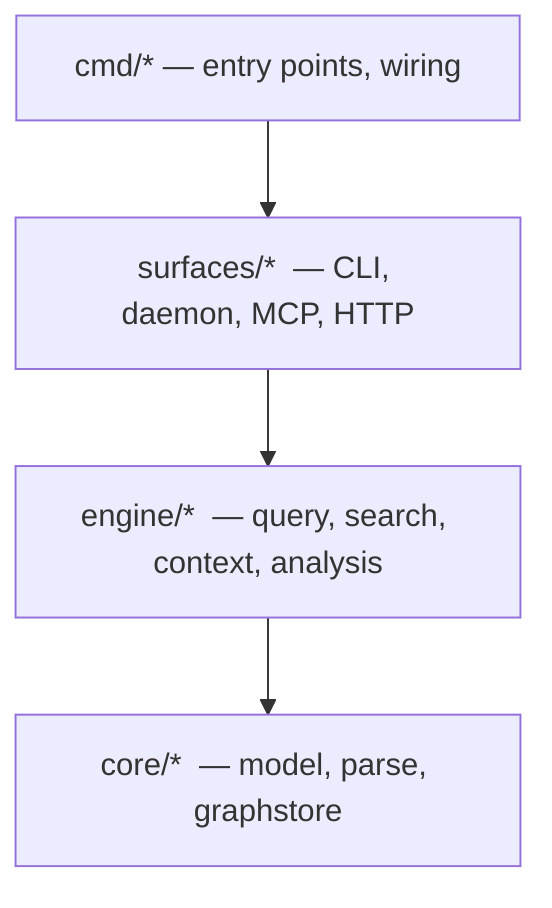

# graphi

> Local-first, CGo-free code-intelligence engine. Parse a repository into a deterministic, provenance-backed code graph and answer structural and semantic questions over an agent-first **MCP (stdio)** + **CLI** surface — without a single byte leaving your machine.

[](#install--run)
[](#the-local-first-contract)
[](#license)

---

## What is graphi?

`graphi` is a code-intelligence engine you run entirely on your own machine. Point it at a repository and it parses the source into a canonical **code graph** — nodes are symbols (functions, types, files), edges are the relationships between them (calls, references, definitions). It keeps that graph hot in a background daemon and answers questions about your codebase in a single round-trip instead of grepping and reading whole files:

- *Who calls this function? What does it call?*
- *Where is this symbol defined? What references it?*
- *If I change this, what else is affected?*
- *How do two functions connect? Which symbols are the riskiest hubs?*

Every relationship in the graph carries **provenance** — a confidence tier (heuristic / derived / confirmed), a reason, and supporting evidence — so you can trust each edge rather than guess at it.

graphi is built for two audiences:

- **Developers** who want fast, structural answers about an unfamiliar or large codebase, on the command line.
- **AI coding agents** that need a stable, read-only graph backend to query over MCP — without owning parsing or indexing themselves, and without sending code to a third party.

Everything runs locally. No accounts, no telemetry, no network calls.

## Capabilities

graphi grows from a structural core into semantic and deep analysis. Each capability is queryable today through the CLI and the MCP server.

### Core code graph

- **Parse to graph** — turn a repository into a canonical node/edge model with deterministic ids and provenance on every edge.
- **Structural queries** — callers, callees, references, definition, and neighborhood for any symbol.
- **Lexical & symbol search** — fast full-text search across symbols and source.
- **Incremental indexing** — only changed files are re-parsed; the graph stays fresh as you edit.
- **Hot daemon** — keep the index in memory and query it over a local Unix socket for instant responses.

#### Language support

The parser registry is open/closed — languages plug in behind a stable seam
without touching existing code. Current extraction coverage:

| Language | Symbol nodes | Intra-file edges | Cross-file/package edges |
|---|---|---|---|
| **Go** | ✅ func / method / type / var / const / file | ✅ `defines`, `calls`, `references` | ⏳ linker pass (roadmap) |
| JSON | structural (AST) | — | — |

Additional CGo-free tier-1 grammars (the pure-Go `gotreesitter` runtime + its
embedded grammar blobs, selected via subset build tags) and the opt-in
`graphi-broad` CGO build (broad grammar set) plug in through the same registry
seam; the frozen tier-1 list and binary-budget model live in
[`bench/lang-budget.md`](bench/lang-budget.md).

### Semantic analysis

Run with `graphi analyze <analyzer>`:

- **`impact`** — the set of symbols reachable from a change, forward (what it affects) or reverse (what affects it).
- **`call-chain`** — reconstruct the call path(s) connecting two symbols.
- **`concept`** — resolve a natural-language concept term to the graph locations that implement it.
- **`metrics`** — graph metrics that surface hubs, bridges, and high-centrality symbols.
- **`batched`** — impact, call-chain, and metrics for a symbol in a single combined response.

### Deep analysis

Also available through `graphi analyze <analyzer>`:

- **`taint`** — flow-sensitive taint tracking from sources to sinks.
- **`pdg`** — program dependence graph: data- and control-dependence edges within a function.
- **`interproc`** — interprocedural, fixpoint-based summary analysis across call boundaries.
- **`contracts`** — detect API/interface contracts and flag drift against them.
- **`git-history`** — repository-history signals such as code churn, co-change groups, and bus-factor.

## The local-first contract

graphi is designed so that nothing leaves your machine:

| Guarantee | What it means for you |
|---|---|
| **Zero outbound network** | The engine makes no non-loopback network calls. Your code stays on disk. |
| **No telemetry** | Nothing is reported anywhere — no usage data, no phone-home. |
| **No accounts, no external services** | A single static binary; nothing to sign up for. |
| **CGo-free default build** | Builds anywhere Go does, with no C toolchain required. |
| **Single static binary** | One self-contained executable, easy to drop into any environment. |

## Install & run

### Prerequisites

- **Go 1.26+**
- No C toolchain required — the default build is CGo-free.

### Build

```bash
# CGo-free build of the whole workspace
CGO_ENABLED=0 go build ./...

# Or build just the CLI binary
CGO_ENABLED=0 go build -o graphi ./cmd/graphi
```

### Run

```bash
# Parse a single file (also the default if no subcommand is given)
graphi parse path/to/file.go

# Start the hot-index daemon
graphi daemon start -socket /tmp/graphi.sock

# Ask "who calls this symbol?" over the daemon
graphi query callers -symbol p.MyFunc -daemon /tmp/graphi.sock

# Run impact analysis on a symbol
graphi analyze impact -symbol p.MyFunc -direction forward

# Run the MCP stdio server (point your MCP client at this binary)
graphi mcp -db ~/.graphi/graph.db
```

## Subcommands

The single `graphi` binary dispatches the subcommands below. Most accept `-db <path>` to open a SQLite store, or `-daemon <socket>` to talk to a running daemon.

| Subcommand | Purpose |
|---|---|
| `graphi parse <file>` | Parse a single file into the graph (default when no subcommand is given). |
| `graphi query <op> -symbol <id> [-depth N]` | Structural query. `<op>` is one of `callers`, `callees`, `references`, `definition`, `neighborhood`. |
| `graphi search [-limit N] <query>` | Lexical / symbol search. |
| `graphi analyze <analyzer> -symbol <id> [options]` | Run a semantic or deep analyzer (see below). |
| `graphi mcp` | Run the MCP **stdio** server (the agent-first surface). |
| `graphi daemon start\|stop\|status [-socket path] [-db path]` | Manage the hot-index Unix-socket daemon. |
| `graphi http [-addr 127.0.0.1:8080] [-db path] [-root repo] [-meta dir]` | Read-only HTTP REST + SSE surface (loopback-only). |
| `graphi tui [-db path] [-daemon socket]` | Interactive terminal surface (select / neighbors / blast / search). |
| `graphi setup [--dry-run] [--binary path] [--config path]` | Register graphi's MCP stdio server into Claude Code's config (idempotent, atomic, offline). |
| `graphi privacy-audit [--target ./...]` | Print the local-first proof (real CGo scan + canary egress guard); non-zero on violation. |
| `graphi savings` | Print the session token-savings readout. |
| `graphi version` | Print the version / commit / build date stamped into the binary. |

### `graphi analyze`

```
graphi analyze [-db path] [-daemon socket] <analyzer> -symbol <id> \
  [-target <id>] [-concept <term>] [-direction forward|reverse] [-max-nodes N]
```

Available analyzers: `impact`, `call-chain`, `concept`, `metrics`, `batched`, `taint`, `pdg`, `interproc`, `contracts`, `git-history`.

```bash
# Reverse impact: what depends on this symbol?
graphi analyze impact -symbol p.MyFunc -direction reverse

# Call path between two symbols
graphi analyze call-chain -symbol p.Caller -target p.Callee

# Resolve a concept to graph locations
graphi analyze concept -symbol p.Root -concept "rate limiting"
```

## Architecture

graphi is a layered Go workspace with a single engine serving every surface:



- **One engine, many surfaces.** A single runtime serves the CLI, the Unix-socket daemon, the MCP stdio server, and the loopback HTTP/SSE surface — no surface holds query, search, or analysis logic of its own, so they can never diverge.
- **Layered by direction.** Lower layers never depend on higher ones; `core/parse` and `core/graphstore` are pure leaves.
- **Data flow.** source repo → incremental ingest → graphstore (hot in-memory graph + durable SQLite sidecar) → query / search / analysis → surfaces.

## Documentation

New here? The **[How-To guide](docs/HOWTO.md)** walks through install, indexing a
repo, and using every surface (CLI, HTTP/SSE, web client, TUI, VS Code, MCP).

Deeper technical documentation lives under [`docs/`](docs/). Start there for parser details, the analysis subsystem, context assembly, and the engineering decisions behind graphi.

## License

Apache-2.0.
