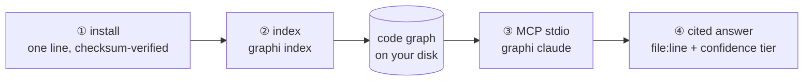
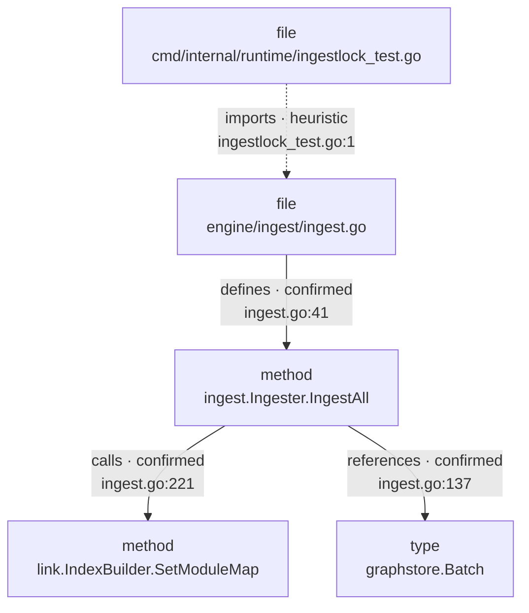
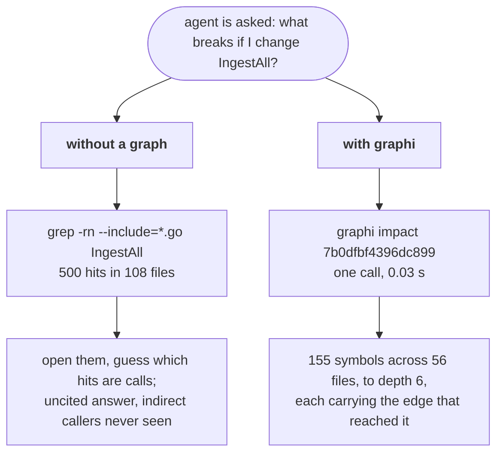
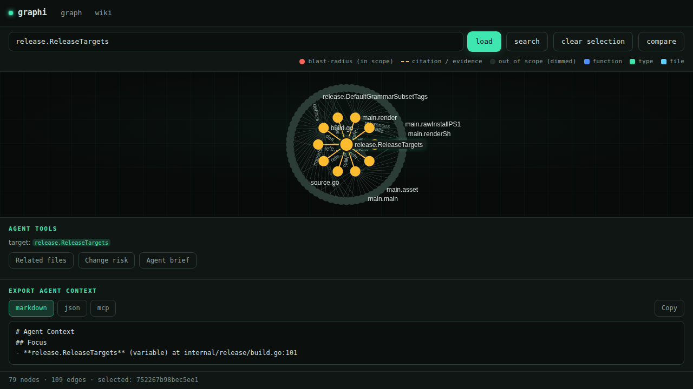
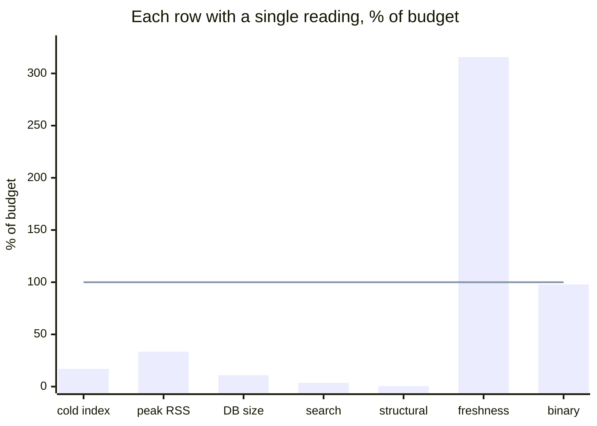
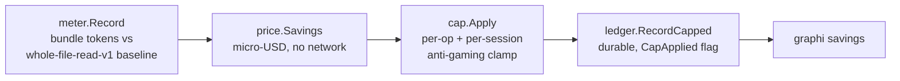
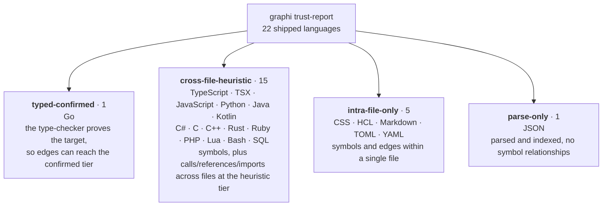
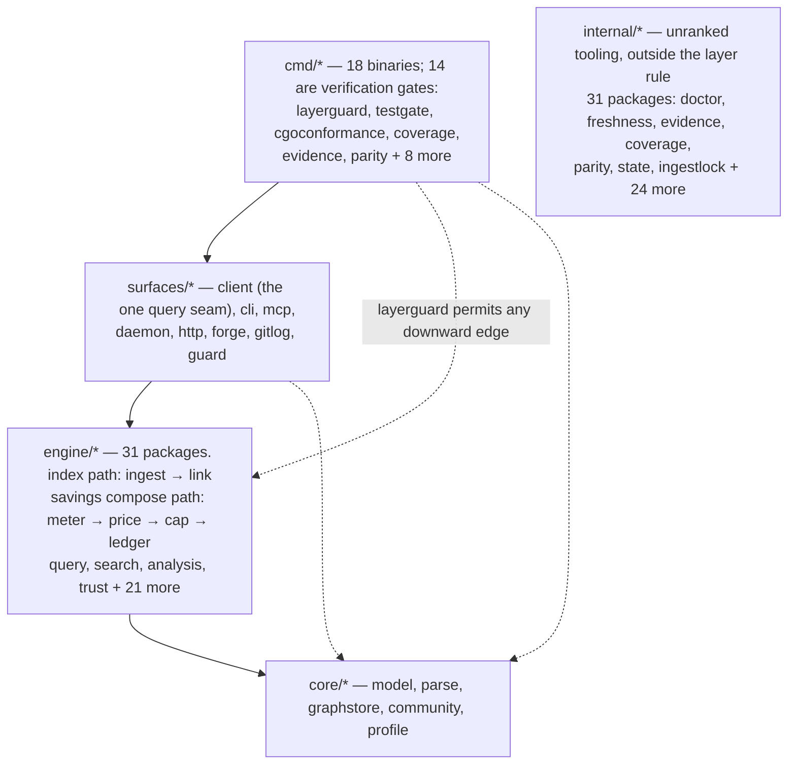

<p align="center"></p>
<h1 align="center">graphi</h1>
<p align="center">Your agent stops grepping the whole codebase. It asks the graph.</p>
<p align="center"><a href="https://samibel.github.io/graphi/">Website</a> · <a href="https://samibel.github.io/graphi/tutorial.html">Hands-on tutorial</a> · <a href="./CHANGELOG.md">Changelog</a> · <a href="docs/known-defects.md">Open defects</a></p>

[](https://github.com/samibel/graphi/actions/workflows/cgoconformance.yml) [](https://github.com/samibel/graphi/actions/workflows/privacy-audit.yml) [](https://github.com/samibel/graphi/actions/workflows/coverage-matrix.yml) [](https://github.com/samibel/graphi/actions/workflows/testgate.yml) [](https://github.com/samibel/graphi/releases/latest)

graphi indexes your repository once into a code graph — symbols as nodes,
calls/references/imports as edges — and answers *who calls this*, *what breaks if
I change it* and *how are these two connected* in one round-trip, entirely on your
machine, with a `file:line` and a confidence tier on every edge it returns.
Structural answers cover the symbols your repo defines: stdlib and third-party
targets are recorded, but deliberately not navigable ([docs/external-nodes.md](docs/external-nodes.md)).

Current release **v0.11.0** · 12 frozen GA operations over CLI + MCP stdio · Apache-2.0 · no account, no telemetry, no cloud.

## Quick start


```mermaid
flowchart LR
  I["① install<br/>one line, checksum-verified"] --> X["② index<br/>graphi index"] --> G[("code graph<br/>on your disk")]
  G --> M["③ MCP stdio<br/>graphi claude"] --> A["④ cited answer<br/>file:line + confidence tier"]
```

**① install · ② index · ③ wire · ④ ask** — one real session, captured against graphi's own repository at tag `v0.10.0`, so every line below reproduces exactly as printed (Windows install: `iwr -useb https://raw.githubusercontent.com/samibel/graphi/main/install.ps1 | iex`). Terminal output is shown as a terminal shows it (stdout and stderr merged); absolute paths appear as `~`; the one elided run of output is marked `…`.

```console
$ curl -fsSL https://raw.githubusercontent.com/samibel/graphi/main/install.sh | sh
install.sh: downloading graphi-darwin-arm64 (latest)...
graphi-darwin-arm64: OK
install.sh: installed graphi to ~/.local/bin/graphi

$ git clone --branch v0.10.0 https://github.com/samibel/graphi && cd graphi && graphi index
graphi: scanning repo…
…  (indexing progress, cross-file linking and type resolution — elided)
graphi: indexed 2580 files in 34.8s
graphi index: ingested ~/graphi

$ graphi claude
config: ~/.claude.json
action: created
entry: {type:stdio command:~/.local/bin/graphi args:[mcp]}
Claude Code: graphi MCP server created in ~/.claude.json (command=~/.local/bin/graphi args=[mcp])
  backup of the original config written to ~/.claude.json.bak-20260826T002022Z
  restart/reload Claude Code to expose graphi's tools.

$ graphi search -limit 1 KnownDefectsCheck | jq -r '.matches[]|"\(.node_id)  \(.source_path):\(.line)"'
899699a3e56a9476  internal/doctor/checks.go:405

$ graphi callers 899699a3e56a9476 | jq -r '.edges[]|"\(.confidence_tier)  \(.evidence[0])"'
confirmed  cmd/graphi/doctor.go:64
derived  internal/doctor/checks_test.go:261
```

The answer comes back already cited — a `file:line` for every caller, plus a tier saying how far to trust it (`confirmed`: the call target was resolved by the go/types type-checker; `derived`: a same-package name match). That is what your agent gets over MCP stdio, without opening a file — run the same two commands in your own repository and only the ids change.

## What an answer looks like

graphi answers about **symbols**, not text: every symbol a repo defines is a node,
every call, reference and import between them an edge carrying a confidence tier and
the `file:line` it was read from. Four real edges around one method of this repo —
every command output, number and edge in this section was captured at tag **`v0.10.0`**
(`29d8feb`), the tree the quick start clones; the one screenshot is older, dated below:


```mermaid
graph TD
  T["file<br/>cmd/internal/runtime/ingestlock_test.go"] -.->|"imports · heuristic<br/>ingestlock_test.go:1"| F["file<br/>engine/ingest/ingest.go"]
  F -->|"defines · confirmed<br/>ingest.go:41"| I["method<br/>ingest.Ingester.IngestAll"]
  I -->|"calls · confirmed<br/>ingest.go:221"| S["method<br/>link.IndexBuilder.SetModuleMap"]
  I -->|"references · confirmed<br/>ingest.go:137"| B["type<br/>graphstore.Batch"]
```

*"What breaks if I change `IngestAll`?"* is then a traversal, not a search, and the
answer names the edge it arrived by. `head -4` alone shortens this list of 155:

```console
$ graphi impact 7b0dfbf4396dc899 | jq -r '"\(.nodes|length) symbols across \([.nodes[].node.source_path]|unique|length) files:", (.nodes[]|"depth \(.depth)  \(.reached_via.confidence_tier)  \(.node.qualified_name)  <- \(.reached_via.evidence[0])")' | head -4
155 symbols across 56 files:
depth 2  confirmed  runtime.WarmOrFullIngest  <- cmd/internal/runtime/runtime.go:458
depth 3  confirmed  main.main  <- cmd/eval/main.go:139
depth 4  confirmed  client.Direct.SafeDelete  <- surfaces/client/direct.go:689
```


```mermaid
flowchart TD
  Q(["agent is asked: what breaks if I change IngestAll?"])
  Q --> N["<b>without a graph</b>"]
  Q --> Y["<b>with graphi</b>"]
  N --> N1["grep -rn --include=*.go IngestAll<br/>500 hits in 108 files"]
  N1 --> N2["open them, guess which hits are calls;<br/>uncited answer, indirect callers never seen"]
  Y --> Y1["graphi impact 7b0dfbf4396dc899<br/>one call, 0.03 s"]
  Y1 --> Y2["155 symbols across 56 files, to depth 6,<br/>each carrying the edge that reached it"]
```

Each figure the diagram adds names a command too:
`grep -rl --include='*.go' IngestAll . | wc -l` → `108`;
`graphi impact 7b0dfbf4396dc899 | jq '[.nodes[].depth]|max'` → `6`;
`/usr/bin/time -p graphi impact 7b0dfbf4396dc899` → `0.03 s`, five runs of five, warm graph
on an Apple Silicon laptop — a cold first call pays for the index instead.

<p align="center"></p>

The same question in the browser UI, on another symbol: `release.ReleaseTargets`'s blast
radius lit, out-of-scope dimmed, agent-context export citing `internal/release/build.go:101`.
That capture is from **v0.4.0** (July), not v0.10.0: its citation was exact when taken, and
the symbol has since moved — `graphi search ReleaseTargets` gives `build.go:106` today.

The graph does not ask to be believed. The same session reports how far it may be trusted
— and names one check that graphi refuses to claim it verified. One precondition:
`privacy-audit` re-runs graphi's own static CGo and telemetry gates over a local Go module,
so it needs the Go toolchain and a graphi checkout, not just the packaged binary; without
them `go list` cannot run and the posture line reads `VIOLATED` — a missing toolchain, not
a finding about egress. With both, in a v0.10.0 clone:

```console
$ graphi trust-report | grep -A3 'edge evidence:'
edge evidence:
  confirmed:      30838
  derived:        8947
  heuristic:      40550

$ graphi privacy-audit
graphi privacy-audit
===================
✓ CGo-free build [PASS] — internal/cgoconformance.CgoUsingPackages scan of ./...
? Zero outbound network [UNVERIFIED] — network layer not observable on this runner (no loopback-only isolation); run `graphi privacy-audit` under the CI deny-egress harness (Linux netns) to verify
✓ No telemetry [PASS] — verified: internal/canary static gate (telemetry-import denylist + type-checked outbound-dial scan) found zero telemetry SDKs and zero unsanctioned dials in the default graph
✓ No accounts required [PASS] — declared: no login, no cloud account, no API key required to run any surface
✓ No required external services [PASS] — declared: all surfaces run against the local engine; no required remote backend

local-first posture: UNVERIFIED (a check could not be observed; not a pass — run under the CI deny-egress harness)
```

**Half the graph is `heuristic`** — 40 550 of 80 335 edges, 50.5 %; `confirmed` (30 838)
means the go/types type-checker resolved the target, `derived` (8 947) a same-package
name match, and `graphi query-strict` filters to the tier you trust. Zero egress comes
back **UNVERIFIED** rather than PASS because a laptop cannot observe its own network
layer; the [privacy-audit workflow](.github/workflows/privacy-audit.yml) re-runs the same
command under a Linux netns deny-egress harness, and that badge is the verification.

## Measured, not asserted

Every number on this page names a command that prints it. These two claims from
the July field test were re-run against this tree on 2026-08-26 and survive it:

| Claim | Command | What it prints |
|---|---|---|
| Taint recall **0/4 → 5/5**, 0 false positives (`vuln-go`; taint is Labs) | `go test ./engine/ingest -run TestTaintE2E_VulnGoRecall -v` | `vuln-go taint: recall=5/5, false_positives=0, findings=5, armed=true` |
| **0** false "dead symbol" warnings on entry points | `go test ./engine/ingest -run TestDiagnose_EntryPointsNotDead` | `PASS` |

Two rows that used to sit here are **removed rather than restated**: "import edges
per node 15.56 → 0.96", retracted as mislabelled by graphi's own report on
2026-08-16, and "226.7 bytes per edge", which its own gate prints as `292.6
bytes/edge (budget 360.0)` — inside the budget, 29 % above the old headline.

### Seven of the ten performance gates, each against its budget

grpc-go v1.60.1 on `ubuntu-latest`, harness `p0-perf/1`, candidate **v0.7.0** at
`5815db5` — graphi's last complete two-run series, and three minor releases behind
the v0.10.0 this page is for. Every row but the last recomputes from the committed
raw samples with `go run ./cmd/eval -aggregate
docs/eval/runs/2026-07-28-ubuntu-latest/run-a/<job>/grpc-go` (and `run-b` likewise)
→ `PASS - all N published metric(s) reproduced from the raw data`, N being 173, 136
and 190 for the three jobs. Latencies are wall-clock on a shared CI runner. RSS and
DB size carry an instrument wrinkle, stated rather than smoothed: their thresholds
are declared **decimal** — `"threshold": 2, "unit": "GB"` and `"threshold": 300,
"unit": "MB"` (`docs/eval/reference-scenario.json:68-71,88-91`) — while the harness
converts the measurement **binary** before comparing, `mb / 1024` and
`b / (1024 * 1024)` (`cmd/eval/coldgates.go:70-77`). So the Measured column reads
GiB/MiB against a decimal Budget column, and the gate in effect allows 2 GiB and
300 MiB — 7.4 % and 4.9 % more than it says. At 33.5 % and 10.9 % of budget neither
row turns on that difference. Only the release-binary row is decimal end to end.

| Gate | Budget | Measured | |
|---|---|---|---|
| Cold index p95 (919 files, 10 cold runs) | ≤ 120 s | 20.368 s | PASS |
| Peak RSS | ≤ 2 GB | 0.670 GiB (686 MiB) | PASS |
| Graph DB size | ≤ 300 MB | 32.688 MiB (34 275 328 B) | PASS |
| Warm `search` p95 | ≤ 100 ms | 3.591 ms | PASS |
| `callers` / `callees` / `impact` p95 (*structural*) | ≤ 200 ms | 0.999 ms | PASS |
| Agent context p95 | ≤ 500 ms | 471.250 ms · 601.732 ms | **UNKNOWN** |
| **Incremental freshness p95** | **≤ 2 s** | **6.315 s** | **FAIL — 3.2× over** |
| Release binary ¹ | ≤ 36.10 MB | 35.35 MB (35 351 306 B) | PASS |

**The UNKNOWN is a row on purpose.** Agent context pooled 975 of the 1000
executions its gate requires in both runs, then landed on opposite sides of it, so
the baseline records it as possibly a withheld FAIL — not a near-pass. Three gates
are not shown: cold index p50 (PASS), OOM on an 8 GB host (PASS), and progress
stall p95 (PASS, held back because its p95 does not describe the tail behind it);
[all ten](docs/eval/runs/2026-07-28-ubuntu-latest/p0-baseline.md) are published with
their verdicts. And **no verdict here is a statement about v0.10.0**: the series is
stamped [`STALE`](docs/eval/runs/2026-07-28-ubuntu-latest/STALENESS-NOTICE.md),
which answers *"are they statements about the current candidate?"* with *"No. Not
one of the ten verdicts carries across, in either direction."* The current release
has no series of its own, and a corrected instrument is a different instrument.


```mermaid
xychart-beta
  title "Each row with a single reading, % of budget"
  x-axis ["cold index", "peak RSS", "DB size", "search", "structural", "freshness", "binary"]
  y-axis "% of budget" 0 --> 330
  bar [17.0, 33.5, 10.9, 3.6, 0.5, 315.7, 97.9]
  line [100, 100, 100, 100, 100, 100, 100]
```

**The FAIL is in the table on purpose.** `freshness_p95` is the wait between an edit
and the graph answering about it: 6.315 s and 6.486 s against a 2 s budget, over 100
of 100 converged changes, 2.7 % apart on two different CPUs (both AMD EPYC,
different generations). The most reproducible number in the series is the one that
misses — and it is the sync promise below, measured. Open work, not done work.

¹ Not from that series: `bench/bench-budget.yml`, re-pinned 2026-08-28, measured
by the canonical CGo-free release build (`internal/release.CanonicalBuildArgs`).
No release scorecard is quoted anywhere on this page — the last one committed is a
2026-07-29 snapshot of a superseded build, and the release gate no longer commits
one. Nothing here is an independent rating or a benchmark against another tool.

### What it saves, and how that is counted

graphi never calls an LLM, so it cannot see your bill. It counts the context it
assembled against the whole-file reads that would have answered the same
question — metered per call, priced, clamped, then persisted:


```mermaid
flowchart LR
  M["meter.Record<br/>bundle tokens vs<br/>whole-file-read-v1 baseline"] --> P["price.Savings<br/>micro-USD, no network"] --> C["cap.Apply<br/>per-op + per-session<br/>anti-gaming clamp"] --> L["ledger.RecordCapped<br/>durable, CapApplied flag"] --> R["graphi savings"]
```

The cap only ever *reduces* a positive contribution and flags what it clamped, so a
capped figure can never be read back as a raw one; an honest overrun passes through
negative and unhidden. **No saving is quoted here, because none is measured** —
graphi ships no savings benchmark, and with no metered session the readout says so:

```console
$ graphi savings
graphi: savings: no ledger to read — pass -ledger <path> (the ledger a prior MCP/daemon session wrote)
```

## Everyday use

```bash
graphi sync                  # pull in changes (run it after a branch switch)
graphi callers <node-id>     # who calls it — ids come from `graphi search <name>`
```

The rest of the surface — `status`, `rebuild`, `ui`, `claude`, `setup`, the one-call Labs bundles, `snapshot`/`compare`, the per-repo graph under `~/.graphi/<fingerprint>/` that re-syncs on every start and tracks what is checked out, and the browser UI that bare `graphi` opens — is in [docs/HOWTO.md](docs/HOWTO.md), tiered in [docs/cli-reference.md](docs/cli-reference.md); sync **misses its freshness budget** (3.2× over), as the FAIL row above says.

## What is GA (and what is not)

graphi's supported surface is deliberately narrow.
**[`docs/stability-tiers.md`](docs/stability-tiers.md) is the single canonical
definition** of the GA / Preview / Labs / Source-only tiers; this is the summary.

**GA — the entire promise:**

- **12 frozen operations:** `index`, `search`, `definition`, `callers`, `callees`,
  `references`, `neighborhood`, `impact`, `agent_brief`, `related_files`,
  `explain_symbol`, `change_risk`.
- **Go only.** Go is the only GA language.
- **CLI + MCP stdio only**, in the CGo-free default binary.

**Not GA:** everything else. Every other language is **Preview** — shipped and
usable, unproven. Every capability outside the 12 is **Labs**, opt-in behind
`graphi mcp -labs` / `GRAPHI_HTTP_LABS=1`; the product lines it covers are
enumerated under *The whole surface* below. The wiki is Source-only, and **SaaS
does not exist** — nothing is hosted, there is no service to sign up for.

> In the machine-checked [coverage matrix](docs/coverage-matrix.md) the `tier`
> column answers a different question ("is this one of the 12 frozen
> operations?"), so parser and surface rows read `labs` despite being the GA
> scope — see the note in the matrix itself.

## When to use graphi — and when not

**Use graphi if** you want an MCP-compatible code-graph backend that runs on the user's machine — its guarantees are [the local-first contract](#the-local-first-contract) below — or your codebase must not leave that machine at all (compliance, data-residency, air-gapped CI).

**Use something else if:**

| If you need | Use instead |
|---|---|
| deep dataflow/taint analysis **across external libraries** | CodeQL |
| thousands of ready-made security rules | Semgrep |
| cross-repository code search over an enterprise monorepo estate | Sourcegraph |

graphi's niche is fast, local, structural ground truth for agents and
developers — it does not try to replace those tools.

## Language support: what each language demonstrably does

**22 languages parse; what they do with what they parse differs, and graphi
grades that itself.** `graphi trust-report` derives these four levels at read
time from the live parser, resolver and type-checker registries — so they are a
capability statement, not a support promise:


```mermaid
flowchart TD
  R["graphi trust-report<br/>22 shipped languages"]
  R --> A["<b>typed-confirmed</b> · 1<br/>Go<br/>the type-checker proves the target,<br/>so edges can reach the confirmed tier"]
  R --> B["<b>cross-file-heuristic</b> · 15<br/>TypeScript · TSX · JavaScript · Python · Java · Kotlin<br/>C# · C · C++ · Rust · Ruby · PHP · Lua · Bash · SQL<br/>symbols, plus calls/references/imports across files at the heuristic tier"]
  R --> C["<b>intra-file-only</b> · 5<br/>CSS · HCL · Markdown · TOML · YAML<br/>symbols and edges within a single file"]
  R --> D["<b>parse-only</b> · 1<br/>JSON<br/>parsed and indexed, no symbol relationships"]
```

The GA / Preview promise vocabulary is defined once in
[docs/stability-tiers.md](docs/stability-tiers.md), and exactly **one**
`category: ga-language` row is live in `docs/coverage-matrix.yaml`: the other 21
were [withdrawn on 2026-08-21](docs/rc/ga-language-withdrawals-2026-08-21.md),
each with a named re-introducer story. Per-language node kinds, edge tiers and
cross-file resolution: [docs/language-support.md](docs/language-support.md).
HTML is not shipped. The opt-in CGO flavor `graphi-broad` opens the
go-sitter-forest grammar seam for trusted input — see
[docs/graphi-broad.md](docs/graphi-broad.md) including its security warning.

## The local-first contract

| Guarantee | What it means for you |
|---|---|
| **Zero outbound network, no telemetry** | The engine makes no non-loopback network calls, reports nothing anywhere — no usage data, no phone-home — and your code stays on disk; but `graphi privacy-audit` only reports that check `PASS` under the CI deny-egress harness; run on a laptop it says **UNVERIFIED**, as above — and the audit needs the Go toolchain in a graphi checkout, or its other two static gates cannot run at all. |
| **One CGo-free static binary, no accounts** | Builds anywhere Go does, with no C toolchain required: one self-contained executable (**35.35 MB** as shipped, against a CI budget of 36.10 MB — `bench/bench-budget.yml`), easy to drop into any environment, with nothing to sign up for and no external services. |
| **Semantic search off by default** | No embedder ships and nothing leaves loopback: `graphi search -semantic` degrades to a typed "unavailable" until you opt in — [docs/semantic-search.md](docs/semantic-search.md). |
| **Labs and forge features are opt-in** | The Stable default tier runs with no accounts and no outbound network access. Explicitly configured Labs/forge or embedder features may contact their configured service; they are not part of that default claim. The git-history provider behind the Labs git intelligence executes the local `git` binary against the local repository — no network, no writes. |

## The whole surface: 174 capabilities

The [capability manifest](docs/capability-manifest.json) is generated from the
CI-enforced coverage matrix and counts **174** capabilities: **60** CLI
subcommands, **56** MCP tools, **22** analyzers, 23 parsers, 7 surfaces, 5 feature
units and 1 GA language. Twelve are the frozen GA operations above; the rest are
**Labs** — shipped, opt-in, outside the promise, and mostly invisible until now:

| Labs product line | What it is |
|---|---|
| **Editing, with undo** | `refactor-preview` · `refactor` · `inline` · `safe-delete` · `undo -token` — graph-aware edits with auditable change records |
| **A query language** | `compound` (SEED / HOP / WHERE / MAXDEPTH) · `search-ast` (closed-field JSON AST patterns, typed errors) · `find-clones` · `search-hybrid` |
| **Semantic search** | `search -semantic` — optional, OFF by default, no embedder ships; nothing leaves loopback ([docs/semantic-search.md](docs/semantic-search.md)) |
| **PR review without an LLM** | `list-prs` · `triage-prs` · `conflicts-prs` · `suggest-reviewers` · `critique-review` · `pr-comment -gate` — deterministic, graph evidence only |
| **Agent memory** | `memory` (store / recall / forget) · `distill` (a session into decisions, risks, questions) · `skillgen` |
| **Architecture & dead code** | `architecture` · `architecture-violations` · `dead-code` · `framework-map` |
| **Agent, test, change & git intelligence** | `symbol-context` · `task-context` · `repo-overview` · `test-impact` · `change-impact` · `hotspots` |
| **Analysis & trust** | `analyze` over 22 analyzers (taint, pdg, call-chain, communities, …) · `trust-report` · `query-strict` · `diagnose` · `doctor` · `privacy-audit` |
| **Surfaces past CLI + MCP stdio** | `daemon` · `http` (loopback HTTP/SSE) · `ui` (web) · the [VS Code editor extension](extensions/vscode) (blast radius, citations, loopback SSE — an editor plugin, *not* the `graphi extension` rule packs below) · the [GitHub Action](extensions/github-action) |

<details>
<summary><b>The short list of subcommands</b> — all <b>60</b>, with flags and tier tags, are in <a href="docs/cli-reference.md">docs/cli-reference.md</a> or <code>graphi help</code></summary>

| Command | Tier | What it does |
|---|---|---|
| `graphi` | labs | Zero-config: index the current repo and open the web UI |
| `graphi sync` · `status` · `rebuild` | **GA** (facade) | Keep the graph matching the checked-out code (incremental / read-only report / full re-index) |
| `graphi trust-report` · `query-strict` | labs | How far may you trust a graph answer: snapshot state, confidence tiers, gaps, fail-closed policy verdicts; tier-filtered queries |
| `graphi snapshot` · `compare` | labs | Freeze named graph states and diff them |
| `graphi index [-root <repo>]` | **GA** | Build/refresh a graph store with explicit paths (advanced form of `sync`/`rebuild`) |
| `graphi callers\|callees\|references\|definition\|neighborhood <node-id>` | **GA** | Structural queries |
| `graphi impact <node-id>` | **GA** | Blast radius of a change (in-repo) |
| `graphi search <query>` | **GA** | Lexical / symbol search |
| `graphi agent-brief` · `explain-symbol` · `related-files` · `change-risk` | **GA** | Cited agent-context operations |
| `graphi mcp` | **GA** | MCP stdio server (the agent-first surface) |
| `graphi setup` | labs | Wire graphi into local MCP clients |
| `graphi analyze <analyzer>` | labs | Deep analyzers (taint, pdg, call-chain, …) |
| `graphi daemon` · `http` | labs | Hot-index daemon, loopback HTTP/SSE |
| `graphi extension validate\|install\|list\|doctor\|enable\|disable\|remove` (`init` · `lint` · `conform` for pack authors) | labs | Declarative rule packs: offline, SHA-256-pinned YAML/JSON data that adds architecture or taint rules — graphi executes nothing a pack ships ([docs/cli-reference.md](docs/cli-reference.md#graphi-extension)) |

</details>

## Architecture


```mermaid
flowchart TD
    CMD["cmd/* — 18 binaries; 14 are verification gates:<br/>layerguard, testgate, cgoconformance, coverage,<br/>evidence, parity + 8 more"]
    SURF["surfaces/* — client (the one query seam), cli, mcp,<br/>daemon, http, forge, gitlog, guard"]
    ENG["engine/* — 31 packages. index path: ingest → link<br/>savings compose path: meter → price → cap → ledger<br/>query, search, analysis, trust + 21 more"]
    CORE["core/* — model, parse, graphstore, community, profile"]
    INT["internal/* — unranked tooling, outside the layer rule<br/>31 packages: doctor, freshness, evidence, coverage,<br/>parity, state, ingestlock + 24 more"]
    CMD --> SURF --> ENG --> CORE
    CMD -. "layerguard permits any downward edge" .-> ENG
    CMD & SURF -.-> CORE
```

- **One engine, many surfaces.** Every surface (CLI, daemon, MCP stdio, HTTP/SSE)
  shares the same `surfaces/client.Client` — no surface holds query logic of its
  own, so they cannot diverge.
- **Layered by direction** (CI-enforced): lower layers never depend on higher
  ones; `core/parse` and `core/graphstore` are pure leaves.
- **Exec at the boundary.** `surfaces/gitlog` is the only component that runs
  the local `git` binary; the engine consumes commits through a provider seam
  and never executes anything.
- **Data flow:** source repo → incremental ingest → graphstore (hot in-memory
  graph + durable SQLite sidecar) → query / search / analysis → surfaces.

Full design: [docs/architecture-plan.md](docs/architecture-plan.md).

## Documentation

Every page and which kind it is: [docs/README.md](docs/README.md) — user docs, architecture docs, machine-written evidence, planning; two field-test rows are retracted or stale.

## License

Licensed under the [Apache License 2.0](./LICENSE). Third-party attributions are
listed in [`NOTICE`](./NOTICE) — note that the optional `graphi-broad` flavor links
go-sitter-forest grammars under their own upstream licenses.
