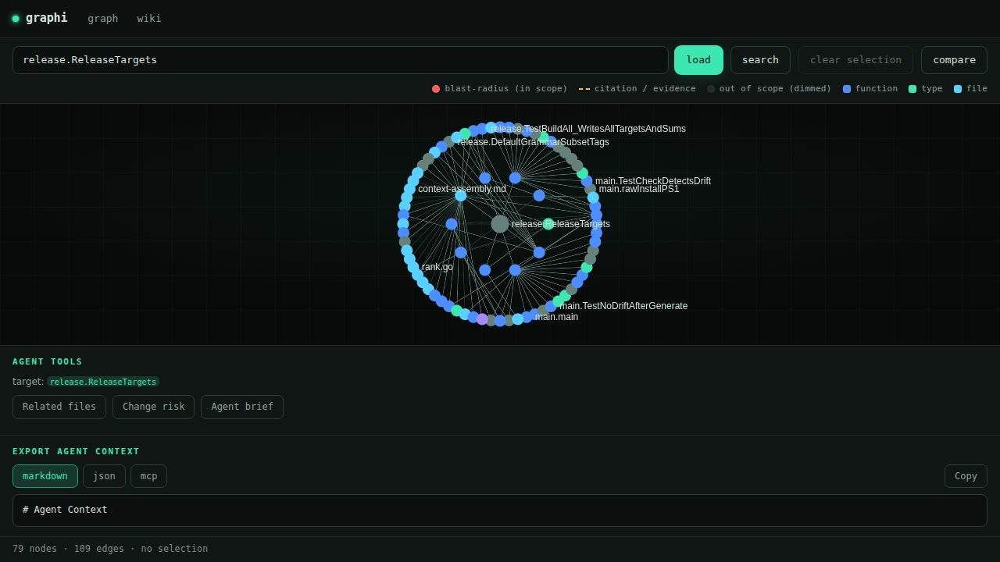
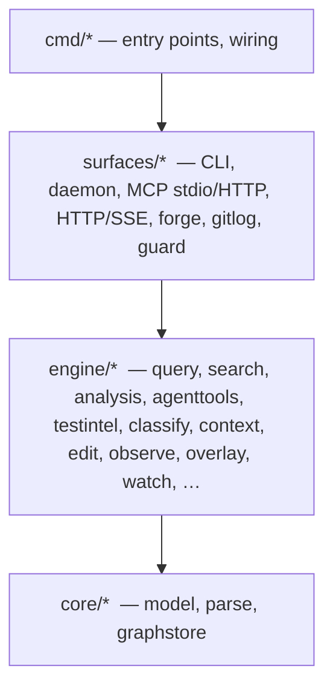

<p align="center">
  
</p>

<h1 align="center">graphi</h1>

<p align="center">
  <a href="https://samibel.github.io/graphi/"><strong>Website</strong></a>
  &nbsp;·&nbsp;
  <a href="https://samibel.github.io/graphi/tutorial.html"><strong>Hands-on tutorial</strong></a>
</p>

> Local-first, CGo-free code-intelligence engine. Parse a repository into a deterministic, provenance-backed code graph and answer structural and semantic questions — plus one-call agent context, test-impact, change-risk and hotspot bundles (Labs) — over an agent-first **MCP (stdio)** + **CLI** surface, without a single byte leaving your machine.

[](#the-local-first-contract)
[](#the-local-first-contract)
[](#license)

An AI coding agent that greps and re-reads your whole codebase on every question
is slow, expensive, and still guessing. graphi indexes the repo once into a
graph — symbols as nodes, calls/references/imports as edges — and answers
"who calls this," "what breaks if I change it," and "how are these two
functions connected" in one round-trip, entirely on your machine. The Labs
agent-intelligence layer extends that to "give me the context for this task,"
"which tests must I run for this diff," and "where does this repository hurt." Structural
answers cover the symbols your repo defines: stdlib and third-party targets
are recorded, but deliberately not navigable (see
[docs/external-nodes.md](docs/external-nodes.md)).

## Quick start

**Step 1 — install.** One line, checksum-verified, no sudo (installs the prebuilt
CGo-free binary to `~/.local/bin`):

```bash
curl -fsSL https://raw.githubusercontent.com/samibel/graphi/main/install.sh | sh
```

On Windows, use the PowerShell installer instead:

```powershell
iwr -useb https://raw.githubusercontent.com/samibel/graphi/main/install.ps1 | iex
```

**Step 2 — run it in your repo.**

```bash
cd your-repo && graphi
```

Your browser opens with the interactive code graph (on a headless box, or with
`--no-browser` / `GRAPHI_NO_BROWSER`, graphi prints the local URL instead).
Click any node to see its blast radius: impacted symbols light up red, the
evidence-bearing edges amber — while the agent-context export fills with the
selection.

<p align="center">
  
</p>

### Everyday use

```bash
# Keep the graph matching your checked-out code
graphi sync                  # pull in changes (run it after a branch switch)
graphi status                # is the graph current? (exit 0 yes / 1 run sync)
graphi rebuild               # re-index from scratch (recovery / after upgrades)

# Short verbs over the symbol under your cursor
graphi callers <symbol>      # who calls it
graphi impact  <symbol>      # what a change to it affects
graphi ui                    # explicitly serve the graph + open the browser
graphi claude                # wire graphi into Claude Code (MCP)
graphi setup                 # wire every detected local MCP client (Claude Code, Copilot, Cursor, Devin CLI, Windsurf, Claude Desktop)

# One-call agent, test, change & git intelligence (Labs)
graphi symbol-context <symbol>   # definition + snippet, hierarchy, tests, risk
graphi task-context "<task>"     # free-text task -> ranked, token-budgeted context
graphi repo-overview             # structure, languages, entry points, central symbols
git diff HEAD~1..HEAD | graphi test-impact -diff -    # which tests must run
git diff HEAD~1..HEAD | graphi change-impact -diff -  # Change Risk 2.0
graphi hotspots                  # churn x dependency centrality, bus-factor warnings

# Freeze and diff branch states (Labs)
graphi snapshot main         # freeze the current checkout under a name
graphi compare main current  # graph-level diff: snapshot vs live graph

# Update to the latest release (user-initiated; never automatic)
graphi upgrade
```

`graphi` keeps the graph in sync automatically whenever it starts (bare
`graphi`, an MCP session, `graphi sync`); it stores one graph per repository
under `~/.graphi/<fingerprint>/`, always tracking whatever is checked out —
no flags, paths, or branch bookkeeping required.

## Measured, not asserted

graphi's headline results come from before/after field tests against a
known-vulnerable Go app and an 11.7k-file monorepo. Every row of the
[Real-World Report Card](docs/real-world-report.md) names the command that
reproduces it:

| Metric | Before | After |
|---|---|---|
| Taint recall (vuln-go; taint is a Labs analyzer) | **0/4**, silent all-clear | **5/5**, 0 false positives |
| Import edges per node (11.7k-file monorepo) | 15.56 (→ 4.27M edges) | **0.96** |
| Storage bytes per edge | ~500 (→ 2.3 GB) | **226.7** |
| False "dead symbol" warnings on entry points | very many | **0** |

The internal release gate (≥ 90 overall, no area below 80, published with
`"self_reported": true`) is a self-measured, in-repo quality ratchet — **not**
an independent rating, and no faster-or-more-accurate-than-competitor claim is
made anywhere. Checked-in run evidence lives under
[docs/eval/runs/](docs/eval/runs).

## What is GA (and what is not)

graphi's supported surface is deliberately narrow.
**[`docs/stability-tiers.md`](docs/stability-tiers.md) is the single canonical
definition** of the GA / Preview / Labs / Source-only tiers; this is the summary.

**GA — the entire promise:**

- **12 frozen operations:** `index`, `search`, `definition`, `callers`, `callees`,
  `references`, `neighborhood`, `impact`, `agent_brief`, `related_files`,
  `explain_symbol`, `change_risk`.
- **Go only.** Go is the only GA language.
- **CLI + MCP stdio only**, in the CGo-free default binary.

**Not GA:** every other language is **Preview** (shipped and usable, unproven);
HTTP/SSE, the daemon, web UI, VS Code extension, GitHub Action, refactorings,
taint, agent memory, semantic search, the one-call agent-intelligence bundles
(`symbol_context`, `task_context`, `repo_overview`), the test/change
intelligence (`test_impact`, `change_impact`) and the git intelligence
(`hotspots`, co-change) are **Labs** (opt-in: `graphi mcp -labs`,
`GRAPHI_HTTP_LABS=1`); the wiki is Source-only. **SaaS does not exist** — nothing
is hosted, there is no service to sign up for.

**Known limits, by design:**

- **External calls are not navigable.** Calls into the stdlib or third-party
  packages are recorded as interned external nodes (visible to the taint
  analyzer) but excluded from callers/callees/references/impact — graphi does
  not claim call-graph coverage over code it has not indexed.
  See [docs/external-nodes.md](docs/external-nodes.md).
- **Cross-file edges are heuristic-tier** for Preview languages; Go alone
  additionally gets type-checker-`confirmed` edges.
- **Git-derived signals need local history.** `hotspots`, `change_impact`'s
  co-change section and the git-history/reviewer analyzers read a bounded
  window of the local `git log` (surface boundary only — the engine never
  executes anything). Outside a git repository or in attach mode (`-db`)
  they return a typed unavailable/empty outcome instead of guessing.
- **Go `imports` edges resolve by module path** (ADR 0009): an import links to
  the one directory its module path declares, across every `go.mod` in the
  tree (nested modules own their subtrees). Directories that merely share a
  package clause never cross-contaminate an importer's edge set. This closed
  defect PARITY-002 (`sync` could diverge from `rebuild` on `imports` edges on
  clause-colliding repositories); the measurement record is
  [docs/rc/parity-matrix-real-repo.md](docs/rc/parity-matrix-real-repo.md).
  ADR 0009 decides **which directory** an import resolves to, and that half is
  unchanged; **which files inside it are targets** is ADR 0011's question, and
  that is what the next bullet narrows.
- **An `imports` edge targets the imported package's SOURCE files** (ADR 0011):
  membership is decided on the file extension, so a `README.md`, a
  `.golangci.yml` or a `Makefile` sitting in the resolved directory is not a
  target. For Go the set is `.go` minus `_test.go` — a test file is a package
  member but is not importable, the same ruling the type-checked layer already
  made. This closed defect LINK-001, under which an edge targeted *every* file in
  the directory (measured on pinned clones: 44 of 340 `imports` edges on cobra
  pointed at `.md`/`.yml`; 2 120 on grpc-go at `.md`/`.sh`). **Two limits it
  deliberately accepts**, both measured rather than reasoned: (1) a non-Go build
  input sitting in the package directory — a `.sql`, `.md`, `.yml`, `.toml`,
  `.css` or `.sh`, embedded via `//go:embed` or merely co-located — and a cgo
  package's `.c`/`.h`, lose their only graph path, because graphi models no
  embed, codegen or cgo relation; (2) consequently `related-files` on a `.md` or
  `.yml` **anchor** now returns an explicit empty outcome where it used to list
  the importing packages, because that inbound edge was the file's only
  cross-file path. Upgrading an existing index needs `graphi rebuild` — `sync`
  reports "up to date" and keeps the old edges. Record:
  [docs/adr/0011-imports-edge-targets-package-source-files.md](docs/adr/0011-imports-edge-targets-package-source-files.md).
- **`imports` edges are per-importer under every profile that keeps them**
  (ADR 0010): each file that imports a package gets its own edge, carrying its
  own `file:line` evidence. The `balanced` profile used to collapse them to one
  edge per target from a representative importer, which dropped true edges and
  made `sync` settle a superset of `rebuild`'s edge set (closed defect
  PARITY-003; `fast` still omits `imports` edges entirely). Record:
  [docs/rc/parity-matrix-real-repo.md](docs/rc/parity-matrix-real-repo.md).
- **OPEN defect LINK-002 — a Go directory with two package clauses loses
  `recv.Method` calls.** When a directory declares two package clauses — most
  often a package beside its **external `_test` package** (`package shop` and
  `package shop_test`) — graphi keeps only one of them, and methods under the
  losing clause become invisible to the *heuristic* receiver-method call
  resolver. `callers`, `callees`, `impact`, `neighborhood` and degree-ranked
  output then return a confident but **incomplete** answer, with no skip and no
  diagnostic. **It also emits wrong edges.** When the surviving clause happens to
  declare a method with the same name, the call is not dropped but **redirected**
  to that unrelated method — so a `c.Reset()` on a `*shop.Cart` can point at
  `shop_test.Fixture.Reset`. The wrong edge is always at the `heuristic` tier
  (confidence 0.6), never `confirmed`; under `-profile balanced` (the default)
  and `-profile deep` the correct `confirmed` edge is emitted alongside it, but
  under `-profile fast` the wrong edge is the only one you get. The defect is
  deterministic for a given tree and reproduces under all three profiles.
  Measured on graphi's own repository: **136 of 1 979 method declarations
  (6.9 %)** unreachable, 108 of them in one directory; **21 of 105** directories
  declaring methods hold more than one package clause and **11** lose methods
  today. How often the *redirection* happens is **not** measured. `references`,
  `imports` and `search` are unaffected. **Workaround:** where the receiver's type is
  import-qualified (`c *shop.Cart`) the Go type-checker resolves the call
  instead and the edge is `confirmed` — this holds under `-profile balanced`
  (the default) and `-profile deep`, but **not** under `-profile fast`, which
  skips type resolution. Record:
  [docs/rc/link-002-clause-by-dir-recall.md](docs/rc/link-002-clause-by-dir-recall.md).
- **OPEN defect LINK-003 — two Go methods sharing a name in one package shadow
  each other.** The same *heuristic* receiver-method resolver keeps only one
  entry per `(package, method-name)` pair, so where a package declares
  `func (a *A) String()` **and** `func (b *B) String()`, one of them is
  unreachable and every unqualified `x.String()` call resolves to whichever won —
  a **wrong** `heuristic`-tier edge, with no package-clause collision needed.
  Same operations affected as LINK-002, same `heuristic`-tier confinement, same
  workaround (import-qualified receivers resolve through go/types at `confirmed`
  tier under `-profile balanced`/`deep`; `-profile fast` has no cover). Measured
  on graphi's own repository: **663 of 1 979 method declarations (33.5 %)** are
  unreachable *or* shadowed once both defects are counted, versus 136 (6.9 %) for
  LINK-002 alone. Filed 2026-08-19; **not fixed**, and the eventual fix must
  close both defects together. Record: §10 of
  [docs/rc/link-002-clause-by-dir-recall.md](docs/rc/link-002-clause-by-dir-recall.md).
- **OPEN defect PARITY-004 — restoring a Go package that was missing when the
  index was built leaves `sync` permanently diverged from `rebuild`.** If you
  run `graphi rebuild` while an intra-module import points at a package that
  does not exist in the tree (mid-refactor, a deleted directory, a partial
  checkout), the importer's re-link record is stored under the import path
  rather than the directory, where the incremental cascade can never find it.
  Restore the package and `graphi sync`: the importer is **not** re-linked, so
  a stale `external` node for the once-missing symbol and its `heuristic`
  `calls` edge survive beside the now-correct `confirmed` edge, and the
  `imports` edge a rebuild emits is missing. Reproduced through the CLI:
  `graphi sync` settles at 7 nodes where `graphi rebuild` over the identical
  tree gives 6, and three further syncs do not repair it. **What that costs, as
  measured on that hermetic fixture rather than inferred:** `neighborhood` on
  the importer loses the `imports` edge (5 edges against a rebuild's 6);
  `related_files` returns the same files but in a different **rank order**, with
  a weaker reason and less evidence; `callers`, `callees` and `impact` were
  **identical**, because interned external nodes are excluded from them anyway
  (first bullet above), and so was `search`. The stale node and edge are still
  visible to the taint analyzer, which does read external nodes. **Workaround:
  run `graphi rebuild` once after restoring a package that was missing at index
  time** — verified: the rebuild converges to 6 nodes and 0 external nodes.
  Filed 2026-08-19; **not fixed**. Record:
  `docs/adr/0004-ingest-recovery-disposition.md` §"ADDED 2026-08-19", D3.

> In the machine-checked [coverage matrix](docs/coverage-matrix.md) the `tier`
> column answers a different question ("is this one of the 12 frozen
> operations?"), so parser and surface rows read `labs` despite being the GA
> scope — see the note in the matrix itself.

## When to use graphi — and when not

**Use graphi if:**

- you want an MCP-compatible code-graph backend that runs **on the user's
  machine** with zero outbound network — no accounts, no telemetry, no cloud
  indexer;
- your codebase must not leave the machine (compliance, data-residency,
  air-gapped CI);
- you want one CGo-free static binary that drops into any environment.

**Use something else if:**

- you need deep dataflow/taint analysis **across external libraries** — use
  CodeQL;
- you need thousands of ready-made security rules — use Semgrep;
- you need cross-repository code search over an enterprise monorepo estate —
  use Sourcegraph.

graphi's niche is fast, local, structural ground truth for agents and
developers — it does not try to replace those tools.

## Language support

**Go is GA; 21 further languages ship as Preview** (TypeScript/JSX, JavaScript,
Python, Java, Kotlin, C#, C, C++, Rust, Ruby, PHP, Lua, Bash, SQL, JSON, CSS,
YAML, TOML, Markdown, HCL); HTML is deferred. The full per-language table —
which node kinds, which edge tiers, and how cross-file resolution works
language by language — is in
[docs/language-support.md](docs/language-support.md). An opt-in CGO flavor
(`graphi-broad`) opens the go-sitter-forest grammar seam for trusted input;
see [docs/graphi-broad.md](docs/graphi-broad.md) including its security
warning.

## Semantic search (optional, OFF by default)

The default binary ships **no embedder** and makes zero non-loopback network
calls; `graphi search -semantic` degrades gracefully to a typed "unavailable"
response until you explicitly opt in (local Ollama endpoint or an opt-in ONNX
build). Setup and the guarantees that hold either way:
[docs/semantic-search.md](docs/semantic-search.md).

## The local-first contract

| Guarantee | What it means for you |
|---|---|
| **Zero outbound network** | The engine makes no non-loopback network calls. Your code stays on disk. |
| **No telemetry** | Nothing is reported anywhere — no usage data, no phone-home. |
| **No accounts, no external services** | A single static binary; nothing to sign up for. |
| **CGo-free default build** | Builds anywhere Go does, with no C toolchain required. |
| **Single static binary** | One self-contained executable (~32 MB as shipped; the size is budget-gated in CI), easy to drop into any environment. |

The Stable default tier runs with no accounts and no outbound network access.
Explicitly configured Labs/forge or embedder features may contact their
configured service; they are not part of that default claim. The git-history
provider behind the Labs git intelligence executes the local `git` binary
against the local repository — no network, no writes. The proof is runnable:
`graphi privacy-audit`.

## Subcommands (the short list)

| Command | Tier | What it does |
|---|---|---|
| `graphi` | labs | Zero-config: index the current repo and open the web UI |
| `graphi sync` · `status` · `rebuild` | **GA** (facade) | Keep the graph matching the checked-out code (incremental / read-only report / full re-index) |
| `graphi trust-report` · `query-strict` | labs | How far may you trust a graph answer: snapshot state, confidence tiers, gaps, fail-closed policy verdicts; tier-filtered queries |
| `graphi snapshot` · `compare` | labs | Freeze named graph states and diff them |
| `graphi index [-root <repo>]` | **GA** | Build/refresh a graph store with explicit paths (advanced form of `sync`/`rebuild`) |
| `graphi callers\|callees\|references\|definition\|neighborhood <symbol>` | **GA** | Structural queries |
| `graphi impact <symbol>` | **GA** | Blast radius of a change (in-repo) |
| `graphi search <query>` | **GA** | Lexical / symbol search |
| `graphi agent-brief` · `explain-symbol` · `related-files` · `change-risk` | **GA** | Cited agent-context operations |
| `graphi symbol-context` · `task-context` · `repo-overview` · `test-impact` · `change-impact` · `hotspots` | labs | One-call agent, test, change & git intelligence |
| `graphi mcp` | **GA** | MCP stdio server (the agent-first surface) |
| `graphi setup` | labs | Wire graphi into local MCP clients |
| `graphi analyze <analyzer>` | labs | Deep analyzers (taint, pdg, call-chain, …) |
| `graphi daemon` · `http` | labs | Hot-index daemon, loopback HTTP/SSE |
| `graphi upgrade` | labs | Update to the latest release (never automatic) |

Every subcommand with flags and tier tags: [docs/cli-reference.md](docs/cli-reference.md)
or `graphi help`.

## Architecture


```mermaid
flowchart TD
    CMD["cmd/*  — entry points, wiring"]
    SURF["surfaces/*  — CLI, daemon, MCP stdio/HTTP, HTTP/SSE, forge, gitlog, guard"]
    ENG["engine/*  — query, search, analysis, agenttools, testintel, classify, context, edit, observe, overlay, watch, …"]
    CORE["core/*  — model, parse, graphstore"]
    CMD --> SURF --> ENG --> CORE
```

- **One engine, many surfaces.** Every surface (CLI, daemon, MCP stdio, HTTP/SSE)
  shares the same `surfaces/client.Client` — no surface holds query logic of its
  own, so they cannot diverge.
- **Layered by direction** (CI-enforced): lower layers never depend on higher
  ones; `core/parse` and `core/graphstore` are pure leaves.
- **Exec at the boundary.** `surfaces/gitlog` is the only component that runs
  the local `git` binary; the engine consumes commits through a provider seam
  and never executes anything.
- **Data flow:** source repo → incremental ingest → graphstore (hot in-memory
  graph + durable SQLite sidecar) → query / search / analysis → surfaces.

Full design: [docs/architecture-plan.md](docs/architecture-plan.md).

## Documentation

| Doc | What it is |
|---|---|
| [docs/HOWTO.md](docs/HOWTO.md) | Install, build from source, index a repo, use every surface |
| [docs/stability-tiers.md](docs/stability-tiers.md) | **Canonical** GA / Preview / Labs / Source-only definition |
| [docs/real-world-report.md](docs/real-world-report.md) | The honest before/after field-test record |
| [docs/FEATURES.md](docs/FEATURES.md) | Complete catalogue: every MCP tool, subcommand, endpoint, analyzer |
| [docs/agent-workflows.md](docs/agent-workflows.md) | Recommended agent call order, incl. the one-call Labs bundles |
| [docs/coverage-matrix.md](docs/coverage-matrix.md) | Machine-checked capability inventory (drift breaks the build) |
| [docs/](docs/) | Documentation map and deeper subsystem docs |

## License

Licensed under the [Apache License 2.0](./LICENSE). Third-party attributions are
listed in [`NOTICE`](./NOTICE) — note that the optional `graphi-broad` flavor links
go-sitter-forest grammars under their own upstream licenses.
