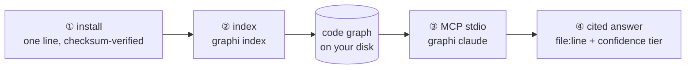
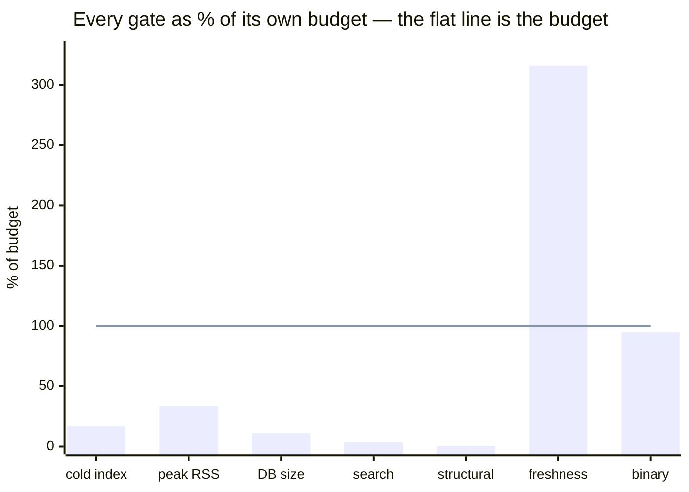
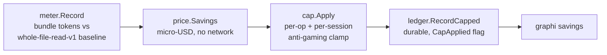
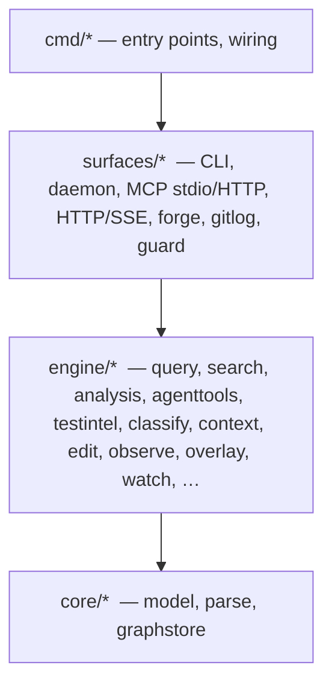

<p align="center"></p>
<h1 align="center">graphi</h1>
<p align="center">Your agent stops grepping the whole codebase. It asks the graph.</p>
<p align="center"><a href="https://samibel.github.io/graphi/">Website</a> · <a href="https://samibel.github.io/graphi/tutorial.html">Hands-on tutorial</a> · <a href="./CHANGELOG.md">Changelog</a> · <a href="docs/known-defects.md">Open defects</a></p>

[](https://github.com/samibel/graphi/actions/workflows/cgoconformance.yml) [](https://github.com/samibel/graphi/actions/workflows/privacy-audit.yml) [](https://github.com/samibel/graphi/actions/workflows/coverage-matrix.yml) [](https://github.com/samibel/graphi/actions/workflows/testgate.yml) [](https://github.com/samibel/graphi/releases/latest)

graphi indexes your repository once into a code graph — symbols as nodes,
calls/references/imports as edges — and answers *who calls this*, *what breaks if
I change it* and *how are these two connected* in one round-trip, entirely on your
machine, with a `file:line` and a confidence tier on every edge it returns.
Structural answers cover the symbols your repo defines: stdlib and third-party
targets are recorded, but deliberately not navigable ([docs/external-nodes.md](docs/external-nodes.md)).

Current release **v0.10.0** · 12 frozen GA operations over CLI + MCP stdio · Apache-2.0 · no account, no telemetry, no cloud.

## Quick start


```mermaid
flowchart LR
  I["① install<br/>one line, checksum-verified"] --> X["② index<br/>graphi index"] --> G[("code graph<br/>on your disk")]
  G --> M["③ MCP stdio<br/>graphi claude"] --> A["④ cited answer<br/>file:line + confidence tier"]
```

**① install · ② index · ③ wire · ④ ask** — one real session, captured against graphi's own repository at tag `v0.10.0`, so every line below reproduces exactly as printed (Windows install: `iwr -useb https://raw.githubusercontent.com/samibel/graphi/main/install.ps1 | iex`). Terminal output is shown as a terminal shows it (stdout and stderr merged); absolute paths appear as `~`; the one elided run of output is marked `…`.

```console
$ curl -fsSL https://raw.githubusercontent.com/samibel/graphi/main/install.sh | sh
install.sh: downloading graphi-darwin-arm64 (latest)...
graphi-darwin-arm64: OK
install.sh: installed graphi to ~/.local/bin/graphi

$ git clone --branch v0.10.0 https://github.com/samibel/graphi && cd graphi && graphi index
graphi: scanning repo…
…  (indexing progress, cross-file linking and type resolution — elided)
graphi: indexed 2580 files in 34.8s
graphi index: ingested ~/graphi

$ graphi claude
config: ~/.claude.json
action: created
entry: {type:stdio command:~/.local/bin/graphi args:[mcp]}
Claude Code: graphi MCP server created in ~/.claude.json (command=~/.local/bin/graphi args=[mcp])
  backup of the original config written to ~/.claude.json.bak-20260826T002022Z
  restart/reload Claude Code to expose graphi's tools.

$ graphi search -limit 1 KnownDefectsCheck | jq -r '.matches[]|"\(.node_id)  \(.source_path):\(.line)"'
899699a3e56a9476  internal/doctor/checks.go:405

$ graphi callers 899699a3e56a9476 | jq -r '.edges[]|"\(.confidence_tier)  \(.evidence[0])"'
confirmed  cmd/graphi/doctor.go:64
derived  internal/doctor/checks_test.go:261
```

The answer comes back already cited — a `file:line` for every caller, plus a tier saying how far to trust it (`confirmed`: the call target was resolved by the go/types type-checker; `derived`: a same-package name match). That is what your agent gets over MCP stdio, without opening a file — run the same two commands in your own repository and only the ids change.

## Measured, not asserted

Every number on this page names a command that prints it. These two claims from
the July field test were re-run against this tree on 2026-08-26 and survive it:

| Claim | Command | What it prints |
|---|---|---|
| Taint recall **0/4 → 5/5**, 0 false positives (`vuln-go`; taint is Labs) | `go test ./engine/ingest -run TestTaintE2E_VulnGoRecall -v` | `vuln-go taint: recall=5/5, false_positives=0, findings=5, armed=true` |
| **0** false "dead symbol" warnings on entry points | `go test ./engine/ingest -run TestDiagnose_EntryPointsNotDead` | `PASS` |

Two rows that used to sit here are **removed rather than restated**: "import edges
per node 15.56 → 0.96", retracted as mislabelled by graphi's own report on
2026-08-16, and "226.7 bytes per edge", which its own gate prints as `292.6
bytes/edge (budget 360.0)` — inside the budget, 29 % above the old headline.

### Every gate against its own budget

grpc-go v1.60.1 on `ubuntu-latest`, harness `p0-perf/1`, candidate **v0.7.0** at
`5815db5` — the last complete two-run series graphi has published, and stamped
[`STALE`](docs/eval/runs/2026-07-28-ubuntu-latest/STALENESS-NOTICE.md): true about
`5815db5`, and the current release has no series of its own. Every row recomputes
from the committed raw samples with `go run ./cmd/eval -aggregate
docs/eval/runs/2026-07-28-ubuntu-latest/run-a/<job>/grpc-go` → `PASS - all 173
published metric(s) reproduced from the raw data`. Latencies are wall-clock on a
shared CI runner; sizes are byte counts.

| Gate | Budget | Measured | |
|---|---|---|---|
| Cold index p95 (919 files, 10 cold runs) | ≤ 120 s | 20.368 s | PASS |
| Peak RSS | ≤ 2 GB | 0.670 GB (686 MiB) | PASS |
| Graph DB size | ≤ 300 MB | 32.688 MB (34 275 328 B) | PASS |
| Warm `search` p95 | ≤ 100 ms | 3.591 ms | PASS |
| `callers` / `callees` / `impact` p95 (*structural*) | ≤ 200 ms | 0.999 ms | PASS |
| **Incremental freshness p95** | **≤ 2 s** | **6.315 s** | **FAIL — 3.2× over** |
| Release binary ¹ | ≤ 36.10 MB | 34.27 MB (34 267 107 B) | PASS |


```mermaid
xychart-beta
  title "Every gate as % of its own budget — the flat line is the budget"
  x-axis ["cold index", "peak RSS", "DB size", "search", "structural", "freshness", "binary"]
  y-axis "% of budget" 0 --> 330
  bar [17.0, 33.5, 10.9, 3.6, 0.5, 315.7, 94.9]
  line [100, 100, 100, 100, 100, 100, 100]
```

**The FAIL is in the table on purpose.** `freshness_p95` is the wait between
editing a file and the graph answering about it: 6.315 s and 6.486 s against a 2 s
budget over 100 of 100 converged changes, 2.7 % apart on two different CPUs (both
AMD EPYC, different generations) — the most reproducible number in the series is
the one that misses. It is the measurement behind the sync promise below: `graphi
sync` does keep the graph matching your checkout, but on a repository that size it
costs seconds, not the sub-second the budget asks for. Fixing it is open work, not
done work.

¹ Not from that series: `bench/bench-budget.yml`, re-pinned 2026-08-24, measured
by the canonical CGo-free release build (`internal/release.CanonicalBuildArgs`).
No release scorecard is quoted anywhere on this page — the last one committed is a
2026-07-29 snapshot of a superseded build, and the release gate no longer commits
one. Nothing here is an independent rating or a benchmark against another tool.

### What it saves, and how that is counted

graphi never calls an LLM, so it cannot see your bill. It counts the context it
assembled against the whole-file reads that would have answered the same
question — metered per call, priced, clamped, then persisted:


```mermaid
flowchart LR
  M["meter.Record<br/>bundle tokens vs<br/>whole-file-read-v1 baseline"] --> P["price.Savings<br/>micro-USD, no network"] --> C["cap.Apply<br/>per-op + per-session<br/>anti-gaming clamp"] --> L["ledger.RecordCapped<br/>durable, CapApplied flag"] --> R["graphi savings"]
```

The cap only ever *reduces* a positive contribution and flags what it clamped, so
a capped figure can never be read back as a raw one; an honest overrun — graphi
using *more* context than the baseline — passes through negative and unhidden.
**No saving is quoted here, because none is measured.** graphi ships no savings
benchmark, and with no metered session behind it the readout says so:

```console
$ graphi savings
graphi: savings: no ledger to read — pass -ledger <path> (the ledger a prior MCP/daemon session wrote)
```

## Everyday use

```bash
# Keep the graph matching your checked-out code
graphi sync                  # pull in changes (run it after a branch switch)
graphi status                # is the graph current? (exit 0 yes / 1 run sync)
graphi rebuild               # re-index from scratch (recovery / after a new release)

# Short verbs over a node id — get one from `graphi search <name>`
graphi callers <node-id>     # who calls it
graphi impact  <node-id>     # what a change to it affects
graphi ui                    # explicitly serve the graph + open the browser
graphi claude                # wire graphi into Claude Code (MCP)
graphi setup                 # wire every detected local MCP client (Claude Code, Copilot, Cursor, Devin CLI, Windsurf, Claude Desktop)

# One-call agent, test, change & git intelligence (Labs)
graphi symbol-context <symbol>   # definition + snippet, hierarchy, tests, risk
graphi task-context "<task>"     # free-text task -> ranked, token-budgeted context
graphi repo-overview             # structure, languages, entry points, central symbols
git diff HEAD~1..HEAD | graphi test-impact -diff -    # which tests must run
git diff HEAD~1..HEAD | graphi change-impact -diff -  # Change Risk 2.0
graphi hotspots                  # churn x dependency centrality, bus-factor warnings

# Freeze and diff branch states (Labs)
graphi snapshot main         # freeze the current checkout under a name
graphi compare main current  # graph-level diff: snapshot vs live graph
```

`graphi` keeps the graph in sync automatically whenever it starts (bare
`graphi`, an MCP session, `graphi sync`); it stores one graph per repository
under `~/.graphi/<fingerprint>/`, always tracking whatever is checked out —
no flags, paths, or branch bookkeeping required. **How long that takes is
measured, and it misses its budget:** catching up after a change was 6.315 s
against a ≤ 2 s gate on a 919-file repository — see the freshness row above.

Bare `graphi` also opens the interactive code graph in your browser (on a
headless box, or with `--no-browser` / `GRAPHI_NO_BROWSER`, graphi prints the
local URL instead). Click any node to see its blast radius: impacted symbols
light up red, the evidence-bearing edges amber — while the agent-context export
fills with the selection.

<p align="center"></p>

## What is GA (and what is not)

graphi's supported surface is deliberately narrow.
**[`docs/stability-tiers.md`](docs/stability-tiers.md) is the single canonical
definition** of the GA / Preview / Labs / Source-only tiers; this is the summary.

**GA — the entire promise:**

- **12 frozen operations:** `index`, `search`, `definition`, `callers`, `callees`,
  `references`, `neighborhood`, `impact`, `agent_brief`, `related_files`,
  `explain_symbol`, `change_risk`.
- **Go only.** Go is the only GA language.
- **CLI + MCP stdio only**, in the CGo-free default binary.

**Not GA:** every other language is **Preview** (shipped and usable, unproven);
HTTP/SSE, the daemon, web UI, VS Code extension, GitHub Action, refactorings,
taint, agent memory, semantic search, the one-call agent-intelligence bundles
(`symbol_context`, `task_context`, `repo_overview`), the test/change
intelligence (`test_impact`, `change_impact`) and the git intelligence
(`hotspots`, co-change) are **Labs** (opt-in: `graphi mcp -labs`,
`GRAPHI_HTTP_LABS=1`); the wiki is Source-only. **SaaS does not exist** — nothing
is hosted, there is no service to sign up for.

> In the machine-checked [coverage matrix](docs/coverage-matrix.md) the `tier`
> column answers a different question ("is this one of the 12 frozen
> operations?"), so parser and surface rows read `labs` despite being the GA
> scope — see the note in the matrix itself.

## When to use graphi — and when not

**Use graphi if:**

- you want an MCP-compatible code-graph backend that runs **on the user's
  machine** with zero outbound network — no accounts, no telemetry, no cloud
  indexer;
- your codebase must not leave the machine (compliance, data-residency,
  air-gapped CI);
- you want one CGo-free static binary that drops into any environment.

**Use something else if:**

- you need deep dataflow/taint analysis **across external libraries** — use
  CodeQL;
- you need thousands of ready-made security rules — use Semgrep;
- you need cross-repository code search over an enterprise monorepo estate —
  use Sourcegraph.

graphi's niche is fast, local, structural ground truth for agents and
developers — it does not try to replace those tools.

## Language support

**Go is GA; 21 further languages ship as Preview** (TypeScript/JSX, JavaScript,
Python, Java, Kotlin, C#, C, C++, Rust, Ruby, PHP, Lua, Bash, SQL, JSON, CSS,
YAML, TOML, Markdown, HCL); HTML is deferred. The full per-language table —
which node kinds, which edge tiers, and how cross-file resolution works
language by language — is in
[docs/language-support.md](docs/language-support.md). An opt-in CGO flavor
(`graphi-broad`) opens the go-sitter-forest grammar seam for trusted input;
see [docs/graphi-broad.md](docs/graphi-broad.md) including its security
warning.

## Semantic search (optional, OFF by default)

The default binary ships **no embedder** and makes zero non-loopback network
calls; `graphi search -semantic` degrades gracefully to a typed "unavailable"
response until you explicitly opt in (local Ollama endpoint or an opt-in ONNX
build). Setup and the guarantees that hold either way:
[docs/semantic-search.md](docs/semantic-search.md).

## The local-first contract

| Guarantee | What it means for you |
|---|---|
| **Zero outbound network** | The engine makes no non-loopback network calls. Your code stays on disk. |
| **No telemetry** | Nothing is reported anywhere — no usage data, no phone-home. |
| **No accounts, no external services** | A single static binary; nothing to sign up for. |
| **CGo-free default build** | Builds anywhere Go does, with no C toolchain required. |
| **Single static binary** | One self-contained executable (**34.27 MB** as shipped, against a CI budget of 36.10 MB — `bench/bench-budget.yml`), easy to drop into any environment. |

The Stable default tier runs with no accounts and no outbound network access.
Explicitly configured Labs/forge or embedder features may contact their
configured service; they are not part of that default claim. The git-history
provider behind the Labs git intelligence executes the local `git` binary
against the local repository — no network, no writes. The proof is runnable:
`graphi privacy-audit`.

## Subcommands (the short list)

| Command | Tier | What it does |
|---|---|---|
| `graphi` | labs | Zero-config: index the current repo and open the web UI |
| `graphi sync` · `status` · `rebuild` | **GA** (facade) | Keep the graph matching the checked-out code (incremental / read-only report / full re-index) |
| `graphi trust-report` · `query-strict` | labs | How far may you trust a graph answer: snapshot state, confidence tiers, gaps, fail-closed policy verdicts; tier-filtered queries |
| `graphi snapshot` · `compare` | labs | Freeze named graph states and diff them |
| `graphi index [-root <repo>]` | **GA** | Build/refresh a graph store with explicit paths (advanced form of `sync`/`rebuild`) |
| `graphi callers\|callees\|references\|definition\|neighborhood <node-id>` | **GA** | Structural queries |
| `graphi impact <node-id>` | **GA** | Blast radius of a change (in-repo) |
| `graphi search <query>` | **GA** | Lexical / symbol search |
| `graphi agent-brief` · `explain-symbol` · `related-files` · `change-risk` | **GA** | Cited agent-context operations |
| `graphi symbol-context` · `task-context` · `repo-overview` · `test-impact` · `change-impact` · `hotspots` | labs | One-call agent, test, change & git intelligence |
| `graphi mcp` | **GA** | MCP stdio server (the agent-first surface) |
| `graphi setup` | labs | Wire graphi into local MCP clients |
| `graphi analyze <analyzer>` | labs | Deep analyzers (taint, pdg, call-chain, …) |
| `graphi daemon` · `http` | labs | Hot-index daemon, loopback HTTP/SSE |

Every subcommand with flags and tier tags: [docs/cli-reference.md](docs/cli-reference.md)
or `graphi help`.

## Architecture


```mermaid
flowchart TD
    CMD["cmd/*  — entry points, wiring"]
    SURF["surfaces/*  — CLI, daemon, MCP stdio/HTTP, HTTP/SSE, forge, gitlog, guard"]
    ENG["engine/*  — query, search, analysis, agenttools, testintel, classify, context, edit, observe, overlay, watch, …"]
    CORE["core/*  — model, parse, graphstore"]
    CMD --> SURF --> ENG --> CORE
```

- **One engine, many surfaces.** Every surface (CLI, daemon, MCP stdio, HTTP/SSE)
  shares the same `surfaces/client.Client` — no surface holds query logic of its
  own, so they cannot diverge.
- **Layered by direction** (CI-enforced): lower layers never depend on higher
  ones; `core/parse` and `core/graphstore` are pure leaves.
- **Exec at the boundary.** `surfaces/gitlog` is the only component that runs
  the local `git` binary; the engine consumes commits through a provider seam
  and never executes anything.
- **Data flow:** source repo → incremental ingest → graphstore (hot in-memory
  graph + durable SQLite sidecar) → query / search / analysis → surfaces.

Full design: [docs/architecture-plan.md](docs/architecture-plan.md).

## Documentation

| Doc | What it is |
|---|---|
| [docs/HOWTO.md](docs/HOWTO.md) | Install, build from source, index a repo, use every surface |
| [docs/stability-tiers.md](docs/stability-tiers.md) | **Canonical** GA / Preview / Labs / Source-only definition |
| [docs/real-world-report.md](docs/real-world-report.md) | The July 2026 before/after field-test record — two of its rows are retracted or stale and are no longer quoted above |
| [docs/FEATURES.md](docs/FEATURES.md) | Complete catalogue: every MCP tool, subcommand, endpoint, analyzer |
| [docs/agent-workflows.md](docs/agent-workflows.md) | Recommended agent call order, incl. the one-call Labs bundles |
| [docs/coverage-matrix.md](docs/coverage-matrix.md) | Machine-checked capability inventory (drift breaks the build) |
| [docs/known-defects.md](docs/known-defects.md) | Open defects and limits, tracked in the open |
| [docs/](docs/) | Documentation map and deeper subsystem docs |

## License

Licensed under the [Apache License 2.0](./LICENSE). Third-party attributions are
listed in [`NOTICE`](./NOTICE) — note that the optional `graphi-broad` flavor links
go-sitter-forest grammars under their own upstream licenses.
